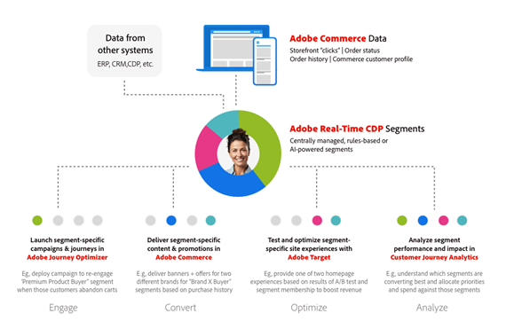

# Présentation d’Adobe Commerce

Adobe Commerce est une solution de commerce d’entreprise qui offre des expériences de commerce électronique supérieures aux consommateurs et aux acheteurs B2B à l’échelle mondiale. Avec des milliers de clients et des milliards de valeur brute annuelle de marchandises traitées par le biais de notre plateforme cloud, Adobe Commerce est à l’avant-garde de l’optimisation des expériences de commerce électronique les plus importantes et les plus complexes au monde pour les détaillants, les marques de consommation, les fabricants et les distributeurs en gros.

## Les équipes d’e-commerce font face à des défis uniques

Les équipes d’e-commerce doivent aujourd’hui offrir des expériences exceptionnelles à leurs clients. Une expérience commerciale rapide, pratique et personnalisée vous permet d’augmenter vos ventes, d’approfondir vos relations avec vos clients et d’optimiser votre efficacité opérationnelle.

Malheureusement, la création et la diffusion d’expériences commerciales exceptionnelles sont plus difficiles que jamais.

- **La dette technique bloque l&#39;entreprise**: les environnements techniques complexes et hérités s’étendent sur plusieurs plateformes et sont difficiles à gérer. [60 %](https://engage.adobe.com/DigComRptWBR-register.html) de professionnels du commerce électronique disent qu&#39;ils ont du mal à maintenir et intégrer leurs technologies.
- **Les équipes devraient faire plus avec moins**: de nombreuses équipes d’e-commerce font face à de fortes attentes de croissance, mais ont souvent du mal à redéfinir l’expérience client en raison de processus manuels, de solutions trop techniques et de données limitées. [56 %](https://engage.adobe.com/DigComRptWBR-register.html) des professionnels du commerce électronique disent qu&#39;ils manquent de financement adéquat.
- **Surcharge des données**: les volumes de données continuent d’augmenter en quantité, mais ne se traduisent pas en expériences de qualité, car les données sont piégées dans divers systèmes, ce qui rend difficile la conduite de l’entreprise et crée des expériences percutantes. [60 %](https://engage.adobe.com/DigComRptWBR-register.html) des professionnels du commerce électronique disent qu&#39;ils n&#39;ont pas les bonnes données dans les bons systèmes.
- **Les consommateurs attendent plus**: le nombre de canaux et de modèles commerciaux que les entreprises doivent prendre en charge continue de se multiplier, ce qui ajoute plus de coûts et de complexité. [53 %](https://www.bloomreach.com/en/news/2020/bloomreach-releases-new-global-research-study) de consommateurs n&#39;achèteront plus à la même société s&#39;ils ont eu une mauvaise expérience et [90 %](https://www.prweb.com/releases/study-90-of-b2b-buyers-will-turn-to-a-competitor-if-a-suppliers-digital-channel-doesn-t-meet-their-needs-811395853.html) Des acheteurs B2B se tournent vers un concurrent si un fournisseur ne peut pas répondre à leurs besoins numériquement.

## La vision d’Adobe Commerce repose sur l’expérience du commerce.

L’objectif d’Adobe est de fournir une plateforme commerciale reposant sur l’expérience, optimisée par les données et compatible avec la technologie.

- [Mené sur l’expérience](#experience-led-commerce). En Adobe, nous croyons que la croissance provient de l&#39;expérience. C&#39;est pourquoi nous nous concentrons sur l&#39;alimentation des vitrines de commerce électronique les plus rapides du monde et nous donnons les moyens aux équipes de commerce électronique de créer des expériences personnalisées à grande échelle.

- [Alimenté par les données](#data-powered-commerce). Adobe Commerce permet un partage transparent des données sur l’ensemble de votre pile de technologies marketing, ce qui vous permet de mettre en oeuvre vos données commerciales propriétaires, en personnalisant les expériences sur chaque point de contact et canal.

- [Compatible technologie](#tech-enabled-commerce). Adobe Commerce est une plateforme de commerce électronique composable conçue pour lancer des fonctionnalités de commerce électronique plus rapidement, pour partager facilement des données entre des systèmes tiers et pour réduire le coût de propriété des intégrations et des personnalisations.

## Commerce piloté par l’expérience

À l’approche de l’année 2024, il est essentiel que les leaders du commerce électronique offrent des expériences commerciales hautement performantes et personnalisées à leurs clients.

### Eclairage de vitrine rapide à l’aide d’Edge Delivery Services

Les recherches ont montré que [64 % des acheteurs](https://techreport.com/statistics/website-load-time-statistics-data) rendez-vous sur le site d’un concurrent pour acheter un article similaire si son expérience web est médiocre. Inversement, pour chaque amélioration de la vitesse du site de 0,1 seconde, les entreprises peuvent s’attendre à une [Augmentation de 9,2 % de la valeur de commande moyenne](https://techreport.com/statistics/website-load-time-statistics-data).

[Edge Delivery Services dans Adobe Commerce](https://experienceleague.adobe.com/developer/commerce/storefront/) est un ensemble de services composables qui optimise la valeur commerciale en offrant des expériences exceptionnelles, tant dans la création de contenu que dans les expériences client. Il combine des fonctionnalités d’entreprise, telles que la création de contenu basé sur des documents et les tests A/B intégrés, avec des composants de dépôt Adobe Commerce et la diffusion de contenu depuis la périphérie pour des storefronts rapides (par exemple, il faut mentionner la diffusion en périphérie).

Ce nouveau storefront haute performance a déjà été piloté avec succès par plusieurs marchands Adobe Commerce, tels que [Maidenform](https://business.adobe.com/blog/perspectives/how-hanesbrands-and-adobe-built-one-of-the-fastest-ecommerce-websites-in-the-world), une propriété de HanesBrands. Les résultats parlent d&#39;eux-mêmes. Les pages de formulaires principaux affichent systématiquement les scores Google Lighthouse [100 et résultats des principales valeurs de la valeur vitale du web](https://treo.sh/sitespeed/www.maidenform.com) bien au-dessus de la moyenne du secteur.

{width=&quot;50%&quot; align=center}
{zoomable="yes"}

>[!BEGINSHADEBOX]

Découvrez comment HanesBrands et Adobe ont développé une architecture de pointe hautement performante avec des fonctionnalités de partage de données et de personnalisation. [E-Comm Masterclass : Hanesbrands crée la vitrine la plus rapide du monde](https://business.adobe.com/summit/2024/sessions/ecomm-masterclass-hanesbrands-creates-the-worlds-f-s435.html)

>[!ENDSHADEBOX]

Au coeur de ce nouveau storefront axé sur l’expérience se trouvent un ensemble de principes qui mettent l’accent sur la diffusion d’une expérience de commerce composable, avec une meilleure conversion, une réduction des coûts et une vitesse accrue.

La conversion dans Commerce est liée à votre capacité à connecter vos clients à vos produits hors site et à votre capacité à personnaliser leur expérience sur site, de manière efficace mais ciblée. En adhérant aux principes des principales valeurs vitales du Web, le service de diffusion Edge de Commerce détermine les deux mesures.

Cela signifie qu’un site plus rapide et axé sur l’expérience est classé plus haut dans les moteurs de recherche, ce qui réduit les coûts d’optimisation pour les moteurs de recherche, tout en augmentant le trafic organique et par mot-clé. Cela permet non seulement d’augmenter le nombre de visiteurs, mais également de connecter vos clients et produits de manière plus transparente que jamais, ce qui permet un emplacement, une sélection et un passage en caisse des produits plus rapides.

Vous bénéficiez également de coûts de création de contenu moindres, car les propriétaires de contenu professionnels peuvent diffuser rapidement et facilement tout en fournissant des fonctionnalités Commerce intégrées à vos chefs de commerce. Plus de barrages routiers opérationnels pour les équipes collaboratrices !

Velocity pour vos équipes de création de contenu, vitesse de diffusion de ce contenu à vos clients et vitesse de l’expérience que vos clients vivent grâce à votre nouvelle vitrine orientée expérience et hautement performante.

Pour ce faire, vous devez disposer d’une architecture composable, qui associe vos fonctionnalités de gestion de contenu et de publication à des composants de dépôt Adobe Commerce afin de créer un storefront Commerce véritablement flexible. La nouvelle liste déroulante de passage en caisse en une seule étape vous permet d’ajouter une expérience de passage en caisse transparente aux parcours de vos clients d’une manière &quot;plug-and-play&quot;.

>[!TIP]
>
>Si vous souhaitez commencer à utiliser le service de diffusion Edge dans Adobe Commerce, vous pouvez découvrir comment tout cela se combine. [ici.](https://experienceleague.adobe.com/developer/commerce/storefront/)

### Intégration d’Adobe Experience Manager Assets

Adobe rassemble Adobe Experience Manager Assets avec Adobe Commerce pour offrir à vos expériences de commerce électronique des ressources approuvées sur marque en bloc, en exploitant de puissantes fonctionnalités GenAI.

Cela permet à une entreprise d’utiliser les Cloud Service Experience Manager Assets comme source unique de vérité pour la création et la gestion des ressources, et comme principale source de gestion des actifs numériques, permettant à Adobe Commerce d’atteindre de nouveaux niveaux d’évolutivité des ressources.

Un nouveau service de moteur de règles associe les ressources dans Experience Manager Assets aux produits correspondants dans Adobe Commerce, en fonction du SKU ou d’autres attributs clés basés sur votre stratégie Commerce. Les mises à jour sont automatiquement partagées afin de vous assurer que votre site dispose des dernières ressources de produit et variations de ressources en place.

Créez des vitrines pour de nouveaux lancements de produits ou des campagnes saisonnières à vitesse accrue en générant des millions de variations de produits pour des expériences Commerce personnalisées à l’aide des services GenAI dans Experience Manager Assets.

### Commerce B2B

Depuis des années, Adobe Commerce fournit des fonctionnalités d’e-commerce B2B essentielles, notamment des comptes d’entreprise, des règles d’approbation des achats, une gestion des devis et des cahiers de prix client. C&#39;est pourquoi les leaders du commerce électronique B2B aiment [Watsco](https://business.adobe.com/content/dam/dx/us/en/resources/ebooks/building-better-experiences/building-better-experiences-and-bigger-profits.pdf), [SealedAir](https://business.adobe.com/customer-success-stories/sealed-air-case-study.html), [Loupe de ceinture de soleil](https://business.adobe.com/customer-success-stories/sunbelt-rentals-case-study.html), [Transcat](https://business.adobe.com/customer-success-stories/transcat-case-study.html), [FoodServiceDirect.com](https://business.adobe.com/customer-success-stories/foodservicedirect-case-study.html), et [Solutions Univar](https://business.adobe.com/summit/2023/sessions/debunking-top-b2b-commerce-myths-s517.html) alimenter leurs canaux de commerce électronique B2B globaux sur Adobe Commerce.

Adobe est heureux de partager que de nouvelles fonctionnalités de création de citations et de gestion d’entreprise seront disponibles plus tard dans l’année 2024.

Les fonctionnalités de gestion d’entreprise permettent aux entreprises de configurer toute structure d’entreprise d’acheteurs dont elles ont besoin pour prendre en charge B2B2X, les conglomérats ou les entreprises mondiales à l’aide des nouvelles structures de compte parent/enfant d’Adobe. Les acheteurs peuvent également basculer entre plusieurs comptes enfants pour des achats simplifiés.

En s’appuyant sur l’outil intégré Adobe Commerce pour les guillemets, les vendeurs B2B peuvent capturer plus de recettes plus rapidement avec de nouveaux outils de demande de devis (RFQ), y compris les devis préliminaires, les guillemets en double, les guillemets fractionnés, les modèles de devis et l’accès multi-administrateur aux guillemets.

Les deux fonctionnalités seront compatibles avec l’architecture native de storefront d’Adobe Commerce et les déploiements commerciaux sans interface utilisateur qui utilisent les API GraphQL.

>[!TIP]
>Pour en savoir plus sur les fonctionnalités de Commerce B2B, consultez notre documentation :
>
>- [Guide de l’utilisateur d’Adobe Commerce B2B](https://experienceleague.adobe.com/en/docs/commerce-admin/b2b/guide-overview)
>- [Guide du développeur d’Adobe Commerce B2B](https://developer.adobe.com/commerce/webapi/rest/b2b/)

### Services de paiement pour Adobe Commerce

[!BADGE Disponible maintenant]{type=Informative tooltip="Disponible maintenant"}

[Services de paiement pour Adobe Commerce](https://business.adobe.com/products/magento/payment-services.html) est un service SaaS qui simplifie les paiements et augmente les conversions et les recettes de ventes. Utilisé par des sociétés comme Toyota en Amérique du Nord, il prend en charge un large éventail de méthodes de paiement et de fonctionnalités facultatives de protection contre les fraudes et les abus sur plusieurs marchés. Il permet aux commerçants de gérer en toute sécurité les paiements et les données de commande dans une seule expérience d’administration pour des gains d’efficacité.

La dernière version s’appuie sur une série de mises à jour datant de 2023, qui ont ajouté Apple Pay, une intégration à Signifyd, une prise en charge internationale pour le Royaume-Uni, la France et l’Australie, la mise à l’échelle de l’infrastructure pour le volume de l’entreprise et la création de rapports sur les transactions. Les nouvelles fonctionnalités élargissent les options de paiement et facilitent le démarrage, quelle que soit la technologie de vitrine utilisée.

>[!TIP]
>
>Pour découvrir comment commencer à utiliser les services de paiement, consultez notre [documentation](https://experienceleague.adobe.com/en/docs/commerce-merchant-services/payment-services/guide-overview).

#### Prise en charge sans tête des services de paiement

[!BADGE Disponible maintenant]{type=Informative tooltip="Disponible maintenant"}

Dans la dernière version, les services de paiement incluent désormais la prise en charge de GraphQL afin que les marchands puissent accepter et traiter les paiements sur les implémentations sans interface utilisateur (Adobe Experience Manager, etc.).

Les services de paiement offrent également des options de tarification à votre convenance, notamment l’échange++ pour des taux de traitement des paiements plus compétitifs et [intégration en libre-service](https://experienceleague.adobe.com/en/docs/commerce-merchant-services/payment-services/get-started/production) aux Services de paiement de base, qui fournissent des capacités de traitement des paiements à près de 200 régions du monde.

>[!TIP]
>
>Pour découvrir comment commencer à utiliser les API de services de paiement, consultez notre [documentation](https://developer.adobe.com/commerce/webapi/graphql/payment-services/).

#### Paiement Google pour les services de paiement

[!BADGE Disponible maintenant]{type=Informative tooltip="1H 2024"}

Adobe Commerce prend désormais en charge Google Pay, un portefeuille numérique de premier plan qui devrait atteindre [36 millions de consommateurs](https://forecasts-na1.emarketer.com/591373e4aeb8830e3829e400/5efc402eac4d4d07841472f9?_gl=1*qmtm8x*_ga*OTEwMjg4NjExLjE3MDY2MzQ2MTk.*_ga_XXYLHB9SXG*MTcwNjk3NjkzNS44LjAuMTcwNjk3NjkzNS42MC4LjA.*_gcl_au*MTkwNzgzOTY5OS4xNzA2NjM0NjE5LjQ3MzE4MjY5LjE3MDY3MTcyMjUuMTcwNjcxNzIyNQ.) consommateurs à l’échelle mondiale. L’ajout de Google Pay complète la prise en charge des portefeuilles numériques populaires, y compris Apple Pay et PayPal.

Ces portefeuilles numériques offrent aux acheteurs la méthode de paiement appropriée, ce qui accroît la confiance en leurs achats et la réalisation de leurs achats.

>[!TIP]
>
>Pour découvrir comment configurer Google Pay, lisez notre [documentation](https://experienceleague.adobe.com/en/docs/commerce-merchant-services/payment-services/payments-checkout/payments-options#google-pay-button).

### Personnalisation optimisée par l’IA avec Live Search

[!BADGE Disponible maintenant]{type=Informative tooltip="Disponible maintenant"}

Les entreprises cherchent à personnaliser chaque partie du parcours d’achat, depuis l’aide aux clients pour trouver les produits adéquats jusqu’à la diffusion de campagnes, d’offres et de communications personnalisées sur tous les canaux.

[Recherche en direct, optimisée par Adobe Sensei](https://business.adobe.com/products/magento/live-search.html), vous aide à personnaliser la manière dont les clients trouvent exactement ce dont ils ont besoin afin que vous puissiez augmenter vos taux de conversion. En fait, les clients Live Search augmentent les taux de conversion de 7 % en moyenne après le lancement de la recherche en direct, avec 15 % des clients ayant un effet élévateur de conversion de plus de 40 %.

La dernière version d’Adobe de la recherche en direct a pour objectif de faciliter l’utilisation de ces fonctionnalités et de vous permettre de personnaliser entièrement l’expérience de recherche en fonction de vos besoins. Vous pouvez désormais appliquer des [Règles de reclassement de l’IA](https://experienceleague.adobe.com/en/docs/commerce-merchant-services/live-search/live-search-admin/rules/rules-add) pour les recherches avec le plus grand volume, complétez ces règles avec une règle de secours par défaut afin de couvrir la longue traîne de _toutes les autres requêtes_.

Par exemple, un marchandiseur peut définir une règle selon laquelle toute requête de recherche contenant l’expression &quot;robe&quot; doit être triée par la variable _éléments de tendance_ algorithme. Ce même marchandiseur peut alors utiliser la variable _le plus acheté_ pour toutes les autres requêtes de recherche. Grâce à cette mise à jour, les marques peuvent présenter leurs principaux produits pour chaque recherche, ce qui simplifie le marchandisage personnalisé.

{align="center" zoomable="yes"}

Adobe a également introduit de nouvelles options de personnalisation pour la recherche en direct. Utilisation de la fonction de recherche en direct [Widget PLP](https://experienceleague.adobe.com/en/docs/commerce-merchant-services/live-search/live-search-storefront/plp-styling) et [Widget Popover](https://experienceleague.adobe.com/en/docs/commerce-merchant-services/live-search/live-search-storefront/storefront-popover), vous pouvez concevoir les fonctionnalités de l’interface utilisateur de la recherche en direct, y compris les échantillons de couleurs, les options de mise en page des détails du produit, les boutons Ajouter au panier, les curseur de prix, etc. à l’aide d’outils de configuration à faible code. Adobe offre une flexibilité totale grâce à une [ouvrir le référentiel de code](https://experienceleague.adobe.com/en/docs/commerce-merchant-services/live-search/install), qui sert de mise en oeuvre de référence aux bonnes pratiques.

>[!TIP]
>
>Pour découvrir comment commencer à utiliser la recherche en direct, lisez notre [documentation](https://experienceleague.adobe.com/en/docs/commerce-merchant-services/live-search/overview):

#### Tableau de bord de la gestion des données

Adobe Commerce fournit un ensemble de fonctionnalités de Software as a Service (SaaS) très performantes pour prendre en charge la gestion du marchandisage et des catalogues, notamment la recherche en direct, le Recommendations de produits et le service de catalogue. Dans notre dernière version, Adobe propose une nouvelle [Tableau de bord de la gestion des données](https://experienceleague.adobe.com/en/docs/commerce-admin/systems/data-transfer/data-dashboard) pour fournir une transparence complète sur la synchronisation de votre catalogue avec Live Search, Product Recommendations et Catalog Service.

Ce nouveau tableau de bord est accessible directement à partir de l’administrateur Adobe Commerce ([!UICONTROL System] > [!UICONTROL Data Management Dashboard]) et vous permet de confirmer que toutes les mises à jour du catalogue sont répercutées sur les services.

## Commerce optimisé par les données

### Intégration entre Adobe Commerce et Adobe Experience Platform

[!BADGE Disponible en juin 2024]{type=Informative tooltip="Disponible en juin 2024"}

L’année dernière, Adobe Commerce a été publié [Connexion aux données](https://experienceleague.adobe.com/en/docs/commerce-merchant-services/data-connection/overview), qui collecte, mappe et partage automatiquement une gamme de données Commerce, y compris les clics au storefront et l’état de la commande back-office, ainsi que les informations sur l’historique des commandes. Aujourd’hui, les responsables du commerce numérique utilisent Data Connection pour ventiler les segments de données, créer des profils et des audiences clients unifiés, personnaliser les parcours client et alimenter les analyses riches.

Au cours du premier semestre de cette année, l&#39;Adobe partagera encore plus de données, y compris [Profils client Commerce](https://experienceleague.adobe.com/en/docs/commerce-admin/customers/customer-accounts/manage/update-account), comportement des applications mobiles et attributs personnalisés pour les événements administratifs afin de personnaliser les campagnes et les expériences à grande échelle.

Par exemple, les clients pourront utiliser les enregistrements de clients Commerce en temps réel pour déclencher des campagnes par e-mail de bienvenue dans [Adobe Journey Optimizer](https://experienceleague.adobe.com/en/docs/journey-optimizer/using/get-started/get-started).

{align="center" zoomable="yes"}

#### Abandon des emails de panier dans Adobe Journey Optimizer à l’aide de données commerciales

Informé par des centaines d’implémentations d’Adobe Commerce avec d’autres solutions Adobe Experience Cloud, Adobe est en train de lancer [Cas d’utilisation des classeurs](https://experienceleague.adobe.com/en/docs/journey-optimizer/using/get-started/playbooks), qui sont des ressources d’implémentation prêtes à l’emploi qui permettent aux clients de tester le délai d’évaluation immédiat.

Le playbook initial d’Adobe Commerce permet aux clients de lancer facilement des campagnes de panier abandonnées en les guidant tout au long du processus de configuration des données. Une fois connecté, les clients peuvent lancer rapidement des campagnes, ce qui leur permet de gagner du temps et d’augmenter les ventes. Un détaillant mondial a réalisé une conversion 1,9 fois en cas de clic, 1 000 personnes supplémentaires réengagées par semaine et un effet élévateur à deux chiffres du chiffre d’affaires résultant du lancement de campagnes d’abandon avec Adobe Commerce et Adobe Journey Optimizer.

Adobe ajoute également des tableaux de bord spécifiques à Commerce dans Adobe Experience Platform pour aider les marketeurs à analyser leurs données Commerce et à identifier les opportunités de personnalisation.

{zoomable="yes"}

#### Activation de la personnalisation à l’aide des audiences de la plateforme de données clients en temps réel d’Adobe

L’année dernière, Adobe Commerce a également été lancé. [Audience Activation](https://experienceleague.adobe.com/en/docs/commerce-admin/customers/audience-activation), qui exploite les profils client et les audiences unifiés de Real-Time CDP pour personnaliser les parcours d’acheteurs. Plus précisément : [Adobe Real-Time CDP](https://experienceleague.adobe.com/en/docs/experience-platform/rtcdp/intro/rtcdp-intro/get-started) assemble des données Commerce avec des données provenant d’autres sources afin de créer des profils client et des segments d’audience détaillés pour le ciblage de contenu et d’offres promotionnelles dans Adobe Commerce.

Dans la première moitié de l&#39;année, l&#39;Adobe est en train de développer ces [Audience Activation](https://experienceleague.adobe.com/en/docs/commerce-admin/customers/audience-activation) fonctionnalités permettant aux marketeurs et aux marchandiseurs d’utiliser les audiences définies dans Real-Time CDP d’Adobe pour personnaliser davantage d’aspects de l’expérience d’achat d’Adobe Commerce, notamment [produits associés](https://experienceleague.adobe.com/en/docs/commerce-admin/marketing/promotions/product-relationships/product-related-rules), [promotions](https://experienceleague.adobe.com/en/docs/commerce-admin/marketing/promotions/cart-rules/price-rules-cart), et [blocs de contenu](https://experienceleague.adobe.com/en/docs/commerce-admin/content-design/elements/dynamic-blocks/dynamic-blocks).

#### Suivi et personnalisation du commerce dans les applications mobiles natives

Adobe apporte des expériences hyper-personnalisées au commerce d’applications mobiles. Utilisation [Connexion aux données](https://experienceleague.adobe.com/en/docs/commerce-merchant-services/data-connection/overview), vous pouvez envoyer des événements d’application mobile d’Adobe Commerce à d’autres applications Adobe Experience Cloud, notamment Adobe Real-Time CDP, Adobe Journey Optimizer, Customer Journey Analytics, Adobe Analytics et Adobe Target. Utilisation [Audience Activation](https://experienceleague.adobe.com/en/docs/commerce-admin/customers/audience-activation), vous pouvez personnaliser l’expérience de l’application (notamment le contenu dynamique, les promotions et les règles de produit associées) en fonction des audiences créées et gérées dans Adobe Real-Time CDP.

>[!TIP]
>
>- Pour découvrir comment commencer à utiliser Adobe Commerce Data Connection, lisez notre [documentation](https://experienceleague.adobe.com/en/docs/commerce-merchant-services/data-connection/overview).
>- Pour démarrer votre parcours de personnalisation, consultez la section [documentation sur la personnalisation à l’échelle](https://experienceleague.adobe.com/en/docs/commerce-admin/customers/customers-menu/personalize-scale).

Explorez le parcours de transformation numérique de Coca-Cola pour créer des expériences d’achat personnalisées à grande échelle à l’aide de la connexion de données Adobe Commerce à Adobe Journey Optimizer et de la plateforme de données clients en temps réel. [Coca-Cola : déverrouillage des données pour créer des expériences Commerce axées sur les consommateurs](https://business.adobe.com/summit/2024/sessions/cocacola-unlocking-data-to-create-consumercentric-s434.html).

## Commerce prenant en charge les technologies

### Développement composable simplifié avec App Builder

Adobe Commerce est une plateforme de commerce électronique composable conçue pour lancer des fonctionnalités de commerce électronique plus rapidement, pour partager facilement des données entre des systèmes tiers et pour réduire le coût de propriété des intégrations et des personnalisations.

Les applications composables traditionnelles sont créées à l’aide d’intégrations point à point entre plusieurs services. Cette approche conduit à une couche d’intégration fragile avec une dette technique croissante. Adobe Commerce fournit aux développeurs des points d’extension complets ainsi qu’une plateforme extensible pour orchestrer l’API, les événements et les données, ce qui se traduit par une architecture flexible et composable. La plateforme Adobe Commerce comprend les éléments suivants :

- Complet [API](https://developer.adobe.com/commerce/webapi/) couverture
- [Webhooks](https://developer.adobe.com/commerce/extensibility/webhooks/) pour personnaliser les processus de commerce natifs
- [Interface utilisateur d’administration](https://developer.adobe.com/commerce/extensibility/admin-ui-sdk/) extensibilité
- Plus de 700 [events](https://experienceleague.adobe.com/en/docs/commerce-learn/tutorials/adobe-developer-app-builder/io-events/getting-started-io-events)

### Améliorations des webhooks et du SDK de l’interface utilisateur d’administration

[!BADGE Disponible maintenant]{type=Informative tooltip="Disponible maintenant"}

Avec la dernière version, Adobe continue de montrer l’exemple en simplifiant le développement composable pour les entreprises de commerce électronique. Vous pouvez désormais [configuration des webhooks via l’interface utilisateur d’administration](https://developer.adobe.com/commerce/extensibility/webhooks/admin-configuration/) il est ainsi plus simple d’étendre les processus de commerce natifs tels que le passage en caisse, l’ajout au panier, etc. Les webhooks peuvent désormais être déclenchés de manière conditionnelle. Par exemple, vous pouvez déclencher un webhook de calcul de livraison pour le processus de passage en caisse uniquement pour des codes postaux spécifiques.

Les développeurs disposent désormais d’un contrôle plus précis pour étendre l’interface utilisateur d’administration, comme l’ajout d’autres [colonnes](https://developer.adobe.com/commerce/extensibility/admin-ui-sdk/extension-points/product/grid-columns/), [boutons](https://developer.adobe.com/commerce/extensibility/admin-ui-sdk/extension-points/order/view-button/), et [actions de masse](https://developer.adobe.com/commerce/extensibility/admin-ui-sdk/extension-points/order/mass-action/) aux panneaux d’administration existants.

Plus tard cette année, Adobe augmentera la disponibilité de l’API Mesh à plus de 200 emplacements mondiaux, ce qui réduit la latence du réseau et offre un meilleur temps de calcul ; offrant ainsi une meilleure expérience globale pour les acheteurs.

>[!TIP]
>
>Pour découvrir comment commencer à utiliser les webhooks, lisez notre [documentation](https://developer.adobe.com/commerce/extensibility/webhooks/).

### Kit de démarrage d’intégration et intégrations ERP préconfigurées

[!BADGE Disponible en juin 2024]{type=Informative tooltip="Disponible en juin 2024"}

L’intégration d’une plateforme de commerce électronique à votre système ERP, OMS ou CRM est une exigence essentielle pour la mission. Les entreprises peuvent dépenser des dizaines de milliers de dollars pour construire ces intégrations. Pour réduire les coûts d’intégration aux systèmes administratifs et améliorer la fiabilité des connexions en temps réel, Adobe propose un kit de démarrage d’intégration.

Le kit comprend des intégrations de référence pour les données commerciales courantes, notamment les commandes, les produits et les clients. Il comprend également des scripts d’intégration et une architecture normalisée permettant aux développeurs de s’appuyer sur les bonnes pratiques suivantes. Le kit de démarrage (actuellement en version bêta) devrait réduire l’effort d’intégration jusqu’à 50 %.

Plus tard cette année, Adobe publiera également des intégrations préconfigurées pour deux PGI communs à l’aide du kit de démarrage de l’intégration :

- [Finance et opérations Microsoft Dynamics](https://www.microsoft.com/en-us/dynamics-365/products/finance)
- [SAP S/4HANA](https://www.sap.com/products/erp/s4hana.html)

Ces intégrations de référence peuvent facilement être personnalisées par les développeurs pour répondre aux besoins de l’entreprise, ce qui réduit le temps de mise sur le marché et le coût des intégrations.

#### Commerce d&#39;inscriptions sous la houlette de Zuora

[!BADGE Disponible maintenant]{type=Informative tooltip="Disponible maintenant"}

Selon la société de services financiers UBS, l&#39;économie des abonnements est en bonne voie pour atteindre 1 500 milliards $, contre 650 milliards $ en 2021. Les consommateurs et les entreprises sont de plus en plus à l’aise avec l’achat de produits et services d’abonnement en raison de leur commodité et de leur valeur.

Pour permettre aux entreprises d’ajouter des flux de revenus d’abonnement à leurs activités et de prendre en charge les modèles d’affaires de revenus récurrents existants, Adobe Commerce s’est associé à Zuora, la plate-forme de gestion des abonnements de pointe, pour lancer la [Gestion des abonnements Zuora pour Adobe Commerce](https://commercemarketplace.adobe.com/zuora-revenue-management-with-subcriptions.html) extension .

Basé sur la structure du créateur d’applications d’Adobe, le [Extension Zuora](https://commercemarketplace.adobe.com/zuora-revenue-management-with-subcriptions.html) reçu [Programme Adobe Commerce App Assurance](https://developer.adobe.com/commerce/marketplace/guides/sellers/assurance/) la reconnaissance des bonnes pratiques de développement composable simplifiées, y compris une architecture frontale native React et l’utilisation d’événements Adobe I/O et d’Adobe API Mesh pour limiter les personnalisations dans la plateforme Adobe Commerce principale.

>[!TIP]
>
>Pour découvrir comment commencer à utiliser l’extension Zuora, lisez la [documentation](https://commercemarketplace.adobe.com/media/catalog/product/zuora-revenue-management-with-subcriptions-1-0-0-ece/installation_guides.pdf?1708112475).

### Adobe Commerce : solution prête pour HIPAA

Adobe dispose d’une vaste expérience dans le déploiement de services prêts pour l’HIPAA auprès de clients de santé de toutes tailles. Qu’il s’agisse de payeurs, de fournisseurs ou de fournisseurs de technologies pharmaceutiques ou médicales, Adobe définit la norme de gestion responsable des données clients. Cette expertise s’étend maintenant au marché en plein essor du commerce numérique de la santé avec une version de la plateforme cloud Adobe Commerce prête pour HIPAA.

L’offre Prêt pour HIPAA est disponible pour les clients cloud Adobe Commerce et Managed Service. Il comprend des contrôles supplémentaires de sécurité et de confidentialité pour assurer la protection des renseignements électroniques personnels sur la santé (IFSP) afin que les organismes de santé et de sciences de la vie puissent plus facilement remplir leurs obligations de conformité. La solution prend en charge un certain nombre de cas pratiques, notamment la vente en ligne rapide et pratique de la couverture de santé, des ordonnances, des dispositifs médicaux prescrits et des fournitures médicales. Adobe Commerce rejoint désormais le [Adobe Experience Cloud pour les soins de santé](https://business.adobe.com/solutions/industries/healthcare.html) suite de solutions permettant aux clients de proposer des expériences de patients sécurisées et exceptionnelles tout en respectant les préférences des clients.

>[!TIP]
>
>En savoir plus sur la préparation HIPAA sur Adobe Commerce, consultez notre [documentation](https://experienceleague.adobe.com/en/docs/commerce-admin/start/compliance/hipaa-ready-service).

### Mise à jour de la plateforme principale pour Adobe Commerce

La dernière version d’ [Adobe Commerce](https://experienceleague.adobe.com/en/docs/commerce-operations/release/notes/adobe-commerce/2-4-7) est désormais disponible et inclut

- Amélioration de 30 % des temps de réponse de l’API GraphQL avec le nouveau [Serveur d’applications GraphQL](https://experienceleague.adobe.com/en/docs/commerce-operations/performance-best-practices/concepts/application-server).

- Bulk [import](https://developer.adobe.com/commerce/webapi/rest/modules/import/) jusqu’à 100 000 enregistrements par minute au format JSON.

- Prise en charge d’un maximum de 1 million de règles de prix de panier basées sur des bons.

## Opportunités bêta

Visitez le [page de mise à jour bêta](https://experienceleague.adobe.com/en/docs/commerce-operations/release/beta) pour obtenir un résumé des programmes d’accès bêta et anticipé, notamment la gestion des commandes Sterling d’IBM, la connexion aux données à Adobe Experience Platform, ainsi que le kit de démarrage de l’intégration PGI, CRM et PIM (système d’administration des actifs numériques) à l’aide d’App Builder.

## Contenu à la demande depuis Adobe Summit

Adobe Summit manqué ? La conférence entière est maintenant à la demande !

Lisez la section [résumé complet](https://experienceleague.adobe.com/en/docs/commerce-operations/events/summit/2024) À propos d’Adobe Commerce à Adobe Summit, y compris la feuille de route Adobe Commerce, des présentations client à la demande, etc.
