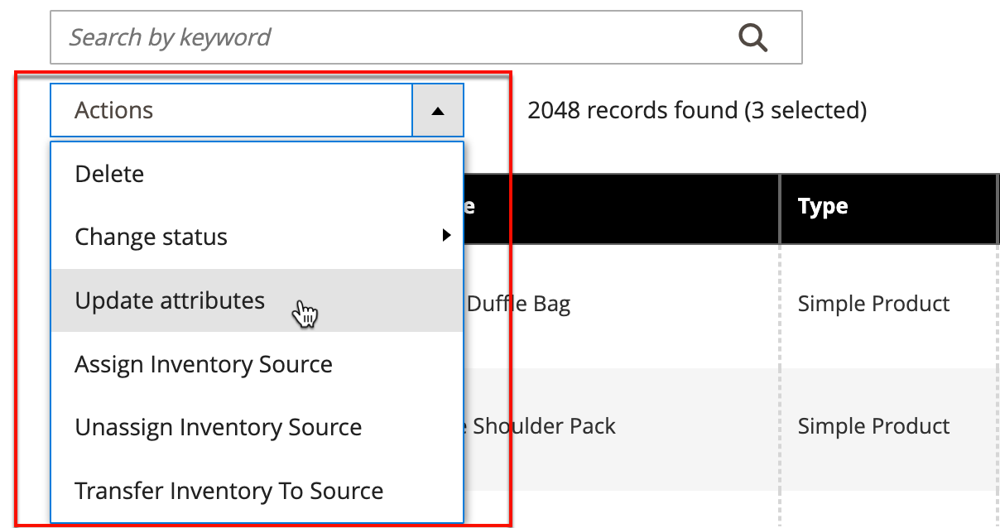

# Contrôle des actions

Lorsque vous travaillez avec une collection d&#39;enregistrements dans la grille, vous pouvez utiliser le contrôle Actions pour appliquer une opération à un ou plusieurs enregistrements. Le contrôle Actions répertorie chaque opération disponible pour le type de données spécifique. Par exemple, vous pouvez utiliser le contrôle Actions pour mettre à jour les attributs des produits sélectionnés, pour modifier le statut de `Disabled` en `Enabled` ou pour supprimer des enregistrements de la base de données.

Vous pouvez apporter autant de modifications que nécessaire, puis mettre à jour les enregistrements en une seule étape. Il est beaucoup plus efficace que de modifier les paramètres individuellement pour chaque produit. L’application de modifications à un lot d’enregistrements est une opération asynchrone, qui s’exécute en arrière-plan afin que vous puissiez continuer à travailler dans l’administration sans attendre la fin de l’opération. Le système affiche un message lorsque la tâche est terminée.

La sélection des actions disponibles varie selon la liste et des options supplémentaires peuvent apparaître en fonction de l’action sélectionnée. Par exemple, lorsque vous modifiez le statut d&#39;un groupe d&#39;enregistrements, une zone de _[!UICONTROL Status]_apparaît en regard de la commande Actions avec des options supplémentaires.

## Étape 1 : sélection des enregistrements

La case à cocher de la première colonne de la liste identifie chaque enregistrement qui est une cible pour l&#39;action. Les [contrôles de filtre](admin-grid-controls.md) peuvent être utilisés pour limiter la liste aux enregistrements que vous souhaitez cibler pour l’action.

1. Si nécessaire, définissez les filtres en haut de chaque colonne pour afficher uniquement les enregistrements à inclure.

1. Cochez la case de chaque enregistrement qui est la cible de l’action ou utilisez le sélecteur de colonnes pour choisir une sélection en bloc.

{width="500"}

## Etape 2 : appliquer une action aux enregistrements sélectionnés

1. Définissez le contrôle **[!UICONTROL Actions]** sur l’opération à appliquer.

   **_Example:_** Mise à jour des attributs

   - Dans la liste, cochez la case de chaque enregistrement à mettre à jour.

   - Définissez la commande **[!UICONTROL Actions]** sur `Update Attributes`.

     {width="450"}

   - Cliquez sur **[!UICONTROL Submit]**.

     La page Mettre à jour les attributs répertorie tous les attributs disponibles, organisés par groupe dans le panneau de gauche.

     {width="700" zoomable="yes"}

   - Cochez la case **[!UICONTROL Change]** en regard de chaque attribut et effectuez les modifications nécessaires.

   - Cliquez sur **[!UICONTROL Save]** pour mettre à jour les attributs du groupe d&#39;enregistrements sélectionné.

1. Cliquez ensuite sur **[!UICONTROL Submit]**.

## Actions de case à cocher

| Action | Description |
|--- |--- |
| [!UICONTROL Select All] | Coche la case de tous les enregistrements de la liste. |
| [!UICONTROL Unselect All] | Décoche la case de tous les enregistrements de la liste. |
| [!UICONTROL Select All on This Page] | Sélectionne la case à cocher des enregistrements affichés sur la page active. |
| [!UICONTROL Deselect All on This Page] | Décoche la case des enregistrements affichés sur la page active. |

{style="table-layout:auto"}
