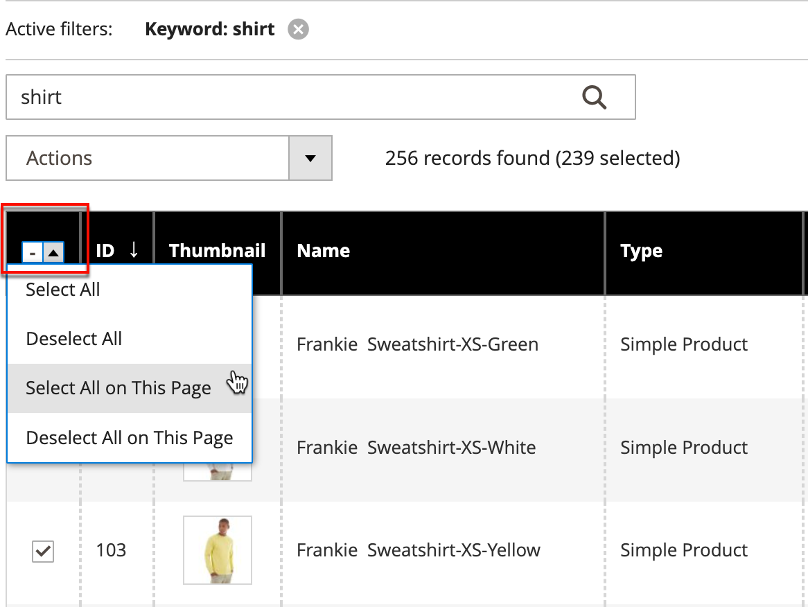

# Contrôle des actions

Lorsque vous utilisez une collection d&#39;enregistrements dans la grille, vous pouvez utiliser le contrôle Actions pour appliquer une opération à un ou plusieurs enregistrements. Le contrôle Actions répertorie chaque opération disponible pour le type spécifique de données. Par exemple, vous pouvez utiliser le contrôle Actions pour mettre à jour les attributs des produits sélectionnés, pour modifier l’état de `Disabled` to `Enabled`ou pour supprimer des enregistrements de la base de données.

Vous pouvez apporter autant de modifications que nécessaire, puis mettre à jour les enregistrements en une seule étape. Il est beaucoup plus efficace que de modifier les paramètres individuellement pour chaque produit. L’application de modifications à un lot d’enregistrements est une opération asynchrone qui s’exécute en arrière-plan afin que vous puissiez continuer à travailler dans l’administrateur sans attendre la fin de l’opération. Le système affiche un message lorsque la tâche est terminée.

La sélection des actions disponibles varie en fonction de la liste. D’autres options peuvent s’afficher, selon l’action sélectionnée. Par exemple, lors de la modification de l’état d’un groupe d’enregistrements, une _[!UICONTROL Status]_s’affiche en regard du contrôle Actions avec des options supplémentaires.

## Etape 1 : Sélection des enregistrements

La case à cocher dans la première colonne de la liste identifie chaque enregistrement qui est une cible pour l’action. La variable [contrôles de filtre](admin-grid-controls.md) peut être utilisé pour limiter la liste aux enregistrements que vous souhaitez cibler pour l’action.

1. Si nécessaire, définissez les filtres en haut de chaque colonne pour n&#39;afficher que les enregistrements à inclure.

1. Cochez la case de chaque enregistrement qui est une cible pour l’action ou utilisez le sélecteur de colonnes pour choisir une sélection en bloc.

{width="500"}

## Etape 2 : appliquer une action aux enregistrements sélectionnés

1. Définissez la variable **[!UICONTROL Actions]** contrôler l’opération que vous souhaitez appliquer.

   **_Exemple :_** Mise à jour des attributs

   - Dans la liste, cochez la case de chaque enregistrement à mettre à jour.

   - Définissez la variable **[!UICONTROL Actions]** contrôler à `Update Attributes`.

     {width="450"}

   - Cliquez sur **[!UICONTROL Submit]**.

     La page Mettre à jour les attributs répertorie tous les attributs disponibles, organisés par groupe dans le panneau de gauche.

     {width="700" zoomable="yes"}

   - Sélectionnez la variable **[!UICONTROL Change]** en regard de chaque attribut et apportez les modifications nécessaires.

   - Cliquez sur **[!UICONTROL Save]** pour mettre à jour les attributs du groupe d’enregistrements sélectionnés.

1. Lorsque vous avez terminé, cliquez sur **[!UICONTROL Submit]**.

## Actions de case à cocher

| Action | Description |
|--- |--- |
| [!UICONTROL Select All] | Coche la case de tous les enregistrements de la liste. |
| [!UICONTROL Unselect All] | Efface la case à cocher de tous les enregistrements de la liste. |
| [!UICONTROL Select All on This Page] | Coche la case des enregistrements affichés sur la page active. |
| [!UICONTROL Deselect All on This Page] | Efface la case à cocher des enregistrements affichés sur la page active. |

{style="table-layout:auto"}
