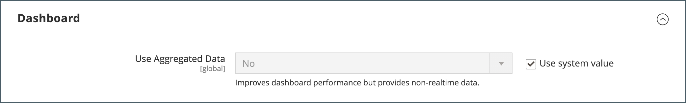

# Tableau de bord d’administration

Le tableau de bord est généralement la première page qui s’affiche lorsque vous vous connectez à l’_Admin_ et peut fournir un aperçu en temps réel des ventes et de l’activité du client. Les données du tableau de bord fournissent un instantané des ventes de durée de vie, du montant moyen des commandes, des commandes récentes et des termes de recherche. Le graphique présente les commandes et les montants terminés pour la période sélectionnée. Il peut être généré à partir de données dynamiques, de données en temps réel ou de données agrégées historiques. Les onglets inférieurs fournissent des rapports rapides sur vos produits les plus vendus, les produits les plus consultés, les nouveaux clients et les clients qui ont acheté le plus.

Si vous devez traiter une quantité importante de données, désactivez le graphique pour améliorer les performances. Le tableau de bord de l’exemple suivant est configuré pour utiliser des données en temps réel et affiche les commandes terminées par heure au cours des dernières 24 heures. Le graphique est mis à jour pour chaque commande terminée.

{zoomable="yes"}

[Rapports avancés](business-intelligence.md#advanced-reporting) affiche un tableau de bord personnalisé en fonction de vos données de produit, de commande et de client.

{zoomable="yes"}

## Configuration du tableau de bord

1. Dans la barre latérale _Admin_, accédez à **[!UICONTROL Stores]** > _[!UICONTROL Settings]_>**[!UICONTROL Configuration]**et définissez l’un des paramètres suivants.

1. Une fois la configuration terminée, cliquez sur **[!UICONTROL Save Config]**.

1. Après avoir enregistré les modifications, cliquez sur **[!UICONTROL Cache Management]** et actualisez chaque cache non valide.

### Activer les graphiques

Si vous devez traiter une grande quantité de données, vous pouvez désactiver l’affichage du graphique pour améliorer les performances. Lorsqu’il n’est pas activé, le message « Aucune donnée trouvée » s’affiche à la place du graphique, bien que les totaux récapitulatifs ci-dessous soient toujours générés.

1. Dans le panneau de navigation de gauche, sous **[!UICONTROL Advanced]**, choisissez **[!UICONTROL Admin]**.

1. Si nécessaire, développez la section **[!UICONTROL Dashboard]** .

   {width="600"}

1. Pour modifier la valeur par défaut, décochez la case **[!UICONTROL Use system value]** .

1. Définissez **Activer les graphiques** sur `Yes`.

Pour plus d’informations sur les options de configuration d’administration, consultez le [ Guide de référence de configuration ](../configuration-reference/advanced/admin.md).

### Modification de la page de démarrage

Le tableau de bord est la [page de démarrage](../configuration-reference/advanced/admin.md) par défaut de l’administrateur, bien que vous puissiez configurer une autre page de démarrage.

1. Si les options de configuration d’administration ne sont pas déjà ouvertes, choisissez **[!UICONTROL Admin]** sous _[!UICONTROL Advanced]_dans le panneau de navigation de gauche.

1. Cliquez pour développer la section **Page de démarrage**.

   {width="600"}

1. Décochez la case **[!UICONTROL Use system value]** et sélectionnez la **Page de démarrage** qui doit s’afficher lorsque vous vous connectez à Admin.

### Choisir les dates de début

1. Dans le panneau de navigation de gauche, sous **[!UICONTROL General]**, choisissez **Rapports**.

1. Sur la page, développez la section **[!UICONTROL Dashboard]** .

1. Décochez les cases **[!UICONTROL Use system value]** des paramètres de date et procédez comme suit :

   - Définissez **Débuts de cumul annuel** sur **Mois** et **Jour**.

   - Définissez **Début du mois en cours** sur **Jour**.

   {width="600"}

Pour plus d’informations sur les options de configuration [!UICONTROL Reports], consultez le [_Guide de référence de configuration_](../configuration-reference/general/reports.md).

### Configurer la source de données

Le graphique de tableau de bord peut être généré en temps réel ou à l’aide de données agrégées historiques. Si les performances posent problème, vous pouvez accélérer les choses à l’aide de données agrégées.

1. Dans le panneau de navigation de gauche, cliquez sur pour développer **Ventes** et choisissez **Ventes** en dessous.

1. Sur la page, développez la section **[!UICONTROL Dashboard]** .

   {width="600"}

1. Décochez la case **[!UICONTROL Use system value]** et définissez **[!UICONTROL Use Aggregated Data]** sur l’une des options suivantes :

   - Pour les données historiques agrégées, choisissez `Yes`.
   - Pour les données en temps réel, choisissez `No`.

## Sections du graphique

| Section | Description |
|--- |--- |
| [!UICONTROL Orders] | Cet onglet affiche un graphique en temps réel de toutes les commandes terminées pour la vue de magasin actuelle et la période spécifiée. |
| [!UICONTROL Amounts] | Cet onglet affiche un graphique en temps réel de tous les montants de commande terminés pour la vue de magasin actuelle et la période spécifiée. |
| [!UICONTROL Time Range] | Détermine les données représentées dans le graphique et les totaux récapitulatifs ci-dessous. Options : `Last 7 Days` / `Current Month` / `YTD` / `2YTD` |
| [!UICONTROL Summary Totals] | Les totaux des revenus, taxes, expéditions et quantités sous le graphique sont basés sur les données du graphique et le paramètre de la période actuelle. |

{style="table-layout:auto"}

## Données de capture instantanée

| Section | Description |
|--- |--- |
| [!UICONTROL Lifetime Sales] | Chiffre d’affaires total agrégé pendant la durée de vie du magasin. |
| [!UICONTROL Average Order] | Montant moyen de la commande pendant la durée de vie du magasin. |
| [!UICONTROL Last Orders] | Résumé des cinq dernières commandes passées. |
| [!UICONTROL Last Search Terms] | Les cinq derniers termes de recherche. |
| [!UICONTROL Top Search Terms] | Les cinq termes de recherche les plus couramment utilisés. |

{style="table-layout:auto"}

## Onglets Rapport

| Section | Description |
|--- |--- |
| [!UICONTROL Bestsellers] | Les cinq produits les plus vendus au cours de la période spécifiée. |
| [!UICONTROL Most Viewed Products] | Les cinq produits les plus consultés au cours de la période spécifiée. |
| [!UICONTROL New Customers] | Les cinq clients les plus récents qui se sont inscrits à un compte au cours de la période spécifiée. |
| [!UICONTROL Customers] | Les cinq derniers clients dont la commande a terminé le traitement au cours de la période spécifiée. |

{style="table-layout:auto"}

## Boutons du tableau de bord

| Bouton | Description |
|--- |--- |
| [!UICONTROL Reload Data] | Actualise les données du tableau de bord. |
| [!UICONTROL Go to Advanced Reporting] | Affiche un tableau de bord personnalisé de graphiques et de rapports dynamiques en fonction de vos données de produit, de commande et de client. Pour une analyse plus approfondie, consultez [Rapports avancés](business-intelligence.md#advanced-reporting). |

{style="table-layout:auto"}
