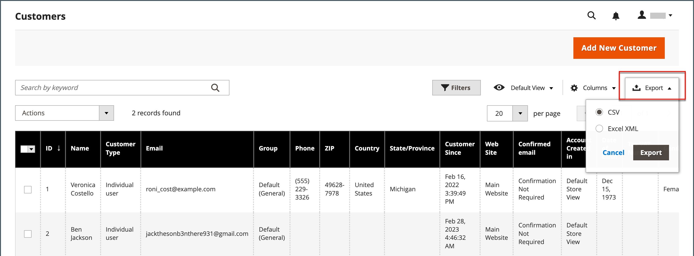

# Contrôles de grille d’administration

Les pages d’administration qui gèrent les données affichent une collection d’enregistrements dans une grille. Les contrôles en haut de chaque colonne peuvent être utilisés pour trier les données. L’ordre de tri actuel est indiqué par une flèche ascendante ou descendante dans l’en-tête de colonne. Vous pouvez spécifier les colonnes qui apparaissent dans la grille et les faire glisser à différentes positions. Vous pouvez également enregistrer différentes dispositions de colonnes en tant que vues pouvant être utilisées ultérieurement. La colonne **[!UICONTROL Action]** répertorie les opérations qui peuvent être appliquées à un enregistrement individuel. En outre, la date de la vue actuelle de la plupart des grilles peut être exportée dans un fichier [CSV](../systems/data-csv.md) ou XML.

{width="700" zoomable="yes"}

## Tri de la liste

1. Cliquez sur n’importe quel en-tête de colonne.

   La flèche indique que l’ordre actuel est croissant ou décroissant.

1. Utilisez les commandes de pagination pour afficher des pages supplémentaires dans la collection.

   {width="300"}

## Paginer la liste

1. Définissez le contrôle **[!UICONTROL Pagination]** sur le nombre d’enregistrements que vous souhaitez afficher par page.

1. Cliquez sur **[!UICONTROL Next]** et **[!UICONTROL Previous]** pour parcourir la liste ou entrez un **[!UICONTROL Page Number]** spécifique.

## Filtrer la liste

1. Cliquez sur **[!UICONTROL Filters]**.

1. Complétez autant de filtres que nécessaire pour décrire l’enregistrement que vous souhaitez trouver.

1. Cliquez sur **[!UICONTROL Apply Filters]**.

   {width="700" zoomable="yes"}

## Exporter des données

1. Sélectionnez les enregistrements à exporter.

   >[!NOTE]
   >
   >Les données de produit ne peuvent pas être exportées à partir de la grille. Pour en savoir plus, voir [Export](../systems/data-export.md).

1. Dans le menu _Exporter_ () situé dans le coin supérieur droit, sélectionnez l’un des formats de fichier suivants :

   - `CSV`
   - `Excel XML`

   {width="700" zoomable="yes"}

1. Cliquez sur **[!UICONTROL Export]**.

1. Recherchez le fichier téléchargé des données exportées à l’emplacement utilisé pour les téléchargements par votre navigateur.

## Disposition de la grille

La sélection des colonnes et leur ordre dans la grille peuvent être modifiés selon vos préférences et enregistrés sous la forme d’une _vue_. Vous pouvez contrôler les attributs affichés dans la grille sous la configuration d’attribut individuelle. De nombreux attributs affichés dans la grille de produit peuvent affecter le temps et les performances de chargement de l’administrateur.

{width="700" zoomable="yes"}

### Modifier la sélection des colonnes

1. Dans le coin supérieur droit, cliquez sur la commande _Colonnes_ ().

1. Modifier les sélections de colonnes :

   - Cochez la case d’une colonne que vous souhaitez ajouter à la grille.
   - Décochez la case de toute colonne que vous souhaitez supprimer de la grille.
   - Pour renvoyer la vue de grille par défaut, cliquez sur **[!UICONTROL Reset]**.

Veillez à faire défiler vers le bas pour afficher toutes les colonnes disponibles.

### Déplacer une colonne

1. Cliquez sur l’en-tête de la colonne et maintenez-la enfoncée.

1. Faites glisser la colonne vers la nouvelle position et la nouvelle version.

### Enregistrer une vue de grille

1. Cliquez sur la commande _View_ ().

1. Cliquez sur **[!UICONTROL Save Current View]**.

1. Saisissez un **[!UICONTROL name]** pour la vue.

1. Pour enregistrer toutes les modifications, cliquez sur la _flèche_ ().

   Le nom de la vue s’affiche désormais sous la forme de la vue actuelle.

### Modification de la vue de grille

1. Cliquez sur la commande _Afficher_ ().

1. Effectuez l’une des opérations suivantes :

   - Pour utiliser une autre vue, cliquez sur le nom de la vue.
   - Pour modifier le nom d&#39;une vue, cliquez sur l&#39;icône _Modifier_ () et mettez à jour le nom.
   - Pour supprimer une vue, cliquez sur l’icône _Modifier_ (), puis sur l’icône _Supprimer_ ().
