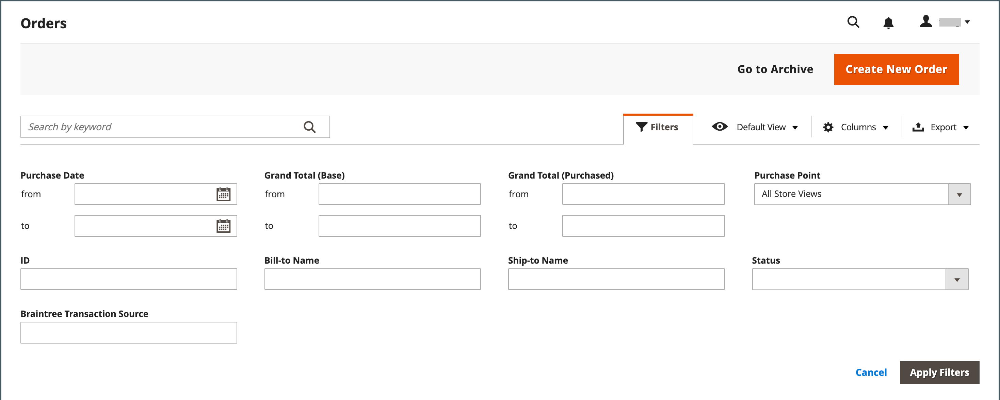
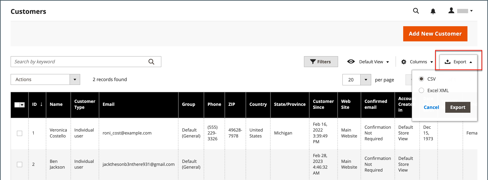
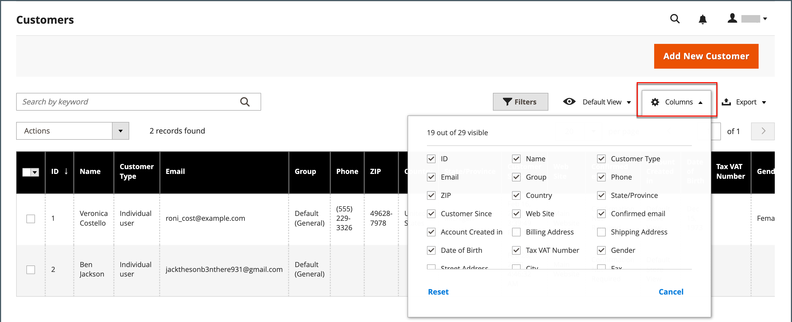

# Contrôles de grille d&#39;administration

Les pages d’administration qui gèrent les données affichent une collection d’enregistrements dans une grille. Les commandes en haut de chaque colonne peuvent être utilisées pour trier les données. L’ordre de tri actuel est indiqué par une flèche ascendante ou descendante dans l’en-tête de colonne. Vous pouvez spécifier les colonnes à afficher dans la grille et les faire glisser vers différentes positions. Vous pouvez également enregistrer différentes dispositions de colonnes en tant que vues utilisables ultérieurement. La colonne **[!UICONTROL Action]** répertorie les opérations qui peuvent être appliquées à un enregistrement individuel. En outre, la date de l’affichage actuel de la plupart des grilles peut être exportée dans un fichier [CSV](../systems/data-csv.md) ou XML.

{width="700" zoomable="yes"}

## Trier la liste

1. Cliquez sur un en-tête de colonne.

   La flèche indique que l’ordre actuel est croissant ou décroissant.

1. Utilisez les commandes de pagination pour afficher des pages supplémentaires dans la collection.

   {width="300"}

## Paginer la liste

1. Définissez le contrôle **[!UICONTROL Pagination]** sur le nombre d’enregistrements que vous souhaitez afficher par page.

1. Cliquez sur **[!UICONTROL Next]** et **[!UICONTROL Previous]** pour parcourir la liste, ou saisissez une **[!UICONTROL Page Number]** spécifique.

## Filtrer la liste

1. Cliquez sur **[!UICONTROL Filters]**.

1. Renseignez autant de filtres que nécessaire pour décrire l’enregistrement que vous souhaitez rechercher.

1. Cliquez sur **[!UICONTROL Apply Filters]**.

   {width="700" zoomable="yes"}

## Exporter les données

1. Sélectionnez les enregistrements à exporter.

   >[!NOTE]
   >
   >Les données de produit ne peuvent pas être exportées à partir de la grille. Pour en savoir plus, voir [Exporter](../systems/data-export.md).

1. Dans le menu _Exporter_ () dans le coin supérieur droit, choisissez l’un des formats de fichiers suivants :

   - `CSV`
   - `Excel XML`

   {width="700" zoomable="yes"}

1. Cliquez sur **[!UICONTROL Export]**.

1. Recherchez le fichier téléchargé des données exportées à l’emplacement utilisé pour les téléchargements par votre navigateur.

## Disposition Grille

La sélection des colonnes et leur ordre dans la grille peuvent être modifiés selon vos préférences et enregistrés en tant que _vue_. Vous pouvez contrôler les attributs qui s’affichent dans la grille sous la configuration d’attributs individuels. De nombreux attributs affichés dans la grille de produit peuvent affecter le temps de chargement et les performances de l’administrateur.

{width="700" zoomable="yes"}

### Modifier la sélection des colonnes

1. Dans le coin supérieur droit, cliquez sur le contrôle _Colonnes_ ().

1. Modifiez les sélections de colonnes :

   - Cochez la case de n’importe quelle colonne à ajouter à la grille.
   - Décochez la case de toute colonne que vous souhaitez supprimer de la grille.
   - Pour revenir à la vue de grille par défaut, cliquez sur **[!UICONTROL Reset]**.

Veillez à faire défiler l’écran vers le bas pour afficher toutes les colonnes disponibles.

### Déplacer une colonne

1. Cliquez sur l’en-tête de la colonne et maintenez la touche enfoncée.

1. Faites glisser la colonne vers sa nouvelle position et relâchez-la.

### Enregistrer une vue de grille

1. Cliquez sur le contrôle _Affichage_ ().

1. Cliquez sur **[!UICONTROL Save Current View]**.

1. Saisissez un **[!UICONTROL name]** pour la vue.

1. Pour enregistrer toutes les modifications, cliquez sur la _Flèche_ ().

   Le nom de la vue apparaît désormais comme vue actuelle.

### Modifier l’affichage de la grille

1. Cliquez sur la commande _Affichage_ ().

1. Effectuez l’une des opérations suivantes :

   - Pour utiliser une autre vue, cliquez sur son nom.
   - Pour modifier le nom d&#39;une vue, cliquez sur l&#39;icône _Modifier_ () et mettez à jour le nom.
   - Pour supprimer une vue, cliquez sur l&#39;icône _Modifier_ (), puis sur l&#39;icône _Supprimer_ ().
