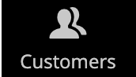

# Barre latérale d’administration

La barre latérale gauche est le menu principal du magasin. _Administration_ et est conçu pour les ordinateurs de bureau et les appareils mobiles. Le menu déroulant permet d’accéder à tous les outils que vous utilisez pour gérer votre boutique tous les jours.

| Icône Menu | Lien | Description |
| --------- | ---- | ----------- |
|  | **[Page de démarrage de l’administrateur](../configuration-reference/advanced/admin.md)** | Affiche la page de démarrage de l’administrateur, qui est le tableau de bord par défaut. |
|  | **[[!UICONTROL Dashboard]](admin-dashboard.md)** | Le tableau de bord fournit un aperçu rapide des ventes et de l’activité des clients dans votre boutique. Il s’agit généralement de la première page qui s’affiche lorsque vous vous connectez à l’administrateur. |
|  | **[[!UICONTROL Sales]](../stores-purchase/sales-menu.md)** | La variable [!UICONTROL Sales] vous y trouverez tout ce qui a trait aux opérations de traitement des commandes, des factures, des envois, des notes de crédit et des transactions. |
|  | **[[!UICONTROL Catalog]](../catalog/catalog-menu.md)** | La variable [!UICONTROL Catalog] sert à créer des produits et à définir des catégories. |
|  | **[[!UICONTROL Customers]](../customers/customers-introduction.md)** | La variable [!UICONTROL Customers] vous permet de gérer les comptes clients et de voir quels clients sont en ligne en ce moment. |
|  | **[[!UICONTROL Marketing]](../merchandising-promotions/marketing-menu.md)** | La variable [!UICONTROL Marketing] est l’emplacement où vous configurez les règles de prix du catalogue et du panier, ainsi que les bons. Les règles de prix déclenchent des actions lorsqu’un ensemble de conditions spécifiques est satisfait. |
|  | **[[!UICONTROL Content]](../content-design/content-menu.md)** | La variable [!UICONTROL Content] est l’emplacement où vous gérez les éléments de contenu et la conception de votre magasin. Découvrez comment créer des pages, des blocs et des applications frontales et gérer la présentation de votre boutique. |
|  | **[[!UICONTROL Reports]](reports-menu.md)** | La variable [!UICONTROL Reports] offre une large sélection de rapports qui vous donnent des informations sur tous les aspects de votre boutique, notamment les ventes, le panier, les produits, les clients, les balises, les révisions, les termes de recherche, ainsi que la surveillance des performances en temps réel 24/7 et les recommandations du [Outil d’analyse à l’échelle du site](https://experienceleague.adobe.com/en/docs/commerce-operations/tools/site-wide-analysis-tool/intro). |
|  | **[[!UICONTROL Stores]](../stores-purchase/stores-menu.md)** | La variable [!UICONTROL Stores] menu comprend des outils pour configurer et gérer tous les aspects de votre magasin, y compris les paramètres d’installation multisite, les taxes, la devise, les attributs de produit et les groupes de clients. |
|  | **[[!UICONTROL System]](../systems/system-menu.md)** | La variable [!UICONTROL System] menu comprend des outils pour gérer les opérations système, installer des extensions et gérer les services web pour l’intégration à d’autres applications. |
|  | **[[!UICONTROL Find Partners & Extensions]](commerce-marketplace.md)** | La variable [!DNL Commerce Marketplace] est l’emplacement où vous pouvez trouver des solutions Adobe Commerce et Magento Open Source pour votre boutique. |

{style="table-layout:auto"}
