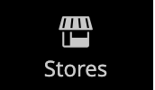

# Barre latérale d’administration

La barre latérale gauche est le menu principal du magasin _Admin_ et est conçue pour les ordinateurs de bureau et les appareils mobiles. Le menu déroulant permet d’accéder à tous les outils que vous utilisez pour gérer votre boutique quotidiennement.

| Icône de menu | Lien | Description |
| --------- | ---- | ----------- |
|  | **[Page de démarrage de l’administrateur](../configuration-reference/advanced/admin.md)** | Affiche la page de démarrage d’administration, qui est le tableau de bord par défaut. |
|  | **[[!UICONTROL Dashboard]](admin-dashboard.md)** | Le tableau de bord offre un aperçu rapide des ventes et de l’activité des clients dans votre boutique. Il s’agit généralement de la première page qui s’affiche lorsque vous vous connectez à l’administrateur. |
|  | **[[!UICONTROL Sales]](../stores-purchase/sales-menu.md)** | Dans le menu [!UICONTROL Sales], vous trouverez tout ce qui concerne les opérations de traitement des commandes, des factures, des expéditions, des avoirs et des transactions. |
|  | **[[!UICONTROL Catalog]](../catalog/catalog-menu.md)** | Le menu [!UICONTROL Catalog] permet de créer des produits et de définir des catégories. |
|  | **[[!UICONTROL Customers]](../customers/customers-introduction.md)** | Le menu [!UICONTROL Customers] vous permet de gérer les comptes clients et de voir quels clients sont en ligne pour le moment. |
|  | **[[!UICONTROL Marketing]](../merchandising-promotions/marketing-menu.md)** | Dans le menu [!UICONTROL Marketing], configurez les règles de prix et les coupons du catalogue et du panier. Les règles de prix déclenchent des actions lorsqu’un ensemble de conditions spécifiques est rempli. |
|  | **[[!UICONTROL Content]](../content-design/content-menu.md)** | Le menu [!UICONTROL Content] vous permet de gérer les éléments de contenu et la conception de votre boutique. Découvrez comment créer des pages, des blocs et des applications frontales, et comment gérer la présentation de votre boutique. |
|  | **[[!UICONTROL Reports]](reports-menu.md)** | [!BADGE PaaS uniquement]{type=Informative url="https://experienceleague.adobe.com/fr/docs/commerce/user-guides/product-solutions" tooltip="S’applique uniquement aux projets Adobe Commerce on Cloud (infrastructure PaaS gérée par Adobe) et aux projets On-premise."} Le menu [!UICONTROL Reports] propose une large sélection de rapports qui vous permettent d’accéder à insight dans tous les aspects de votre boutique, y compris les ventes, le panier, les produits, les clients, les balises, les révisions, les termes de recherche, ainsi que la surveillance des performances en temps réel 24h/24 et 7j/7 et les recommandations de l’[outil d’analyse à l’échelle du site](https://experienceleague.adobe.com/fr/docs/commerce-operations/tools/site-wide-analysis-tool/intro). |
|  | **[[!UICONTROL Stores]](../stores-purchase/stores-menu.md)** | Le menu [!UICONTROL Stores] comprend des outils permettant de configurer et de gérer tous les aspects de votre boutique, notamment les paramètres d’installation multisite, les taxes, la devise, les attributs de produit et les groupes de clients. |
|  | **[[!UICONTROL System]](../systems/system-menu.md)** | Le menu [!UICONTROL System] comprend des outils permettant de gérer les opérations système, d’installer des extensions et de gérer les services web pour l’intégration à d’autres applications. |
|  | **[[!UICONTROL Find Partners & Extensions]](commerce-marketplace.md)** | [!BADGE PaaS uniquement]{type=Informative url="https://experienceleague.adobe.com/fr/docs/commerce/user-guides/product-solutions" tooltip="S’applique uniquement aux projets Adobe Commerce on Cloud (infrastructure PaaS gérée par Adobe) et aux projets On-premise."} c’est dans ce [!DNL Commerce Marketplace] que vous trouverez les solutions Adobe Commerce et Magento Open Source pour votre boutique. |

{style="table-layout:auto"}
