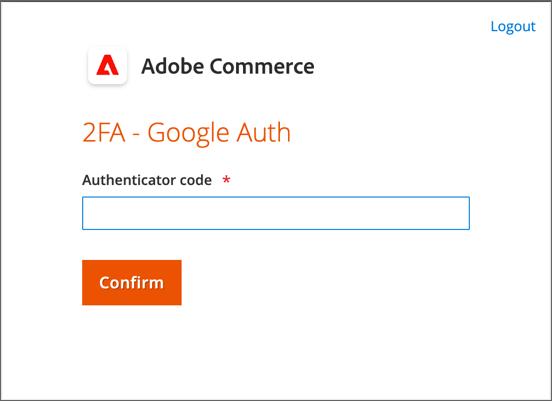

# Votre compte administrateur

Le compte administrateur principal a été initialement configuré pendant l’installation et peut contenir des informations initiales sur l’espace réservé ou des exemples de données. Le propriétaire désigné de ce compte peut personnaliser le nom d’utilisateur et le mot de passe et mettre à jour le prénom, le nom et l’adresse électronique à tout moment. Ce compte, un _super-utilisateur_ avec toutes les autorisations par défaut, crée généralement les comptes d’utilisateur administrateur nécessaires à l’entreprise.

- Voir [Création d’un utilisateur](../systems/permissions-users-all.md#create-a-user) pour plus d’informations sur l’ajout ou la modification d’utilisateurs.

- Voir [Autorisations](../systems/permissions.md) et [Rôles utilisateur](../systems/permissions-user-roles.md) pour plus d’informations sur les rôles d’administrateur et d’utilisateur.

{{ims-admin-note}}

## Connexion d’administrateur

L’ [!DNL Commerce] _administrateur_ est protégé par plusieurs couches de mesures de sécurité afin d’empêcher tout accès non autorisé aux données de votre magasin, de votre commande et de vos clients. La première fois que vous vous connectez à _Admin_, vous devez saisir votre nom d’utilisateur et votre mot de passe et configurer l’ [authentification à deux facteurs](../systems/security-two-factor-authentication.md) (2FA).

Selon la configuration de votre boutique, il peut y avoir un problème [CAPTCHA](../systems/security-google-recaptcha.md) à résoudre, comme saisir une série de caractères de clavier, résoudre un puzzle ou cliquer sur une série d’images avec un thème commun. Ces tests sont conçus pour vous identifier en tant qu’humain, plutôt qu’en tant que robot automatisé.

Pour plus de sécurité, vous pouvez déterminer les parties de l’ _Admin_ auxquelles chaque utilisateur a [l’autorisation](../systems/permissions.md) d’accéder et limiter également le nombre de [tentatives de connexion](../configuration-reference/advanced/admin.md). Par défaut, après six tentatives, le compte est verrouillé et l’utilisateur doit attendre quelques minutes avant de réessayer. [Les comptes verrouillés](../systems/permissions-users-all.md#locked-users) peuvent également être réinitialisés à partir de l’ _administrateur_.

>[!NOTE]
>
>La première fois que vous vous connectez à _Admin_, vous êtes invité à _Autoriser la collecte de données d’utilisation de l’administrateur_. Voir [Collecte de données d’utilisation](admin.md#usage-data-collection) pour plus d’informations.

{width="400"}

### Étape 1 : configuration de l’authentification à deux facteurs

Avant de pouvoir vous connecter à l’ _administrateur_ de votre boutique, vous devez disposer d’une solution d’authentification à deux facteurs configurée et prête à l’emploi. Pour en savoir plus sur le processus d’authentification utilisé par chaque solution, voir [Utilisation de l’authentification à deux facteurs](../systems/security-two-factor-authentication-use.md). Par défaut, [!DNL Commerce] prend en charge [Authentificateur Google][1].

Demandez à votre administrateur système [!DNL Commerce] quelles solutions 2FA sont prises en charge pour le magasin. Ensuite, effectuez la configuration de votre solution 2FA préférée en fonction des instructions du fournisseur.

### Étape 2 : connexion à l’administrateur

1. Saisissez l’URL _Admin_ spécifiée lors de l’installation de [!DNL Commerce].

   L’URL _Admin_ par défaut ressemble à `https://www.yourdomain.com/your-custom-admin-domain`.

   >[!NOTE]
   >
   >Bien que cette documentation utilise `admin` comme URL de base dans la plupart des exemples, il est recommandé de choisir une [URL personnalisée](../stores-purchase/store-urls.md) unique et difficile à deviner pour l’ _administrateur_ de votre boutique.

   Vous pouvez ajouter un signet pour la page ou enregistrer un raccourci sur votre bureau pour un accès facile.

1. Saisissez vos _Admin_ **[!UICONTROL Username]** et **[!UICONTROL Password]**.

1. (Facultatif) Si un CAPTCHA est activé pour votre magasin, suivez les instructions à l’écran pour résoudre le problème.

   Pour en savoir plus, voir [CAPTCHA](../systems/security-captcha.md) et [reCAPTCHA](../systems/security-google-recaptcha.md).

1. Cliquez sur **[!UICONTROL Sign in]**.

   Si c’est la première fois que vous vous connectez à _Admin_ à partir du compte, vous devriez recevoir un courrier électronique contenant un lien vers les instructions de configuration.

### Étape 3 : achèvement de la configuration 2FA

L’exemple suivant montre comment associer votre compte _Admin_ à l’authentificateur Google.

1. Lorsque le code QR apparaît, utilisez l’une des méthodes suivantes pour capturer le code et associer l’authentificateur Google à votre compte _Admin_.

   {width="400"}

   - Capture du code QR à l’aide d’un smartphone

     Sur votre smartphone, lancez l’authentificateur Google. Appuyez sur le signe _plus_ (+) dans le coin supérieur droit de l’application. Ensuite, en bas de l’écran, appuyez sur **[!UICONTROL Scan Barcode]** et prenez une photo du code QR.

   - Capture du code QR à partir du navigateur

     Si l’authentificateur Google est installé en tant qu’extension dans votre navigateur, cliquez sur l’icône **Authentificateur** de la barre d’outils et enregistrez la page.

   - Saisie manuelle du code QR

     Copiez la chaîne de texte sous le code QR. Lancez l’authentificateur Google avec votre smartphone ou navigateur, puis cliquez sur le signe plus (+). Sélectionnez ensuite **[!UICONTROL Manual Entry]**. Sous **[!UICONTROL Account]**, saisissez l’adresse électronique associée à votre compte _Admin_ et collez la chaîne de code QR dans le champ **[!UICONTROL Key]**.

1. Pour vous connecter à l’ _Admin_ avec authentification à deux facteurs, saisissez le code à six chiffres généré par l’authentificateur Google dans le champ **[!UICONTROL Authenticator code]**, puis cliquez sur **[!UICONTROL Confirm]**.

   {width="400"}

## Réinitialisation de votre mot de passe

La réutilisation des quatre derniers mots de passe affectés au compte n’est pas autorisée.

1. Saisissez le **[!UICONTROL Email Address]** associé au compte _Admin_.

   {width="400"}

1. Cliquez sur **[!UICONTROL Retrieve Password]**.

   Si un compte est associé à l’adresse électronique, un courrier électronique est envoyé pour réinitialiser votre mot de passe.

   >[!NOTE]
   >
   >Un mot de passe _Admin_ doit comporter au moins sept caractères et contenir à la fois des lettres et des chiffres. Voir [Configuration de la _sécurité de l&#39;administrateur_](../systems/security-admin.md) pour plus d&#39;informations sur les options de mot de passe.

## Déconnexion de l’administrateur

1. Dans le coin supérieur droit, cliquez sur l’icône _Compte_ ().

1. Cliquez sur **[!UICONTROL Sign Out]**.

   {width="700" zoomable="yes"}

La page _[!UICONTROL Sign In]_affiche un message indiquant que vous êtes déconnecté. Déconnectez-vous de_ Admin _chaque fois que vous laissez votre ordinateur sans surveillance.

## Modifier les informations du compte

1. Cliquez sur l&#39;icône _Compte_ ().

1. Cliquez sur **[!UICONTROL Account Setting]**.

   {width="700" zoomable="yes"}

1. Apportez les modifications nécessaires aux informations de votre compte.

   Si vous modifiez vos informations de connexion, assurez-vous de les stocker dans un emplacement sécurisé.

1. Saisissez le mot de passe de votre compte actuel.

1. Cliquez sur **[!UICONTROL Save Account]**.

## Autorisation de plusieurs connexions d’administrateur

L’administrateur permet de gérer les commandes, les clients, les produits, les frais d’expédition et les fonctionnalités de paiements. La configuration par défaut est définie pour interdire plusieurs connexions pour un compte d’utilisateur administrateur en tant que bonne pratique de sécurité. Cependant, vous pouvez modifier ce paramètre pour permettre aux utilisateurs administrateurs d’être connectés à partir de plusieurs appareils en fonction des workflows de votre entreprise.

1. Sur la barre latérale _Admin_, accédez à **[!UICONTROL Stores]** > _[!UICONTROL Settings]_>**[!UICONTROL Configuration]**.

1. Dans le panneau de navigation de gauche, développez **[!UICONTROL Advanced]** et choisissez **[!UICONTROL Admin]**.

1. Développez la section  sur **[!UICONTROL Security]** .

1. Pour **Partage de compte administrateur**, sélectionnez `Yes`.

   {width="700" zoomable="yes"}

1. Cliquez sur **[!UICONTROL Save Config]**.

## Définir les noms de connexion des utilisateurs administrateurs en fonction de la casse

1. Sur la barre latérale _Admin_, accédez à **[!UICONTROL Stores]** > _[!UICONTROL Settings]_>**[!UICONTROL Configuration]**.

1. Dans le panneau de navigation de gauche, développez **[!UICONTROL Advanced]** et choisissez **[!UICONTROL Admin]**.

1. Développez la section  sur **[!UICONTROL Security]** .

1. Définissez le champ **[!UICONTROL Login is Case Sensitive]** sur `Yes`.

1. Cliquez sur **[!UICONTROL Save Config]**.

[1]: https://play.google.com/store/apps/details?id=com.google.android.apps.authenticator2&amp;hl=en_US
