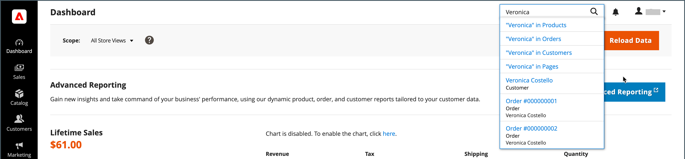

# Outils d’administration et espace de travail

L’espace de travail d’administration permet d’accéder à tous les outils, données et contenu utilisés pour exécuter votre magasin. La page de démarrage par défaut peut être définie dans la configuration . De nombreuses pages d’administration disposent d’une grille qui répertorie les données de la section, avec un ensemble d’outils permettant de rechercher, trier, filtrer, sélectionner et appliquer des actions. Par défaut, le [tableau de bord](admin-dashboard.md) est la page de démarrage de l’administrateur. Cependant, vous pouvez choisir n’importe quelle autre page qui apparaîtra comme page de démarrage lorsque vous vous connectez. Vous pouvez cliquer sur le logo dans la barre latérale d’administration pour revenir à la page de démarrage de l’administrateur.

{zoomable="yes"}

## Contrôles Workspace

| Contrôle | Description |
|--- |--- |
| [!UICONTROL Global Search] | L’icône de recherche en haut à droite permet de trouver n’importe quelle valeur dans la base de données, y compris les enregistrements de produit, de client et de commande. |
| [!UICONTROL Grid Search] | La zone de recherche au-dessus de la grille peut être utilisée pour filtrer rapidement l&#39;affichage de la grille en fonction des mots-clés trouvés dans les enregistrements. |
| [!UICONTROL Sort] | L’en-tête de chaque colonne peut être utilisé pour trier la liste par ordre croissant ou décroissant. |
| [!UICONTROL Filters] | Définit un ensemble de paramètres de recherche qui détermine les enregistrements qui apparaissent dans la grille. En outre, les filtres dans l&#39;en-tête de certaines colonnes peuvent être utilisés pour limiter la liste à des valeurs spécifiques. Certains filtres comportent des options supplémentaires qui peuvent être sélectionnées à partir d’une zone de liste. |
| [!UICONTROL Default View] | Détermine la disposition des colonnes par défaut de la grille. |
| [!UICONTROL Columns] | Détermine la sélection de [colonnes](admin-grid-controls.md) et leur ordre dans la grille. La mise en page des colonnes peut être modifiée et enregistrée en tant que _vue_. Par défaut, seules certaines colonnes sont incluses dans la grille. |
| [!UICONTROL Paginate] | Les commandes de pagination sont utilisées pour afficher les pages de résultats supplémentaires. |
| [!UICONTROL Actions] | Le contrôle Actions applique une opération à tous les enregistrements sélectionnés. |
| [!UICONTROL Select] | Le contrôle Sélectionner permet de sélectionner plusieurs enregistrements qui doivent être la cible d&#39;une action. Options : `Select All` / `Deselect All` |

{style="table-layout:auto"}

## Recherche Workspace

Pour trouver un enregistrement dans la base de données, utilisez l’icône en forme de loupe dans l’en-tête de l’_Admin_. Les résultats peuvent inclure des clients, des produits, des commandes ou tout attribut associé. Par exemple, si vous saisissez un nom de client, les résultats peuvent inclure l’enregistrement du client et les commandes associées au nom.

{width="700" zoomable="yes"}

1. Dans l’en-tête, cliquez sur l’icône _Rechercher_ () pour ouvrir la zone de recherche.

1. Effectuez l’une des opérations suivantes :

   - Pour rechercher une correspondance de proximité, saisissez les premières lettres de ce que vous souhaitez trouver.
   - Pour rechercher une correspondance exacte, saisissez le ou les mots que vous souhaitez rechercher.

1. Dans les résultats de recherche affichés, cliquez sur un élément pour ouvrir l’enregistrement.

## Modifier la page de démarrage de l’administrateur

Le [tableau de bord](admin-workspace.md#the-dashboard) est la page de démarrage par défaut de l’administrateur, bien que vous puissiez configurer une autre page de démarrage.

1. Sur la barre latérale _Admin_, accédez à **[!UICONTROL Stores]** > _[!UICONTROL Settings]_>**[!UICONTROL Configuration]**.

1. Dans le panneau de navigation de gauche sous **[!UICONTROL Advanced]**, choisissez **[!UICONTROL Admin]**.

1. Développez la section  sur **[!UICONTROL Startup Page]** .

   {width="600"}

1. Définissez **[!UICONTROL Startup Page]** sur la page que vous souhaitez afficher en premier après vous être connecté à l’administrateur.

   Pour obtenir la liste détaillée de toutes les options d’administration, voir [Admin](../configuration-reference/advanced/admin.md) dans la _référence de configuration_.

1. Une fois l’opération terminée, cliquez sur **[!UICONTROL Save Config]**.
