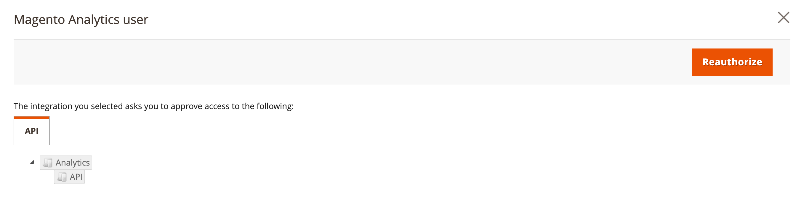

# [!DNL Commerce Intelligence] outils

Utilisez les outils Commerce Intelligence pour obtenir les informations nécessaires pour prendre des décisions professionnelles avisées.

## Compte [!DNL Commerce Intelligence]

Lorsque vous activez un compte [!DNL Commerce Intelligence] par Adobe, vous avez accès à cinq tableaux de bord avec environ 70 rapports. Ces rapports sont conçus pour fournir des informations sur vos données et répondre à des questions telles que &quot;Comment mes commandes augmentent-elles d’un mois à l’autre ?&quot;, &quot;Qui sont mes clients les plus fidèles ?&quot; et &quot;Ma stratégie de bons fonctionne-t-elle ?&quot;. Pour plus d’informations sur cet ensemble d’outils, consultez le [Guide de l’utilisateur de Commerce Intelligence][1].

## [!DNL Advanced Reporting]

[!DNL Advanced Reporting] est inclus avec Adobe Commerce et Magento Open Source. Cette fonctionnalité vous donne accès à une suite de rapports dynamiques reposant sur les données de vos produits, commandes et clients, avec un tableau de bord personnalisé adapté aux besoins de votre entreprise. Bien que [!DNL Advanced Reporting] utilise [!DNL Commerce Intelligence] pour les analyses, vous n&#39;avez pas besoin d&#39;un compte Commerce Intelligence pour utiliser [!DNL Advanced Reporting].

Pour obtenir des informations techniques, consultez la rubrique [[!DNL Advanced Reporting]][2]{:target=&quot;_blank&quot;} de la documentation destinée aux développeurs.

>[!NOTE]
>
>En raison de problèmes de compatibilité avec [!DNL Adobe Commerce Intelligence], Commerce ne peut temporairement pas prendre en charge la création de rapports avancés à l’aide du compartiment AWS S3 comme support pour le fichier de données source dans [!DNL Commerce Intelligence].

{width="700"}

### Conditions

* Le site web doit s’exécuter sur un serveur web public.

* Le domaine doit disposer d’un certificat de sécurité (SSL) valide.

* [!DNL Commerce] doit avoir été installé ou mis à niveau sans erreur.

* Dans la configuration [!DNL Commerce] pour les [URL du magasin](../stores-purchase/store-urls.md), le paramètre **[!UICONTROL Base URL (Secure)]** de la vue du magasin doit pointer vers l’URL sécurisée. Par exemple : `https://yourdomain.com`.

* Dans la configuration [!DNL Commerce] pour les URL de magasin, **[!UICONTROL Use Secure URLs on Storefront]** et **[!UICONTROL Use Secure URLs in Admin]** doivent être définis sur `Yes`.

* [[!DNL Commerce] crontab][3] est créé et les tâches cron sont en cours d’exécution sur le serveur installé.

>[!NOTE]
>
>[!DNL Advanced Reporting] ne peut être utilisé qu’avec les installations [!DNL Commerce] qui ont continuellement utilisé une seule [devise de base](../stores-purchase/currency-configuration.md).


### Étape 1 : Activer [!DNL Advanced Reporting]

Dans la configuration [!DNL Commerce], [[!DNL Advanced Reporting]](../configuration-reference/general/advanced-reporting.md) est activé par défaut et démarre automatiquement si cron est [configuré](../configuration-reference/advanced/system.md) et en cours d’exécution. Une tentative d’établissement de l’abonnement est lancée au début de chaque heure au cours des 24 heures suivantes, jusqu’à ce qu’elle aboutisse. L’état de l’abonnement est &quot;en attente&quot; jusqu’à ce que l’abonnement soit correctement défini.

1. Sur la barre latérale _Admin_, accédez à **[!UICONTROL Stores]** > _[!UICONTROL Settings]_>**[!UICONTROL Configuration]**.

1. Dans le panneau de navigation de gauche où **[!UICONTROL General]** est développé, sélectionnez **[!UICONTROL Advanced Reporting]** et procédez comme suit :

   * Vérifiez que **[!UICONTROL Advanced Reporting Service]** est défini sur `Enable` (paramètre par défaut).

   * Définissez le **[!UICONTROL Time of day to send data]** sur l’heure, la minute et la seconde, selon une horloge de 24 heures, selon laquelle vous souhaitez que le service reçoive des données mises à jour de votre magasin. Par défaut, les données sont envoyées à 02h00.

   * Sous **[!UICONTROL Industry Data]**, sélectionnez le **[!UICONTROL Industry]** qui décrit le mieux votre entreprise.

   {width="400"}

1. Une fois l’opération terminée, cliquez sur **[!UICONTROL Save Config]**.

1. Lorsque vous y êtes invité, cliquez sur **[[!UICONTROL Cache Management]](../systems/cache-management.md)** dans le message en haut de la page et actualisez les caches non valides.

1. Patientez toute la nuit ou jusqu’à ce que la prochaine mise à jour soit programmée. Vérifiez ensuite le statut de votre abonnement. Si l’état est toujours _en attente_, assurez-vous que votre installation répond à toutes les exigences.

### Étape 2 : Accès à [!DNL Advanced Reporting]

1. Effectuez l’une des opérations suivantes :

   * Dans la barre latérale _Admin_, choisissez **[!UICONTROL Dashboard]**. Cliquez ensuite sur **[!UICONTROL Go to Advanced Reporting]**.
   * Sur la barre latérale _Admin_, accédez à **[!UICONTROL Reports]** > _[!UICONTROL Business Intelligence]_>**[!UICONTROL Advanced Reporting]**.

   Le tableau de bord [!DNL Advanced Reporting] fournit un résumé rapide de vos commandes, clients et produits. Veillez à faire défiler la page vers le bas pour voir le tableau de bord complet.

1. Pour obtenir une meilleure vue des données, définissez le **[!UICONTROL Filters]** dans le coin supérieur droit sur la période et la vue de magasin que vous souhaitez inclure dans le rapport. Ensuite, procédez comme suit :

   * Passez la souris sur un point de données pour plus d’informations.
   * Pour afficher tous les rapports du tableau de bord, cliquez sur chaque onglet.

   {width="600" zoomable="yes"}

## Accès aux ressources de données [!DNL Advanced Reporting]

Dans le coin supérieur droit du tableau de bord des rapports avancés, cliquez sur **[!UICONTROL Additional Resources]**.

{width="600" zoomable="yes"}

## Dépannage

Si vous recevez un message 404 &quot;Page introuvable&quot;, vérifiez que votre boutique répond aux exigences de [!DNL Advanced Reporting]. Suivez ensuite les instructions pour vérifier que l’intégration est installée.

### Vérifier que l’intégration est active

1. Sur la barre latérale _Admin_, accédez à **[!UICONTROL System]** > _[!UICONTROL Extensions]_>**[!UICONTROL Integration]**.

1. Vérifiez que l’intégration **[!UICONTROL Magento Analytics user]** apparaît dans la liste et que **[!UICONTROL Status]** est `Active`.

1. Pour rétablir l’utilisateur, cliquez sur **[!UICONTROL Reauthorize]** et procédez comme suit :

   {width="600"}

   * Lorsque vous y êtes invité, cliquez sur **[!UICONTROL Reauthorize]** pour approuver l’accès aux ressources de l’API.

     {width="600"}

   * Vérifiez que la liste des jetons d’intégration pour les extensions est terminée. Cliquez ensuite sur **Terminé**.

     {width="600"}

1. Recherchez le message indiquant que l’intégration `Magento Analytics user` est réautorisée.

1. Patientez toute la nuit ou jusqu’à après l’heure de la prochaine mise à jour planifiée.

### Vérifier la devise de base unique

[!DNL Advanced Reporting] ne peut être utilisé qu’avec les installations [!DNL Commerce] qui n’ont utilisé qu’une seule [devise de base](../stores-purchase/currency-configuration.md) depuis l’installation. Par conséquent, dans l’historique, toutes les commandes utilisent la même devise de base. [!DNL Advanced Reporting] ne fonctionne pas si vous avez, à tout moment, modifié votre devise de base et que vos commandes dans votre historique ont été traitées avec des devises de base différentes.

Pour déterminer si votre boutique comporte plusieurs devises de base, vous pouvez interroger votre base de données [!DNL Commerce] à partir de la ligne de commande à l’aide de l’exemple MySQL suivant. Vous devrez peut-être modifier les noms de table pour qu’ils correspondent à votre structure de données :

```sql
select distinct base_currency_code from sales_order;
```

### Incohérence des données

Si vous remarquez que la légende `Data last updated...` affiche la date d’hier et non celle d’aujourd’hui, il peut y avoir un délai allant jusqu’à une journée dans les mises à jour des rapports avancés. Ce délai est dû à une taille de file d’attente supérieure à celle prévue.

## Rapports sur les tableaux de bord

**[!UICONTROL Orders]**

| Champ | Description |
|--- |--- |
| [!UICONTROL Revenue] | Affiche toutes les recettes reçues par la vue de magasin au cours de la période définie. |
| [!UICONTROL Orders] | Affiche toutes les commandes passées dans la vue de magasin au cours de la période définie. |
| [!UICONTROL AOV] | Affiche la valeur de commande moyenne placée dans la vue de magasin au cours de la période définie. |
| [!UICONTROL Refunds] | Affiche tous les remboursements traités via la vue de magasin pendant la période définie. |
| [!UICONTROL Tax Collected] | Affiche toutes les taxes collectées via la vue de magasin au cours de la période définie. |
| [!UICONTROL Shipping Collected] | Affiche toutes les frais de livraison collectés par le biais de la vue de magasin au cours de la période définie. |
| [!UICONTROL Orders by Status] | Affiche le nombre de commandes par statut, pour la vue de magasin pendant la période définie. |
| [!UICONTROL Orders by Status] | Répertorie le nombre de commandes par statut. |
| [!UICONTROL Coupon Usage] | Répertorie tous les codes de coupon et le nombre d’utilisateurs pour chacun d’eux, consommés via la vue de magasin au cours de la période définie. |
| [!UICONTROL Orders and Revenue by Billing Region] | Répertorie le nombre de commandes et de recettes par région pour la vue de magasin au cours de la période définie. |
| [!UICONTROL Tax Collected by Billing Region] | Répertorie le montant de la taxe collectée par région pour la vue de magasin au cours de la période définie. |
| [!UICONTROL Shipping Fees Collected by Shipping Region] | Répertorie les frais d’expédition collectés par région pour la vue du magasin au cours de la période définie. |

{style="table-layout:auto"}

**[!UICONTROL Customers]**

| Champ | Description |
|--- |--- |
| [!UICONTROL Unique Customers] | Affiche le nombre de comptes clients uniques associés à la vue de magasin au cours de la période définie. |
| [!UICONTROL New Registered Accounts] | Affiche le nombre de nouveaux comptes clients enregistrés dans la vue de magasin au cours de la période définie. |
| [!UICONTROL Top Coupon Users] | Répertorie les principaux utilisateurs de coupons par ID de client, ainsi que le nombre de commandes passées avec des bons pour la vue de la boutique pendant la période définie. |
| [!UICONTROL Customer KPI Table] | Répertorie le nombre de commandes, les recettes et la valeur de commande moyenne par ID de client pour la vue de magasin au cours de la période définie. |

{style="table-layout:auto"}

**[!UICONTROL Products]**

| Champ | Description |
|--- |--- |
| [!UICONTROL Quantity of Products Sold] | Affiche le nombre de produits vendus lors de la consultation du magasin au cours de la période définie. |
| [!UICONTROL Products Added to Wishlists] | Répertorie tous les produits ajoutés aux listes noires via la vue de magasin pendant la période définie. |
| [!UICONTROL Best Selling Products by Quantity] | Répertorie les produits les plus vendus et la quantité vendue via la vue de magasin au cours de la période définie. |
| [!UICONTROL Best Selling Products by Revenue] | Répertorie les produits les plus vendus et les recettes générées par la vente du produit via la vue de magasin au cours de la période définie. |

{style="table-layout:auto"}


[1]: https://experienceleague.adobe.com/docs/commerce-business-intelligence/mbi/guide-overview.html?lang=fr
[2]: https://developer.adobe.com/commerce/php/development/advanced-reporting/
[3]: https://experienceleague.adobe.com/docs/commerce-operations/configuration-guide/cli/configure-cron-jobs.html?lang=fr
