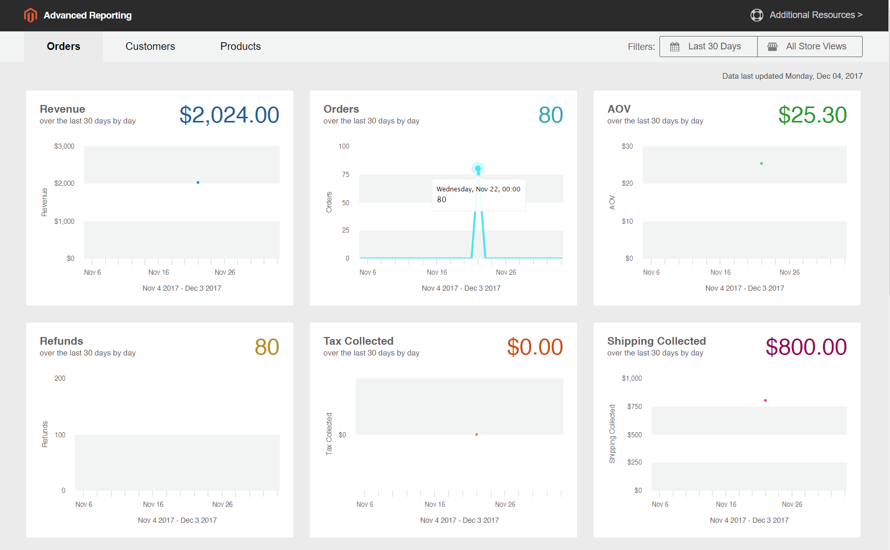

# outils [!DNL Commerce Intelligence]

Utilisez les outils de Commerce Intelligence pour tirer parti de l’insight utilisé pour prendre des décisions commerciales éclairées.

## compte [!DNL Commerce Intelligence]

Lorsque vous activez un compte [!DNL Commerce Intelligence] via Adobe, vous avez accès à cinq tableaux de bord contenant environ 70 rapports. Ces rapports sont conçus pour fournir des informations sur vos données et répondre à des questions telles que « Comment mes commandes augmentent-elles mois après mois ? », « Qui sont mes clients les plus fidèles ? » et « Ma stratégie de coupons fonctionne-t-elle ? » Pour plus d’informations sur cet ensemble d’outils, consultez le [Guide de l’utilisateur de Commerce Intelligence](https://experienceleague.adobe.com/docs/commerce-business-intelligence/mbi/guide-overview.html?lang=fr).

## [!DNL Advanced Reporting]

[!DNL Advanced Reporting] est inclus dans Adobe Commerce et Magento Open Source. Cette fonctionnalité vous donne accès à une suite de rapports dynamiques basés sur les données de vos produits, commandes et clients, avec un tableau de bord personnalisé adapté aux besoins de votre entreprise. Bien qu’[!DNL Advanced Reporting] utilise [!DNL Commerce Intelligence] pour les analyses, il n’est pas nécessaire d’avoir un compte Commerce Intelligence pour [!DNL Advanced Reporting] utiliser.

Pour plus d’informations techniques, voir la rubrique [[!DNL Advanced Reporting]](https://developer.adobe.com/commerce/php/development/advanced-reporting/){:target="_blank"} dans la documentation destinée aux développeurs.

>[!NOTE]
>
>En raison de problèmes de compatibilité avec [!DNL Adobe Commerce Intelligence], Commerce ne peut temporairement pas prendre en charge les rapports avancés à l’aide du compartiment AWS S3 comme support du fichier de données source dans [!DNL Commerce Intelligence].

{width="700"}

### Conditions requises

* Le site web doit s’exécuter sur un serveur web public.

* Le domaine doit disposer d’un certificat de sécurité (SSL) valide.

* [!DNL Commerce] doit avoir été installé ou mis à niveau sans erreur.

* Dans la configuration [!DNL Commerce] des [URL de boutique](../stores-purchase/store-urls.md), le paramètre **[!UICONTROL Base URL (Secure)]** de la vue de boutique doit pointer vers l’URL sécurisée. Par exemple : `https://yourdomain.com`.

* Dans la configuration [!DNL Commerce] des URL de magasin, **[!UICONTROL Use Secure URLs on Storefront]** et **[!UICONTROL Use Secure URLs in Admin]** doivent être définis sur `Yes`.

* [[!DNL Commerce] crontab](https://experienceleague.adobe.com/docs/commerce-operations/configuration-guide/cli/configure-cron-jobs.html?lang=fr) est créé et les tâches cron sont en cours d’exécution sur le serveur installé.

>[!NOTE]
>
>[!DNL Advanced Reporting] ne peut être utilisé qu’avec des installations [!DNL Commerce] qui ont continuellement utilisé une seule [devise de base](../stores-purchase/currency-configuration.md).


### Étape 1 : Activer [!DNL Advanced Reporting]

Dans la configuration [!DNL Commerce], [[!DNL Advanced Reporting]](../configuration-reference/general/advanced-reporting.md) est activé par défaut et démarre automatiquement si cron est [configuré](../configuration-reference/advanced/system.md) et en cours d’exécution. Une tentative d’établissement de l’abonnement est lancée au début de chaque heure au cours des 24 heures suivantes, jusqu’à ce qu’elle aboutisse. Le statut de l’abonnement est « en attente » jusqu’à ce que l’abonnement soit correctement établi.

1. Dans la barre latérale _Admin_, accédez à **[!UICONTROL Stores]** > _[!UICONTROL Settings]_>**[!UICONTROL Configuration]**.

1. Dans le panneau de navigation de gauche où **[!UICONTROL General]** est développé, choisissez **[!UICONTROL Advanced Reporting]** et procédez comme suit :

   * Vérifiez que **[!UICONTROL Advanced Reporting Service]** est défini sur `Enable` (paramètre par défaut).

   * Définissez la **[!UICONTROL Time of day to send data]** sur l’heure, la minute et la seconde, selon une horloge de 24 heures, dans laquelle vous souhaitez que le service reçoive des données mises à jour de votre boutique. Par défaut, les données sont envoyées à 2 :00.

   * Sous **[!UICONTROL Industry Data]**, choisissez la **[!UICONTROL Industry]** qui décrit le mieux votre entreprise.

   {width="400"}

1. Cliquez ensuite sur **[!UICONTROL Save Config]**.

1. Lorsque vous y êtes invité, cliquez sur **[[!UICONTROL Cache Management]](../systems/cache-management.md)** dans le message en haut de la page et actualisez tous les caches non valides.

1. Patientez pendant la nuit ou jusqu’à après l’heure de la prochaine mise à jour planifiée. Vérifiez ensuite le statut de votre abonnement. Si le statut est toujours _en attente_, assurez-vous que votre installation répond à toutes les exigences.

### Etape 2 : Accès aux [!DNL Advanced Reporting]

1. Effectuez l’une des opérations suivantes :

   * Dans la barre latérale _Admin_, choisissez **[!UICONTROL Dashboard]**. Cliquez ensuite sur **[!UICONTROL Go to Advanced Reporting]**.
   * Dans la barre latérale _Admin_, accédez à **[!UICONTROL Reports]** > _[!UICONTROL Business Intelligence]_>**[!UICONTROL Advanced Reporting]**.

   Le tableau de bord [!DNL Advanced Reporting] fournit un résumé rapide de vos commandes, de vos clients et de vos produits. Veillez à faire défiler l’écran vers le bas pour afficher le tableau de bord complet.

1. Pour obtenir une meilleure vue des données, définissez la **[!UICONTROL Filters]** dans le coin supérieur droit sur la période et stockez la vue que vous souhaitez inclure dans le rapport. Procédez ensuite comme suit :

   * Pour plus d’informations, pointez sur n’importe quel point de données.
   * Pour afficher tous les rapports de tableau de bord, cliquez sur chaque onglet.

   {width="600" zoomable="yes"}

## Accès aux ressources de données [!DNL Advanced Reporting]

Dans le coin supérieur droit du tableau de bord Rapports avancés, cliquez sur **[!UICONTROL Additional Resources]**.

{width="600" zoomable="yes"}

## Dépannage

Si vous recevez un message 404 « Page introuvable », vérifiez que votre boutique répond aux conditions requises pour [!DNL Advanced Reporting]. Suivez ensuite les instructions pour vérifier que l’intégration est installée.

### Vérifier que l’intégration est active

1. Dans la barre latérale _Admin_, accédez à **[!UICONTROL System]** > _[!UICONTROL Extensions]_>**[!UICONTROL Integration]**.

1. Vérifiez que l’intégration **[!UICONTROL Magento Analytics user]** apparaît dans la liste et que la **[!UICONTROL Status]** est `Active`.

1. Pour rétablir l’utilisateur, cliquez sur **[!UICONTROL Reauthorize]** et procédez comme suit :

   {width="600"}

   * Lorsque vous y êtes invité, cliquez sur **[!UICONTROL Reauthorize]** pour approuver l’accès aux ressources de l’API.

     {width="600"}

   * Vérifiez que la liste des jetons d’intégration pour les extensions est terminée. Cliquez ensuite sur **Terminé**.

     {width="600"}

1. Recherchez le message indiquant que le `Magento Analytics user` d’intégration est réautorisé.

1. Patientez jusqu’au lendemain de la prochaine mise à jour planifiée.

### Vérifier la devise de base unique

[!DNL Advanced Reporting] ne peut être utilisé qu’avec des installations [!DNL Commerce] qui n’ont utilisé qu’une seule [devise de base](../stores-purchase/currency-configuration.md) depuis l’installation. Par conséquent, dans l&#39;historique, toutes les commandes utilisent la même devise de base. [!DNL Advanced Reporting] ne fonctionne pas si, à un moment donné, vous avez modifié votre devise de base et que des commandes de votre historique ont été traitées avec des devises de base différentes.

Pour déterminer si votre magasin comporte plusieurs devises de base, vous pouvez interroger votre base de données [!DNL Commerce] à partir de la ligne de commande à l’aide de l’exemple MySQL suivant. Vous devrez peut-être modifier les noms des tables pour qu’ils correspondent à votre structure de données :

```sql
select distinct base_currency_code from sales_order;
```

### Incohérence des données

Si vous remarquez que la légende `Data last updated...` affiche la date d&#39;hier et non celle d&#39;aujourd&#39;hui, les mises à jour des rapports avancés peuvent être retardées d&#39;un jour au maximum. Ce retard est dû à une taille de file d’attente plus grande que prévu.

## Rapports de tableau de bord

**[!UICONTROL Orders]**

| Champ | Description |
|--- |--- |
| [!UICONTROL Revenue] | Affiche tous les revenus reçus par la vue de magasin pendant la période définie. |
| [!UICONTROL Orders] | Affiche toutes les commandes passées via la vue de magasin pendant la période définie. |
| [!UICONTROL AOV] | Affiche la valeur moyenne de la commande passée dans la vue du magasin pendant la période définie. |
| [!UICONTROL Refunds] | Affiche tous les remboursements traités via la vue du magasin pendant la période définie. |
| [!UICONTROL Tax Collected] | Affiche toutes les taxes collectées via la vue du magasin pendant la période définie. |
| [!UICONTROL Shipping Collected] | Affiche tous les frais d&#39;expédition collectés via la vue de magasin pendant la période définie. |
| [!UICONTROL Orders by Status] | Affiche le nombre de commandes par statut, pour la vue de magasin pendant la période définie. |
| [!UICONTROL Orders by Status] | Répertorie une synthèse du nombre de commandes par statut. |
| [!UICONTROL Coupon Usage] | Répertorie tous les codes coupon et le nombre d’utilisateurs pour chacun, échangés via la vue de magasin pendant la période définie. |
| [!UICONTROL Orders and Revenue by Billing Region] | Répertorie le nombre de commandes et le chiffre d&#39;affaires par région pour la vue de magasin pendant la période définie. |
| [!UICONTROL Tax Collected by Billing Region] | Répertorie le montant de taxe collecté par région pour la vue de magasin pendant la période définie. |
| [!UICONTROL Shipping Fees Collected by Shipping Region] | Répertorie les frais d’expédition collectés par région pour la vue de magasin pendant la période définie. |

{style="table-layout:auto"}

**[!UICONTROL Customers]**

| Champ | Description |
|--- |--- |
| [!UICONTROL Unique Customers] | Affiche le nombre de comptes client uniques associés à la vue de magasin pendant la période définie. |
| [!UICONTROL New Registered Accounts] | Affiche le nombre de nouveaux comptes client enregistrés avec la vue de magasin pendant la période définie. |
| [!UICONTROL Top Coupon Users] | Répertorie les principaux utilisateurs de coupons par ID client et le nombre de commandes passées avec des coupons pour la vue de magasin pendant la période définie. |
| [!UICONTROL Customer KPI Table] | Répertorie le nombre de commandes, le chiffre d&#39;affaires et la valeur de commande moyenne par ID client pour la vue de magasin pendant la période définie. |

{style="table-layout:auto"}

**[!UICONTROL Products]**

| Champ | Description |
|--- |--- |
| [!UICONTROL Quantity of Products Sold] | Affiche le nombre de produits vendus via la vue du magasin pendant la période définie. |
| [!UICONTROL Products Added to Wishlists] | Répertorie tous les produits ajoutés aux listes de souhaits via la vue de magasin pendant la période définie. |
| [!UICONTROL Best Selling Products by Quantity] | Répertorie les produits les plus vendus et la quantité vendue via la vue du magasin pendant la période définie. |
| [!UICONTROL Best Selling Products by Revenue] | Répertorie les produits les plus vendus et le chiffre d’affaires généré par la vente du produit via la vue du magasin pendant la période définie. |

{style="table-layout:auto"}
