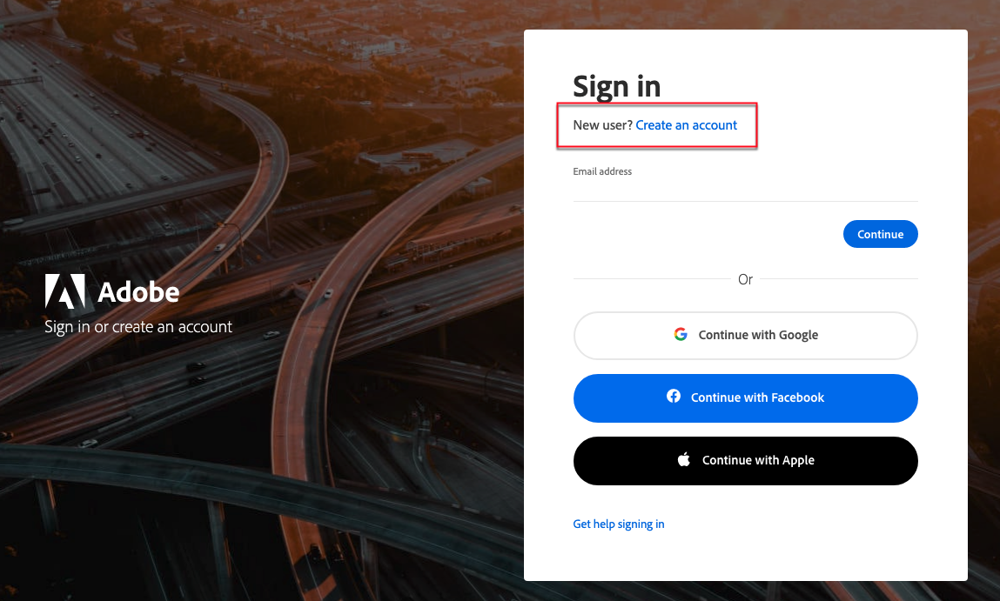

# Accéder à votre compte [!DNL Commerce]

Vous pouvez accéder à votre compte à partir du site Web [!DNL Commerce]. Dans le tableau de bord de votre compte [!DNL Commerce], vous trouverez des informations relatives aux produits et services que vous avez achetés, ainsi que vos coordonnées et vos informations de facturation. Certaines informations sont visibles uniquement par les propriétaires de licence.

Vous pouvez accéder à votre compte à partir du site Web [!DNL Commerce]. Le tableau de bord du compte affiche les produits, services et coordonnées de facturation que vous avez achetés. Certaines informations sont visibles uniquement par les propriétaires de licence.

![Votre compte [!DNL Commerce]](./assets/home-acct.png){width="700"}

L’identifiant de votre compte [!DNL Commerce] est distinct de celui de votre administrateur de boutique. Vous utiliserez normalement des informations d’identification différentes pour chaque système et l’accès à chaque système est géré indépendamment.

Cependant, un utilisateur qui souhaite rationaliser sa connexion aux produits Adobe Commerce et Adobe Business pourra configurer son Adobe ID pour se connecter à l’administrateur de la boutique : [Configurer l’intégration de l’administrateur Commerce à Adobe ID](https://experienceleague.adobe.com/fr/docs/commerce-admin/start/admin/ims/adobe-ims-config)

Les identifiants Commerce et Store Admin sont distincts, avec des informations d’identification différentes et un accès géré indépendamment. Cependant, vous pouvez rationaliser l’accès en configurant votre Adobe ID pour vous connecter à l’administrateur du magasin. Voir [Configuration de l’intégration d’administration Commerce à Adobe ID] dans le *Guide d’intégration IMS pour Commerce*.

>[!NOTE]
>
>Une fois votre compte créé, il est recommandé d’utiliser l’authentification à deux facteurs (TFA) pour [sécuriser votre compte](commerce-account-secure.md).

## Connectez-vous à votre compte [!DNL Commerce]

Un Adobe ID est requis pour accéder à un compte Commerce. Si vous disposez déjà d’un compte Commerce, mais que vous ne disposez pas d’un Adobe ID, vous pouvez en créer un pendant le processus de connexion.

>[!WARNING]
>
>Utilisez l’adresse e-mail associée à votre compte Commerce MAGEID existant pour créer l’Adobe ID. L’utilisation d’une adresse e-mail différente et entièrement nouvelle crée un MAGEID.

1. Accédez au [[!DNL Commerce] site](https://account.magento.com/customer/account/login/).

1. Cliquez sur **[!UICONTROL Sign in with Adobe ID]**.

   {width="700"}

1. Saisissez votre adresse e-mail et cliquez sur **[!UICONTROL Continue]**.

   >[!TIP]
   >
   >Si vous avez utilisé une adresse e-mail associée à un MAGEID de compte Commerce existant, le processus de connexion la lie automatiquement à votre Adobe ID.

## Créer un compte [!DNL Commerce]

Tout le monde peut créer un compte [!DNL Commerce] gratuit. L’adresse e-mail que vous utilisez ne peut être associée qu’à un seul compte Commerce.

>[!NOTE]
>
>Utilisez un Adobe ID pour créer un compte Commerce et y accéder.
>- Si vous ne disposez pas d’un compte Commerce, vous pouvez en créer un pendant le processus d’inscription.
>- Si vous disposez déjà d’un compte Commerce, mais que vous ne disposez pas d’un Adobe ID, voir [connexion à un compte Commerce](#log-in-to-your-dnl-commerce-account).

1. Accédez au [[!DNL Commerce] site](https://account.magento.com/customer/account/login/).

1. Cliquez sur **[!UICONTROL Sign in with Adobe ID]**.

1. Si vous ne disposez pas d’Adobe ID, cliquez sur **[!UICONTROL Create an account]**. Sinon, passez à l’étape 7.

   {width="700"}

1. Remplissez le formulaire d’inscription.

   {width="700"}

1. Cliquez sur **[!UICONTROL Create account]**.

1. Saisissez le code de vérification envoyé à votre adresse e-mail.

   {width="700"}

1. Une fois votre Adobe ID créée et vérifiée, revenez sur https://account.magento.com/. Un MAGE ID sera généré et automatiquement lié à votre Adobe ID.

## Réinitialiser votre mot de passe

1. Accédez au [[!DNL Commerce] site](https://account.magento.com/customer/account/login/).

1. Cliquez sur **[!UICONTROL Sign in with Adobe ID]**.

1. Cliquez sur **[!UICONTROL Get help signing in]**.

   {width="700"}

1. Cliquez sur **[!UICONTROL Reset your password]**.

   {width="700"}

1. Saisissez votre adresse e-mail.

1. Cliquez sur **[!UICONTROL Continue]**.
