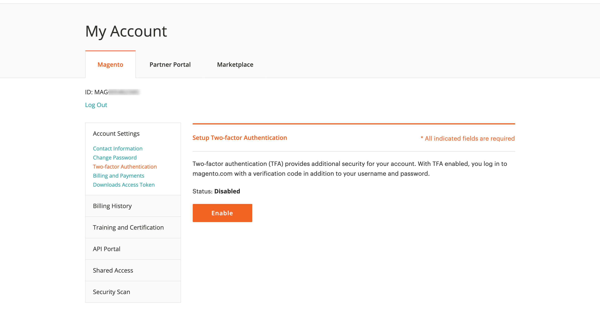
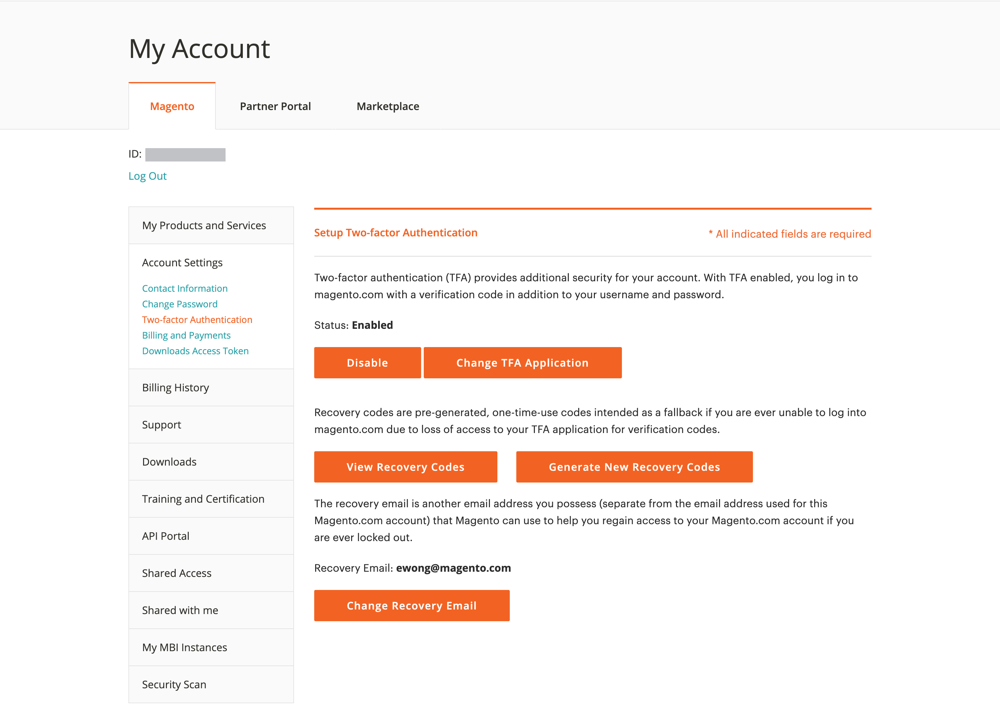

# Sécurisez vos [!DNL Commerce] account

L’authentification à deux facteurs (TFA ou 2FA) est une couche de sécurité supplémentaire pour mieux protéger votre [!DNL Commerce] d’un accès non autorisé. Pour terminer le processus de connexion, TFA requiert une _second facteur_ en plus des informations d’identification d’utilisateur et de mot de passe standard. Ce second facteur prend la forme de codes de vérification temporaires générés en continu par une application TFA installée sur votre périphérique mobile et associée à votre [!DNL Commerce] compte .

Lorsque TFA est activé, votre compte est plus sécurisé. Un utilisateur non autorisé ne peut pas se connecter à moins qu’il ne dispose à la fois de vos informations d’identification d’utilisateur et de mot de passe (premier facteur) et d’un code de vérification valide de l’application TFA sur votre appareil personnel (second facteur).

>[!NOTE]
>
>L’authentification à deux facteurs qui protège la variable _Administration_ de votre magasin a une configuration distincte. Pour en savoir plus, voir [Authentification à deux facteurs](../systems/security-two-factor-authentication.md).

## Avant de commencer

Pour utiliser TFA, une application TFA doit être installée sur votre appareil personnel (smartphone, tablette, ordinateur, etc.). De nombreuses options sont disponibles, mais certaines sont populaires et gratuites :

- Authentificateur Google (iOS, Android™, BlackBerry®)

- Création (iOS, Android™)

- Authentificateur Microsoft® (iOS, Android™, Windows Phone)

## Activer l’authentification à deux facteurs

1. Connectez-vous à [[!DNL Commerce] account][1]{:target=&quot;_blank&quot;}.

1. Dans le volet de navigation de gauche, sélectionnez **[!UICONTROL Account Settings]**, puis sélectionnez **[!UICONTROL Two-factor Authentication]**.

   {width="600" zoomable="yes"}

1. Sélectionner **[!UICONTROL Enable]** pour lancer le processus de configuration de l’authentification à deux facteurs.

1. Saisissez le **[!UICONTROL Verification Code]** envoyé à votre email et sélectionnez **[!UICONTROL Verify Code]** pour continuer.

   {width="400"}

1. Ouvrez l’application d’authentification à deux facteurs que vous avez téléchargée et installée sur votre périphérique personnel.

1. Sur le [!UICONTROL SETUP TWO-FACTOR AUTHENTICATION] formulaire, utilisez la méthode **[!UICONTROL Setup Code]** pour ajouter Adobe Commerce à votre application TFA.

   {width="400"}

   Vous pouvez ajouter le code en analysant le code QR à l’aide de l’application TFA ou en le saisissant manuellement. Ce code associe votre application TFA à votre [!DNL Commerce] et permet aux autorisations de générer l’application TFA afin de générer des codes de vérification pour un accès sécurisé au compte.

1. Terminez la configuration.

   - Sur le [!UICONTROL SETUP TWO FACTOR-AUTHENTICATION] saisissez le code de vérification de votre application d’authentification à deux facteurs.

   - Sélectionner **[!UICONTROL Verify Code]**.

   >[!NOTE]
   >
   >Pour des raisons de sécurité, les codes de vérification de votre application TFA expirent et se régénèrent en permanence. **_Toujours_** utilisez le code actuellement affiché.

1. Enregistrez le **[!UICONTROL Recovery Codes]** présenté dans un lieu sûr et accessible.

   {width="400"}

   Si vous ne pouvez pas fournir de code de vérification lorsque vous vous connectez à votre [!DNL Commerce] , vous devez utiliser un code de récupération pour récupérer l’accès au compte.

   Chaque code de récupération peut être utilisé une seule fois, mais vous pouvez [générer](#generate-new-recovery-codes) nouvelles. Les codes de récupération respectent la casse.

1. Cochez la case de confirmation et sélectionnez **[!UICONTROL Submit]** pour continuer.

1. Pour vous assurer que vous pouvez récupérer l’accès à votre compte, saisissez une **[!UICONTROL Recovery Email]**.

   Cette adresse électronique est nécessaire si vous ne pouvez pas générer de code de vérification à partir de votre application d’authentification à deux facteurs et que vous n’avez pas accès à un code de récupération prégénéré inutilisé.

   Une fois toutes les 24 heures, vous pouvez générer et envoyer un code de récupération temporaire à votre adresse électronique de récupération désignée. Utilisez ce code pour récupérer l’accès au compte.

   >[!IMPORTANT]
   >
   >Maintenez l’accès à votre compte de messagerie de récupération. Sinon, vous ne pouvez pas utiliser les codes de récupération temporaires envoyés à ce compte.

   {width="400"}

1. Cochez la case de confirmation et sélectionnez **[!UICONTROL Submit]** pour terminer le processus de configuration de l’authentification à deux facteurs.

   - Une notification est envoyée à l’adresse électronique associée à votre [!DNL Commerce] pour confirmer que vous avez activé l’authentification à deux facteurs.

   - Une notification est envoyée à votre compte de messagerie de récupération pour confirmer la configuration.

>[!TIP]
>
>Si vous perdez votre appareil personnel ou en obtenez un nouveau, vous pouvez [modifier votre application d’authentification à deux facteurs ;](#change-your-two-factor-authentication-application) et générer de nouveaux codes de récupération.

## Connexion à l’aide d’un code de vérification

1. Accédez au [!DNL Commerce] [connexion au compte][1]{:target=&quot;_blank&quot;}.

1. Saisissez votre nom d’utilisateur et votre mot de passe, puis sélectionnez **[!UICONTROL Login]**.

1. Saisissez le **[!UICONTROL Verification Code]** affiché dans votre application d’authentification à deux facteurs lorsque vous y êtes invité.

   {width="600"}

1. Sélectionner **[!UICONTROL Submit]** pour terminer le processus de connexion.

## Connexion à l’aide d’un code de récupération

1. Accédez au [!DNL Commerce] [connexion au compte][1]{:target=&quot;_blank&quot;}.

1. Saisissez votre nom d’utilisateur et votre mot de passe, puis sélectionnez **[!UICONTROL Login]**.

1. Sélectionner **[!UICONTROL Use recovery code]** pour contourner l’invite de code de vérification.

1. Saisissez un **[!UICONTROL Recovery Code]** lorsque vous y êtes invité.

   {width="600"}

1. Sélectionner **[!UICONTROL Submit]** pour terminer le processus de connexion.

## Connectez-vous à l’aide de votre email de récupération

1. Connectez-vous à [[!DNL Commerce] account][1]{:target=&quot;_blank&quot;}.

1. Saisissez votre nom d’utilisateur et votre mot de passe, puis sélectionnez **[!UICONTROL Login]**.

1. Sélectionner **[!UICONTROL Use recovery code]** pour contourner l’invite de code de vérification.

1. Pour obtenir un code de récupération temporaire par courrier électronique, sélectionnez la variable **[!UICONTROL recovery email]** lien.

   {width="600"}

1. Ouvrez votre compte de courrier électronique de récupération pour obtenir le code temporaire, puis saisissez le code dans les champs désignés.

1. Sélectionner **[!UICONTROL Submit]** pour terminer le processus de connexion.

Après avoir utilisé un code de récupération temporaire pour accéder à votre compte, [générer de nouveaux codes de récupération ;](#generate-new-recovery-codes) et enregistrez-les pour éviter d’autres problèmes d’accès au compte.

## Afficher vos codes de récupération

1. Accédez au [!DNL Commerce] [connexion au compte][1]{:target=&quot;_blank&quot;}.

1. Saisissez votre nom d’utilisateur et votre mot de passe, puis sélectionnez **[!UICONTROL Login]**.

1. Procédez à la connexion à l’aide de l’une des méthodes d’authentification à deux facteurs décrites précédemment.

1. Dans le volet de navigation de gauche, sélectionnez **[!UICONTROL Account Settings]**, puis sélectionnez **[!UICONTROL Two-factor Authentication]**.

   {width="600" zoomable="yes"}

1. Pour afficher vos codes de récupération prégénérés, sélectionnez **Affichage des codes de récupération**.

1. Saisissez le **[!UICONTROL Verification Code]** envoyé à votre email et sélectionnez **[!UICONTROL Verify Code]** pour continuer.

   {width="400"}

1. Enregistrez le **Codes de récupération** présenté dans un lieu sûr et accessible.

   Si vous ne pouvez pas fournir de code de vérification pour vous connecter à votre [!DNL Commerce] , l’utilisation d’un code de récupération est le seul moyen de récupérer l’accès au compte.

   Chaque code de récupération est utilisé une seule fois, mais vous pouvez toujours [générer](#generate-new-recovery-codes) nouvelles. Les codes de récupération respectent la casse.

   {width="400"}

1. Cochez la case de confirmation et sélectionnez **[!UICONTROL Submit]** pour fermer la boîte de dialogue.

## Générer de nouveaux codes de récupération

1. Accédez au [!DNL Commerce] [connexion au compte][1]{:target=&quot;_blank&quot;}.

1. Saisissez votre nom d’utilisateur et votre mot de passe, puis sélectionnez **[!UICONTROL Login]**.

1. Procédez à la connexion à l’aide de l’une des méthodes d’authentification à deux facteurs décrites précédemment.

1. Dans le volet de navigation de gauche, sélectionnez **[!UICONTROL Account Settings]**, puis sélectionnez **[!UICONTROL Two-factor Authentication]**.

1. Pour générer de nouveaux codes de récupération prégénérés, sélectionnez **Générer de nouveaux codes de récupération**.

1. Saisissez le **[!UICONTROL Verification Code]** envoyé à votre email et sélectionnez **[!UICONTROL Verify Code]** pour continuer.

1. Enregistrez le **Codes de récupération** présenté dans un lieu sûr et accessible.

   Si vous ne pouvez pas fournir de code de vérification lorsque vous vous connectez à votre [!DNL Commerce] , l’utilisation d’un code de récupération est le seul moyen de récupérer l’accès au compte.

   Tous les codes de récupération générés précédemment sont désormais rendus non valides et doivent être ignorés (seul l’ensemble actuel de codes de récupération générés est fonctionnel). Les codes de récupération respectent la casse.

1. Cochez la case de confirmation et sélectionnez **[!UICONTROL Submit]** pour fermer la boîte de dialogue.

## Modification de l’email de récupération

1. Accédez au [!DNL Commerce] [connexion au compte][1]{:target=&quot;_blank&quot;}.

1. Saisissez votre nom d’utilisateur et votre mot de passe, puis sélectionnez **[!UICONTROL Login]**.

1. Procédez à la connexion à l’aide de l’une des méthodes d’authentification à deux facteurs décrites précédemment.

1. Dans le volet de navigation de gauche, sélectionnez **[!UICONTROL Account Settings]**, puis sélectionnez **[!UICONTROL Two-factor Authentication]**.

1. Sélectionner **Modifier le courrier électronique de récupération** pour modifier l’e-mail de récupération dans le fichier de votre compte.

1. Saisissez le **[!UICONTROL Verification Code]** envoyé à votre email et sélectionnez **[!UICONTROL Verify Code]** pour continuer.

1. Pour vous assurer que vous pouvez récupérer l’accès à votre compte, saisissez une **Email de récupération**.

   Cette adresse électronique est nécessaire si vous ne pouvez pas générer de code de vérification à partir de votre application d’authentification à deux facteurs et que vous n’avez pas accès à un code de récupération prégénéré inutilisé.

   Une fois toutes les 24 heures, vous pouvez générer et envoyer un code de récupération temporaire à votre adresse électronique de récupération désignée. Vous pouvez utiliser ce code pour récupérer l’accès au compte.

   >[!IMPORTANT]
   >
   >Maintenez l’accès à votre compte de messagerie de récupération. Sinon, vous ne pouvez pas utiliser les codes de récupération temporaires envoyés à ce compte.

1. Cochez la case de confirmation et sélectionnez **[!UICONTROL Submit]** pour fermer la boîte de dialogue.

   Le système envoie une notification par courrier électronique à l’adresse électronique de récupération que vous avez désignée pour confirmer que cette adresse électronique spécifique figure dans le fichier en tant qu’adresse électronique de récupération pour réception des codes de récupération temporaires.

## Modification de votre application d’authentification à deux facteurs

1. Accédez au [!DNL Commerce] [connexion au compte][1]{:target=&quot;_blank&quot;}.

1. Saisissez votre nom d’utilisateur et votre mot de passe, puis sélectionnez **[!UICONTROL Login]**.

1. Procédez à la connexion à l’aide de l’une des méthodes d’authentification à deux facteurs décrites précédemment.

1. Dans le volet de navigation de gauche, sélectionnez **[!UICONTROL Account Settings]**, puis sélectionnez **[!UICONTROL Two-factor Authentication]**.

1. Sélectionner **Modification de l’application TFA** pour utiliser une autre application TFA avec votre compte magento.com.

1. Saisissez le **[!UICONTROL Verification Code]** envoyé à votre email et sélectionnez **[!UICONTROL Verify Code]** pour continuer.

1. Ouvrez l’application d’authentification à deux facteurs sur votre périphérique personnel.

1. Saisissez le **Configuration du code** dans votre application d’authentification à deux facteurs.

   Vous pouvez ajouter le code en analysant le code QR à l’aide de l’application TFA ou en le saisissant manuellement. Ce code associe votre application TFA à votre [!DNL Commerce] et permet aux autorisations de l’application TFA de générer des codes de vérification pour un accès sécurisé au compte.

   >[!NOTE]
   >
   >Pour des raisons de sécurité, les codes de vérification de votre application TFA expirent et se régénèrent en permanence. **_Toujours_** utilisez le code actuellement affiché.

1. Votre application TFA est désormais associée à votre [!DNL Commerce] , saisissez la variable **[!UICONTROL Verification Code]** affiché dans votre application TFA et sélectionnez **[!UICONTROL Verify Code]** pour continuer.

1. Enregistrez le **Codes de récupération** présenté dans un lieu sûr et accessible.

   Si vous ne pouvez pas fournir de code de vérification lorsque vous vous connectez à votre [!DNL Commerce] , le seul moyen de récupérer l’accès au compte est d’utiliser un code de récupération.

   Chaque code de récupération est utilisé une seule fois, mais vous pouvez toujours [générer](#generate-new-recovery-codes) nouvelles. Les codes de récupération respectent la casse. Les codes de récupération respectent la casse.

1. Cochez la case pour confirmer et sélectionnez **[!UICONTROL Submit]** pour continuer.

1. Pour vous assurer que vous pouvez récupérer l’accès à votre compte, saisissez une **Email de récupération**.

   Cette adresse électronique est nécessaire si vous ne pouvez pas générer de code de vérification à partir de votre application d’authentification à deux facteurs et que vous n’avez pas accès à un code de récupération prégénéré inutilisé.

   Une fois toutes les 24 heures, vous pouvez générer et envoyer un code de récupération temporaire à votre adresse électronique de récupération désignée. Utilisez ce code pour récupérer l’accès au compte.

   >[!IMPORTANT]
   >
   >Maintenez l’accès à votre compte de messagerie de récupération. Sinon, vous ne pouvez pas utiliser les codes de récupération temporaires envoyés à ce compte.

1. Cochez la case de confirmation et sélectionnez **[!UICONTROL Submit]** pour terminer le processus de configuration de l’authentification à deux facteurs.

   Une notification électronique est envoyée à l’adresse électronique de récupération que vous avez désignée pour confirmer que cette adresse électronique spécifique figure dans le fichier en tant qu’adresse électronique de récupération pour réception d’un code de récupération temporaire.

## Désactivation de l’authentification à deux facteurs

>[!IMPORTANT]
>
>Si votre stratégie de sécurité organisationnelle nécessite une authentification à plusieurs facteurs sur les comptes Adobe Commerce, vous ne pouvez pas désactiver l’authentification à deux facteurs.

1. Accédez au [!DNL Commerce] [connexion au compte][1]{:target=&quot;_blank&quot;}.

1. Saisissez votre nom d’utilisateur et votre mot de passe, puis sélectionnez **[!UICONTROL Login]**.

1. Procédez à la connexion à l’aide de l’une des méthodes d’authentification à deux facteurs décrites précédemment.

1. Dans le volet de navigation de gauche, sélectionnez **[!UICONTROL Account Settings]** et sélectionnez **[!UICONTROL Two-factor Authentication]** en-dessous.

1. Sélectionner **[!UICONTROL Disable]** pour lancer le processus de désactivation de TFA.

1. Saisissez le **[!UICONTROL Verification Code]** envoyé à votre email et sélectionnez **[!UICONTROL Verify Code]** pour continuer.

1. Cochez la case de confirmation et sélectionnez **[!UICONTROL Submit]** pour terminer la désactivation de l’authentification à deux facteurs.

   Le système envoie une confirmation par courrier électronique indiquant que TFA a été désactivé sur votre [!DNL Commerce] compte .

   {width="400"}

[1]: https://account.magento.com/customer/account/login
