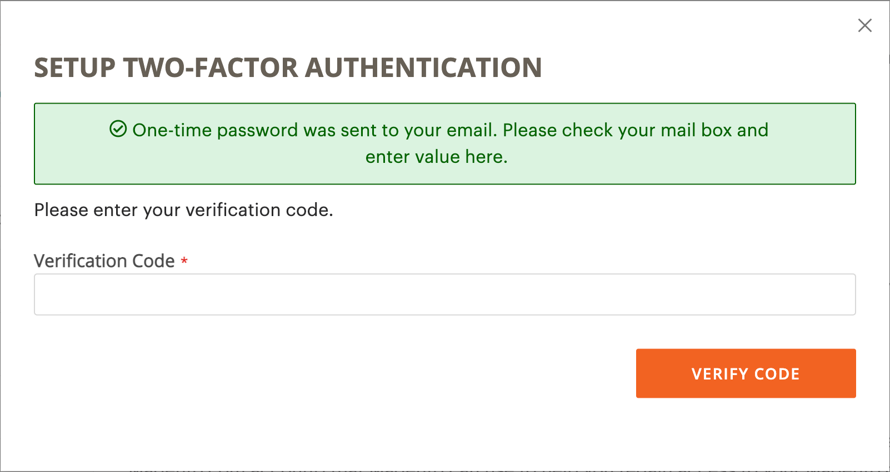

# Sécuriser votre compte [!DNL Commerce]

L’authentification à deux facteurs (TFA ou 2FA) est une couche de sécurité supplémentaire pour mieux protéger votre compte [!DNL Commerce] contre les accès non autorisés. Pour terminer le processus de connexion, TFA nécessite un _deuxième facteur_ en plus des informations d&#39;identification de nom d&#39;utilisateur et de mot de passe standard. Ce deuxième facteur prend la forme de codes de vérification temporaires qui sont générés en continu par une application TFA installée sur votre appareil mobile et associée à votre compte [!DNL Commerce].

Lorsque le TFA est activé, votre compte est plus sécurisé. Une personne non autorisée ne peut pas se connecter à moins d’avoir à la fois votre nom d’utilisateur et votre mot de passe (premier facteur) et un code de vérification valide de l’application TFA sur votre appareil personnel (second facteur).

>[!NOTE]
>
>L’authentification à deux facteurs qui protège l’_administrateur_ de votre boutique dispose d’une configuration distincte. Pour en savoir plus, voir [Authentification à deux facteurs](../systems/security-two-factor-authentication.md).

## Avant de commencer

Pour utiliser TFA, vous devez avoir une application TFA installée sur votre appareil personnel (tel que votre smartphone, tablette, ordinateur). Il existe de nombreuses options disponibles, mais certaines sont populaires et gratuites :

- Authentificateur Google (iOS, Android™, BlackBerry®)

- Authentifier (iOS, Android™)

- Authentificateur Microsoft® (iOS, Android™, Windows Phone)

## Activer l’authentification à deux facteurs

1. Connectez-vous à votre [[!DNL Commerce]  compte &#x200B;](https://account.magento.com/customer/account/login){:target="_blank"}.

1. Dans le volet de navigation de gauche, sélectionnez **[!UICONTROL Account Settings]**, puis **[!UICONTROL Two-factor Authentication]**.

   {width="600" zoomable="yes"}

1. Sélectionnez **[!UICONTROL Enable]** pour lancer le processus de configuration de l’authentification à deux facteurs.

1. Saisissez le **[!UICONTROL Verification Code]** envoyé à votre e-mail et sélectionnez **[!UICONTROL Verify Code]** pour continuer.

   {width="400"}

1. Ouvrez l’application d’authentification à deux facteurs que vous avez téléchargée et installée sur votre appareil personnel.

1. Sur le formulaire [!UICONTROL SETUP TWO-FACTOR AUTHENTICATION], utilisez l’**[!UICONTROL Setup Code]** pour ajouter Adobe Commerce à votre application TFA.

   {width="400"}

   Vous pouvez ajouter le code en scannant le code QR à l’aide de l’application TFA ou en le saisissant manuellement. Ce code associe votre application TFA à votre compte [!DNL Commerce] et permet aux autorisations de générer l’application TFA de générer des codes de vérification pour un accès sécurisé au compte.

1. Terminez la configuration.

   - Sur le formulaire [!UICONTROL SETUP TWO FACTOR-AUTHENTICATION], saisissez le code de vérification de votre application d’authentification à deux facteurs.

   - Sélectionnez **[!UICONTROL Verify Code]**.

   >[!NOTE]
   >
   >Pour des raisons de sécurité, les codes de vérification dans votre application TFA expirent et se régénèrent en permanence. **_Toujours_** utilisez le code actuellement affiché.

1. Conservez les **[!UICONTROL Recovery Codes]** présentés dans un endroit sûr et accessible.

   {width="400"}

   Si vous ne pouvez pas fournir de code de vérification lorsque vous vous connectez à votre compte [!DNL Commerce], vous devez utiliser un code de récupération pour récupérer l’accès au compte.

   Chaque code de récupération ne peut être utilisé qu’une seule fois, mais vous pouvez en [générer](#generate-new-recovery-codes) de nouveaux. Les codes de récupération respectent la casse.

1. Cochez la case de confirmation et sélectionnez **[!UICONTROL Submit]** pour continuer.

1. Pour vous assurer que vous pouvez récupérer l’accès à votre compte , saisissez un **[!UICONTROL Recovery Email]**.

   Cette adresse e-mail est nécessaire si vous ne pouvez pas générer de code de vérification à partir de votre application d’authentification à deux facteurs et si vous n’avez pas accès à un code de récupération prégénéré inutilisé.

   Une fois toutes les 24 heures, vous pouvez générer et envoyer un code de récupération temporaire à l’adresse e-mail de récupération désignée. Utilisez ce code pour récupérer l’accès au compte.

   >[!IMPORTANT]
   >
   >Conservez l’accès à votre compte de messagerie de récupération. Sinon, vous ne pouvez pas utiliser de codes de récupération temporaires envoyés à ce compte.

   {width="400"}

1. Cochez la case de confirmation et sélectionnez **[!UICONTROL Submit]** pour terminer le processus de configuration de l’authentification à deux facteurs.

   - Une notification est envoyée à l’adresse e-mail associée à votre compte [!DNL Commerce] pour confirmer que vous avez correctement activé l’authentification à deux facteurs.

   - Une notification est envoyée à votre compte de messagerie de récupération pour confirmer la configuration.

>[!TIP]
>
>Si vous perdez votre appareil personnel ou en obtenez un nouveau, vous pouvez [modifier votre application d&#39;authentification à deux facteurs](#change-your-two-factor-authentication-application) et générer de nouveaux codes de récupération.

## Se connecter à l’aide d’un code de vérification

1. Accédez à la [!DNL Commerce] [compte de connexion](https://account.magento.com/customer/account/login){:target="_blank"}.

1. Saisissez votre nom d’utilisateur et votre mot de passe, puis sélectionnez **[!UICONTROL Login]**.

1. Saisissez le **[!UICONTROL Verification Code]** affiché dans votre application d’authentification à deux facteurs lorsque vous y êtes invité.

   {width="600"}

1. Sélectionnez **[!UICONTROL Submit]** pour terminer le processus de connexion.

## Se connecter à l&#39;aide d&#39;un code de récupération

1. Accédez à la [!DNL Commerce] [compte de connexion](https://account.magento.com/customer/account/login){:target="_blank"}.

1. Saisissez votre nom d’utilisateur et votre mot de passe, puis sélectionnez **[!UICONTROL Login]**.

1. Sélectionnez **[!UICONTROL Use recovery code]** pour contourner l’invite de code de vérification.

1. A l’invite, saisissez un **[!UICONTROL Recovery Code]** inutilisé.

   {width="600"}

1. Sélectionnez **[!UICONTROL Submit]** pour terminer le processus de connexion.

## Se connecter à l’aide de l’e-mail de récupération

1. Connectez-vous à votre [[!DNL Commerce]  compte &#x200B;](https://account.magento.com/customer/account/login){:target="_blank"}.

1. Saisissez votre nom d’utilisateur et votre mot de passe, puis sélectionnez **[!UICONTROL Login]**.

1. Sélectionnez **[!UICONTROL Use recovery code]** pour contourner l’invite de code de vérification.

1. Pour obtenir un code de récupération temporaire par e-mail, sélectionnez le lien **[!UICONTROL recovery email]**.

   {width="600"}

1. Ouvrez votre compte de messagerie de récupération pour obtenir le code temporaire, puis saisissez le code dans les champs désignés.

1. Sélectionnez **[!UICONTROL Submit]** pour terminer le processus de connexion.

Après avoir utilisé un code de récupération temporaire pour accéder à votre compte, [générez de nouveaux codes de récupération](#generate-new-recovery-codes) et enregistrez-les pour éviter d’autres problèmes d’accès au compte.

## Affichage des codes de récupération

1. Accédez à la [!DNL Commerce] [compte de connexion](https://account.magento.com/customer/account/login){:target="_blank"}.

1. Saisissez votre nom d’utilisateur et votre mot de passe, puis sélectionnez **[!UICONTROL Login]**.

1. Effectuez le processus de connexion à l’aide de l’une des méthodes d’authentification à deux facteurs décrites précédemment.

1. Dans le volet de navigation de gauche, sélectionnez **[!UICONTROL Account Settings]**, puis **[!UICONTROL Two-factor Authentication]**.

   Paramètres {width="600" zoomable="yes"}

1. Pour afficher vos codes de récupération prégénérés, sélectionnez **Afficher les codes de récupération**.

1. Saisissez le **[!UICONTROL Verification Code]** envoyé à votre e-mail et sélectionnez **[!UICONTROL Verify Code]** pour continuer.

   {width="400"}

1. Enregistrez les **codes de récupération** présentés dans un endroit sûr et accessible.

   Si vous ne pouvez pas fournir de code de vérification pour vous connecter à votre compte [!DNL Commerce], l’utilisation d’un code de récupération est la seule façon de récupérer l’accès au compte.

   Chaque code de récupération est à usage unique uniquement, mais vous pouvez toujours en [générer](#generate-new-recovery-codes) de nouveaux. Les codes de récupération respectent la casse.

   {width="400"}

1. Cochez la case de confirmation et sélectionnez **[!UICONTROL Submit]** pour fermer la boîte de dialogue.

## Générer de nouveaux codes de récupération

1. Accédez à la [!DNL Commerce] [compte de connexion](https://account.magento.com/customer/account/login){:target="_blank"}.

1. Saisissez votre nom d’utilisateur et votre mot de passe, puis sélectionnez **[!UICONTROL Login]**.

1. Effectuez le processus de connexion à l’aide de l’une des méthodes d’authentification à deux facteurs décrites précédemment.

1. Dans le volet de navigation de gauche, sélectionnez **[!UICONTROL Account Settings]**, puis **[!UICONTROL Two-factor Authentication]**.

1. Pour générer de nouveaux codes de récupération prégénérés, sélectionnez **Générer de nouveaux codes de récupération**.

1. Saisissez le **[!UICONTROL Verification Code]** envoyé à votre e-mail et sélectionnez **[!UICONTROL Verify Code]** pour continuer.

1. Enregistrez les **codes de récupération** présentés dans un endroit sûr et accessible.

   Si vous ne pouvez pas fournir de code de vérification lorsque vous vous connectez à votre compte [!DNL Commerce], l’utilisation d’un code de récupération est la seule façon de récupérer l’accès au compte.

   Tous les codes de récupération précédemment générés sont désormais rendus non valides et doivent être ignorés (seul le jeu actuel de codes de récupération générés est fonctionnel). Les codes de récupération respectent la casse.

1. Cochez la case de confirmation et sélectionnez **[!UICONTROL Submit]** pour fermer la boîte de dialogue.

## Modification de votre e-mail de récupération

1. Accédez à la [!DNL Commerce] [compte de connexion](https://account.magento.com/customer/account/login){:target="_blank"}.

1. Saisissez votre nom d’utilisateur et votre mot de passe, puis sélectionnez **[!UICONTROL Login]**.

1. Effectuez le processus de connexion à l’aide de l’une des méthodes d’authentification à deux facteurs décrites précédemment.

1. Dans le volet de navigation de gauche, sélectionnez **[!UICONTROL Account Settings]**, puis **[!UICONTROL Two-factor Authentication]**.

1. Sélectionnez **Modifier l’e-mail de récupération** pour modifier l’e-mail de récupération enregistré pour votre compte.

1. Saisissez le **[!UICONTROL Verification Code]** envoyé à votre e-mail et sélectionnez **[!UICONTROL Verify Code]** pour continuer.

1. Pour vous assurer que vous pouvez récupérer l’accès à votre compte, saisissez un **e-mail de récupération**.

   Cette adresse e-mail est nécessaire si vous ne pouvez pas générer de code de vérification à partir de votre application d’authentification à deux facteurs et si vous n’avez pas accès à un code de récupération prégénéré inutilisé.

   Une fois toutes les 24 heures, vous pouvez générer et envoyer un code de récupération temporaire à l’adresse e-mail de récupération désignée. Vous pouvez utiliser ce code pour récupérer l’accès au compte.

   >[!IMPORTANT]
   >
   >Conservez l’accès à votre compte de messagerie de récupération. Sinon, vous ne pouvez pas utiliser de codes de récupération temporaires envoyés à ce compte.

1. Cochez la case de confirmation et sélectionnez **[!UICONTROL Submit]** pour fermer la boîte de dialogue.

   Le système envoie une notification par e-mail à l’adresse e-mail de récupération que vous avez désignée pour confirmer qu’une adresse e-mail spécifique figure dans le fichier en tant qu’e-mail de récupération pour recevoir des codes de récupération temporaires.

## Modification de votre application d’authentification à deux facteurs

1. Accédez à la [!DNL Commerce] [compte de connexion](https://account.magento.com/customer/account/login){:target="_blank"}.

1. Saisissez votre nom d’utilisateur et votre mot de passe, puis sélectionnez **[!UICONTROL Login]**.

1. Effectuez le processus de connexion à l’aide de l’une des méthodes d’authentification à deux facteurs décrites précédemment.

1. Dans le volet de navigation de gauche, sélectionnez **[!UICONTROL Account Settings]**, puis **[!UICONTROL Two-factor Authentication]**.

1. Sélectionnez **Modifier l’application TFA** pour utiliser une autre application TFA avec votre compte magento.com.

1. Saisissez le **[!UICONTROL Verification Code]** envoyé à votre e-mail et sélectionnez **[!UICONTROL Verify Code]** pour continuer.

1. Ouvrez l’application d’authentification à deux facteurs sur votre appareil personnel.

1. Saisissez le **Code de configuration** dans votre application d’authentification à deux facteurs.

   Vous pouvez ajouter le code en scannant le code QR à l’aide de l’application TFA ou en le saisissant manuellement. Ce code associe votre application TFA à votre compte [!DNL Commerce] et permet à l’application TFA de générer des codes de vérification pour un accès sécurisé au compte.

   >[!NOTE]
   >
   >Pour des raisons de sécurité, les codes de vérification dans votre application TFA expirent et se régénèrent en permanence. **_Toujours_** utilisez le code actuellement affiché.

1. Maintenant que votre demande d’AFE est associée à votre compte [!DNL Commerce], saisissez le **[!UICONTROL Verification Code]** affiché dans votre demande d’AFE et sélectionnez **[!UICONTROL Verify Code]** pour continuer.

1. Enregistrez les **codes de récupération** présentés dans un endroit sûr et accessible.

   Si vous ne pouvez pas fournir de code de vérification lorsque vous vous connectez à votre compte [!DNL Commerce], la seule façon de récupérer l’accès au compte est d’utiliser un code de récupération.

   Chaque code de récupération est à usage unique uniquement, mais vous pouvez toujours en [générer](#generate-new-recovery-codes) de nouveaux. Les codes de récupération respectent la casse. Les codes de récupération respectent la casse.

1. Cochez la case pour confirmer et sélectionnez **[!UICONTROL Submit]** pour continuer.

1. Pour vous assurer que vous pouvez récupérer l’accès à votre compte, saisissez un **e-mail de récupération**.

   Cette adresse e-mail est nécessaire si vous ne pouvez pas générer de code de vérification à partir de votre application d’authentification à deux facteurs et si vous n’avez pas accès à un code de récupération prégénéré inutilisé.

   Une fois toutes les 24 heures, vous pouvez générer et envoyer un code de récupération temporaire à l’adresse e-mail de récupération désignée. Utilisez ce code pour récupérer l’accès au compte.

   >[!IMPORTANT]
   >
   >Conservez l’accès à votre compte de messagerie de récupération. Sinon, vous ne pouvez pas utiliser de codes de récupération temporaires envoyés à ce compte.

1. Cochez la case de confirmation et sélectionnez **[!UICONTROL Submit]** pour terminer le processus de configuration de l’authentification à deux facteurs.

   Une notification par e-mail est envoyée à l’e-mail de récupération que vous avez désigné pour confirmer que cette adresse e-mail spécifique figure dans le fichier en tant qu’e-mail de récupération pour la réception d’un code de récupération temporaire.

## Désactiver l’authentification à deux facteurs

>[!IMPORTANT]
>
>Si votre politique de sécurité d’organisation nécessite une authentification à plusieurs facteurs sur les comptes Adobe Commerce, vous ne pouvez pas désactiver l’authentification à deux facteurs.

1. Accédez à la [!DNL Commerce] [compte de connexion](https://account.magento.com/customer/account/login){:target="_blank"}.

1. Saisissez votre nom d’utilisateur et votre mot de passe, puis sélectionnez **[!UICONTROL Login]**.

1. Effectuez le processus de connexion à l’aide de l’une des méthodes d’authentification à deux facteurs décrites précédemment.

1. Dans le volet de navigation de gauche, sélectionnez **[!UICONTROL Account Settings]** et sélectionnez **[!UICONTROL Two-factor Authentication]** en dessous.

1. Sélectionnez **[!UICONTROL Disable]** pour lancer le processus de désactivation de l’AFE.

1. Saisissez le **[!UICONTROL Verification Code]** envoyé à votre e-mail et sélectionnez **[!UICONTROL Verify Code]** pour continuer.

1. Cochez la case de confirmation et sélectionnez **[!UICONTROL Submit]** pour terminer la désactivation pour l’authentification à deux facteurs.

   Le système envoie un e-mail de confirmation indiquant que le TFA a été désactivé sur votre compte [!DNL Commerce].

   {width="400"}
