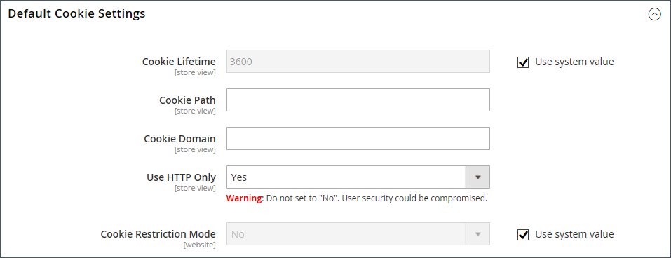

# Conformité à la loi sur les cookies

Les cookies sont de petits fichiers qui sont enregistrés sur l&#39;ordinateur de chaque visiteur de votre site, et utilisés comme des lieux de rétention temporaires pour des informations. Les informations enregistrées dans les cookies sont utilisées pour personnaliser l’expérience d’achat, associer les visiteurs à leur panier, mesurer les modèles de trafic et améliorer l’efficacité des promotions. Pour suivre le rythme de la législation dans de nombreux pays concernant l’utilisation des cookies, Adobe Commerce et Magento Open Source offrent aux commerçants un choix de méthodes pour obtenir le consentement du client. Pour obtenir la liste des cookies par défaut dans Adobe Commerce et Magento Open Source, voir [Référence des cookies](#default-cookies).

>[!NOTE]
>
>Si vous modifiez les paramètres de confidentialité par défaut de  conformément au [Règlement général sur la protection des données](compliance-gdpr.md), il n’est pas nécessaire d’obtenir le consentement de l’utilisateur pour l’utilisation des cookies Google Analytics.

## Mode de restriction des cookies

Lorsque le mode de restriction des cookies est activé, les visiteurs de votre boutique sont avertis que les cookies sont requis pour les opérations complètes. Selon votre thème, le message peut apparaître au-dessus de l’en-tête, sous le pied de page ou ailleurs sur la page. Le message renvoie à votre politique de confidentialité pour plus d’informations et encourage les visiteurs à cliquer sur le bouton Autoriser pour accorder leur consentement. Une fois le consentement accordé, le message disparaît.

Votre [politique de confidentialité](privacy-policy.md) doit inclure le nom de votre boutique et vos coordonnées, et expliquer la finalité de chaque cookie utilisé par votre boutique. Pour en savoir plus, voir [ Référence des cookies ](#default-cookies).

>[!NOTE]
>
>Si vous modifiez la clé URL de la politique de confidentialité, vous devez également créer une réécriture d’URL personnalisée pour rediriger le trafic vers la nouvelle clé URL. Sinon, le lien du message Mode de restriction des cookies renvoie la valeur `404 Page Not Found`.

{width="600"}

### Étape 1 : activer le mode de restriction des cookies

1. Dans la barre latérale _Admin_, accédez à **[!UICONTROL Stores]** > _[!UICONTROL Settings]_>**[!UICONTROL Configuration]**.

1. Dans le panneau de navigation de gauche, sous **[!UICONTROL General]**, choisissez **[!UICONTROL Web]**.

1. Développez la section **[!UICONTROL Default Cookie Settings]** et procédez comme suit :

   {width="600"}

   - Saisissez le **[!UICONTROL Cookie Lifetime]** en secondes.

   - Si vous souhaitez rendre les cookies disponibles dans d’autres dossiers, saisissez la **[!UICONTROL Cookie Path]** . Pour rendre les cookies disponibles n’importe où sur le site, saisissez une barre oblique (`/`). Cette valeur ne peut contenir que le chemin d’accès au cookie et **_ne peut pas_** aucun autre paramètre de cookie.

   - Pour rendre les cookies disponibles pour un sous-domaine, saisissez le nom du sous-domaine dans le champ **[!UICONTROL Cookie Domain]** (`subdomain.yourdomain.com`). Pour rendre les cookies disponibles pour tous les sous-domaines, saisissez le nom de domaine précédé d’un point (`.yourdomain.com`). Cette valeur ne peut contenir que le domaine du cookie et **_ne peut pas_** aucun autre paramètre de cookie.

   - Pour empêcher les langages de script, tels que JavaScript, d’accéder aux cookies, assurez-vous que **Utiliser HTTP uniquement** est défini sur `Yes`.

   - Définissez **[!UICONTROL Cookie Restriction Mode]** sur `Yes`.

     Si nécessaire, décochez la case et cliquez sur **[!UICONTROL OK]** pour confirmer le changement de portée.

1. Cliquez ensuite sur **[!UICONTROL Save Config]**.

1. Lorsque vous êtes invité à mettre à jour le cache, cliquez sur le lien **[!UICONTROL Cache Management]** dans le message système et actualisez chaque cache non valide.

### Étape 2 : mettre à jour votre politique de confidentialité

Mettez à jour votre [politique de confidentialité](privacy-policy.md) afin qu’elle reflète les informations collectées par votre entreprise et la manière dont elles sont utilisées.

## Cookies par défaut

Les cookies par défaut dans Adobe Commerce et Magento Open Source sont classés comme Exempts/Non exempts afin d’aider les commerçants à respecter les exigences des réglementations de confidentialité telles que le [RGPD](compliance-gdpr.md). Les commerçants doivent utiliser ces informations comme guide et consulter leurs conseillers juridiques pour mettre à jour leurs politiques en matière de confidentialité et de cookies dans le cadre d&#39;une stratégie complète de conformité à la réglementation sur la confidentialité.

Les cookies suivants sont utilisés par [!DNL Commerce] « prêt à l’emploi » pour les installations on-premise et cloud. Ces cookies peuvent être requis par une fonctionnalité explicitement demandée par le client. Pour en savoir plus sur la durée de vie des cookies de session, voir [ Durée de vie de la session ](../customers/customer-online-options.md).

Certains de ces cookies peuvent fournir des options de configuration, notamment activer/désactiver, si nécessaire.

### Cookies de fonctionnalité demandés (exemptés)

| Nom | Type | Description |
| ------ | ------ | ------------- |
| **`add_to_cart`** | Cookie |  (Adobe Commerce uniquement) Capture le SKU, le nom, le prix et la quantité du produit supprimé du panier. Permet à Google Analytics de savoir quand un produit a été ajouté à un panier. |
| **`guest-view`** | Cookie | Associe une commande d’invité à un invité (car il n’existe pas de compte pour l’invité). Pour maintenir la stabilité du système, ne désactivez pas ce cookie. |
| **`login_redirect`** | Cookie | Enregistre l’URL de redirection pour acheminer l’utilisateur en cas de connexion réussie et d’enregistrement de l’utilisateur. Enregistre la page sur laquelle se trouvait l’utilisateur avant de se connecter (afin de déterminer l’emplacement auquel il reviendra après s’être connecté). |
| **`mage-banners-cache-storage`** | Stockage local |  (Adobe Commerce uniquement) Stockage local pour la fonctionnalité de bannière. Stocke le contenu des bannières localement pour améliorer les performances. Le contenu de bannière comprend des ressources générales de site web qui affichent des informations à un acheteur. Pour maintenir la stabilité du système, ne désactivez pas ce cookie. |
| **`mage-messages`** | Cookie | Effectue le suivi des messages d’erreur et d’autres notifications qui sont affichés à l’utilisateur, tels que le message de consentement du cookie et divers messages d’erreur. Le message est supprimé du cookie après sa présentation à l’acheteur. Il n’existe pas d’option permettant de désactiver ce cookie. C’est ainsi que les informations ponctuelles sont communiquées à l’utilisateur, telles que les messages d’erreur. Pour maintenir la stabilité du système, ne désactivez pas ce cookie. |
| **`product_data_storage`** | Stockage local | Stocke la configuration des données de produit utilisées pour utiliser les fonctions « Récemment consultés » et « Comparer des produits ». Stocke les paramètres spécifiques d’un utilisateur (par exemple, s’il a récemment consulté un produit ou comparé des produits). Pour maintenir la stabilité du système, ne désactivez pas ce cookie. |
| **`recently_compared_product`** | Stockage local | Stocke les identifiants de produits récemment comparés. Pour maintenir la stabilité du système, ne désactivez pas ce cookie. |
| **`recently_compared_product_previous`** | Stockage local | Stocke les identifiants de produits précédemment comparés pour une navigation plus facile. Pour maintenir la stabilité du système, ne désactivez pas ce cookie. |
| **`recently_viewed_product`** | Stockage local | Stocke les identifiants de produits récemment consultés pour une navigation plus facile. Pour maintenir la stabilité du système, ne désactivez pas ce cookie. |
| **`recently_viewed_product_previous`** | Stockage local | Stocke les identifiants de produits récemment consultés pour une navigation plus facile. Pour maintenir la stabilité du système, ne désactivez pas ce cookie. |
| **`remove_from_cart`** | Cookie |  (Adobe Commerce uniquement) Permet à Google Analytics de savoir quand un produit a été supprimé d’un panier. |
| **`stf`** | Cookie | Enregistre l&#39;heure d&#39;envoi des messages par le module SendFriend ([Email a Friend](../stores-purchase/email-a-friend.md)). Lorsqu’un acheteur envoie un lien vers un produit, ce cookie enregistre un horodatage et tient un compte. |
| **`X-Magento-Vary`** | Cookie | Indique lorsqu’une nouvelle version d’une page doit être diffusée à partir du cache. Prend en charge les performances des sites web. Pour maintenir la stabilité du système, ne désactivez pas ce cookie. |
| **`form_key`** | Cookie | Mécanisme de sécurité qui contient une valeur générée de manière aléatoire pour empêcher les attaques CSRF (Cross-Site Request Forgery) en contribuant à déterminer si une requête provient d’une source réelle ou d’un acteur malveillant. Il s’agit d’une pratique standard du secteur pour prévenir les attaques CSRF. Pour maintenir la stabilité du système, ne désactivez pas ce cookie. |
| **`mage-cache-sessid`** | Cookie | Utile pour déterminer quand nettoyer le stockage local dans le navigateur après l’expiration de la session. Il est utilisé pour déterminer si le stockage local doit être nettoyé. L’absence de ce cookie déclenche le nettoyage du stockage local. Pour maintenir la stabilité du système, ne désactivez pas ce cookie. |
| **`mage-cache-storage`** | Stockage local | Stockage local du contenu spécifique au visiteur qui active des fonctions d’e-commerce. Inutilisé par défaut, mais lorsqu’il est utilisé, il est utilisé pour accélérer le passage en caisse afin que des informations utilisateur de base soient disponibles lorsque quelqu’un quitte et revient. Pour maintenir la stabilité du système, ne désactivez pas ce cookie. |
| **`mage-cache-storage-section-invalidation`** | Stockage local | Stocke des informations relatives aux sections de la page qui doivent être invalidées et supprimées. Pour maintenir la stabilité du système, ne désactivez pas ce cookie. |
| **`mage-cache-timeout`** | Stockage local | Contrôle la durée de mise en cache des données client dans le navigateur. À l’expiration de ce délai, Magento efface et recharge les sections client mises en cache, telles que le panier, la liste de souhaits et les données client. Ce comportement permet de maintenir la précision et la confidentialité des données tout en équilibrant les performances côté client. La valeur du délai d’expiration s’aligne sur la durée de vie des cookies configurée pour maintenir la cohérence avec la gestion des sessions côté serveur. |
| **`persistent_shopping_cart`** | Cookie | Stocke l’identifiant de clé d’un panier persistant afin de permettre la restauration du panier pour un acheteur anonyme. Pour maintenir la stabilité du système, ne désactivez pas ce cookie. |
| **`private_content_version`** | Cookie | Ajoute un nombre et une heure aléatoires et uniques aux pages avec du contenu client pour les empêcher d’être mises en cache sur le serveur. Il est défini à plusieurs endroits : en PHP, dans JavaScript sous forme de cookie et dans JavaScript pour le stockage local. Pour maintenir la stabilité du système, ne désactivez pas ce cookie. |
| **`section_data_ids`** | Cookie | Stocke des informations spécifiques au client relatives aux actions initiées par l’acheteur, telles que l’affichage de la liste de souhaits et les informations de passage en caisse. Pour maintenir la stabilité du système, ne désactivez pas ce cookie. |
| **`store`** | Cookie | Effectue le suivi de la vue/des paramètres régionaux du magasin spécifique sélectionné par l’acheteur. Pour maintenir la stabilité du système, ne désactivez pas ce cookie. |
| **`PHPSESSID`** | Cookie | Effectue le suivi des sessions utilisateur sur le storefront. Il s’agit des acheteurs qui utilisent les produits finaux. Pour maintenir la stabilité du système, ne désactivez pas ce cookie. |
| **`admin`** | Cookie | Effectue le suivi des sessions utilisateur du côté administrateur. Pour maintenir la stabilité du système, ne désactivez pas ce cookie. |
| **`loggedOutReasonCode`** | Cookie | Défini lorsqu’un utilisateur administrateur est verrouillé après un certain nombre de tentatives infructueuses d’obtention d’un mot de passe. |
| **`section_data_clean`** | Cookie | Défini lorsqu’un utilisateur ou une utilisatrice change de vue de magasin. La présence de ce cookie entraîne le rechargement par JavaScript de certaines sections de la page afin de refléter la vue correcte de la boutique. Pour maintenir la stabilité du système, ne désactivez pas ce cookie. |
| **`lang`** | Cookie | Défini indirectement par le module Admin Analytics. Utilisé uniquement dans la zone administrative d’un magasin. Non applicable aux acheteurs. Pour maintenir la stabilité du système, ne désactivez pas ce cookie. |
| **`s_fid`** | Cookie | Défini indirectement par le module Admin Analytics. Horodatage/heure de l’identifiant visiteur unique de secours. Il est utilisé pour identifier un visiteur unique si le cookie `s_vi` standard n’est pas disponible en raison de restrictions des cookies tiers. Utilisé uniquement dans la zone administrative d’un magasin. Non applicable aux acheteurs. Pour maintenir la stabilité du système, ne désactivez pas ce cookie. |
| **`s_cc`** | Cookie | Défini indirectement par le module Admin Analytics. Il est défini et lu par le code JavaScript pour déterminer si les cookies sont activés. Utilisé uniquement dans la zone administrative d’un magasin. Non applicable aux acheteurs. Pour maintenir la stabilité du système, ne désactivez pas ce cookie. |
| **`apt.sid`** | Cookie | Défini par la bibliothèque Gainsight PX indirectement utilisée par le module Admin Analytics. Ce cookie a pour but d’autoriser le suivi des ID de session persistants sous le domaine de niveau supérieur du produit et est utilisé comme ID de référence pour la session active. Utilisé uniquement dans la zone administrative d’un magasin. Non applicable aux acheteurs. Pour maintenir la stabilité du système, ne désactivez pas ce cookie. |
| **`apt.uid`** | Cookie | Défini par la bibliothèque Gainsight PX indirectement utilisée par le module Admin Analytics. L’objectif de ce cookie est de permettre le suivi des identifiants persistants sous le domaine de niveau supérieur du produit et est utilisé comme identifiant de référence pour l’entité utilisateur. Utilisé uniquement dans la zone administrative d’un magasin. Non applicable aux acheteurs. Pour maintenir la stabilité du système, ne désactivez pas ce cookie. |
| **`s_sq`** | Cookie | Défini indirectement par le module Admin Analytics. Utilisé par la fonctionnalité ClickMap qui collecte des données sur l’emplacement où les visiteurs cliquent et sur ce sur quoi ils cliquent. Stocke les informations de chaque clic. Utilisé uniquement dans la zone administrative d’un magasin. Non applicable aux acheteurs. Pour maintenir la stabilité du système, ne désactivez pas ce cookie. |
| **`pagebuilder_modal_dismissed`** | Cookie | Défini par le module Page Builder. Contient un indicateur qui empêche les invites suivantes demandant à un administrateur de confirmer l&#39;ouverture d&#39;une certaine action si l&#39;administrateur les a explicitement ignorées auparavant. Utilisé uniquement dans la zone administrative d’un magasin. Non applicable aux acheteurs. |
| **`pagebuilder_template_apply_confirm`** | Cookie | Défini par le module Page Builder. Contient un indicateur qui empêche les invites suivantes demandant à un administrateur de confirmer l&#39;ouverture d&#39;une certaine action si l&#39;administrateur les a explicitement ignorées auparavant. Utilisé uniquement dans la zone administrative d’un magasin. Non applicable aux acheteurs. |
| **`accordion-{VARIABLE}-{VARIABLE}`** | Cookie | Utilisé dans le cadre de l’implémentation de la fonctionnalité d’onglets uniquement dans une zone d’administration d’un magasin. Non applicable aux acheteurs. |

{style="table-layout:auto"}

## Cookies de recommandations de produits

 (Adobe Commerce uniquement) Les cookies suivants sont utilisés par les recommandations de produits pour les clients Adobe Commerce. Ces cookies sont installés avec le [module DataServices](https://experienceleague.adobe.com/en/docs/commerce/product-recommendations/getting-started/install-configure).

- `mg_dnt` : permet de [restreindre la collecte de données Adobe Commerce](https://experienceleague.adobe.com/en/docs/commerce/product-recommendations/developer/setting-cookie) si vous disposez d’un code personnalisé pour gérer le consentement des cookies sur votre site.
- `user_allowed_save_cookie` : utilisé pour [mode de restriction des cookies](#cookie-restriction-mode).
- `authentication_flag` : indique si un acheteur s’est connecté ou s’est déconnecté. Ce cookie est mis à jour en même temps que le cookie `dataservices_customer_id`.
- `dataservices_customer_id` : indique si un acheteur s’est connecté ou s’est déconnecté. Ce cookie contient l’ID unique du client dans le système.
- `dataservices_customer_group` : indique le groupe d’un client ou d’une cliente. Ce cookie est stocké en tant que somme de contrôle [sha1](https://en.wikipedia.org/wiki/SHA-1) de l’ID de groupe du client.
- `dataservices_cart_id` : identifie les actions liées au panier d’un acheteur. Ce cookie contient l’ID de panier unique du client dans le système.
- `dataservices_product_context` : identifie les interactions produit d’un acheteur. Ce cookie contient l’ID de devis unique du client dans le système.

### Données de stockage local des recommandations de produits

Les données suivantes sont enregistrées dans le stockage local pour les magasins à l’aide du thème Luma lors de l’installation de Live Search ou de Recommandations de produits :

- `ds-cart` : stocke les informations sur le panier pour les fonctionnalités spécifiques à Luma.
- `ds-cart-order` : stocke les informations de commande pour la fonctionnalité de panier.
- `ds-purchase-history` : effectue le suivi de l’historique des achats des clients
- `ds-view-history-time-decay` : stocke l’historique des consultations de produit avec une décroissance temporelle
- `ds-logged-in` : indique le statut de connexion du client. Ces données n’existent que lorsque le client est connecté et sont stockées même lorsque le mode de restriction des cookies est activé. Il s’agit des seules données que Commerce stocke dans l’enregistrement local lorsque le mode de restriction des cookies est activé, quel que soit le statut de consentement de l’utilisateur.

## Cookies supplémentaires

 (Adobe Commerce uniquement) Les cookies suivants sont définis pour les clients Adobe Commerce. Ces cookies sont installés avec le [module DataServices](https://experienceleague.adobe.com/en/docs/commerce/product-recommendations/getting-started/install-configure).

- `mg` : défini par le dispositif de suivi JavaScript Snowplow. Vous trouverez plus d’informations à ce sujet dans la [documentation Snowplow](https://docs.snowplow.io/docs/sources/trackers/javascript-trackers/web-tracker/tracker-setup/initialization-options/).
- `com.adobe.alloy.getTld` : compte tenu du nom d&#39;hôte de la page web actuelle, il s&#39;agit du domaine le plus élevé qui n&#39;est pas un « suffixe public » comme indiqué dans https://publicsuffix.org. Essentiellement, il s’agit du domaine le plus élevé qui peut accepter les cookies. Ce cookie fait partie du [Alloy Web SDK](https://github.com/adobe/alloy).
- `aep-segments-membership` : contient des [informations sur l’audience](https://experienceleague.adobe.com/en/docs/commerce-admin/customers/audience-activation), telles que le segment auquel appartient un acheteur.
