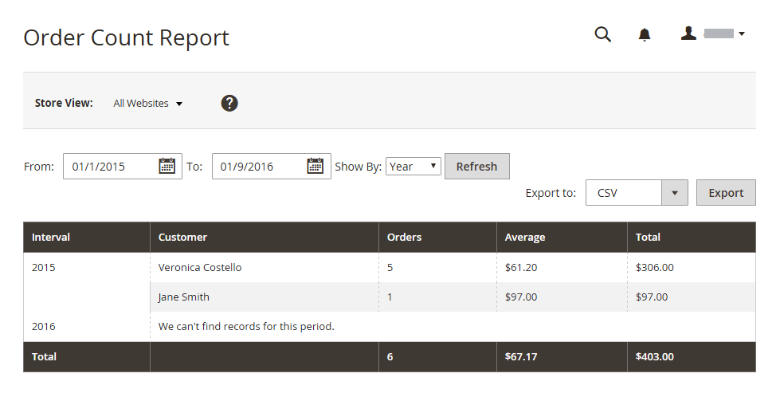
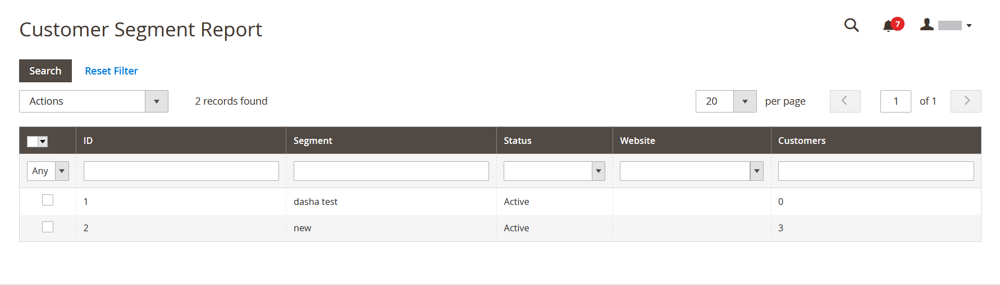

# Rapports clients

Les rapports des clients fournissent insight dans l’activité des clients au cours d’une période ou d’une période spécifiée.

## [!UICONTROL Order Total Report]

La [!UICONTROL Order Total Report] affiche les commandes client pour un intervalle de temps ou une période spécifié. L&#39;état inclut le nombre de commandes par client, le montant moyen des commandes et le montant total.

Dans la barre latérale _Admin_, accédez à **[!UICONTROL Reports]** > _[!UICONTROL Customers]_>**[!UICONTROL Order Total]**.

{width="600"}

### Contrôles Workspace

| Contrôle | Description |
|--- |--- |
| [!UICONTROL From / To] | Permet de définir une recherche des commandes en fonction des dates de début et de fin. |
| [!UICONTROL Show By] | Définit la granularité du fractionnement de l’enregistrement de commande. Options : `Month` / `Day` / `Year` |
| [!UICONTROL Refresh] | Met à jour la grille avec les filtres spécifiés. |
| [!UICONTROL Export] | Exporte les enregistrements sélectionnés au format CSV ou XML Excel. |
| [!UICONTROL Scope] | Utilisé pour définir le site ou le magasin pour lequel le rapport est généré. |

{style="table-layout:auto"}

### Descriptions des colonnes

| Colonne | Description |
|--- |--- |
| [!UICONTROL Interval] | L’intervalle total de commande, par `Month` / `Day` / `Year`. |
| [!UICONTROL Customer] | Nom du client qui a passé les commandes. |
| [!UICONTROL Orders] | Nombre de commandes pour l’intervalle spécifié. |
| [!UICONTROL Average] | Montant moyen de la commande. Ce montant est toujours calculé pour les prix des produits **hors taxe** même si les prix des produits du catalogue, le sous-total de la commande et le total de la commande incluent la taxe. Par conséquent, le montant indiqué dans l&#39;état est différent du montant indiqué dans les détails de la commande dans les cas où les totaux des commandes incluent la taxe. |
| [!UICONTROL Total] | Somme de toutes les commandes pour la période. Ce montant est toujours calculé pour les prix des produits **hors taxe** même si les prix des produits du catalogue, le sous-total de la commande et le total de la commande incluent la taxe. Par conséquent, le total indiqué dans l&#39;état est différent du montant indiqué dans les détails de la commande dans les cas où les totaux des commandes incluent la taxe. |

{style="table-layout:auto"}

## [!UICONTROL Order Count Report]

La [!UICONTROL Order Count Report] affiche le nombre de commandes par client pour un intervalle de temps ou une période spécifié. L&#39;état inclut le nombre de commandes par client, le montant moyen des commandes et le montant total.

Dans la barre latérale _Admin_, accédez à **[!UICONTROL Reports]** > _[!UICONTROL Customers]_>**[!UICONTROL Order Count]**.

{width="600"}

### Contrôles Workspace

| Contrôle | Description |
|--- |--- |
| [!UICONTROL From / To] | Permet de définir une recherche des commandes en fonction des dates de début et de fin. |
| [!UICONTROL Show By] | Définit la granularité du fractionnement de l’enregistrement de commande. Options : `Month` / `Day` / `Year` |
| [!UICONTROL Refresh] | Met à jour la grille avec les filtres spécifiés. |
| [!UICONTROL Export] | Exporte les enregistrements sélectionnés au format CSV ou XML Excel. |
| [!UICONTROL Scope] | Utilisé pour définir le site ou le magasin pour lequel le rapport est généré. |

{style="table-layout:auto"}

### Descriptions des colonnes

| Colonne | Description |
|--- |--- |
| [!UICONTROL Interval] | L’intervalle de nombre de commandes, par `Month` / `Day` / `Year`. |
| [!UICONTROL Customer] | Client qui a passé la commande. |
| [!UICONTROL Orders] | Nombre de commandes pour l’intervalle spécifié. |
| [!UICONTROL Average] | Montant moyen de la commande. Ce montant est toujours calculé pour les prix des produits **hors taxe** même si les prix des produits du catalogue, le sous-total de la commande et le total de la commande incluent la taxe. Par conséquent, le montant indiqué dans l&#39;état est différent du montant indiqué dans les détails de la commande dans les cas où les totaux des commandes incluent la taxe. |
| [!UICONTROL Total] | Somme de toutes les commandes pour la période. Ce montant est toujours calculé pour les prix des produits **hors taxe** même si les prix des produits du catalogue, le sous-total de la commande et le total de la commande incluent la taxe. Par conséquent, le total indiqué dans l&#39;état est différent du montant indiqué dans les détails de la commande dans les cas où les totaux des commandes incluent des tâches. |

{style="table-layout:auto"}

## [!UICONTROL New Accounts Report]

La [!UICONTROL New Accounts Report] affiche le nombre de nouveaux comptes client ouverts au cours d’un intervalle de temps ou d’une période spécifié.

Dans la barre latérale _Admin_, accédez à **[!UICONTROL Reports]** > _[!UICONTROL Customers]_>**[!UICONTROL New]**.

{width="600"}

### Contrôles Workspace

| Contrôle | Description |
|--- |--- |
| [!UICONTROL From / To] | Permet de définir une recherche des nouveaux comptes en fonction des dates de début et de fin. |
| [!UICONTROL Show By] | Définit la granularité du fractionnement de l’enregistrement de commande. Options : Mois / Jour / Année |
| [!UICONTROL Refresh] | Met à jour la grille avec les filtres spécifiés. |
| [!UICONTROL Export] | Exporte les enregistrements sélectionnés au format CSV ou XML Excel. |
| [!UICONTROL Scope] | Utilisé pour définir le site ou le magasin pour lequel le rapport est généré. |

{style="table-layout:auto"}

### Descriptions des colonnes

| Colonne | Description |
|--- |--- |
| [!UICONTROL Interval] | Intervalle de création du nouveau compte, par mois/jour/année. |
| [!UICONTROL New Accounts] | Nombre de nouveaux comptes créés dans un certain intervalle. |

{style="table-layout:auto"}

## [!UICONTROL Customer Wish List Report]

[!BADGE PaaS uniquement]{type=Informative url="https://experienceleague.adobe.com/en/docs/commerce/user-guides/product-solutions" tooltip="S’applique uniquement aux projets Adobe Commerce on Cloud (infrastructure PaaS gérée par Adobe) et aux projets On-premise."}

 (Adobe Commerce uniquement)

Le [!UICONTROL Customer Wish List Report] fournit des informations sur les listes de souhaits des clients.

Dans la barre latérale _Admin_, accédez à **[!UICONTROL Reports]** > _[!UICONTROL Customers]_>**[!UICONTROL Wish Lists]**.

{width="600"}

### Contrôles Workspace

| Contrôle | Description |
|--- |--- |
| [!UICONTROL Scope] | Utilisé pour définir le site ou le magasin pour lequel le rapport est généré. |
| [!UICONTROL Search] | Lance une recherche selon les paramètres spécifiés. |
| [!UICONTROL Reset Filter] | Lance la réinitialisation de tous les paramètres de recherche. |
| [!UICONTROL Per Page] | Définit le nombre d’enregistrements affichés dans une seule page. |
| [!UICONTROL Export] | Exporte les enregistrements sélectionnés au format CSV ou XML Excel. |
| [!UICONTROL From / To] | Permet de définir une recherche pour les listes de souhaits en fonction des dates de début et de fin. |
| [!UICONTROL Wishlist] | Lance une recherche de liste de souhaits par nom. |
| [!UICONTROL Status] | Statut de la liste de souhaits. Options : `Private` / `Public` |
| [!UICONTROL Comment] | Lance une recherche par texte dans les commentaires de la liste de souhaits. |

{style="table-layout:auto"}

### Descriptions des colonnes

| Colonne | Description |
|--- |--- |
| [!UICONTROL Added] | Date de création de la liste de souhaits. |
| [!UICONTROL Customer] | Prénom et nom du client ou de la cliente qui a créé la liste de souhaits. |
| [!UICONTROL Wishlist] | Nom de la liste de souhaits. |
| [!UICONTROL Status] | Statut de la liste de souhaits. Options : `Private` / `Public` |
| [!UICONTROL Product] | Nom du produit ajouté à la liste de souhaits. |
| [!UICONTROL SKU] | SKU du produit ajouté à la liste de souhaits. |
| [!UICONTROL Comment] | Texte de commentaire saisi lors de la création de la liste de souhaits. |

{style="table-layout:auto"}

## [!UICONTROL Customer Segment Report]

 (Adobe Commerce uniquement)

Le [!UICONTROL Customer Segment Report] fournit des informations sur le nombre de clients dans chaque segment.

Dans la barre latérale _Admin_, accédez à **[!UICONTROL Reports]** > _[!UICONTROL Customers]_>**[!UICONTROL Segments]**.

{width="600"}

### Contrôles Workspace

| Contrôle | Description |
|--- |--- |
| [!UICONTROL Search] | Lance une recherche selon les paramètres spécifiés. |
| [!UICONTROL Reset Filter] | Lance la réinitialisation de tous les paramètres de recherche. |
| [!UICONTROL Action] | Lance l’affichage des segments par paramètres. Options : `Action` / `View Combined Report` |
| [!UICONTROL Per Page] | Définit le nombre d’enregistrements affichés dans une seule page. |

{style="table-layout:auto"}

### Descriptions des colonnes

| Colonne | Description |
|--- |--- |
| [!UICONTROL ID] | Identifiant numérique unique attribué à chaque segment. |
| [!UICONTROL Segment] | Nom du segment. |
| [!UICONTROL Status] | Statut du segment. Options : `Active` / `Inactive` |
| [!UICONTROL Website] | Site web auquel le segment est affecté. |
| [!UICONTROL Customers] | Nombre de clients affectés au segment. |

{style="table-layout:auto"}
