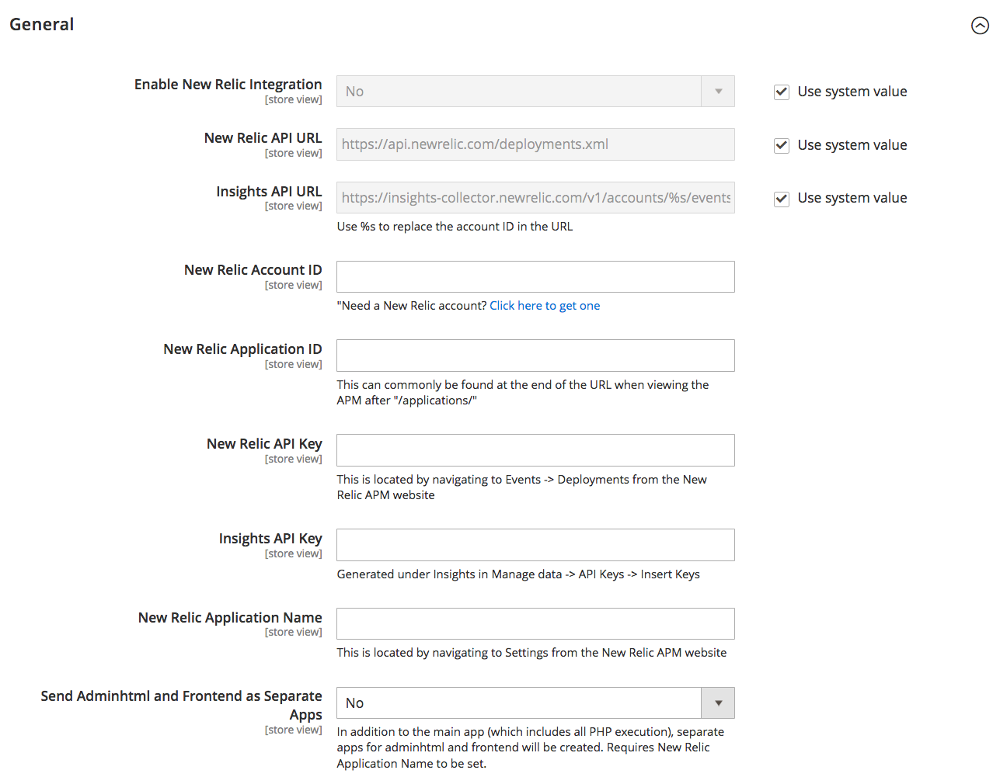

# [!DNL New Relic] reporting

[New Relic][1] est un service d’analyse logicielle qui vous aide à analyser et à améliorer les interactions de l’application. Les comptes d’Adobe Commerce sur l’infrastructure cloud incluent le logiciel pour la variable [!DNL New Relic APM] service. Pour plus d’informations, voir [Services New Relic][4] dans le _Guide d’infrastructure de Commerce on Cloud_.

## Étape 1 : inscription à un [!DNL New Relic] account

1. Accédez au [[!DNL New Relic]][1] et abonnez-vous à un compte.

   Vous pouvez également vous abonner à un compte d’essai gratuit.

1. Suivez les instructions sur le site. Lorsque vous y êtes invité, choisissez d’abord le produit que vous souhaitez installer.

1. Pendant que vous êtes dans votre compte, recherchez les informations d’identification suivantes requises pour terminer la configuration de Commerce :

   | Option | Description |
   | ------ | ----------- |
   | Identifiant de compte | Dans [!DNL New Relic] tableau de bord du compte, l’ ID de compte est le numéro de l’URL suivant : `/accounts` |
   | ID de l’application | Dans [!DNL New Relic] tableau de bord du compte, cliquez sur **[!UICONTROL New Relic APM]**. Dans le menu, choisissez **[!UICONTROL Applications]**. Sélectionnez ensuite votre application. L’ID d’application est le numéro dans l’URL après : `/applications/` |
   | Clé API New Relic | Dans [!DNL New Relic] tableau de bord du compte, cliquez sur **[!UICONTROL Account Settings]**. Dans le menu de gauche sous Intégrations, sélectionnez **[!UICONTROL Data Sharing]**. Vous pouvez créer, régénérer ou supprimer votre clé API à partir de cette page. |
   | Clé API Insights | Dans [!DNL New Relic] tableau de bord du compte, cliquez sur **[!UICONTROL Insights]**. Dans le menu de gauche sous Administration, choisissez **[!UICONTROL API Keys]**. Vos clés d’API Insights apparaissent sur cette page. Si nécessaire, cliquez sur le signe plus (**+**) en regard de l’option Insérer des clés pour générer une clé. |

   {style="table-layout:auto"}

## Étape 2 : installation de [!DNL New Relic] agent sur votre serveur

Pour utiliser [!DNL New Relic APM Pro] pour collecter et transmettre des données, l’agent PHP doit être installé sur votre serveur.

1. Lorsque vous êtes invité à choisir un agent web, cliquez sur **PHP**.

1. Pour configurer l’agent PHP sur votre serveur, suivez les instructions.

   Si vous avez besoin d’aide, voir [New Relic pour PHP][3].

1. Assurez-vous que cron est en cours d’exécution sur votre serveur.

   Pour en savoir plus, voir [Configuration et exécution de cron][5] dans la documentation destinée aux développeurs.

## Étape 3 : Configuration de votre magasin

>[!NOTE]
>Ces options de configuration ne s’appliquent pas à Adobe Commerce sur l’infrastructure cloud.
>
>Si vous êtes sur le plan Pro, New Relic est déjà [préconfiguré et activé par défaut](https://experienceleague.adobe.com/docs/commerce-cloud-service/user-guide/monitor/new-relic/new-relic-service.html). Si vous êtes en formule de démarrage, vous devez renseigner la variable [Étapes de configuration de New Relic](https://experienceleague.adobe.com/docs/commerce-cloud-service/user-guide/monitor/new-relic/account-management.html#configure-new-relic-for-starter-environment) qui font partie du processus de configuration.

1. Sur le _Administration_ barre latérale, accédez à **[!UICONTROL Stores]** > _[!UICONTROL Settings]_>**[!UICONTROL Configuration]**.

1. Dans le panneau de navigation de gauche où **[!UICONTROL General]** est développé, choisissez **[!UICONTROL New Relic Reporting]** et procédez comme suit :

   {width="600"}

   * Définir **[!UICONTROL Enable New Relic Integration]** to `Yes`.

   * Dans le **[!UICONTROL Insights API URL]**, remplacez le pourcentage (`%`) avec votre ID de compte New Relic.

   * Saisissez votre **[!UICONTROL New Relic Account ID]**.

   * Saisissez votre **[!UICONTROL New Relic Application ID]**.

   * Saisissez votre **[!UICONTROL New Relic API Key]**.

   * Saisissez **[!UICONTROL Insights API Key]**.

1. Pour **[!UICONTROL New Relic Application Name]**, saisissez un nom pour identifier la configuration à des fins de référence interne.

1. (Facultatif) Pour **[!UICONTROL Send Adminhtml and Frontend as Separate Apps]**, sélectionnez `Yes` pour envoyer les données collectées pour storefront et Admin en tant qu’applications distinctes à New Relic.

   Cette option nécessite la saisie d’un nom pour la variable **[!UICONTROL New Relic Application Name]**.

   >[!NOTE]
   >
   >L’activation de cette fonction réduit le nombre de faux positifs. [!DNL New Relic] alertes et permet une surveillance et des alertes configurées uniquement pour les performances frontales. New Relic reçoit des fichiers de données d’application distincts auxquels sont ajoutés les noms de l’application `Adminhtml` et frontal. Par exemple : `MyStore_Adminhtml`

1. Lorsque vous avez terminé, cliquez sur **[!UICONTROL Save Config]**.

## Étape 4 : activation de Cron pour [!DNL New Relic] reporting

1. Développer  la valeur **[!UICONTROL Cron]** .

   {width="600"}

1. Définir **[!UICONTROL Enable Cron]** to `Yes`.

1. Lorsque vous avez terminé, cliquez sur **[!UICONTROL Save Config]**.

## [!DNL New Relic] requêtes

[!DNL New Relic Insights] Les données sont basées sur des instructions écrites dans [!DNL New Relic Query Language] (NRQL) et tous les paramètres personnalisés que vous pouvez inclure. Les données peuvent être renvoyées à partir de requêtes ad hoc ou par des requêtes enregistrées dans votre tableau de bord. Pour en savoir plus, voir la section [Référence NRQL][6] dans le [!DNL New Relic] la documentation.

### Événements d’administration

#### Utilisateurs administrateurs actifs

Renvoie le nombre d’utilisateurs administrateurs actifs.

    SELECT uniqueCount(AdminId)
    FROM Transaction
    WHERE appName=&#39;&lt;your_app_name>&#39; DEPUIS 15 minutes

#### Utilisateurs d’administration actuellement actifs

Renvoie les noms des utilisateurs administrateurs actifs.

    SELECT uniques(AdminName)
    FROM Transaction
    WHERE appName=&#39;&lt;your_app_name>&#39; DEPUIS 15 minutes

#### Activité d’administration récente

Renvoie le nombre d’actions administrateur récentes.

    SELECT count(AdminId)
    FROM Transaction
    WHERE appName =&#39;&lt;your_app_name>&#39; FACET AdminName depuis il y a 1 jour

#### Dernière activité d’administrateur

Renvoie des informations détaillées sur les actions d’administration récentes, notamment le nom d’utilisateur administrateur, la durée et le nom de l’application.

    SELECT AdminName, duration, name
    FROM Transaction
    WHERE appName=&#39;&#39; AND AdminName &lt;your_app_name>IS NOT NULL
    AND AdminName !&lt;/your_app_name>= LIMITE &#39;S.O&#39; 50

### Evénements Cron

#### Nombre de catégories

Renvoie le nombre d’événements d’application par catégorie pendant la période spécifiée.

    SELECT average(CatalogCategoryCount)
    DE Cron
    OÙ CatalogCategoryCount N’EST PAS NULL
    AND appName = &#39;&lt;your_app_name>&quot;HORODATAGES 2 minutes

#### Nombre de catalogues actuels

Renvoie le nombre moyen d’événements d’application dans le catalogue par catégorie durant une période donnée.

    SELECT average(CatalogCategoryCount)
    FROM Cron
    WHERE CatalogCategoryCount IS NOT NULL
    ET CatalogCategoryCount > 0
    AND appName = &#39;&lt;your_app_name>&#39; DEPUIS 2 minutes LIMITE 1
&lt;/your_app_name>
#### Produits actifs

Renvoie le nombre d’événements d’application par produit au cours de la période spécifiée.

    SELECT average(CatalogProductActiveCount)
    DE Cron
    OÙ CatalogProductActiveCount N’EST PAS NULL
    AND appName = &#39;&lt;your_app_name>&quot;HORODATAGES 2 minutes

#### Nombre de produits actifs

Renvoie le nombre moyen d’événements d’application actifs par produit au cours de la période spécifiée.

    SELECT average(CatalogProductActiveCount)
    DE Cron
    OÙ CatalogProductActiveCount N’EST PAS NULL
    ET CatalogProductActiveCount > 0
    AND appName = &#39;&lt;your_app_name>&#39; DEPUIS 2 minutes LIMIT 1

#### Produits configurables

Renvoie le nombre moyen d’événements d’application pour les produits configurables au cours de la période spécifiée.

    SELECT average(CatalogProductConfigurableCount)
    DE Cron
    OÙ CatalogProductConfigurableCount N’EST PAS NULL
    AND appName = &#39;&lt;your_app_name>&quot;HORODATAGES 2 minutes

#### Nombre de produits configurables

Renvoie le nombre moyen d’événements d’application par produit configurable au cours de la période spécifiée.

    SELECT average(CatalogProductConfigurableCount)
    DE Cron
    OÙ CatalogProductConfigurableCount N’EST PAS NULL
    AND CatalogProductConfigurableCount > 0
    AND appName = &#39;&lt;your_app_name>&#39; DEPUIS 2 minutes LIMIT 1

#### Nombre de produits (tous)

Renvoie le nombre total d’événements d’application pour tous les produits.

    SELECT average(CatalogProductCount)
    DE Cron
    OÙ CatalogProductCount N’EST PAS NULL
    AND appName = &#39;&lt;your_app_name>&quot;HORODATAGES 2 minutes

#### Nombre actuel de produits (tous)

Renvoie le nombre moyen d’événements d’application pour tous les produits au cours de la période spécifiée.

    SELECT average(CatalogProductCount)
    DE Cron
    OÙ CatalogProductCount N’EST PAS NULL
    ET CatalogProductCount > 0
    AND appName = &#39;&lt;your_app_name>&#39; DEPUIS 2 minutes LIMIT 1

#### Nombre de clients

Renvoie le nombre moyen d’événements d’application par client.

    SELECT average(CustomerCount)
    DE Cron
    OÙ CustomerCount N’EST PAS NULL
    ET CustomerCount > 0&lt;
    AND appName = &#39;&lt;your_app_name>&quot;HORODATAGES 2 minutes

#### Nombre actuel de clients

Renvoie le nombre moyen de clients au cours de la période spécifiée.

    SELECT average(CustomerCount)
    DE Cron
    OÙ CustomerCount N’EST PAS NULL
    ET CustomerCount > 0
    AND appName = &#39;&lt;your_app_name>&#39; DEPUIS 2 minutes LIMIT 1

#### État du module

Renvoie le nombre moyen de fois où les modules d’application sont activés, désactivés ou installés au cours de la période spécifiée.

    SELECT average(ModulesDisabled), average(ModulesEnabled), average)
    (ModulesInstalled)
    DE Cron&lt;
    WHERE appName = &#39;&lt;your_app_name>&quot;HORODATAGES 2 minutes

#### Etat actuel du module

Renvoie le nombre moyen de fois où les modules ont été activés, désactivés ou installés au cours de la période spécifiée.

    SELECT average(ModulesDisabled), average(ModulesEnabled), average)
    (ModulesInstalled)
    DE Cron
    WHERE appName = &#39;&lt;your_app_name>&#39; DEPUIS 2 minutes LIMIT 1

#### Nombre de sites web et de magasins

Renvoie le nombre moyen d’événements d’application par site web et magasin pendant la période spécifiée.

    SELECT average(StoreViewCount), average(WebsiteCount)
    DE Cron
    WHERE appName = &#39;&amp;lt;your_app_name&amp;gt;&#39; TIMESERIES 2 minutes

#### Nombre actuel de sites web et de magasins

Renvoie le nombre moyen d’événements de l’application en cours au cours de la période spécifiée.

    SELECT average(StoreViewCount), average(WebsiteCount)
    DE Cron
    WHERE appName = &#39;&lt;your_app_name>&#39; DEPUIS 2 minutes LIMIT 1

#### Cron : toutes les données de l’événement

Renvoie toutes les données d’événement d’application.

    SELECT *
    DE Cron
    WHERE appName = &#39;&lt;your_app_name>&#39;

### Clients

#### Nombre de clients actifs

Renvoie le nombre de clients actifs au cours de la période spécifiée.

    SELECT uniqueCount(CustomerId)
    FROM Transaction
    WHERE appName = &#39;&lt;your_app_name>&#39; DEPUIS 15 minutes

#### Clients actifs

Renvoie les noms des clients actifs pendant la période spécifiée.

    SELECT uniques(CustomerName)
    FROM Transaction
    WHERE appName=&#39;&lt;your_app_name>&#39; DEPUIS 15 minutes

#### Clients principaux

Renvoie les principaux clients pendant la période spécifiée.

    SELECT count(CustomerId)
    FROM Transaction
    WHERE appName = &#39;&lt;your_app_name>&quot;Nom du client FACET depuis il y a 1 jour

#### Activité d’administration récente

Renvoie un nombre défini d’enregistrements d’activité récente, incluant le nom du client et la durée de la visite.

    SELECT CustomerName, duration, name
    FROM Transaction
    WHERE appName=&#39;&lt;your_app_name>&#39;
    AND CustomerName IS NOT NULL
    ET CustomerName !&lt;/your_app_name>= LIMITE &#39;S.O&#39; 50

### Commandes

#### Nombre de commandes passées

Renvoie le nombre de commandes passées pendant la période spécifiée.

    SELECT count(Order)
    FROM Transaction SINCE 1 day ago

#### Valeur totale de la commande

Renvoie le nombre total d’éléments de ligne commandés au cours de la période spécifiée.

    SELECT sum(orderValue)
    FROM Transaction DEPUIS 1 jour auparavant

#### Nombre total d’éléments commandés

Renvoie le nombre total d’articles commandés au cours d’une période spécifiée.

    SELECT sum(lineItemCount)
    DEPUIS LA Transaction DEPUIS 1 jour

[1]: https://newrelic.com/
[3]: https://docs.newrelic.com/docs/agents/php-agent/getting-started/new-relic-php
[4]: https://experienceleague.adobe.com/docs/commerce-cloud-service/user-guide/monitor/new-relic/new-relic-service.html
[5]: https://experienceleague.adobe.com/docs/commerce-operations/configuration-guide/cli/configure-cron-jobs.html
[6]: https://docs.newrelic.com/docs/insights/new-relic-insights/using-new-relic-query-language/nrql-reference
