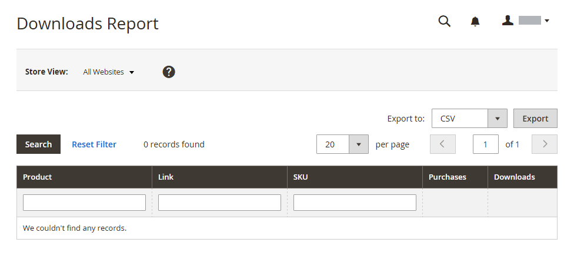

# Rapports sur les produits

Les rapports de produit vous donnent accès à insight concernant les produits consultés et commandés, les best-sellers, les niveaux de stock et les téléchargements.

## [!UICONTROL Product Views Report]

[!BADGE PaaS uniquement]{type=Informative url="https://experienceleague.adobe.com/en/docs/commerce/user-guides/product-solutions" tooltip="S’applique uniquement aux projets Adobe Commerce on Cloud (infrastructure PaaS gérée par Adobe) et aux projets On-premise."}

La [!UICONTROL Product Views Report] affiche les produits qui ont été consultés au cours d’un intervalle de temps ou d’une plage de dates. Le rapport inclut le nom, le prix et le nombre de consultations du produit.

Dans la barre latérale _Admin_, accédez à **[!UICONTROL Reports]** > _[!UICONTROL Products]_>**[!UICONTROL Views]**.

{width="600"}

## [!UICONTROL Bestsellers Report]

La [!UICONTROL Bestsellers Report] affiche les cinq meilleures ventes au cours d’un intervalle de temps ou de période. L&#39;état inclut le nom du produit, le prix et la quantité commandée.

Dans la barre latérale _Admin_, accédez à **[!UICONTROL Reports]** > _[!UICONTROL Products]_>**[!UICONTROL Bestsellers]**.

{width="600"}

## [!UICONTROL Low Stock Report]

Le [!UICONTROL Low Stock Report] répertorie tous les produits dont le niveau de stock se situe dans une plage spécifiée. Lorsque l&#39;option [[!DNL Inventory Management]](../inventory-management/introduction.md) est activée, l&#39;état inclut les faibles quantités en stock par origine avec le code source indiqué.

Dans la barre latérale _Admin_, accédez à **[!UICONTROL Reports]** > _[!UICONTROL Products]_>**[!UICONTROL Low Stock]**.

{width="600"}

## [!UICONTROL Ordered Products Report]

Le [!UICONTROL Ordered Products Report] répertorie tous les produits commandés pour un intervalle de temps ou une période spécifié. L&#39;état inclut le nom du produit et la quantité commandée.

Dans la barre latérale _Admin_, accédez à **[!UICONTROL Reports]** > _[!UICONTROL Products]_>**[!UICONTROL Ordered]**.

{width="600"}

## [!UICONTROL Downloads Report]

[!BADGE PaaS uniquement]{type=Informative url="https://experienceleague.adobe.com/en/docs/commerce/user-guides/product-solutions" tooltip="S’applique uniquement aux projets Adobe Commerce on Cloud (infrastructure PaaS gérée par Adobe) et aux projets On-premise."}

Le [!UICONTROL Downloads Report] répertorie tous les téléchargements au cours de l’intervalle de temps ou de la période spécifié. Le rapport comprend le nom du produit, le lien de téléchargement et le SKU, ainsi que le nombre d’achats et de téléchargements.

Dans la barre latérale _Admin_, accédez à **[!UICONTROL Reports]** > _[!UICONTROL Products]_>**[!UICONTROL Downloaded]**.

{width="600"}
