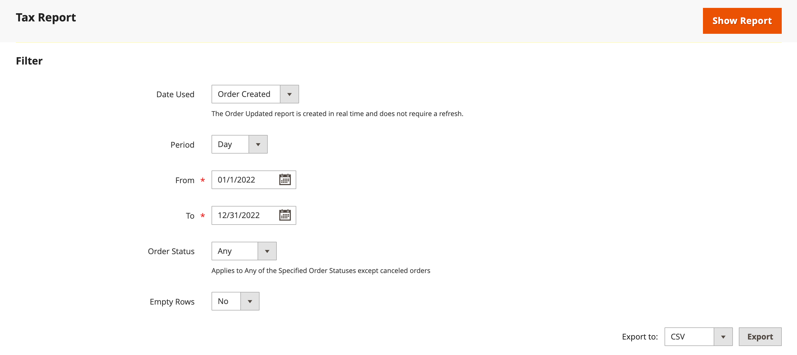
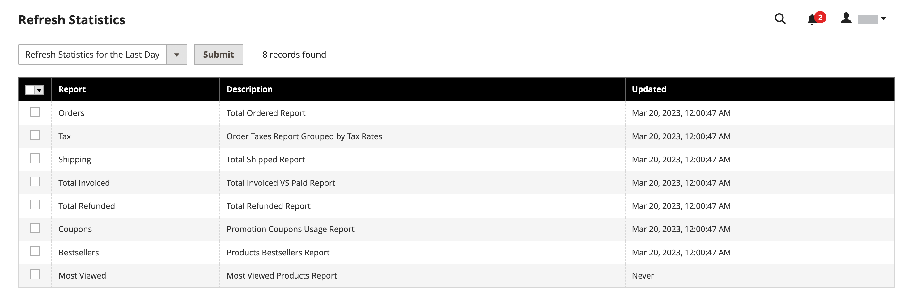

# Rapports des ventes

La sélection des rapports de vente inclut les commandes, la taxe, la facturation, l&#39;expédition, les remboursements, les coupons et le règlement PayPal.

## Filtres de rapport

Vous pouvez générer un rapport des ventes pour l&#39;ensemble d&#39;un site Web ou pour un magasin. Les rapports de ventes peuvent être filtrés par intervalle de temps, date et statut.

{width="600"}

Pour filtrer un rapport de ventes, définissez les options suivantes :

| Option | Description |
|--- |--- |
| [!UICONTROL Date Used] | Définit les données à utiliser pour le rapport. |
| [!UICONTROL Period] | Période pour laquelle les données sont utilisées : Jour/Mois/Année. |
| [!UICONTROL From/To] | Utilisé pour définir les données de recherche par date de début et de fin. |
| [!UICONTROL Order Status] | Indique le statut de la commande |
| [!UICONTROL Empty Rows] | Indique s’il faut ajouter des lignes vides au rapport. |

## [!UICONTROL Orders Report]

Le [!UICONTROL Orders Report] comprend le nombre de commandes passées et annulées, avec les totaux des ventes, les montants facturés, remboursés, la taxe collectée, les frais d&#39;expédition facturés et les remises.

1. Dans la barre latérale _Admin_, accédez à **[!UICONTROL Reports]** > _[!UICONTROL Sales]_>**[!UICONTROL Orders]**.

1. Dans la section **[!UICONTROL Filter]** , sélectionnez les options relatives à la période de création des rapports ainsi que le statut de la commande utilisé pour générer le rapport.

1. Cliquez sur **[!UICONTROL Show Report]**.

{width="600"}

## [!UICONTROL Tax Report]

La [!UICONTROL Tax Report] inclut la règle de taxe appliquée, le taux de taxe, le nombre de commandes et le montant de la taxe facturée.

1. Dans la barre latérale _Admin_, accédez à **[!UICONTROL Reports]** > _[!UICONTROL Sales]_>**[!UICONTROL Tax]**.

1. Dans la section **[!UICONTROL Filter]** , sélectionnez les options relatives à la période de création des rapports ainsi que le statut de la commande utilisé pour générer le rapport.

1. Cliquez sur **[!UICONTROL Show Report]**.

{width="600"}

## [!UICONTROL Invoice Report]

Le [!UICONTROL Invoice Report] inclut le nombre de commandes et de factures au cours de la période, avec les montants facturés, payés et non payés.

1. Dans la barre latérale _Admin_, accédez à **[!UICONTROL Reports]** > _[!UICONTROL Sales]_>**[!UICONTROL Invoiced]**.

1. Dans la section **[!UICONTROL Filter]** , sélectionnez les options relatives à la période de création des rapports ainsi que le statut de la commande utilisé pour générer le rapport.

1. Cliquez sur **[!UICONTROL Show Report]**.

{width="600"}

## [!UICONTROL Shipping Report]

Le [!UICONTROL Shipping Report] inclut le nombre de commandes pour le transporteur ou le mode d’expédition utilisé, y compris les montants pour les ventes totales et l’expédition totale.

1. Dans la barre latérale _Admin_, accédez à **[!UICONTROL Reports]** > _[!UICONTROL Sales]_>**[!UICONTROL Shipping]**.

1. Dans la section **[!UICONTROL Filter]** , sélectionnez les options relatives à la période de création des rapports ainsi que le statut de la commande utilisé pour générer le rapport.

1. Cliquez sur **[!UICONTROL Show Report]**.

{width="600"}

## [!UICONTROL Refunds Report]

Le [!UICONTROL Refunds Report] inclut le nombre de commandes remboursées et le montant total remboursé en ligne et hors ligne.

1. Dans la barre latérale _Admin_, accédez à **[!UICONTROL Reports]** > _[!UICONTROL Sales]_>**[!UICONTROL Refunds]**.

1. Dans la section **[!UICONTROL Filter]** , sélectionnez les options relatives à la période de création des rapports ainsi que le statut de la commande utilisé pour générer le rapport.

1. Cliquez sur **[!UICONTROL Show Report]**.

{width="600"}

## [!UICONTROL Coupons Report]

La [!UICONTROL Coupons Report] comprend chaque code coupon utilisé pendant l&#39;intervalle spécifié, la règle de prix associée et le nombre de fois utilisées, avec des totaux et sous-totaux pour les ventes et les remises.

1. Dans la barre latérale _Admin_, accédez à **[!UICONTROL Reports]** > _[!UICONTROL Sales]_>**[!UICONTROL Coupons]**.

1. Dans la section **[!UICONTROL Filter]** , sélectionnez les options relatives à la période de création des rapports ainsi que le statut de la commande utilisé pour générer le rapport.

1. Cliquez sur **[!UICONTROL Show Report]**.

Pour plus d’informations sur l’utilisation de l’[!UICONTROL Coupons Report] afin de collecter des données pour vos campagnes promotionnelles, voir [Rapports sur les coupons](../merchandising-promotions/price-rules-cart-coupon.md#coupons-report) dans le _Guide de marchandisage et de promotion_.

<!---  need coupon data  -->

## [!UICONTROL PayPal Settlement Reports]

La page [Rapports de règlement PayPal] indique le type d&#39;événement, tel qu&#39;une transaction par carte de débit, les dates de début et de fin, le montant brut et les frais associés. Le rapport peut être automatiquement mis à jour avec les données les plus récentes de PayPal. Il existe des options de filtrage pour la période, le compte commercial, l’ID de transaction, l’ID de facture ou l’ID de référence PayPal.

Dans la barre latérale _Admin_, accédez à **[!UICONTROL Reports]** > _[!UICONTROL Sales]_>**[!UICONTROL PayPal Settlement]**.

{width="600"}

Pour plus d&#39;informations sur l&#39;utilisation du [!UICONTROL PayPal Settlement Reports] pour récupérer des informations sur chaque transaction PayPal qui affecte le règlement des fonds, voir [Rapports de règlement PayPal](../stores-purchase/paypal-settlement-reports.md) dans le _Guide des magasins et de l&#39;expérience d&#39;achat_.

## [!UICONTROL Braintree Settlement Report]

Le rapport de règlement [Braintree](../stores-purchase/braintree.md) peut être filtré en fonction de la date de création, du montant, du statut, du type de transaction, du type de paiement, du numéro de transaction, du numéro de commande, du numéro de paiement PayPal, du type, du numéro de compte commercial ou du numéro de lot de règlement. L&#39;état contient l&#39;ID transaction, l&#39;ID commande, l&#39;ID paiement PayPal, le type, la date de création, le montant, le code règlement, le statut, le texte de réponse de règlement, les ID remboursement, l&#39;ID compte commerçant, l&#39;ID lot de règlement et la devise.

Dans la barre latérale _Admin_, accédez à **[!UICONTROL Reports]** > _[!UICONTROL Sales]_>**[!UICONTROL Braintree Settlement]**.

<!---  need a Braintree connection to update report screen -->

## Export de rapports

1. Pour exporter le rapport, sélectionnez le type de fichier : `Excel XML` ou `CSV`

1. Cliquez sur **[!UICONTROL Export]**.

## Actualiser les statistiques

[!BADGE PaaS uniquement]{type=Informative url="https://experienceleague.adobe.com/en/docs/commerce/user-guides/product-solutions" tooltip="S’applique uniquement aux projets Adobe Commerce on Cloud (infrastructure PaaS gérée par Adobe) et aux projets On-premise."}

Pour réduire l&#39;impact sur les performances de la génération des rapports de ventes, [!DNL Commerce] calcule et stocke les statistiques requises pour chaque rapport. Au lieu de recalculer les statistiques chaque fois qu’un rapport est généré, les statistiques stockées sont utilisées, sauf si vous actualisez les statistiques. Pour inclure les données les plus récentes, les statistiques du rapport doivent être actualisées avant la génération d&#39;un rapport de ventes.

{width="700"}

1. Dans la barre latérale _Admin_, accédez à **[!UICONTROL Reports]** > _[!UICONTROL Statistics]_>**[!UICONTROL Refresh Statistics]**.

1. Dans la liste, cochez la case correspondant à chaque rapport à actualiser.

1. Définissez le contrôle **[!UICONTROL Actions]** sur l’une des options suivantes :

   - `Refresh Lifetime Statistics`
   - `Refresh Statistics for the Last Day`

1. Cliquez sur **[!UICONTROL Submit]**.
