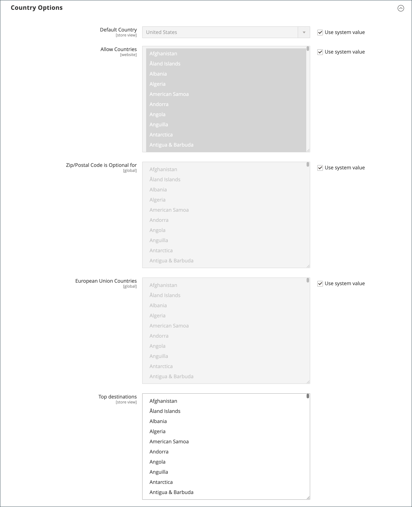

# Détails de la boutique

Les informations de base de votre boutique comprennent le nom et l’adresse de la boutique, le numéro de téléphone et l’adresse e-mail qui apparaissent sur les e-mails, les factures et les autres communications envoyées à vos clients.

{width="900" zoomable="yes"}

## [!UICONTROL Store Information]

La section _[!UICONTROL Store Information]_&#x200B;fournit les informations de base qui apparaissent sur les documents de vente et dans d’autres communications.

1. Dans la barre latérale _Admin_, accédez à **[!UICONTROL Stores]** > _[!UICONTROL Settings]_>**[!UICONTROL Configuration]**.

1. Sous **[!UICONTROL General]** dans le panneau de navigation de gauche, choisissez **[!UICONTROL General]**.

1. Développez  la section **[!UICONTROL Store Information]** .

   {width="700"}

1. Définissez les options en fonction des détails de votre boutique :

   - Saisissez le **[!UICONTROL Store Name]** que vous souhaitez utiliser dans toutes les communications.

   - Saisissez le **[!UICONTROL Store Phone Number]**, formaté comme vous souhaitez qu’il apparaisse.

   - Par **[!UICONTROL Store Hours of Operation]**, saisissez les heures d’ouverture de votre magasin. Par exemple : `Mon - Fri, 9-5, Sat 9-noon PST`.

   - Sélectionnez le **[!UICONTROL Country]** où se trouve votre entreprise.

   - Sélectionnez le **[!UICONTROL Region/State]** avec le pays.

   - Saisissez le **[!UICONTROL Store Address]**. Si l’adresse est longue, continuez avec l’adresse sur **Store Address Line 2**.

   - Le cas échéant, saisissez le **[!UICONTROL VAT Number]** de votre boutique.

     Pour vérifier le nombre, cliquez sur le bouton **[!UICONTROL Validate VAT Number]** . Pour en savoir plus, voir [Validation du numéro de TVA](../stores-purchase/vat.md#vat-id-validation).

1. Cliquez ensuite sur **[!UICONTROL Save Config]**.

Pour plus d’informations sur les options de configuration des informations du magasin, consultez le [_Guide de référence de configuration_](../configuration-reference/general/general.md#store-information).

## [!UICONTROL Locale Options]

Le paramètre régional détermine les nombreux paramètres utilisés dans l’ensemble du magasin. Voici quelques-uns d’entre eux :

- Langue
- Pays
- Taux d&#39;imposition
- Devise monétaire
- Prix
- Format des nombres

Le paramètre régional détermine le fuseau horaire et la langue utilisés pour chaque magasin, et identifie les jours de la semaine de travail dans la zone.

1. Dans la barre latérale _Admin_, accédez à **[!UICONTROL Stores]** > _[!UICONTROL Settings]_>**[!UICONTROL Configuration]**.

1. Dans le panneau de navigation de gauche, sous **[!UICONTROL General]**, choisissez **[!UICONTROL General]**.

1. Développez  la section **[!UICONTROL Locale Options]** .

   {width="700"}

1. Sélectionnez votre **[!UICONTROL Timezone]** dans la liste.

1. Définissez **[!UICONTROL Locale]** sur la langue du magasin.

1. Définissez **[!UICONTROL Weight Unit]** sur l’unité de mesure généralement utilisée pour les expéditions à partir de votre paramètre régional.

1. Définissez **[!UICONTROL First Day of the Week]** sur le jour qui est considéré comme le premier jour de la semaine dans votre zone.

1. Dans la liste **[!UICONTROL Weekend Days]**, sélectionnez les jours qui tombent un week-end dans votre région.

   Pour sélectionner plusieurs jours, maintenez la touche Ctrl (PC) ou Commande (Mac) enfoncée et cliquez sur chaque élément.

1. Cliquez ensuite sur **[!UICONTROL Save Config]**.

Pour plus d’informations sur les options de configuration des paramètres régionaux, consultez le [ Guide de référence de configuration ](../configuration-reference/general/general.md#locale-options).

## [!UICONTROL State Options]

Dans de nombreux pays, l’État, la province ou la région est une partie obligatoire d’une adresse postale. Ces informations sont utilisées pour les informations d’expédition et de facturation, pour calculer les taux de taxe, etc. Pour les pays où l’état n’est pas obligatoire, le champ peut être entièrement omis de l’adresse ou inclus en tant que champ facultatif.

Comme les formats d&#39;adresse standard varient d&#39;un pays à l&#39;autre, vous pouvez également modifier le modèle utilisé pour formater l&#39;adresse des factures, des bons de livraison et des étiquettes d&#39;expédition.

1. Dans la barre latérale _Admin_, accédez à **[!UICONTROL Stores]** > _[!UICONTROL Settings]_>**[!UICONTROL Configuration]**.

1. Sous **[!UICONTROL General]** dans le panneau de navigation de gauche, choisissez **[!UICONTROL General]**.

1. Développez  la section **[!UICONTROL State Options]** .

   {width="700"}

1. Utilisez la liste **[!UICONTROL State is required for]** pour sélectionner chaque pays où Région/État est une entrée obligatoire.

1. Définissez **[!UICONTROL Allow to Choose State if it is Optional for Country]** sur l’une des options suivantes :

   `Yes` - Dans les pays où le champ État n’est pas obligatoire, inclut le champ État comme entrée facultative.

   `No` - Dans les pays où le champ État n’est pas obligatoire, omet le champ État .

1. Cliquez ensuite sur **[!UICONTROL Save Config]**.

Pour plus d’informations sur les options de configuration d’état, consultez le [ Guide de référence de configuration ](../configuration-reference/general/general.md#state-options).

## [!UICONTROL Country Options]

Les options pays identifient le pays où se trouve votre entreprise et les pays d&#39;où vous acceptez le paiement.

### Définir les options de pays pour votre boutique

1. Dans la barre latérale _Admin_, accédez à **[!UICONTROL Stores]** > _[!UICONTROL Settings]_>**[!UICONTROL Configuration]**.

1. Dans le panneau de navigation de gauche, sous **[!UICONTROL General]**, choisissez **[!UICONTROL General]**.

1. Développez  la section **[!UICONTROL Country Options]** .

   >[!NOTE]
   >
   >Si nécessaire, décochez la case **[!UICONTROL Use system value]** pour chaque paramètre à modifier.

   {width="700"}

1. Choisissez le **[!UICONTROL Default Country]** où se trouve votre entreprise.

1. Dans la liste **[!UICONTROL Allow Countries]**, sélectionnez chaque pays dans lequel vous acceptez des commandes.

   Par défaut, tous les pays de la liste sont sélectionnés. Pour sélectionner plusieurs pays, maintenez la touche Ctrl (PC) ou Commande (Mac) enfoncée et cliquez sur chaque élément.

1. Utilisez la liste **[!UICONTROL Zip/Postal Code is Optional for]** pour sélectionner chaque pays dans lequel vous exercez des activités qui n’exige pas l’inclusion d’un code postal dans l’adresse postale.

1. Dans la liste **[!UICONTROL European Union Countries]**, sélectionnez chaque pays de l&#39;UE où vous exercez vos activités.

   Par défaut, tous les pays de l’UE sont sélectionnés. Pour sélectionner les pays dont vous avez besoin, maintenez la touche Ctrl (PC) ou Commande (Mac) enfoncée et cliquez sur chaque élément.

1. Dans la liste **[!UICONTROL Top Destinations]**, sélectionnez les principaux pays que vous ciblez pour les ventes.

1. Cliquez ensuite sur **[!UICONTROL Save Config]**.

### Définir les options de pays pour une méthode de diffusion spécifique

Vous pouvez également configurer l’expédition vers des pays spécifiques pour chaque [méthode de livraison](../stores-purchase/delivery.md) disponible (UPS, FedEx, etc.).

1. Dans la barre latérale _Admin_, accédez à **[!UICONTROL Stores]** > _[!UICONTROL Settings]_>**[!UICONTROL Configuration]**.

1. Dans le panneau de navigation de gauche, développez **[!UICONTROL Sales]** et choisissez **[!UICONTROL Delivery Methods]**.

1. Sélectionnez le transporteur auquel vous souhaitez appliquer des pays spécifiques.

1. Par **[!UICONTROL Ship to Applicable Countries]**, décochez la case **[!UICONTROL Use system value]** et sélectionnez l’option **[!UICONTROL Specific Countries]** .

1. Dans la liste **[!UICONTROL Top Destinations]**, sélectionnez les principaux pays que vous ciblez pour l&#39;expédition.

   {width="700"}

1. Cliquez ensuite sur **[!UICONTROL Save Config]**.

### Résolution des problèmes liés aux ressources

Pour obtenir de l’aide sur la résolution des problèmes de configuration des pays, consultez les articles suivants de la base de connaissances de l’assistance [!DNL Commerce] :

- [Comment ajouter un pays ](https://experienceleague.adobe.com/docs/commerce-knowledge-base/kb/how-to/how-to-add-a-new-country-to-magento-2.html?lang=fr)

## [!UICONTROL Merchant Location]

[!BADGE PaaS uniquement]{type=Informative url="https://experienceleague.adobe.com/fr/docs/commerce/user-guides/product-solutions" tooltip="S’applique uniquement aux projets Adobe Commerce on Cloud (infrastructure PaaS gérée par Adobe) et aux projets On-premise."}

Le paramètre Emplacement du vendeur est utilisé pour configurer [modes de paiement](../stores-purchase/payments.md). S’il n’existe aucune valeur pour ce paramètre, le paramètre [Pays par défaut](#uicontrol-country-options) est utilisé.

1. Dans la barre latérale _Admin_, accédez à **[!UICONTROL Stores]** > _[!UICONTROL Settings]_>**[!UICONTROL Configuration]**.

1. Dans le panneau de navigation de gauche, développez **[!UICONTROL Sales]** et choisissez **[!UICONTROL Payment Methods]**.

1. Développez  la section **Emplacement du commerçant** et choisissez votre **[!UICONTROL Merchant Country]**.

   {width="600"}

1. Cliquez ensuite sur **[!UICONTROL Save Config]**.

Pour plus d&#39;informations sur les options de configuration des modes de paiement, consultez le [ Guide de référence de configuration](../configuration-reference/sales/payment-methods.md).

## Devise monétaire

Configuration de la devise : définit la devise [devise](../stores-purchase/currency-configuration.md) de base et toutes les devises supplémentaires acceptées en tant que paiement. Établit également la connexion et le planning d&#39;importation qui sont utilisés pour mettre à jour automatiquement les taux de change.

Symboles de devise - Définit les [ symboles de devise](../stores-purchase/currency-configuration.md#step-5-customize-currency-symbols-optional) qui apparaissent dans les prix de produit et les documents de vente tels que les commandes et les factures. [!DNL Commerce] prend en charge les devises de plus de 200 pays à travers le monde.

Mise à jour des taux de change - Les taux de change peuvent être [mis à jour](../stores-purchase/currency-update.md) manuellement ou importés dans votre boutique selon vos besoins ou selon un planning prédéfini.

Sélecteur de devise - Si plusieurs devises sont disponibles, le [sélecteur de devise](../stores-purchase/currency.md) est disponible dans l’en-tête du magasin.

## [!UICONTROL Store Email Addresses]

Vous pouvez avoir jusqu’à cinq adresses e-mail différentes pour représenter des fonctions ou des services distincts pour chaque magasin ou vue. Outre les identités d’e-mail prédéfinies suivantes, vous pouvez configurer quelques identités personnalisées en fonction de vos besoins.

- Contact général
- Représentant commercial
- Service clientèle

Chaque identité et son adresse e-mail associée peuvent être associées à des e-mails automatisés spécifiques et apparaître comme l’expéditeur des e-mails envoyés à partir de votre boutique.

### Étape 1 : configurer les adresses e-mail pour votre domaine

Avant de pouvoir configurer des adresses e-mail pour le magasin , chacune d’elles doit être configurée en tant qu’adresse e-mail valide pour votre domaine. Pour créer chaque adresse e-mail requise, suivez les instructions de l’administrateur du serveur ou du fournisseur d’hébergement de messagerie.

### Étape 2 : définir l’URL de base pour les liens générés

[!BADGE SaaS uniquement]{type=Positive url="https://experienceleague.adobe.com/fr/docs/commerce/user-guides/product-solutions" tooltip="S’applique uniquement aux projets Adobe Commerce as a Cloud Service (infrastructure SaaS gérée par Adobe)."}

Certains e-mails destinés aux clients et clientes incluent des liens vers le magasin, tels que ceux qui aident les clients à réinitialiser leurs mots de passe. Pour vous assurer que les liens vers le storefront sont fonctionnels, vous devez définir l’URL de base vers votre storefront.

1. Dans la barre latérale _Admin_, accédez à **[!UICONTROL Stores]** > _[!UICONTROL Settings]_>**[!UICONTROL Configuration]**.

1. Sous **[!UICONTROL General]** dans le panneau de navigation de gauche, choisissez **[!UICONTROL Store Email Addresses]**.

1. Dans la section **[!UICONTROL General]** du champ **[!UICONTROL Storefront Base URL]** , saisissez l’URL racine de votre boutique, par exemple `https://www.example.com/`. L’URL doit se terminer par une barre oblique.

   {width="600"}

### Étape 3 : configurer les adresses e-mail de votre boutique

1. Dans la barre latérale _Admin_, accédez à **[!UICONTROL Stores]** > _[!UICONTROL Settings]_>**[!UICONTROL Configuration]**.

1. Sous **[!UICONTROL General]** dans le panneau de navigation de gauche, choisissez **[!UICONTROL Store Email Addresses]**.

1. Développez  la section **[!UICONTROL General Contact]** et procédez comme suit :

   {width="600"}

   - Par **[!UICONTROL Sender Name]**, saisissez le nom de la personne associée à l&#39;identité du contact général qui apparaîtra comme expéditeur de tout e-mail.

   - Par **[!UICONTROL Sender Email]**, saisissez l’adresse e-mail associée.

1. Répétez ce processus pour chaque adresse e-mail de magasin que vous prévoyez d’utiliser.

1. Cliquez ensuite sur **[!UICONTROL Save Config]**.

### Étape 4 : mettre à jour la configuration de l’e-mail de vente

Si vous utilisez des adresses e-mail personnalisées, veillez à mettre à jour la configuration de tous les e-mails associés, de sorte que l’identité correcte s’affiche en tant qu’expéditeur.

1. Dans le panneau de navigation de gauche, développez **[!UICONTROL Sales]** et choisissez **[!UICONTROL Sales Emails]**.

   La page comporte une section distincte pour chacun des éléments suivants :

   - Commentaires de commande et de commande
   - Commentaires sur la facture et la facture
   - Expédition et commentaires sur l&#39;expédition
   - Avoir et commentaires sur l&#39;avoir
   - RMA, autorisation RMA, commentaires d&#39;administration RMA et commentaires client RMA  (Adobe Commerce uniquement)

1. À partir de **[!UICONTROL Order]**, développez la section pour chaque message et assurez-vous que le bon expéditeur est sélectionné.

   {width="600"}

1. Cliquez ensuite sur **[!UICONTROL Save Config]**.

Pour plus d’informations sur les options de configuration des e-mails commerciaux, consultez le [_Guide de référence de configuration_](../configuration-reference/sales/sales-emails.md).

## Formulaire de contact

Le lien _Contactez-nous_ situé dans le pied de page du magasin est un moyen facile pour les clients de rester en contact avec vous. Les clients peuvent remplir le formulaire pour envoyer un message à votre boutique. Une installation [!DNL Commerce] standard affiche le formulaire _Nous contacter_ par défaut. Après l’envoi du formulaire, un message de remerciement s’affiche

Il est important de comprendre que le formulaire Contact Us par défaut est généré directement à partir du code plutôt que d’une page CMS.

{width="700"}

Le pied de page du magasin comprend un lien vers la page Nous contacter disponible dans l’ensemble du magasin.

{width="700"}

Les exemples de données Luma incluent des informations supplémentaires sur la page Nous contacter, qui montrent comment personnaliser la page pour votre boutique.

{width="700"}

### Configuration du formulaire de contact

1. Dans la barre latérale _Admin_, accédez à **[!UICONTROL Stores]** > _[!UICONTROL Settings]_>**[!UICONTROL Configuration]**.

1. Dans le panneau de navigation de gauche, sous **[!UICONTROL General]**, choisissez **[!UICONTROL Contacts]**.

1. Développez  la section **[!UICONTROL Contact Us]** et définissez **[!UICONTROL Enable Contact Us]** sur `Yes`.

   {width="600"}

1. Développez  la section **[!UICONTROL Email Options]** et définissez les options de contact e-mail :

   {width="600"}

   - Par **[!UICONTROL Send Emails to]**, saisissez l’adresse e-mail à laquelle les messages du formulaire Nous contacter sont envoyés.

   - Définissez **[!UICONTROL Email Sender]** sur l’identité du magasin qui apparaît comme expéditeur du message à partir du formulaire Nous contacter. Par exemple : E-mail personnalisé 2.

   - Définissez **[!UICONTROL Email Template]** sur le modèle utilisé pour les messages envoyés à partir du formulaire Nous contacter .

1. Cliquez sur **[!UICONTROL Save Config]** lorsque vous avez terminé.

### Personnalisation du contenu

Vous pouvez personnaliser le contenu du formulaire _Contactez-nous_ en fonction des besoins de votre boutique et des politiques de service client.

### Méthode 1 : utiliser des données d’exemple

Les exemples de données Luma comprennent un bloc _Informations de contact_ qui peut être personnalisé pour votre boutique. Le `contact-us-info` [bloc](../content-design/blocks.md) peut être facilement modifié pour ajouter votre propre contenu à la page Nous contacter.

1. Dans la barre latérale _Admin_, accédez à **[!UICONTROL Content]** > _[!UICONTROL Elements]_>**[!UICONTROL Blocks]**.

1. Recherchez le bloc **[!UICONTROL Contact Us Info]** dans la liste et ouvrez-le en mode **[!UICONTROL Edit]**.

   {width="700"}

1. Au bas de la page du bloc, cliquez sur **[!UICONTROL Edit with Page Builder]**.

   {width="700"}

   >[!NOTE]
   >
   >Si vous avez [[!DNL Page Builder] désactivé](../page-builder/setup.md#disable-dnl-page-builder), vous pouvez utiliser l’éditeur [barre d’outils](../content-design/editor.md) pour formater le texte et ajouter des [images](../content-design/editor-insert-image.md) et [liens](../content-design/editor-insert-link.md).

1. Pointez sur le conteneur HTML pour afficher la boîte à outils et choisissez l’icône _Paramètres_ (  ).

1. Modifiez le code HTML en fonction des informations de contact de votre boutique et cliquez sur **[!UICONTROL Save]**.

   {width="700"}

1. Quittez l’étape [!DNL Page Builder] et cliquez sur **[!UICONTROL Save Block]**.

### Méthode 2 : sans exemples de données

>[!IMPORTANT]
>
>À compter de la version 2.4.0, le formulaire de contact ne peut plus appeler dans un bloc CMS ou une page CMS. Toute personnalisation du formulaire de contact doit être effectuée à l’aide de modèles de mise en page xml ou de thèmes personnalisés.

Par défaut, les acheteurs accèdent au formulaire de contact à l’aide du lien _Contact_ dans le pied de page des pages du storefront. Pour plus d’informations sur la personnalisation de la page de contact, reportez-vous au [Guide de développement de Frontend][theme-guide].

[theme-guide]: https://developer.adobe.com/commerce/frontend-core/guide/themes/
