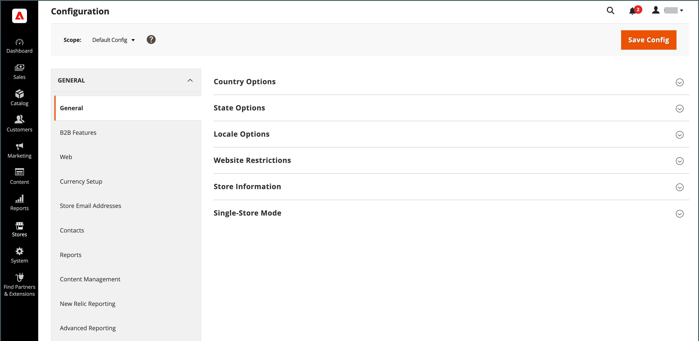

# Détails de la boutique

Les informations de base de votre boutique incluent le nom et l’adresse du magasin, le numéro de téléphone et l’adresse électronique qui apparaissent dans les emails, les factures et autres communications envoyés à vos clients.

{width="900" zoomable="yes"}

## [!UICONTROL Store Information]

La variable _[!UICONTROL Store Information]_fournit les informations de base qui apparaissent dans les documents de vente et dans d’autres communications.

1. Sur le _Administration_ barre latérale, accédez à **[!UICONTROL Stores]** > _[!UICONTROL Settings]_>**[!UICONTROL Configuration]**.

1. Sous **[!UICONTROL General]** dans le panneau de navigation de gauche, choisissez **[!UICONTROL General]**.

1. Développer  la valeur **[!UICONTROL Store Information]** .

   {width="700"}

1. Définissez les options en fonction des détails de votre boutique :

   - Saisissez le **[!UICONTROL Store Name]** que vous voulez utiliser dans toutes les communications.

   - Saisissez le **[!UICONTROL Store Phone Number]**, formaté selon l’affichage souhaité.

   - Pour **[!UICONTROL Store Hours of Operation]**, saisissez les heures d’ouverture de votre boutique. Par exemple: `Mon - Fri, 9-5, Sat 9-noon PST`.

   - Sélectionnez la variable **[!UICONTROL Country]** où se trouve votre entreprise.

   - Sélectionnez la variable **[!UICONTROL Region/State]** avec le pays.

   - Saisissez le **[!UICONTROL Store Address]**. Si l’adresse est longue, continuez en **Ligne d’adresse du magasin 2**.

   - Le cas échéant, saisissez la variable **[!UICONTROL VAT Number]** de votre magasin.

     Pour vérifier le nombre, cliquez sur le bouton **[!UICONTROL Validate VAT Number]** bouton . Pour en savoir plus, voir [Validation de l’ID de TVA](../stores-purchase/vat.md#vat-id-validation).

1. Lorsque vous avez terminé, cliquez sur **[!UICONTROL Save Config]**.

Pour plus d’informations sur les options de configuration des informations de magasin, voir [_Guide de référence de configuration_](../configuration-reference/general/general.md#store-information).

## [!UICONTROL Locale Options]

Le paramètre régional détermine la plupart des paramètres utilisés dans l’ensemble du magasin. En voici quelques-uns :

- Langue
- Pays
- Taux d&#39;imposition
- Devise
- Prix
- Format des nombres

Le paramètre régional détermine le fuseau horaire et la langue utilisés pour chaque magasin et identifie les jours de la semaine de travail dans la zone.

1. Sur le _Administration_ barre latérale, accédez à **[!UICONTROL Stores]** > _[!UICONTROL Settings]_>**[!UICONTROL Configuration]**.

1. Dans le panneau de navigation de gauche, sous **[!UICONTROL General]**, choisissez **[!UICONTROL General]**.

1. Développer  la valeur **[!UICONTROL Locale Options]** .

   {width="700"}

1. Sélectionnez votre **[!UICONTROL Timezone]** dans la liste.

1. Définir **[!UICONTROL Locale]** dans la langue du magasin.

1. Définir **[!UICONTROL Weight Unit]** à l’unité de mesure généralement utilisée pour les envois à partir de vos paramètres régionaux.

1. Définir **[!UICONTROL First Day of the Week]** au jour considéré comme le premier jour de la semaine dans votre région.

1. Dans le **[!UICONTROL Weekend Days]** sélectionnez les jours qui s’écoulent un week-end dans votre zone.

   Pour sélectionner plusieurs jours, maintenez la touche Ctrl (PC) ou la touche Commande (Mac) enfoncée, puis cliquez sur chaque élément.

1. Lorsque vous avez terminé, cliquez sur **[!UICONTROL Save Config]**.

Pour plus d’informations sur les options de configuration des paramètres régionaux, voir [Guide de référence de configuration](../configuration-reference/general/general.md#locale-options).

## [!UICONTROL State Options]

Dans de nombreux pays, l’État, la province ou la région est une partie obligatoire d’une adresse postale. Ces informations sont utilisées pour les informations d’expédition et de facturation, pour le calcul des taux d’imposition, etc. Pour les pays où l’état n’est pas obligatoire, le champ peut être entièrement omis de l’adresse ou inclus comme champ facultatif.

Comme les formats d’adresse standard varient d’un pays à l’autre, vous pouvez également modifier le modèle utilisé pour formater l’adresse pour les factures, les bordereaux d’emballage et les libellés de livraison.

1. Sur le _Administration_ barre latérale, accédez à **[!UICONTROL Stores]** > _[!UICONTROL Settings]_>**[!UICONTROL Configuration]**.

1. Sous **[!UICONTROL General]** dans le panneau de navigation de gauche, choisissez **[!UICONTROL General]**.

1. Développer  la valeur **[!UICONTROL State Options]** .

   {width="700"}

1. Utilisez la variable **[!UICONTROL State is required for]** pour sélectionner chaque pays dans lequel la région/l’état est une entrée obligatoire.

1. Définir **[!UICONTROL Allow to Choose State if it is Optional for Country]** à l’une des options suivantes :

   `Yes` - Dans les pays où le champ Etat n&#39;est pas obligatoire, inclut le champ Etat en tant qu&#39;entrée facultative.

   `No` - Dans les pays où le champ Etat n’est pas obligatoire, omet le champ Etat .

1. Lorsque vous avez terminé, cliquez sur **[!UICONTROL Save Config]**.

Pour plus d’informations sur les options de configuration de l’état, voir [Guide de référence de configuration](../configuration-reference/general/general.md#state-options).

## [!UICONTROL Country Options]

Les options de pays identifient le pays dans lequel votre entreprise se trouve et les pays d’où vous acceptez le paiement.

### Définition des options de pays pour votre magasin

1. Sur le _Administration_ barre latérale, accédez à **[!UICONTROL Stores]** > _[!UICONTROL Settings]_>**[!UICONTROL Configuration]**.

1. Dans le panneau de navigation de gauche, sous **[!UICONTROL General]**, choisissez **[!UICONTROL General]**.

1. Développer  la valeur **[!UICONTROL Country Options]** .

   >[!NOTE]
   >
   >Si nécessaire, effacez la variable **[!UICONTROL Use system value]** pour chaque paramètre que vous souhaitez modifier.

   {width="700"}

1. Choisissez la **[!UICONTROL Default Country]** où se trouve votre entreprise.

1. Dans le **[!UICONTROL Allow Countries]** sélectionnez chaque pays à partir duquel vous acceptez des commandes.

   Par défaut, tous les pays de la liste sont sélectionnés. Pour sélectionner plusieurs pays, maintenez la touche Ctrl (PC) ou la touche Commande (Mac) enfoncée, puis cliquez sur chaque élément.

1. Utilisez la variable **[!UICONTROL Zip/Postal Code is Optional for]** pour sélectionner chaque pays dans lequel vous dirigez une entreprise qui ne nécessite pas l’inclusion d’un code postal dans l’adresse postale.

1. Dans le **[!UICONTROL European Union Countries]** sélectionnez, dans la liste, chaque pays de l’UE dans lequel vous dirigez une entreprise.

   Par défaut, tous les pays de l’UE sont sélectionnés. Pour sélectionner les pays dont vous avez besoin, maintenez la touche Ctrl (PC) ou la touche Commande (Mac) enfoncée et cliquez sur chaque élément.

1. Dans le **[!UICONTROL Top Destinations]** sélectionnez les pays principaux que vous ciblez pour les ventes.

1. Lorsque vous avez terminé, cliquez sur **[!UICONTROL Save Config]**.

### Définition des options de pays pour un mode de remise spécifique

Vous pouvez également configurer des frais d’expédition vers des pays spécifiques pour chaque offre [méthode de diffusion](../stores-purchase/delivery.md) (UPS, FedEx, etc.).

1. Sur le _Administration_ barre latérale, accédez à **[!UICONTROL Stores]** > _[!UICONTROL Settings]_>**[!UICONTROL Configuration]**.

1. Dans le panneau de navigation de gauche, développez **[!UICONTROL Sales]** et choisissez **[!UICONTROL Delivery Methods]**.

1. Sélectionnez le transporteur auquel vous souhaitez appliquer des pays spécifiques.

1. Pour **[!UICONTROL Ship to Applicable Countries]**, désélectionnez l’option **[!UICONTROL Use system value]** et sélectionnez l’option **[!UICONTROL Specific Countries]** .

1. Dans le **[!UICONTROL Top Destinations]** sélectionnez les pays principaux que vous ciblez pour l’expédition.

   {width="700"}

1. Lorsque vous avez terminé, cliquez sur **[!UICONTROL Save Config]**.

### Ressources de dépannage

Pour obtenir de l’aide sur le dépannage des problèmes de configuration des pays, voir : [!DNL Commerce] Prise en charge des articles de la base de connaissances :

- [Comment ajouter un pays](https://experienceleague.adobe.com/docs/commerce-knowledge-base/kb/how-to/how-to-add-a-new-country-to-magento-2.html)
- [countryId fourni n’existe pas](https://experienceleague.adobe.com/docs/commerce-knowledge-base/kb/support-tools/patches/v1-0-15/mdva-33393-magento-patch-provided-countryid-does-not-exist.html)

## [!UICONTROL Merchant Location]

Le paramètre Emplacement du site marchand est utilisé pour configurer [mode de paiement](../stores-purchase/payments.md). S’il n’existe aucune valeur pour ce paramètre, la variable [Pays par défaut](#uicontrol-country-options) est utilisé.

1. Sur le _Administration_ barre latérale, accédez à **[!UICONTROL Stores]** > _[!UICONTROL Settings]_>**[!UICONTROL Configuration]**.

1. Dans le panneau de navigation de gauche, développez **[!UICONTROL Sales]** et choisissez **[!UICONTROL Payment Methods]**.

1. Développer  la valeur **Emplacement commercial** et sélectionnez votre **[!UICONTROL Merchant Country]**.

   {width="600"}

1. Lorsque vous avez terminé, cliquez sur **[!UICONTROL Save Config]**.

Pour plus d’informations sur les options de configuration des méthodes de paiement, voir [Guide de référence de configuration](../configuration-reference/sales/payment-methods.md).

## Devise

Configuration de devise - Définit la base [currency](../stores-purchase/currency-configuration.md) et toute autre devise acceptée comme paiement. Établit également la connexion et le planning d&#39;import utilisés pour mettre à jour automatiquement les taux de change.

Symboles de devise - Définit la variable [symboles de devise](../stores-purchase/currency-configuration.md#step-5-customize-currency-symbols-optional) qui apparaissent dans les prix des produits et les documents de vente, tels que les commandes et les factures. [!DNL Commerce] prend en charge les devises de plus de 200 pays dans le monde.

Mise à jour des taux de change - Les taux de change peuvent être [mis à jour](../stores-purchase/currency-update.md) soit manuellement, soit importés dans votre boutique selon les besoins, soit selon un calendrier prédéfini.

Sélecteur de devise : si plusieurs devises sont disponibles, la variable [sélecteur de devise](../stores-purchase/currency.md) est disponible dans l’en-tête du magasin.

## [!UICONTROL Store Email Addresses]

Vous pouvez avoir jusqu’à cinq adresses électroniques différentes pour représenter des fonctions ou des services distincts pour chaque magasin ou affichage. Outre les identités d’email prédéfinies suivantes, vous pouvez configurer quelques identités personnalisées en fonction de vos besoins.

- Contact général
- représentant commercial
- Assistance clientèle

Chaque identité et son adresse électronique associée peuvent être associées à des messages électroniques automatisés spécifiques et apparaître comme l’expéditeur des messages électroniques envoyés depuis votre boutique.

### Étape 1 : configuration des adresses électroniques de votre domaine

Avant de pouvoir configurer des adresses électroniques pour le magasin, chacune d’elles doit être configurée en tant qu’adresse électronique valide pour votre domaine. Pour créer chaque adresse électronique nécessaire, suivez les instructions de votre administrateur de serveur ou de votre fournisseur d’hébergement de messagerie.

### Étape 2 : configurer les adresses électroniques de votre magasin

1. Sur le _Administration_ barre latérale, accédez à **[!UICONTROL Stores]** > _[!UICONTROL Settings]_>**[!UICONTROL Configuration]**.

1. Sous **[!UICONTROL General]** dans le panneau de navigation de gauche, choisissez **[!UICONTROL Store Email Addresses]**.

1. Développer  la valeur **[!UICONTROL General Contact]** et procédez comme suit :

   {width="600"}

   - Pour **[!UICONTROL Sender Name]**, saisissez le nom de la personne associée à l’identité Contact général qui apparaîtra comme expéditeur de tout email.

   - Pour **[!UICONTROL Sender Email]**, saisissez l’adresse électronique associée.

1. Répétez cette procédure pour chaque adresse électronique de magasin que vous prévoyez d’utiliser.

1. Lorsque vous avez terminé, cliquez sur **[!UICONTROL Save Config]**.

### Etape 3 : mise à jour de la configuration de l&#39;email de vente

Si vous utilisez des adresses électroniques personnalisées, veillez à mettre à jour la configuration de tout message électronique associé afin que l’identité correcte apparaisse comme expéditeur.

1. Dans le panneau de navigation de gauche, développez **[!UICONTROL Sales]** et choisissez **[!UICONTROL Sales Emails]**.

   La page comporte une section distincte pour chacun des éléments suivants :

   - Commande et commentaires des commandes
   - Commentaires sur les factures et les factures
   - Commentaires sur l’envoi et l’envoi
   - Note de crédit et commentaires de note de crédit
   - RMA, RMA Authorization, RMA Admin Comments et RMA Customer Comments  (Adobe Commerce uniquement)

1. Prise en main de **[!UICONTROL Order]**, développez la section de chaque message et assurez-vous que l’expéditeur correct est sélectionné.

   {width="600"}

1. Lorsque vous avez terminé, cliquez sur **[!UICONTROL Save Config]**.

Pour plus d’informations sur les options de configuration des emails de vente, voir la section [_Guide de référence de configuration_](../configuration-reference/sales/sales-emails.md).

## Formulaire de contact

La variable _Nous contacter_ dans le pied de page du magasin est un moyen facile pour les clients de rester en contact avec vous. Les clients peuvent remplir le formulaire pour envoyer un message à votre boutique. Un standard [!DNL Commerce] l’installation affiche la valeur par défaut _Nous contacter_ formulaire. Après l’envoi du formulaire, un message de remerciement s’affiche.

Il est important de comprendre que le formulaire de contact par défaut est généré directement à partir du code plutôt qu’à partir d’une page CMS.

{width="700"}

Le pied de page du magasin comprend un lien vers la page Nous contacter , disponible dans tout le magasin.

{width="700"}

Les exemples de données Luma incluent des informations supplémentaires sur la page Nous contacter , qui montrent comment personnaliser la page pour votre magasin.

{width="700"}

### Configurer le formulaire de contact

1. Sur le _Administration_ barre latérale, accédez à **[!UICONTROL Stores]** > _[!UICONTROL Settings]_>**[!UICONTROL Configuration]**.

1. Dans le panneau de navigation de gauche, sous **[!UICONTROL General]**, choisissez **[!UICONTROL Contacts]**.

1. Développer  la valeur **[!UICONTROL Contact Us]** section et définition **[!UICONTROL Enable Contact Us]** to `Yes`.

   {width="600"}

1. Développer  la valeur **[!UICONTROL Email Options]** et définissez les options de contact email :

   {width="600"}

   - Pour **[!UICONTROL Send Emails to]**, saisissez l’adresse électronique à laquelle les messages du formulaire de contact sont envoyés.

   - Définir **[!UICONTROL Email Sender]** à l’identité du magasin qui apparaît comme expéditeur du message à partir du formulaire de contact. Par exemple : courrier électronique personnalisé 2.

   - Définir **[!UICONTROL Email Template]** au modèle utilisé pour les messages envoyés à partir du formulaire de contact.

1. Lorsque vous êtes en concurrence, cliquez sur **[!UICONTROL Save Config]**.

### Personnalisation du contenu

Vous pouvez personnaliser le contenu dans la variable _Nous contacter_ formulaire pour répondre aux besoins de vos stratégies de magasin et de service client.

### Méthode 1 : utilisation d’exemples de données

Les exemples de données Luma incluent un _Coordonnées_ qui peut être personnalisé pour votre magasin. La variable `contact-us-info` [block](../content-design/blocks.md) peut être facilement modifié pour ajouter votre propre contenu à la page Nous contacter .

1. Sur le _Administration_ barre latérale, accédez à **[!UICONTROL Content]** > _[!UICONTROL Elements]_>**[!UICONTROL Blocks]**.

1. Recherchez le **[!UICONTROL Contact Us Info]** bloc dans la liste et ouvrez-le **[!UICONTROL Edit]** mode .

   {width="700"}

1. Au bas de la page bloquée, cliquez sur **[!UICONTROL Edit with Page Builder]**.

   {width="700"}

   >[!NOTE]
   >
   >Si vous avez [[!DNL Page Builder] disabled](../page-builder/setup.md#disable-dnl-page-builder), vous pouvez utiliser l’éditeur [barre d’outils](../content-design/editor.md) pour mettre le texte en forme, puis ajoutez [images](../content-design/editor-insert-image.md) et [links](../content-design/editor-insert-link.md).

1. Passez la souris sur le conteneur HTML pour afficher la boîte à outils et sélectionnez l’option _Paramètres_ (  ).

1. Modifiez le code du HTML en fonction des coordonnées de votre boutique, puis cliquez sur **[!UICONTROL Save]**.

   {width="700"}

1. Quitter le [!DNL Page Builder] évaluation et clic **[!UICONTROL Save Block]**.

### Méthode 2 : sans exemple de données

>[!IMPORTANT]
>
>À compter de la version 2.4.0, le formulaire de contact ne peut plus appeler dans un bloc CMS ou une page CMS. Toutes les personnalisations du formulaire de contact doivent être effectuées à l’aide du fichier xml de mise en page ou de modèles de thème personnalisés.

Par défaut, les acheteurs accèdent au formulaire de contact à l’aide du _Lien de contact_ dans le pied de page des pages storefront. Pour plus d&#39;informations sur la personnalisation de la page de contact, reportez-vous au [Guide du développeur de Frontend][theme-guide].

[theme-guide]: https://developer.adobe.com/commerce/frontend-core/guide/themes/
