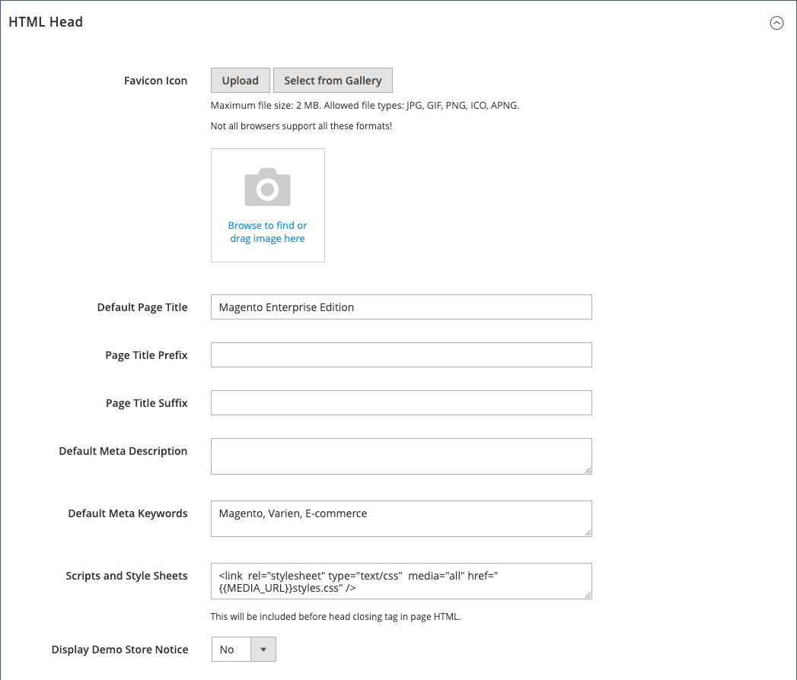

# Marque Storefront

Une des premières choses que vous souhaitez faire est de [modifier le logo](#upload-your-logo) dans l’en-tête et [télécharger une favicon](#add-a-favicon) pour le navigateur. Ensuite, vous devez [ajouter votre message de bienvenue](#change-the-welcome-message) et [mettre à jour l’avis de copyright](#change-the-copyright-notice) dans le pied de page. Ces tâches sont quelques éléments de conception simples dont vous pouvez vous occuper immédiatement. Pendant que votre magasin est en cours de développement, vous pouvez [activer l’avis de démonstration du magasin](#set-the-store-demo-notice), puis le supprimer lorsque vous êtes prêt à le lancer.

{width="600" zoomable="yes"}

## Télécharger votre logo

La taille et l’emplacement du logo dans l’en-tête sont déterminés par le thème de magasin. Votre logo peut être enregistré en tant que type de fichier GIF, PNG ou JPG (JPEG) et téléchargé depuis l’administrateur de votre boutique.

{width="600"}

L’image du logo se trouve à l’emplacement suivant sur le serveur. Tout fichier image portant le nom `logo.svg` est utilisé comme logo de thème par défaut.

Chemin complet - `app/design/frontend/[vendor]/[theme]/web/images/logo.svg`

Chemin relatif - `images/logo.svg`

Si vous ne connaissez pas la taille du logo ou des autres images utilisées dans votre thème, ouvrez la page dans un navigateur, cliquez avec le bouton droit de la souris sur l’image et examinez l’élément.

>[!NOTE]
>
>Outre le logo dans l’en-tête, votre logo apparaît également sur les [ modèles d’email ](../systems/email-templates.md#prepare-your-email-logo) et sur les [ factures PDF ](../stores-purchase/sales-documents.md) et autres documents de vente. Les logos utilisés pour les modèles d&#39;email et les factures ont des tailles différentes et doivent être téléchargés séparément.

Formats de fichiers de logo pris en charge :

| Format du fichier | Description |
|--- |--- |
| PNG | (Graphiques réseau mobiles) Cette nouvelle alternative au format de GIF prend en charge jusqu’à 16 millions de couleurs (24 bits). Le format de compression sans perte produit une image bitmap de haute qualité avec du texte clair, mais un fichier plus volumineux que certains formats. Le format PNG prend en charge les calques transparents et est conçu pour l’affichage en ligne et la diffusion en continu. |
| GIF | (Format d’échange graphique) Format bitmap plus ancien et largement pris en charge, limité à 256 couleurs (8 bits). Le format de GIF prend en charge l’animation simple et les calques transparents. |
| JPG (JPEG) | (Groupe d’experts photographiques interarmées) Format bitmap compressé utilisé par la plupart des appareils photo numériques. La compression avec perte entraîne une perte de données, qui est parfois perceptible sous la forme de zones floues dans le texte. |

{style="table-layout:auto"}

1. Sur la barre latérale _Admin_, accédez à **[!UICONTROL Content]** > _[!UICONTROL Design]_>**[!UICONTROL Configuration]**.

   {width="700"}

1. Recherchez la vue de magasin que vous souhaitez configurer et cliquez sur **[!UICONTROL Edit]** dans la colonne _[!UICONTROL Action]_.

1. Développez la section  sur **[!UICONTROL Header]** .

   {width="600"}

1. Pour charger un nouveau logo, cliquez sur **[!UICONTROL Upload]** et sélectionnez le fichier sur votre système.

1. Saisissez les **[!UICONTROL Logo Image Width]** et **[!UICONTROL Logo Image Height]** en pixels.

1. Pour **[!UICONTROL Logo Image Alt]**, saisissez le texte que vous souhaitez afficher lorsque quelqu’un survole l’image.

1. Une fois l’opération terminée, cliquez sur **[!UICONTROL Save Configuration]**.

## Ajout d’une favicon

_Favicon_ est une abréviation de _icône préférée_ et fait référence à la petite icône dans l’onglet de chaque page de navigateur. Selon le navigateur, l’icône favicon s’affiche également dans la barre d’adresse, juste avant l’URL.

Une favicon fait généralement 16 x 16 pixels ou 32 x 32 pixels de taille. [!DNL Commerce] accepte les types de fichiers ICO, PNG, APNG, GIF et JPG (JPEG), bien que tous les navigateurs ne prennent pas en charge ces formats. Le format de fichier le plus souvent pris en charge pour une favicon est ICO. Vous pouvez utiliser d’autres types de fichiers image, mais le format peut ne pas être pris en charge par tous les navigateurs. Il existe de nombreux outils gratuits en ligne que vous pouvez utiliser pour générer une image ICO ou convertir une image dans ce format.

{width="600"}

[!DNL Commerce] prend en charge les formats de fichiers suivants en tant que favicon :

| Format du fichier | Description |
|--- |--- |
| ICO | Ce format de fichier image est conçu pour les images d’icônes d’ordinateur de petite taille. Principalement utilisé sous Microsoft® Windows OS, le format ICO peut contenir des images de 256 x 256 pixels et 16 millions de couleurs (24 bits) avec 8 bits de transparence. |
| PNG | (Graphiques réseau mobiles) Cette nouvelle alternative au format de GIF prend en charge jusqu’à 16 millions de couleurs (24 bits). Le format de compression sans perte produit une image bitmap de haute qualité avec du texte clair, mais un fichier plus volumineux que certains formats. Le format PNG prend en charge les calques transparents et est conçu pour l’affichage en ligne et la diffusion en continu. |
| APNG | (Animated Portable Network Graphics) Format de fichier similaire au format PNG qui prend en charge l’animation simple. |
| GIF | (Format d’échange graphique) Format bitmap plus ancien et largement pris en charge, limité à 256 couleurs (8 bits). Le format de GIF prend en charge l’animation simple et les calques transparents. |
| JPG (JPEG) | (Groupe d’experts photographiques interarmées) Format bitmap compressé utilisé par la plupart des appareils photo numériques. La compression avec perte entraîne une perte de données, qui est parfois perceptible sous la forme de zones floues dans le texte. |

{style="table-layout:auto"}

### Étape 1 : création d’une favicon

1. A l’aide de l’éditeur d’image de votre choix, créez une image graphique de votre logo 16 x 16 ou 32 x 32.

1. (Facultatif) Utilisez l’un des outils en ligne disponibles pour convertir le fichier au format .ico et enregistrer le fichier sur votre ordinateur.

### Étape 2 : téléchargement de la favicon vers votre boutique

1. Sur la barre latérale _Admin_, accédez à **[!UICONTROL Content]** > _[!UICONTROL Design]_>**[!UICONTROL Configuration]**.

1. Dans la grille, recherchez la vue de magasin que vous souhaitez configurer et cliquez sur **[!UICONTROL Edit]** dans la colonne _[!UICONTROL Action]_.

1. Sous _[!UICONTROL Other Settings]_, développez la section  sur **[!UICONTROL HTML Head]**.

   {width="600"}

1. Si vous souhaitez supprimer l’icône de favicon actuelle, cliquez sur l’icône _Supprimer_ () dans le coin inférieur gauche de l’image.

1. Cliquez sur **[!UICONTROL Upload]** et ouvrez le fichier favicon que vous avez préparé.

   {width="400"}

1. Une fois l’opération terminée, cliquez sur **[!UICONTROL Save Configuration]**.

### Étape 3 : Actualisation du cache

1. Lorsque vous êtes invité à actualiser le cache, cliquez sur le lien **[!UICONTROL Cache Management]** dans le message situé en haut de l’espace de travail.

1. Dans la liste, cochez la case **[!UICONTROL Page Cache]** qui est marquée `Invalidated`.

1. Définissez **[!UICONTROL Actions]** sur `Refresh` et cliquez sur **[!UICONTROL Submit]**.

1. Pour afficher la nouvelle favicon, revenez à votre vitrine et actualisez le navigateur.

## Modifier le message de bienvenue

Le message de bienvenue dans l’en-tête se développe afin d’inclure le nom du client connecté. Avant de lancer votre boutique, veillez à modifier le texte par défaut _Bienvenue_ pour chaque vue de magasin.

{width="600"}

1. Sur la barre latérale _Admin_, accédez à **[!UICONTROL Content]** > _[!UICONTROL Design]_>**[!UICONTROL Configuration]**.

1. Dans la grille, recherchez la vue de magasin que vous souhaitez configurer et cliquez sur **[!UICONTROL Edit]** dans la colonne _[!UICONTROL Action]_.

1. Sous _[!UICONTROL Other Settings]_, développez la section  sur **[!UICONTROL Header]**.

1. Pour **[!UICONTROL Welcome Text]**, saisissez le texte du message de bienvenue que vous souhaitez afficher dans l’en-tête de votre boutique.

   {width="600"}

1. Une fois l’opération terminée, cliquez sur **[!UICONTROL Save Configuration]**.

1. Lorsque vous êtes invité à mettre à jour le cache de page, cliquez sur le lien **[!UICONTROL Cache Management]** situé en haut de l’espace de travail et suivez les instructions pour actualiser le cache.

## Modification de la notification de copyright

Votre boutique affiche un avis de copyright dans le pied de page de chaque page. En règle générale, la mention de copyright doit inclure l’année en cours et identifier votre société comme propriétaire légal du contenu sur le site.

{width="600"}

Le code de caractère `&copy;` est utilisé pour insérer le symbole de copyright, comme illustré dans les exemples suivants :

- Exemple de format long

  `Copyright &copy; 2013-present Luma, Inc. All rights reserved.`

- Exemple de format court

  `&copy; 2021 Luma, Inc. All rights reserved.`

**_Pour mettre à jour l&#39;avis de copyright :_**

1. Sur la barre latérale _Admin_, accédez à **[!UICONTROL Content]** > _[!UICONTROL Design]_>**[!UICONTROL Configuration]**.

1. Dans la grille, recherchez la vue de magasin que vous souhaitez configurer et cliquez sur **[!UICONTROL Edit]** dans la colonne _[!UICONTROL Action]_.

1. Sous _Other Settings_, développez la section **[!UICONTROL Footer]** .

   {width="600"}

1. Pour **[!UICONTROL Copyright]**, saisissez la notification de copyright que vous souhaitez afficher dans le pied de page de chaque page.

   Utilisez le code de caractère `&copy;` pour insérer un symbole de copyright.

1. Une fois l’opération terminée, cliquez sur **[!UICONTROL Save Configuration]**.

## Définition de l’avis de démonstration du magasin

Si votre boutique est en ligne, mais qu’elle est toujours en construction, vous pouvez afficher un avis de démonstration en haut de la page pour informer les utilisateurs que la boutique n’est pas encore ouverte pour les besoins professionnels. Lorsque vous êtes prêt à _publier_, supprimez simplement le message. Elle est similaire à l’inversion du panneau suspendu dans la fenêtre de _Fermé_ à _Ouvert_. Le format de l’avis de démonstration est déterminé par le thème de votre magasin.

{width="600"}

1. Sur la barre latérale _Admin_, accédez à **[!UICONTROL Content]** > _[!UICONTROL Design]_>**[!UICONTROL Configuration]**.

1. Dans la grille, recherchez la vue de magasin que vous souhaitez configurer et cliquez sur **[!UICONTROL Edit]** dans la colonne _[!UICONTROL Action]_.

1. Sous _[!UICONTROL Other Settings]_, développez la section  sur **[!UICONTROL HTML Head]**.

   {width="600"}

1. Faites défiler l’écran vers le bas et définissez **[!UICONTROL Display Demo Store Notice]** sur vos préférences.

1. Une fois l’opération terminée, cliquez sur **[!UICONTROL Save Configuration]**.

1. Si vous êtes invité à mettre à jour le cache, cliquez sur **[!UICONTROL Cache Management]** dans le message système et suivez les instructions pour actualiser le cache.
