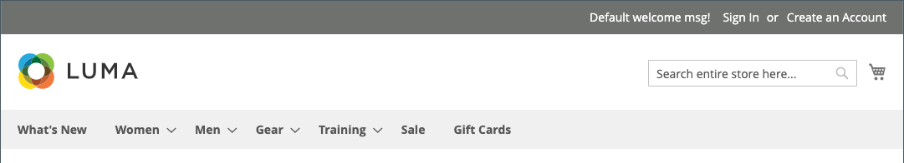
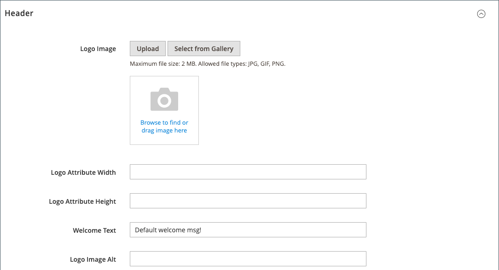
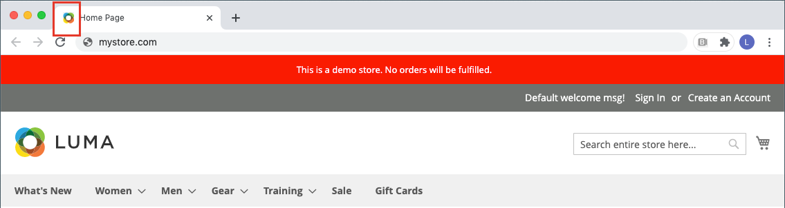
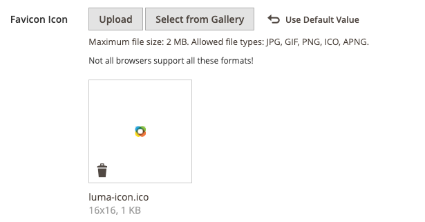
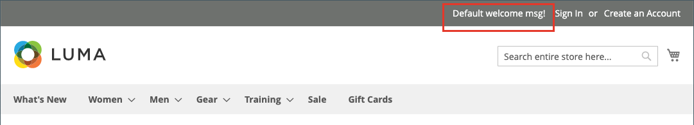
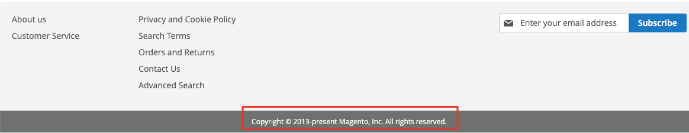
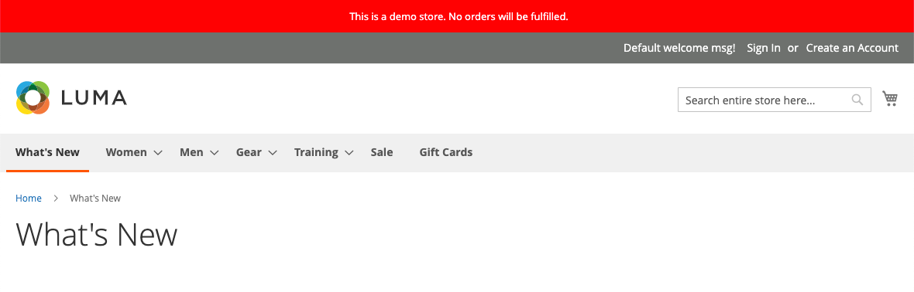

# Image de marque de Storefront

L’une des premières choses à faire est de [modifier le logo](#upload-your-logo) dans l’en-tête et [télécharger une favicon](#add-a-favicon) pour le navigateur. Ensuite, vous devez [ajouter votre message de bienvenue](#change-the-welcome-message) et [mettre à jour l’avis de copyright](#change-the-copyright-notice) dans le pied de page. Ces tâches ne sont que quelques éléments de conception simples dont vous pouvez vous occuper immédiatement. Pendant le développement de votre boutique, vous pouvez [activer l’avis de démonstration de la boutique](#set-the-store-demo-notice), puis le supprimer lorsque vous êtes prêt à lancer.

{width="600" zoomable="yes"}

## Téléchargez votre logo

La taille et l’emplacement du logo dans l’en-tête sont déterminés par le thème du magasin. Votre logo peut être enregistré en tant que type de fichier GIF, PNG ou JPG (JPEG) et téléchargé à partir de l’administration de votre boutique.

{width="600"}

L’image du logo se trouve à l’emplacement suivant sur le serveur. Tout fichier image portant le nom `logo.svg` est utilisé comme logo de thème par défaut.

Chemin complet - `app/design/frontend/[vendor]/[theme]/web/images/logo.svg`

Chemin relatif - `images/logo.svg`

Si vous ne connaissez pas la taille du logo ou des autres images utilisées dans votre thème, ouvrez la page dans un navigateur, cliquez avec le bouton droit sur l’image et inspectez l’élément.

>[!NOTE]
>
>En plus du logo dans l’en-tête, votre logo apparaît également sur les [modèles d’e-mail](../systems/email-templates.md#prepare-your-email-logo) et sur les [factures PDF](../stores-purchase/sales-documents.md) ainsi que sur d’autres documents de vente. Les logos utilisés pour les modèles d’e-mail et les factures ont des exigences de taille différentes et doivent être téléchargés séparément.

Formats de fichiers de logo pris en charge :

| Format du fichier | Description |
|--- |--- |
| PNG | (Carte graphique réseau portable) Cette nouvelle alternative au format GIF prend en charge jusqu’à 16 millions de couleurs (24 bits). Le format de compression sans perte produit une image bitmap de haute qualité avec un texte clair, mais une taille de fichier plus grande que certains formats. Le format PNG prend en charge les calques transparents et est conçu pour l’affichage en ligne et la diffusion en continu. |
| GIF | (Graphics Interchange Format) Format bitmap ancien et largement pris en charge, limité à 256 couleurs (8 bits). Le format GIF prend en charge l’animation simple et les calques transparents. |
| JPG (JPEG) | (Joint Photographic Expert Group) Format bitmap compressé utilisé par la plupart des appareils photo numériques. La compression avec perte entraîne une perte de données, qui est parfois perceptible sous la forme de points flous dans le texte. |

{style="table-layout:auto"}

1. Dans la barre latérale _Admin_, accédez à **[!UICONTROL Content]** > _[!UICONTROL Design]_>**[!UICONTROL Configuration]**.

   {width="700"}

1. Recherchez la vue de magasin que vous souhaitez configurer, puis cliquez sur **[!UICONTROL Edit]** dans la colonne _[!UICONTROL Action]_.

1. Développez  la section **[!UICONTROL Header]** .

   {width="600"}

1. Pour télécharger un nouveau logo, cliquez sur **[!UICONTROL Upload]** et sélectionnez le fichier sur votre système.

1. Saisissez le **[!UICONTROL Logo Image Width]** et le **[!UICONTROL Logo Image Height]** en pixels.

1. Par **[!UICONTROL Logo Image Alt]**, saisissez le texte qui doit apparaître lorsqu’une personne survole l’image avec la souris.

1. Cliquez ensuite sur **[!UICONTROL Save Configuration]**.

## Ajouter une favicon

_Favicon_ est l’abréviation de _icône préférée_ et fait référence à la petite icône dans l’onglet de chaque page du navigateur. Selon le navigateur, la favicon apparaît également dans la barre d’adresse, juste avant l’URL.

Une favicon a généralement une taille de 16 x 16 pixels ou de 32 x 32 pixels. [!DNL Commerce] accepte les types de fichiers ICO, PNG, APNG, GIF et JPG (JPEG), bien que tous les navigateurs ne prennent pas en charge ces formats. Le format de fichier le plus répandu à utiliser pour un favicon est ICO. Vous pouvez utiliser d’autres types de fichiers image, mais le format peut ne pas être pris en charge par tous les navigateurs. Il existe de nombreux outils gratuits en ligne que vous pouvez utiliser pour générer une image ICO ou convertir une image dans ce format.

{width="600"}

[!DNL Commerce] prend en charge les formats de fichiers suivants en tant que favicon :

| Format du fichier | Description |
|--- |--- |
| ICO | Ce format de fichier image est conçu pour les images d’icône d’ordinateur de petite taille. Principalement utilisé sous ® Windows OS, le format ICO peut contenir des images de 256 x 256 pixels maximum et 16 millions de couleurs (24 bits) avec 8 bits de transparence. |
| PNG | (Carte graphique réseau portable) Cette nouvelle alternative au format GIF prend en charge jusqu’à 16 millions de couleurs (24 bits). Le format de compression sans perte produit une image bitmap de haute qualité avec un texte clair, mais une taille de fichier plus grande que certains formats. Le format PNG prend en charge les calques transparents et est conçu pour l’affichage en ligne et la diffusion en continu. |
| APNG | (Animated Portable Network Graphics) Format de fichier similaire au format PNG prenant en charge l’animation simple. |
| GIF | (Graphics Interchange Format) Format bitmap ancien et largement pris en charge, limité à 256 couleurs (8 bits). Le format GIF prend en charge l’animation simple et les calques transparents. |
| JPG (JPEG) | (Joint Photographic Expert Group) Format bitmap compressé utilisé par la plupart des appareils photo numériques. La compression avec perte entraîne une perte de données, qui est parfois perceptible sous la forme de points flous dans le texte. |

{style="table-layout:auto"}

### Étape 1 : créer une favicon

1. À l’aide de l’éditeur d’image de votre choix, créez une image graphique de votre logo de 16 x 16 ou 32 x 32.

1. (Facultatif) Utilisez l’un des outils en ligne disponibles pour convertir le fichier au format .ico et enregistrez le fichier sur votre ordinateur.

### Étape 2 : Chargez la favicon dans votre boutique

1. Dans la barre latérale _Admin_, accédez à **[!UICONTROL Content]** > _[!UICONTROL Design]_>**[!UICONTROL Configuration]**.

1. Dans la grille, recherchez la vue de magasin que vous souhaitez configurer, puis cliquez sur **[!UICONTROL Edit]** dans la colonne _[!UICONTROL Action]_.

1. Sous _[!UICONTROL Other Settings]_, développez  la section **[!UICONTROL HTML Head]**.

   {width="600"}

1. Si vous souhaitez supprimer la favicon active, cliquez sur l’icône _Supprimer_ () dans le coin inférieur gauche de l’image.

1. Cliquez sur **[!UICONTROL Upload]** et ouvrez le fichier favicon que vous avez préparé.

   {width="400"}

1. Cliquez ensuite sur **[!UICONTROL Save Configuration]**.

### Étape 3 : actualiser le cache

1. Lorsque vous êtes invité à actualiser le cache, cliquez sur le lien **[!UICONTROL Cache Management]** dans le message en haut de l’espace de travail.

1. Dans la liste, cochez la case **[!UICONTROL Page Cache]** qui est `Invalidated`.

1. Définissez **[!UICONTROL Actions]** sur `Refresh`, puis cliquez sur **[!UICONTROL Submit]**.

1. Pour afficher la nouvelle favicon, revenez à votre storefront et actualisez le navigateur.

## Modifier le message de bienvenue

Le message de bienvenue dans l’en-tête se développe pour inclure le nom du client connecté. Avant de lancer votre boutique, veillez à modifier le texte par défaut _Bienvenue_ pour chaque affichage de la boutique.

{width="600"}

1. Dans la barre latérale _Admin_, accédez à **[!UICONTROL Content]** > _[!UICONTROL Design]_>**[!UICONTROL Configuration]**.

1. Dans la grille, recherchez la vue de magasin que vous souhaitez configurer, puis cliquez sur **[!UICONTROL Edit]** dans la colonne _[!UICONTROL Action]_.

1. Sous _[!UICONTROL Other Settings]_, développez  la section **[!UICONTROL Header]**.

1. Par **[!UICONTROL Welcome Text]**, saisissez le texte du message de bienvenue que vous souhaitez afficher dans l’en-tête de votre boutique.

   {width="600"}

1. Cliquez ensuite sur **[!UICONTROL Save Configuration]**.

1. Lorsque vous êtes invité à mettre à jour le cache de page, cliquez sur le lien **[!UICONTROL Cache Management]** en haut de l’espace de travail et suivez les instructions pour actualiser le cache.

## Modification de l’avis de copyright

Votre boutique affiche un avis de copyright dans le pied de page de chaque page. En règle générale, l’avis de copyright doit inclure l’année en cours et identifier votre entreprise comme propriétaire légal du contenu du site.

{width="600"}

Le code de caractère `&copy;` est utilisé pour insérer le symbole de copyright, comme illustré dans les exemples suivants :

- Exemple de format long

  `Copyright &copy; 2013-present Luma, Inc. All rights reserved.`

- Exemple de format court

  `&copy; 2021 Luma, Inc. All rights reserved.`

**_Pour mettre à jour la notification de copyright:_**

1. Dans la barre latérale _Admin_, accédez à **[!UICONTROL Content]** > _[!UICONTROL Design]_>**[!UICONTROL Configuration]**.

1. Dans la grille, recherchez la vue de magasin que vous souhaitez configurer, puis cliquez sur **[!UICONTROL Edit]** dans la colonne _[!UICONTROL Action]_.

1. Sous _Autres paramètres_, développez  dans la section **[!UICONTROL Footer]**.

   {width="600"}

1. Par **[!UICONTROL Copyright]**, saisissez l’avis de copyright que vous souhaitez afficher dans le pied de page de chaque page.

   Utilisez le code de caractère `&copy;` pour insérer un symbole de copyright.

1. Cliquez ensuite sur **[!UICONTROL Save Configuration]**.

## Définir l’avis de démonstration du magasin

Si votre magasin est en ligne, mais est toujours en construction, vous pouvez afficher un avis de démonstration en haut de la page pour informer les gens que le magasin n&#39;est pas encore ouvert. Lorsque vous êtes prêt à _publier_, il vous suffit de supprimer le message. Cela revient à retourner le panneau qui pend dans la fenêtre de _Fermé_ à _Ouvert_. Le format de l’avis de démonstration est déterminé par le thème de votre boutique.

{width="600"}

1. Dans la barre latérale _Admin_, accédez à **[!UICONTROL Content]** > _[!UICONTROL Design]_>**[!UICONTROL Configuration]**.

1. Dans la grille, recherchez la vue de magasin que vous souhaitez configurer, puis cliquez sur **[!UICONTROL Edit]** dans la colonne _[!UICONTROL Action]_.

1. Sous _[!UICONTROL Other Settings]_, développez  la section **[!UICONTROL HTML Head]**.

   {width="600"}

1. Faites défiler jusqu’en bas et définissez le **[!UICONTROL Display Demo Store Notice]** selon vos préférences.

1. Cliquez ensuite sur **[!UICONTROL Save Configuration]**.

1. Si vous êtes invité à mettre à jour le cache, cliquez sur **[!UICONTROL Cache Management]** dans le message système et suivez les instructions pour actualiser le cache.
