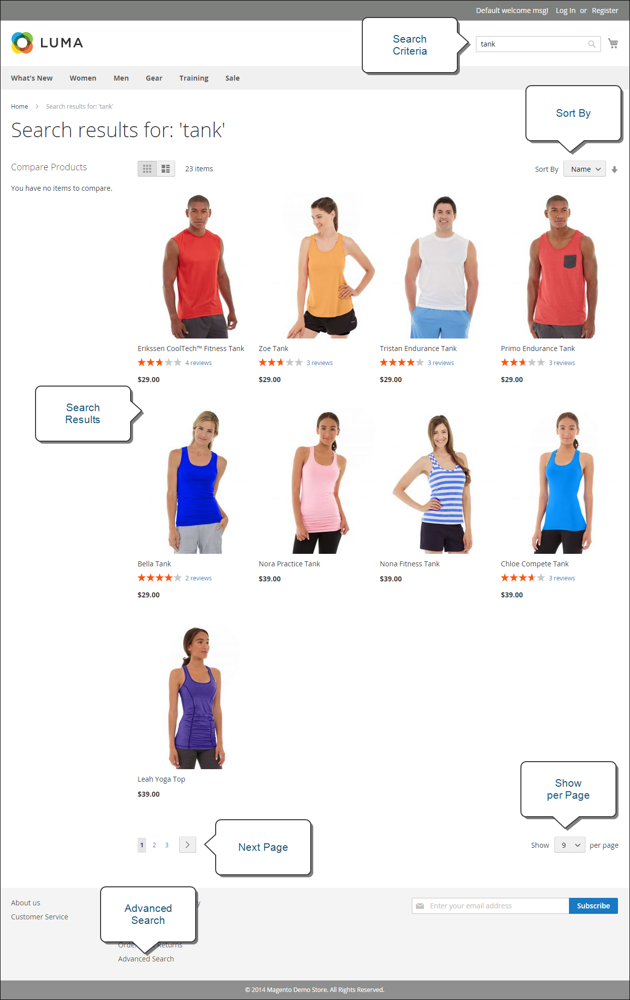

# Quelle est la devanture ?

Dans votre mise en œuvre Adobe Commerce ou Magento Open Source, le storefront est la partie externe de votre boutique destinée au public. Il fournit le contenu et les composants fonctionnels que vos clients utilisent pour acheter et acheter.

Le chemin emprunté par les clients pour conclure une vente est parfois appelé le _chemin d’accès à l’achat_, et votre storefront inclut les composants permettant aux clients de terminer ce chemin. Les sections suivantes présentent un aperçu des types de page de base qui offrent une valeur stratégique, à savoir les endroits que les clients visitent généralement lors de leurs achats dans votre magasin. En les examinant, tenez compte des différentes fonctions de magasin qui peuvent être utilisées à chaque étape du parcours client.

## Page d’accueil

Saviez-vous que la plupart des gens ne passent que quelques secondes sur une page avant de décider de rester ou d&#39;aller ailleurs ? Il n&#39;est pas long de faire une impression. Des études montrent que les gens aiment aussi les photos, surtout celles des autres. Quel que soit le design que vous choisissez, tout ce qui se trouve sur votre page d&#39;accueil devrait faire passer les visiteurs à l&#39;étape suivante du processus de vente. L&#39;idée est de guider leur attention dans un flux cohérent d&#39;un point d&#39;intérêt à l&#39;autre.

{width="700"}

## Page Catalogue

Les listes des pages de catalogue comportent généralement de petites images de produit et de brèves descriptions. Elles peuvent être formatées sous la forme d’une liste ou d’une grille. Vous pouvez ajouter des blocs, des vidéos et des descriptions riches en mots-clés, ainsi que créer des conceptions spéciales pour une promotion ou une saison. Vous pouvez créer une catégorie spéciale pour mettre en avant un style de vie ou une marque constituée d’une collection sélectionnée de produits de différentes catégories.

La description initiale du produit donne généralement aux acheteurs suffisamment d’informations pour mériter un examen plus approfondi. Les personnes qui savent ce qu’elles veulent peuvent ajouter le produit à leur panier et s’en aller. Les clients qui magasinent tout en étant connectés à leur compte bénéficient d’une expérience d’achat personnalisée.

{width="700"}

## Résultats de la recherche

Saviez-vous que les personnes qui utilisent la recherche sont près de deux fois plus susceptibles de faire un achat que les personnes qui dépendent uniquement de la navigation ? Vous pouvez considérer ces acheteurs comme _pré-qualifié_.

### [!DNL Live Search]

Avec [[!DNL Live Search]](https://experienceleague.adobe.com/docs/commerce-merchant-services/live-search/overview.html) pour Adobe Commerce, votre boutique offre une expérience de recherche rapide, très pertinente et intuitive, et est disponible pour Adobe Commerce sans frais supplémentaires.

{width="700"}

### Recherche catalogue standard

Avec [recherche catalogue standard](../catalog/search.md), votre boutique comprend une zone Rechercher dans le coin supérieur droit et un lien vers la Recherche avancée dans le pied de page. Tous les termes de recherche que les acheteurs envoient sont enregistrés, afin que vous puissiez voir exactement ce qu’ils recherchent. Vous pouvez faire des suggestions et saisir des synonymes et des fautes d&#39;orthographe courantes. Affichez ensuite une page spécifique lors de la saisie d’un terme de recherche.

{width="700"}

## Page produit

La page produit a beaucoup de choses en cours ! La première chose qui attire votre attention sur la page produit est l’image principale avec un zoom et une galerie de miniatures haute résolution. En plus du prix et de la disponibilité, il y a une section à onglets avec plus d&#39;informations et une liste des produits associés.

{width="700"}

## Panier

Le panier est l&#39;endroit où le total des commandes peut être déterminé, ainsi que des coupons de réduction et une estimation de l&#39;expédition et de la taxe, et un endroit idéal pour afficher vos badges de confiance et vos sceaux. C&#39;est aussi l&#39;occasion idéale d&#39;offrir un dernier article. Dans le cadre d’une vente croisée, vous pouvez sélectionner certains articles à proposer en tant qu’achat impulsif chaque fois qu’un article spécifique apparaît dans le panier.

{width="700"}

## Page de passage en caisse

Le processus de passage en caisse se compose de deux étapes :

1. Informations sur l’expédition

   La première étape du processus de passage en caisse consiste pour le client à compléter les informations d’adresse de livraison et à choisir le mode de livraison. Si le client possède un compte, l&#39;adresse de livraison est saisie automatiquement, mais peut être modifiée si nécessaire.
Si un client invité saisit une adresse e-mail reconnue comme précédemment enregistrée, l’invite de connexion s’affiche si le [!UICONTROL Enable Guest Checkout Login] le champ dans la configuration du magasin est défini sur `Yes` (voir [[!UICONTROL Checkout Options]](../configuration-reference/sales/checkout.md#checkout-options) dans le _Guide de référence de configuration_). Cependant, ce paramètre peut exposer les informations du client à des utilisateurs non authentifiés.

   {width="700"}

1. Informations sur la révision et le paiement

   La deuxième étape du processus de passage en caisse consiste pour le client à choisir le mode de paiement et éventuellement à appliquer un code d’escompte.

   >[!NOTE]
   >
   >Bien que [!DNL Commerce] permet de configurer plusieurs codes de coupon. Un client ne peut appliquer qu’un seul code de coupon au panier. (Voir [Codes de coupon](../merchandising-promotions/price-rules-cart-coupon.md#coupon-codes) pour plus d’informations.)

   {width="700"}

La barre de progression en haut de la page suit chaque étape du processus de passage en caisse, et la _Récapitulatif de la commande_ affiche les informations saisies jusqu’à ce point.

>[!NOTE]
>
>L’exception à la procédure de passage en caisse en deux étapes s’applique aux produits virtuels et/ou téléchargeables. Si le panier ne contient que ces types de produits, le passage en caisse est automatiquement transformé en une procédure en une seule étape, car les informations d’expédition ne sont pas requises.
