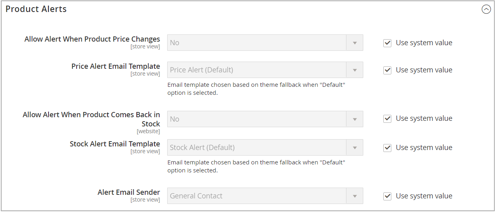

# Alertes de produits

Les clients peuvent s’abonner à deux types d’alertes par e-mail : les alertes de changement de prix et les alertes en stock. Pour chaque type d’alerte, vous pouvez déterminer si les clients peuvent s’abonner, sélectionner le modèle d’e-mail utilisé et identifier l’expéditeur de l’e-mail.

{width="600" zoomable="yes"}

## Alertes de changement de prix

Lorsque les alertes de modification de prix sont activées, un lien _M’avertir lorsque le prix baisse_ s’affiche sur chaque page de produit. Les clients peuvent cliquer sur le lien pour s’abonner aux alertes relatives au produit. Les clients sont invités à ouvrir un compte dans votre boutique. Chaque fois que le prix change ou que le produit passe en mode spécial, toute personne abonnée à l’alerte reçoit une alerte par e-mail.

## Alertes en stock

L’alerte en stock crée un lien appelé _Avertissez-moi lorsque ce produit est en stock_ pour chaque produit en rupture de stock. Les clients peuvent cliquer sur le lien pour s’abonner à l’alerte. Lorsque le produit est de nouveau en stock, les clients reçoivent une notification par e-mail les informant que le produit est disponible. Les produits comportant des alertes comportent un onglet _Alertes produit_ dans le panneau Informations sur le produit qui répertorie les clients qui se sont abonnés à une alerte.

{width="600" zoomable="yes"}

## Configurer des alertes de produit

1. Dans la barre latérale _Admin_, accédez à **[!UICONTROL Stores]** > _[!UICONTROL Settings]_>**[!UICONTROL Configuration]**.

1. Dans le panneau de gauche, développez **[!UICONTROL Catalog]** et choisissez **[!UICONTROL Catalog]** en dessous.

1. Cliquez pour développer la section _[!UICONTROL Product Alerts]_&#x200B;et procédez comme suit :

   {width="600" zoomable="yes"}

   - Pour proposer des alertes de modification de prix à vos clients, définissez **[!UICONTROL Allow Alert When Product Price Changes]** sur `Yes`.

   - Définissez **[!UICONTROL Price Alert Email Template]** sur le modèle à utiliser pour les notifications d&#39;alerte de prix.

   - Pour envoyer des alertes lorsque des produits en rupture de stock sont à nouveau disponibles, définissez **[!UICONTROL Allow Alert When Product Comes Back in Stock]** sur `Yes`.

     >[!NOTE]
     >
     >Le message _M’avertir lorsque ce produit est en stock_ s’affiche uniquement lorsque **[!UICONTROL Display Out of Stock Products]** est défini sur `Yes` (dans la Configuration sous [!UICONTROL Catalog] > [!UICONTROL Inventory]).

   - Définissez **[!UICONTROL Stock Alert Email Template]** sur le modèle à utiliser pour les alertes de stock de produits.

   - Définissez **[!UICONTROL Alert Email Sender]** sur le [&#x200B; contact de magasin &#x200B;](../getting-started/store-details.md#store-email-addresses){target="_blank"} que vous souhaitez afficher en tant qu’expéditeur de l’alerte par e-mail. Pour en savoir plus sur le [stockage des adresses e-mail](../configuration-reference/general/store-email-addresses.md){target="_blank"}, consultez le guide d’utilisation principal.

1. Cliquez ensuite sur **[!UICONTROL Save Config]**.

## Configurer des modèles d’e-mail d’alertes de produits

Ensuite, configurez, ajoutez ou modifiez le modèle d’e-mail pour votre alerte de prix. Vous pouvez modifier vos configurations d’alerte de prix après avoir créé des modèles supplémentaires.

Pour plus d’informations sur l’utilisation des e-mails, voir [Modèles de message](../systems/email-template-custom.md#message-templates) dans le _Guide des systèmes d’administration_.

1. Dans la barre latérale _Admin_, accédez à **[!UICONTROL Marketing]** > _[!UICONTROL Communications]_>**[!UICONTROL Email Templates]**.

1. Cliquez sur **[!UICONTROL Add New Template]**.

1. Sous _Charger le modèle par défaut_, sélectionnez le **[!UICONTROL Template]** à personnaliser.

   Vous pouvez choisir le modèle d’alerte inclus dans votre thème. Vous pouvez également sélectionner les modèles `Price Alert` ou `Stock Alert` sous _[!UICONTROL Magento_PriceAlert]_.

1. Cliquez sur **[!UICONTROL Load Template]**.

1. Saisissez un **[!UICONTROL Template Name]**.

   Vous pouvez sélectionner ce nom dans la configuration _Alertes de prix_.

1. Lisez le contenu existant et apportez les modifications nécessaires aux éléments suivants :

   | Champ | Description |
   | ----- | ----- |
   | [!UICONTROL Template Subject] | Ce texte est affiché dans l’objet d’un e-mail. |
   | [!UICONTROL Template Content] | Ce texte est affiché dans le contenu complet de l’e-mail envoyé. |

1. Pour ajouter des informations générées à partir de données [!DNL Commerce], utilisez l’option **[!UICONTROL Insert Variable]** pour utiliser une liste de variables disponibles.

1. Cliquez sur **[!UICONTROL Save Template]**.

## Paramètres d’exécution de l’alerte du produit

Ces paramètres vous permettent de sélectionner la fréquence à laquelle [!DNL Commerce] recherche les modifications qui nécessitent l’envoi d’alertes. Vous pouvez également sélectionner le destinataire, l’expéditeur et le modèle des e-mails envoyés en cas d’échec de l’envoi des alertes.

{width="600" zoomable="yes"}

1. Dans la barre latérale _Admin_, accédez à **[!UICONTROL Stores]** > _[!UICONTROL Settings]_>**[!UICONTROL Configuration]**.

1. Dans le panneau de gauche, développez **[!UICONTROL Catalog]** et choisissez **[!UICONTROL Catalog]** en dessous.

1. Développez  la section **[!UICONTROL Product Alerts Run Settings]** .

1. Pour déterminer la fréquence d’envoi des alertes de produit, définissez **[!UICONTROL Frequency]** sur l’une des options suivantes :

   - `Daily`
   - `Weekly`
   - `Monthly`

1. Pour déterminer l’heure d’envoi des alertes de produit, définissez **[!UICONTROL Start Time]** sur l’heure, la minute et la seconde.

   >[!NOTE]
   >
   >Les alertes de produits sont envoyées par le client « product_alert ».

1. Par **[!UICONTROL Error Email Recipient]**, saisissez l’adresse e-mail de la personne à contacter en cas d’erreur.

1. Pour le **[!UICONTROL Error Email Sender]** , sélectionnez l’identité du magasin qui apparaît comme expéditeur de la notification d’erreur.

1. Définissez la **[!UICONTROL Error Email Template]** sur le modèle d’e-mail transactionnel à utiliser pour la notification d’erreur.

1. Cliquez ensuite sur **[!UICONTROL Save Config]**.
