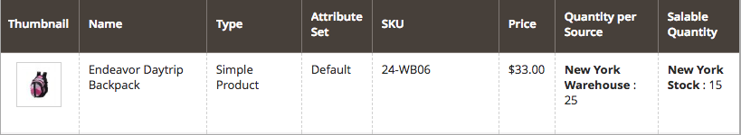

# Configuration des commandes arrière [!DNL Inventory Management]

Les commandes en arrière-plan permettent à votre boutique de continuer à vendre des produits lorsque la quantité atteint zéro ou qu’elle est effectivement en rupture de stock. Lorsqu’une commande client est un backorder, les fonds sont autorisés et capturés immédiatement, l’état de traitement de la commande ne change pas et l’expédition reste en attente jusqu’à ce que le stock soit disponible.

Selon votre boutique et vos ventes, vous pouvez activer ou désactiver les commandes en arrière-plan aux niveaux suivants :

- **[!UICONTROL Global]** - Tous les produits de votre catalogue au niveau du site

- **[!UICONTROL Product]** - Produits spécifiques remplaçant les paramètres du site, de la source et du stock

## Présentation des paramètres d’ordre arrière-plan

Il est vivement recommandé de configurer des seuils et des paramètres spécifiques afin de mieux prendre en charge les commandes d’arrière-plan.

### Seuil en rupture de stock

Utilisez une valeur négative pour ce seuil afin de définir la quantité maximale de produits qui peuvent être commandés en amont avant que le produit ne soit réellement considéré comme en rupture de stock. Ce montant s’ajoute à la quantité vendable. La valeur définie au niveau du produit remplace toute valeur définie au niveau global.

La formule pour la quantité vendable est `(Quantity - (Out-of-Stock Threshold))`.

Voici un exemple :

- Quantité : 25
- Informer pour la quantité inférieure à : 10
- Seuil gauche X seulement : 5
- Seuil en rupture de stock : -50

La quantité vendable pour ce produit est `75 (25 - (-50))`.

{width="600" zoomable="yes"}

{width="600" zoomable="yes"}

Lorsque les clients achètent les 25 produits disponibles, les nouvelles commandes entrent en tant que commandes en amont. Comme la quantité commercialisable du produit est réduite à 5 (70 articles ont été vendus), la page _Produit_ affiche un message `Only 5 left` sur le storefront. Lorsque la quantité vendable atteint `0`, le produit est affiché sous la forme `Out of Stock` dans le storefront.

>[!NOTE]
>
>Lorsqu&#39;un client passe une commande à l&#39;aide de _[!UICONTROL backorder qty]_, [!DNL Inventory Management] soustrait automatiquement la quantité de la quantité venable. Si une commande n’est pas expédiée et est annulée, la quantité est renvoyée à la quantité vendue virtuelle agrégée. La **_quantité de commande annulée n’est affectée à aucune des sources_**, mais est renvoyée au nombre total de produits disponibles à la vente (_[!UICONTROL Salable Quantity]_ colonne sur la grille de produits).

<!--### Notify for Quantity Below JIRA MDVA-8099 MDVA-33783

The _Notify for Quantity Below_ configuration option is configurable at the global, source, and product levels. When it is enabled, the system sends an email notification when the product quantity reaches a level at or below the configured value. For this example, a notification is triggered when the product has a quantity of 10 or less. When backorders are enabled, _Notify for Quantity Below_ is determined by the Salable Quantity (`Salable Quantity = Quantity - (Out-of-Stock Threshold)`). -->

### Etat des stocks

Les produits doivent être définis sur l’état `In Stock` lors de l’activation des commandes en arrière-plan. Vous pouvez définir cette valeur à partir de la page _Product_. Pour les marchands multi-sources, vous devez avoir au moins une source marquée comme `In Stock`. Accédez à la page _Produit_ et définissez son état, puis attribuez-lui la grille _Sources_.

## Configuration globale des commandes d’arrière-plan

Ces étapes permettent d’activer les commandes en arrière-plan pour tous les produits au niveau du site.

1. Sur la barre latérale _Admin_, accédez à **[!UICONTROL Stores]** > _[!UICONTROL Settings]_>**[!UICONTROL Configuration]**.

1. Définissez **[!UICONTROL Store View]** sur `Default Config`.

1. Dans le panneau de gauche, développez **[!UICONTROL Catalog]** et choisissez **[!UICONTROL Inventory]**.

1. Développez  **[!UICONTROL Product Stock Options]**.

1. Pour **[!UICONTROL Backorders]**, désélectionnez la case **[!UICONTROL Use system value]** et sélectionnez une option :

   | Option | Description |
   | -- | -- |
   | `No Backorders` | Ne pas accepter les commandes en arrière-plan lorsque le produit est en rupture de stock. |
   | `Allow Qty Below 0` | Accepter les commandes en arrière-plan lorsque la quantité est inférieure à zéro. |
   | `Allow Qty Below 0 and Notify Customer` | Pour accepter les commandes en arrière-plan lorsque la quantité est inférieure à zéro et informer le client que la commande peut toujours être passée. |

1. Pour **[!UICONTROL Out-of-Stock Threshold]**, désélectionnez la case **[!UICONTROL Use system value]** et saisissez un autre montant.

   | Valeur | Description |
   | -- | -- |
   | Montant positif | Lorsque l’option Commandes d’arrière-plan est désactivée, saisissez une valeur positive. |
   | Zéro | Lorsque les commandes d’arrière-plan sont activées, la saisie de `0` permet des commandes d’arrière-plan infinies. |
   | Montant négatif | Lorsque les commandes d’arrière-plan sont activées, il est recommandé de saisir une valeur négative. Le montant est ajouté à la quantité vendable. Par exemple, saisissez `-50` pour autoriser les commandes jusqu’à ce montant. |

1. Cliquez sur **[!UICONTROL Save Config]**.

## Configuration des commandes en arrière-plan d’un produit

Les configurations au niveau du produit remplacent les configurations globales. Vous pouvez configurer des commandes en arrière-plan au niveau du produit pour remplacer les paramètres au niveau du magasin global ou de la source. Par exemple, votre boutique peut prendre en charge globalement les commandes en arrière-plan. Avec les paramètres de produit, vous pouvez désactiver les commandes en arrière-plan ou modifier le seuil d’rupture de stock sans affecter d’autres produits et sources.

1. Sur la barre latérale _Admin_, accédez à **[!UICONTROL Catalog]** > **[!UICONTROL Products]**.

1. Ouvrez un produit en mode **[!UICONTROL Edit]** et faites défiler la page vers le bas jusqu’à la zone _[!UICONTROL Sources]_.

   Pour les produits configurés sans [!DNL Inventory Management], l’onglet n’apparaît pas. Le bouton `Advanced Inventory` s’affiche sous le champ _[!UICONTROL Quantity]_.

1. Cliquez sur **[!UICONTROL Advanced Inventory]**.

   Cette action affiche une page de configurations spécifiques à un produit. Tout paramètre répertorié comme `global` affiche le paramètre global actuel pour le magasin.

1. Pour **[!UICONTROL Backorders]**, désélectionnez la case **[!UICONTROL Use Config Setting]** et sélectionnez une option :

   | Option | Description |
   | -- | -- |
   | `No Backorders` | Ne pas accepter les commandes en arrière-plan lorsque le produit est en rupture de stock. |
   | `Allow Qty Below 0` | Accepter les commandes en arrière-plan lorsque la quantité est inférieure à zéro. |
   | `Allow Qty Below 0 and Notify Customer` | Accepter les commandes en arrière-plan lorsque la quantité est inférieure à zéro et informer le client que la commande peut toujours être passée. |

1. Pour **[!UICONTROL Out-of-Stock Threshold]**, désélectionnez la case **[!UICONTROL Use Config Setting]** et saisissez un montant :

   | Valeur | Description |
   | -- | -- |
   | Montant positif | Lorsque l’option Commandes d’arrière-plan est désactivée, saisissez une valeur positive. |
   | Zéro | Lorsque les commandes d’arrière-plan sont activées, la saisie de `0` permet des commandes d’arrière-plan infinies. |
   | Montant négatif | Lorsque les commandes d’arrière-plan sont activées, il est recommandé de saisir une valeur négative. Le montant est ajouté à la quantité vendable. Par exemple, saisissez `-50` pour autoriser les commandes jusqu’à ce montant. |

   {width="600" zoomable="yes"}

1. Cliquez sur **[!UICONTROL Done]**, puis sur **[!UICONTROL Save]**.
