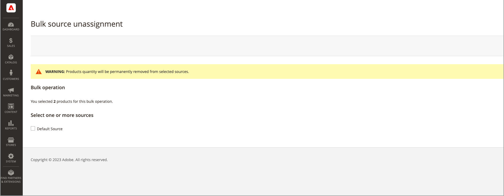

# Affectation et annulation d’affectation de source en bloc

Utilisez l’outil _Attribuer des sources_ pour ajouter une ou plusieurs sources à vos produits. Cet outil vous aide à créer et à affecter des sources personnalisées à vos stocks par défaut ou personnalisés et à préparer de nouveaux emplacements et stocks.

Après avoir ajouté de nouvelles sources personnalisées, vous pouvez ajouter des [quantités d’inventaire par produit](quantities-assign-per-product.md) ou pour plusieurs produits via Admin ou à l’aide de la fonction [importation](inventory-import-export.md).

## Attribuer des sources et des quantités

1. Dans la barre latérale _Admin_, accédez à **[!UICONTROL Catalog]** > **[!UICONTROL Products]**.

1. Sélectionnez les produits pour lesquels vous souhaitez modifier les sources.

   Recherchez ou recherchez les produits et cochez ces cases.

1. Cliquez sur le menu **[!UICONTROL Actions]** en haut et choisissez **[!UICONTROL Assign Inventory Source]**.

1. Cliquez sur **[!UICONTROL OK]** dans la boîte de dialogue de confirmation.

1. Pour toutes les sources que vous souhaitez ajouter aux produits, cochez les cases.

1. Cliquez sur **[!UICONTROL Assign Sources]**.

   {width="600" zoomable="yes"}

Les sources sont ajoutées aux produits avec une quantité en stock de 0. Vous pouvez ajouter [quantités en stock](quantities-assign-per-product.md) par origine.

## Annuler l&#39;affectation des sources et des quantités

Lorsque vous annulez l’affectation d’une source à un produit, vous indiquez que le produit n’est plus en stock à cet emplacement. Ce processus efface complètement toutes les données d&#39;inventaire pour la source actuellement affectée au produit. Si vous souhaitez déplacer le stock existant vers un nouvel emplacement, pensez à utiliser l&#39;option _Transférer le stock_.

{{$include /help/_includes/unassign-source.md}}

Il est vivement recommandé de terminer toutes les commandes et expéditions de ces produits avant de supprimer la source.

1. Dans la barre latérale _Admin_, accédez à **[!UICONTROL Catalog]** > **[!UICONTROL Products]**.

1. Sélectionnez les produits pour lesquels vous souhaitez modifier les sources.

   Recherchez ou recherchez les produits et cochez ces cases.

1. Cliquez sur le menu **[!UICONTROL Actions]** en haut et choisissez **[!UICONTROL Unassign Inventory Source]**.

1. Cliquez sur **[!UICONTROL OK]** dans la boîte de dialogue de confirmation.

1. Sélectionnez la source à supprimer des produits.

   La page affiche une alerte indiquant que l’annulation de l’affectation supprime toutes les données de source et de quantité spécifiques du produit.

1. Cliquez sur **[!UICONTROL Unassign Sources]**.

   {width="600" zoomable="yes"}

<!-- Last updated from includes: 2022-08-30 15:36:09 -->
