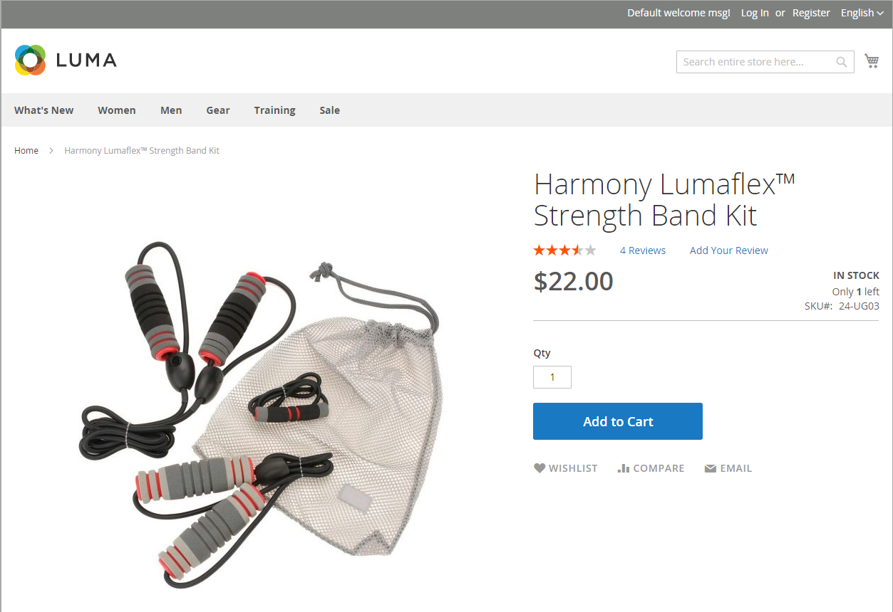

# Configurer [!DNL Inventory Management]

Le module [!DNL Inventory Management] prend en charge les paramètres de configuration de l&#39;inventaire au niveau du produit et au niveau global et fournit également des paramètres supplémentaires qui affectent la disponibilité de la source, les produits du storefront et l&#39;expédition des commandes. Les paramètres de configuration s’appliquent aux éléments suivants :

- L&#39;ensemble du catalogue : Accédez à **[!UICONTROL Stores]** > _[!UICONTROL Settings]_>**[!UICONTROL Configuration]**. Ensuite, développez **[!UICONTROL Catalog]**&#x200B;dans le panneau de gauche et sélectionnez **[!UICONTROL Inventory]**.

- Produits spécifiques : Accédez à **[!UICONTROL Catalog]** > **[!UICONTROL Products]**. Ouvrez ensuite le produit en mode d’édition et cliquez sur **[!UICONTROL Advanced Inventory]** dans la section _[!UICONTROL Sources]_.

Votre catalogue peut être configuré pour afficher les données d’inventaire dans votre storefront, gérer les paniers actifs, etc. Affichez la disponibilité de chaque article comme _En stock_ ou _En rupture de stock_ et le stock disponible lorsque le stock est faible.

Le seuil de rupture de stock indique quand un produit doit être récommandé, soustrait de la quantité vendable pour un stock et peut être défini pour prendre en charge les reliquats activés ou désactivés. Autorisez les reliquats pour votre magasin, en définissant une quantité maximale de commandes pour tous les produits ou pour des produits spécifiques.

Vous pouvez également utiliser le seuil de disponibilité du stock pour gérer les produits qui sont en forte demande. Si vous voulez capturer de nouveaux clients, plutôt que de vendre à des acheteurs en grande quantité, vous pouvez définir une quantité maximale pour empêcher un acheteur unique de retirer la totalité de vos stocks.

## Options de configuration

Les magasins et produits [!DNL Commerce] prennent en charge les configurations suivantes pour la gestion des produits, des stocks, des notifications, etc. [!DNL Commerce] fournit des paramètres de configuration supplémentaires pour les actions en masse et l’algorithme de priorité de distance.

| Option | Description |
|--|--|
| [!UICONTROL Manage Stock] | Permet aux [!DNL Commerce] de gérer tous les stocks. Définit si le contrôle de stock est utilisé pour ce produit ou pour tous les produits en [!DNL Commerce]. Affiche plus d’options lorsqu’elles sont définies sur `Yes`. |
| [!UICONTROL Only X left Threshold] | Définit une quantité à notifier lorsqu’un montant spécifique reste disponible à l’achat. Ce montant est suivi au niveau des stocks. |
| [!UICONTROL Out-of-Stock Threshold] | Votre stock de sécurité, Quantité pour déclencher une notification de rupture de stock et pour atténuer le risque de rupture de stock. Cette valeur affecte les reliquats. Options :  **[!UICONTROL No Backorders]**: n&#39;accepte pas les reliquats lorsque le produit est en rupture de stock. **[!UICONTROL Allow Qty Below 0]** : accepte les reliquats lorsque la quantité est inférieure à zéro. **[!UICONTROL Allow Qty Below 0 and Notify Customer]**: accepte les reliquats lorsque la quantité est inférieure à zéro, mais informe les clients que des commandes peuvent toujours être passées.  **[!UICONTROL Backorders disabled]** : il est recommandé de saisir une valeur positive supérieure à 0, telle que 5 ou 25.  **[!UICONTROL Backorders enabled]**: Entrez un seuil négatif pour la quantité maximale de reliquats autorisés, par exemple -5 ou -25. Une valeur égale à 0 agit comme un stock infini. Une valeur positive est ignorée et traitée comme 0. |
| [!UICONTROL Minimum Qty Allowed in Shopping Cart] | Définit la quantité minimale du produit pouvant être acheté en une seule commande. |
| [!UICONTROL Maximum Qty Allowed in Shopping Cart] | Définit la quantité maximale de produit pouvant être achetée dans une seule commande. |
| [!UICONTROL Qty Uses Decimals] | Permet des quantités décimales, au lieu de nombres entiers, pour la quantité d&#39;un produit. Ce paramètre est utile pour les produits vendus par poids, volume ou longueur. Spécifié au niveau de Source, calculé au niveau des stocks en fonction des sources attribuées. |
| [!UICONTROL Allow Multiple Boxes for Shipping] | Détermine si des parties d&#39;un produit peuvent être expédiées séparément. Cette option est visible lorsque **[!UICONTROL Qty Uses Decimals]** = `Yes`. |
| [!UICONTROL Backorders] | Indique si les reliquats sont autorisés. Spécifié au niveau de Source, calculé au niveau des stocks en fonction des sources attribuées. Si cette option est activée pour autoriser les reliquats, il est recommandé de définir une valeur négative pour le seuil de rupture de stock (voir [Configuration des reliquats](backorders.md)). Options :  **[!UICONTROL No Backorders]**: n&#39;accepte pas les reliquats lorsque le produit est en rupture de stock. **[!UICONTROL Allow Qty Below 0]** : accepte les reliquats lorsque la quantité est inférieure à zéro. **[!UICONTROL Allow Qty Below 0 and Notify Customer]**: accepte les reliquats lorsque la quantité est inférieure à zéro, mais informe les clients que des commandes peuvent toujours être passées. |
| [!UICONTROL Notify for Quantity Below] | Définit la quantité qui déclenche une notification Quantité en dessous, signalant un stock faible. Ce montant est déduit de la quantité commercialisable, et non de la quantité en stock. |
| [!UICONTROL Enable Qty Increments] | Détermine si le produit peut être vendu par incréments de quantité. Si cette option est activée, saisissez la quantité de produits à acheter lors d&#39;une étape incrémentielle. Les incréments définissent le nombre d’articles à acheter en tant que produit unique, et en tant qu’enfant de produits configurables, groupés et groupés. |
| [!UICONTROL Automatically Return Credit Memo Item to Stock] | [!DNL Inventory Management] n’utilise pas cette valeur. Lorsque vous effectuez un retour ou un avoir, la quantité de produit est automatiquement renvoyée à la quantité d&#39;origine affectée. Voir [Configuration des options du produit](product-options.md). |

## Restauration et héritage de la configuration

Les configurations remplacent ou s’appliquent dans le chemin d’accès suivant de l’héritage : la section _[!UICONTROL Sources]_&#x200B;du produit remplace la configuration globale du magasin de&#x200B;_[!UICONTROL Inventory]_ de produit _[!UICONTROL Advanced Options]_&#x200B;remplace la configuration globale du magasin de produits.

Lorsque [!DNL Commerce] vérifie les paramètres personnalisés à appliquer, l’ordre suit :

1. Recherche les paramètres personnalisés au niveau du produit dans la section _[!UICONTROL Sources]_. Quelques paramètres sont disponibles.

1. Vérifie les paramètres de _[!UICONTROL Advanced Inventory]_&#x200B;du produit.

1. Si `Use Config Settings` est sélectionné pour les paramètres du produit, il vérifie une valeur de la page de configuration de magasin globale _Inventaire_.

Par exemple, vous pouvez configurer les commandes en souffrance différemment dans votre magasin avec une configuration similaire à celle-ci :

- _Globalement :_activez les reliquats pour le magasin, définissez le seuil de rupture de stock sur `-50`

- _Product :_Désactive les reliquats pour un produit spécifique, définissez le seuil de rupture de stock sur `10`
