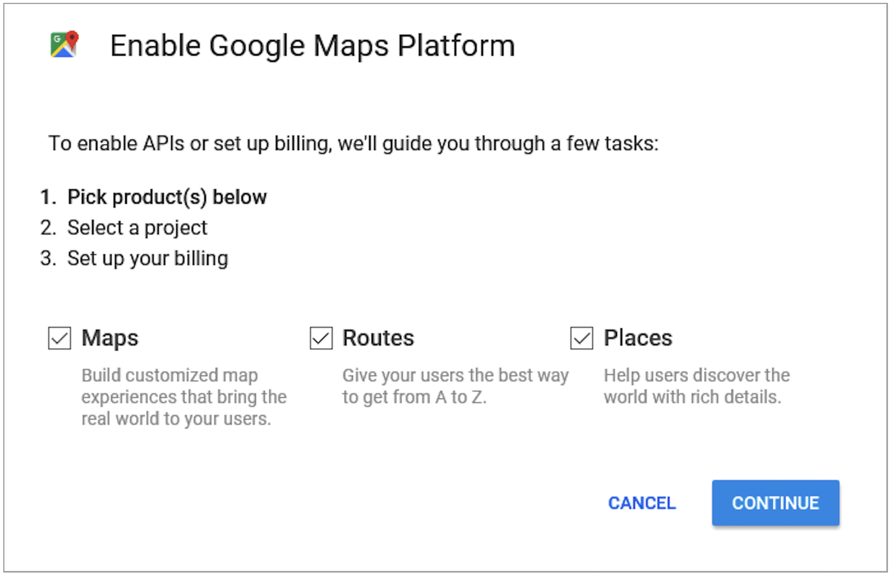
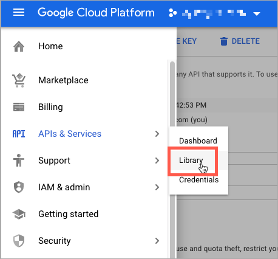

# Configuration de l&#39;algorithme de priorité de distance

L&#39;algorithme de priorité de distance compare l&#39;emplacement de l&#39;adresse de destination d&#39;expédition avec les emplacements source afin de déterminer la source la plus proche pour exécuter les expéditions. La distance peut être déterminée par la distance physique ou le temps passé à voyager d&#39;un emplacement à un autre, en utilisant des données de base de données ou des instructions de conduite, de marche ou de vélo. Utilisez cet [algorithme de sélection Source](selection-reservations.md) pour recommander la source la plus proche des adresses de destination d&#39;expédition.

>[!NOTE]
>
>Si vous utilisez l&#39;algorithme de priorité de distance, il est recommandé de saisir l&#39;adresse et les coordonnées GPS complètes de vos [sources](sources-add.md).

Vous disposez de deux options pour calculer la distance et le temps pour trouver la source la plus proche pour l&#39;exécution de l&#39;expédition :

- **Google MAP** - Utilise les services de [Google Maps Platform](https://cloud.google.com/maps-platform/) pour calculer la distance et le temps entre l’adresse de destination d’expédition et les emplacements source. Cette option utilise la latitude et la longitude de la source (coordonnées GPS) et peut utiliser l’adresse postale en fonction du mode de calcul. Une clé d’API Google est requise avec les fonctions [API Geocoding](https://developers.google.com/maps/documentation/geocoding/start) et [API Distance Matrix](https://developers.google.com/maps/documentation/distance-matrix/start) activées, et vous pouvez encourir des frais via Google.

- **Calcul hors ligne** - Calcule la distance à l’aide de données géocodées téléchargées et importées à l’aide de codes postaux et de coordonnées GPS afin de déterminer la source la plus proche de l’adresse de destination d’expédition. Pour configurer cette option, vous pouvez avoir besoin de l’aide d’un développeur pour télécharger et importer initialement des géocodes à l’aide d’instructions de ligne de commande.

>[!NOTE]
>
>Pour un site web multi-magasin comportant plusieurs pays, configurez la [&#x200B; destination fiscale par défaut &#x200B;](../stores-purchase/tax-class.md#default-tax-destination){target="_blank"} pour chaque pays.

## Utiliser les cartes Google

Vous n’avez pas besoin de compte Google pour commencer. Le processus comprend la création d’un compte Google et d’un projet, si nécessaire. Cette option nécessite l’ajout d’un compte de facturation et d’un mode de paiement à votre compte Google pour terminer les configurations et utiliser l’algorithme.
Cependant, l’algorithme basé sur la distance du mappage Google est recommandé comme étant plus avancé et plus précis que le calcul hors ligne.

### Étape 1 : création de la clé API Google

La clé provient de la plateforme [Google Maps](https://cloud.google.com/maps-platform/) et doit avoir les options [API de géocodage](https://developers.google.com/maps/documentation/geocoding/start) et [API de matrice de distance](https://developers.google.com/maps/documentation/distance-matrix/start) activées. Pour plus d&#39;informations, voir [Configuration de l&#39;algorithme de priorité de distance](distance-priority-algorithm.md).

1. Rendez-vous sur la plateforme [Google Maps](https://cloud.google.com/maps-platform/) et cliquez sur **[!UICONTROL Get Started]**.

1. Pour activer la plateforme, sélectionnez **[!UICONTROL Maps, Routes, and Places]** et cliquez sur **[!UICONTROL Continue]**.

   {width="350" zoomable="yes"}

1. Connectez-vous avec un compte Google ou créez un compte.

1. Configurer un projet :

   - Sélectionnez un projet ou saisissez un nouveau nom de projet.

   - Pour accepter les conditions, sélectionnez `Yes`.

   - Cliquez sur **[!UICONTROL Next]**.

1. Saisissez ou créez un compte de facturation. Vous pouvez ignorer cette étape et ajouter un compte de facturation ultérieurement.

   Un compte de facturation est nécessaire pour utiliser ce service.

1. Pour ouvrir et configurer les options de votre plateforme cloud Google, cliquez sur **[!UICONTROL Console]**.

   - Ouvrez votre projet.

   - Développez le menu et cliquez sur **[!UICONTROL APIs & Services]** > **[!UICONTROL Library]**.

     {width="350" zoomable="yes"}

   - Recherchez [API de géocodage](https://developers.google.com/maps/documentation/geocoding/start) et [API de matrice de distance](https://developers.google.com/maps/documentation/distance-matrix/start). Sélectionnez et activez chaque service.

1. Développez le menu, cliquez sur **[!UICONTROL APIs & Services]** > **[!UICONTROL Credentials]**, puis copiez la clé API Google.

   {width="350" zoomable="yes"}

### Étape 2 : configuration du fournisseur de carte Google

1. Dans la barre latérale _Admin_, accédez à **[!UICONTROL Stores]** > _[!UICONTROL Settings]_>**[!UICONTROL Configuration]**.

1. Dans le panneau de gauche, développez **[!UICONTROL Catalog]** et choisissez **[!UICONTROL Inventory]**.

1. Développez  la section _[!UICONTROL Distance Provider for Distance Based SSA]_&#x200B;et définissez **[!UICONTROL Provider]**&#x200B;sur `Google MAP`.

   {width="350" zoomable="yes"}

1. Développez  la section _[!UICONTROL Google Distance Provider]_&#x200B;et configurez les paramètres :

   - Par **[!UICONTROL Google API Key]**, saisissez la clé copiée à partir de votre compte Google.

   - Par **[!UICONTROL Computation mode]**, sélectionnez une configuration.

     >[!NOTE]
     >
     >Lors de l’utilisation de cet algorithme pour l’expédition, si les itinéraires et les données ne sont pas renvoyés pour le mode de calcul sélectionné (conduite, bicyclette ou marche) pour une expédition, la SSA utilise par défaut la priorité Source. Il est recommandé de définir la [&#x200B; priorité des sources par stock &#x200B;](stocks-prioritize-sources.md).

     | Option | Description |
     | ----- | ----- |
     | `Driving` | (Par défaut) Demande des directions de conduite standard en utilisant le réseau routier. |
     | `Walking` | Demande d&#39;itinéraires en empruntant des sentiers piétonniers et des trottoirs (le cas échéant). |
     | `Bicycling` | Demande des itinéraires cyclables en utilisant les pistes cyclables et les rues préférées (le cas échéant). Le service [Distance Matrix](https://developers.google.com/maps/documentation/javascript/distancematrix#travel_modes) n&#39;est offert qu&#39;aux États-Unis et dans certaines villes canadiennes. |

   - Par **[!UICONTROL Value]**, sélectionnez un type de valeur :

     | Option | Description |
     | ----- | ----- |
     | `Distance` | (Par défaut) Renvoie la distance entre les points en mesures (kilomètres et mètres) ou impériale (milles et pieds). |
     | `Time to Destination` | Renvoie le temps nécessaire pour voyager des emplacements source à l’adresse d’expédition en heures et minutes. |

   {width="350" zoomable="yes"}

1. Cliquez ensuite sur **[!UICONTROL Save Config]**.

## Utiliser le calcul hors ligne

Les calculs hors ligne utilisent des codes pays pour déterminer la distance entre la destination d’expédition et les adresses source. Cette option peut nécessiter l’aide d’un développeur pour la configuration. Utilisez une commande d’interface de ligne de commande [!DNL Inventory Management] pour télécharger et importer des données à partir de [geonames.org](https://www.geonames.org/).

>[!NOTE]
>
>Les géocodes importés de [geonames.org](https://www.geonames.org/) présentent des limitations pour certains pays, tels que le Canada et l&#39;Irlande. Pour plus d’informations, voir [Fichiers de code postal GeoNames](https://download.geonames.org/export/zip/readme.txt).

### Étape 1 : Télécharger et importer des géocodes

Configuration complète de la ligne de commande pour télécharger et importer les géocodes des pays vers lesquels les expédier et les emplacements sources dans. Cette étape peut nécessiter l’aide du développeur pour les tâches de ligne de commande. Pour plus d&#39;informations, consultez la section [Importer des géocodes](cli.md#import-geocodes).

Exécutez ces commandes dès que vous souhaitez ajouter d&#39;autres géocodes.

### Etape 2 : paramétrer le calcul

1. Dans la barre latérale _Admin_, accédez à **[!UICONTROL Stores]** > _[!UICONTROL Settings]_>**[!UICONTROL Configuration]**.

1. Dans le panneau de gauche, développez **[!UICONTROL Catalog]** et choisissez **[!UICONTROL Inventory]**.

1. Développez  la section _[!UICONTROL Distance Provider for Distance Based SSA]_.

1. Décochez la case **[!UICONTROL Use system value]** et définissez **[!UICONTROL Provider]** sur `Offline Calculation`.

   {width="350" zoomable="yes"}

1. Cliquez ensuite sur **[!UICONTROL Save Config]**.
