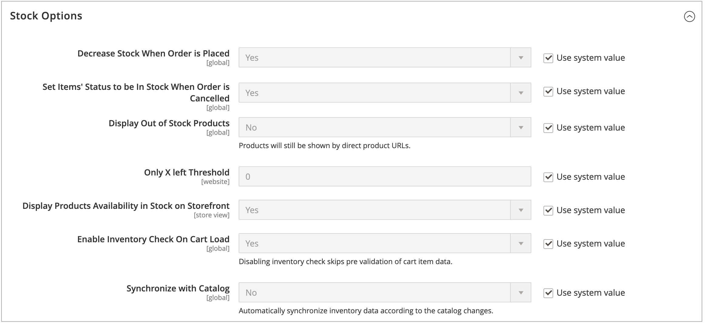

# Configurer [!DNL Inventory Management] options globales

Configurez les options de configuration par défaut pour le produit et le stock de vos sites web. Certains de ces paramètres peuvent être remplacés par produit via [Configuration des options du produit](product-options.md). Pour configurer les paramètres de priorité de distance, voir [Configuration de l&#39;algorithme de priorité de distance](distance-priority-algorithm.md).

## Configuration globale des options de produit et de stock

1. Dans la barre latérale _Admin_, accédez à **[!UICONTROL Stores]** > _[!UICONTROL Settings]_>**[!UICONTROL Configuration]**.

1. Dans le panneau de gauche, développez **[!UICONTROL Catalog]** et choisissez **[!UICONTROL Inventory]**.

1. Développez  la section **[!UICONTROL Stock Options]** et définissez les options suivantes :

   {width="600" zoomable="yes"}

   - Pour ajuster la quantité en stock lors de la commande, définissez **[!UICONTROL Decrease Stock When Order is Placed]** sur `Yes`.

   - Pour retourner des articles en stock si une commande est annulée, **[!UICONTROL Set Items' Status to be in Stock When Order in Cancelled]** sur `Yes`.

   - Pour continuer à afficher les produits du catalogue qui ne sont plus en stock, définissez **[!UICONTROL Display Out of Stock Products]** sur `Yes`.

   - Si les [alertes de prix](alert-setup.md) sont activées, les clients peuvent s’inscrire pour être avertis lorsque le produit est de nouveau en stock.

   - Pour définir le début d&#39;affichage du dernier montant de stock restant sur la page produit, saisissez un montant pour **[!UICONTROL Only X left Threshold]**.

     Le message commence à apparaître lorsque la quantité en stock atteint le seuil. Par exemple, s’il est défini sur `3`, le message `Only 3 left` s’affiche lorsque la quantité en stock atteint trois. Le message s’ajuste pour refléter la quantité en stock, jusqu’à ce que la quantité atteigne zéro.

   - Pour afficher un message « En stock » ou « En rupture de stock » sur la page produit, définissez **[!UICONTROL Display Products Availability In Stock on Storefront]** sur `Yes`.

   - Pour vérifier l’inventaire lors du chargement d’un produit dans le panier, définissez **[!UICONTROL Enable Inventory Check On Cart Load]** sur `Yes`. Lorsque cette option est désactivée, la vérification de l’inventaire est ignorée. La désactivation de cette option accélère le passage en caisse, en particulier si le panier contient de nombreux articles. Cependant, si vous ignorez la pré-validation, les clients peuvent voir des erreurs « en rupture de stock » plus tard dans le processus de passage en caisse.

   - Pour maintenir la cohérence entre l’inventaire et le catalogue, définissez **[!UICONTROL Synchronize with Catalog]** sur `Yes`. Lorsque cette option est activée, les données de stock sont ajustées en fonction des modifications du catalogue (telles que la suppression d’un produit, la modification du SKU d’un produit et la modification du type de produit).

1. Développez  la section **[!UICONTROL Product Stock Options]** et définissez les options suivantes :

   - Pour activer le [contrôle des stocks](enable.md) pour votre catalogue, définissez **[!UICONTROL Manage Stock]** sur `Yes`.

     {width="600" zoomable="yes"}

   - Définissez **[!UICONTROL Backorders]** sur l’une des options suivantes :

     | Option | Description |
     | ----- | ----- |
     | `No Backorders` | Les [reliquats](backorders.md) ne sont pas acceptés lorsque le produit est en rupture de stock. |
     | `Allow Qty Below 0` | Les reliquats sont acceptés lorsque la quantité est inférieure à zéro. |
     | `Allow Qty Below 0 and Notify Customer` | Les reliquats sont acceptés lorsque la quantité est inférieure à zéro et que le système informe le client que la commande peut toujours être passée. |

   - Saisissez le **[!UICONTROL Maximum Qty Allowed in Shopping Cart]**.

   - Saisissez un montant pour le **[!UICONTROL Out-of-Stock Threshold]** :

     | Valeur | Description |
     | ----- |-----|
     | Montant positif | Lorsque Commandes en souffrance est désactivé, saisissez un montant positif. |
     | Zéro | Lorsque les reliquats sont activés, la saisie de `0` permet de créer un nombre infini de reliquats. |
     | Montant négatif | Lorsque les reliquats sont activés, il est recommandé de saisir un montant négatif. Le montant est ajouté à la quantité vendable. Par exemple, saisissez `-50` pour autoriser les commandes jusqu&#39;à ce montant. |

   - Saisissez le **[!UICONTROL Minimum Qty Allowed in Shopping Cart]** pour le groupe et les montants sélectionnés.

   - Par **[!UICONTROL Notify for Quantity Below]**, saisissez le niveau de stock qui déclenche la notification de rupture de stock de l&#39;article.

   - Pour activer les incréments de quantité pour le produit, définissez **[!UICONTROL Enable Qty Increments]** sur `Yes`. Ensuite, par **[!UICONTROL Qty Increments]**, entrez le numéro des articles qui doivent être achetés pour répondre au besoin.

     Par exemple, un article vendu par incréments de six peut être acheté en quantités de `6`, `12`, `18`, etc.

   - Par [!DNL Inventory Management], **[!UICONTROL Automatically Return Credit Memo Item to Stock]** est défini sur `No`. Lors de la soumission d&#39;un avoir, vous saisissez et choisissez de renvoyer le stock aux origines.

1. Développez  la section **[!UICONTROL Admin bulk operations]** et définissez les options suivantes :

   {width="600" zoomable="yes"}

   - Définir des **[!UICONTROL Run asynchronously]** pour exécuter des opérations en bloc de manière asynchrone pour des actions de produits en masse

     Ces opérations incluent l&#39;affectation en bloc [affectation et annulation de l&#39;affectation des sources](bulk-assignment.md) et [&#x200B; transfert du stock vers la source](inventory-transfer.md). Il collecte les actions en bloc jusqu’à la taille de lot asynchrone, puis exécute ces actions. Par défaut, cette option est désactivée. Il est recommandé de vérifier vos performances avec des actions en bloc avant l’activation.

     >[!NOTE]
     >
     >Pour configurer et prendre en charge les _gestionnaires de files d’attente asynchrones_, vous devez exécuter une commande à l’aide de la ligne de commande. Cette étape peut nécessiter l’aide d’un développeur. Voir [Démarrer les consommateurs de files d’attente de messages](https://experienceleague.adobe.com/docs/commerce-operations/configuration-guide/cli/start-message-queues.html?lang=fr) dans le _Guide de configuration_.

   - Si cette option est activée, définissez la **[!UICONTROL Asynchronous batch size]** . La taille de lot par défaut est de 100. Lorsque les processus en masse atteignent cette quantité, le système la déclenche.

1. Cliquez ensuite sur **[!UICONTROL Save Config]**.
