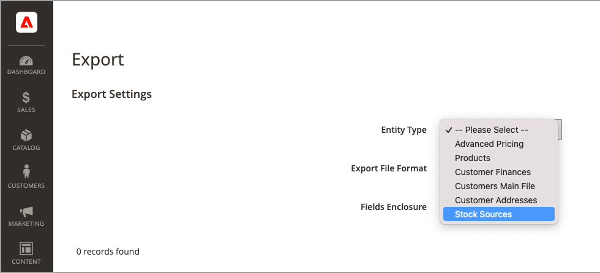

# Importer et exporter l&#39;inventaire

Pour les catalogues comportant de nombreux produits, utilisez les fonctionnalités natives d’importation et d’exportation avec des options de [!DNL Inventory Management] étendues pour mettre à jour les sources et les quantités par SKU. Grâce à ces options, vous pouvez ajouter de nouvelles sources et mettre à jour les quantités en stock pour l&#39;ensemble des sources ou pour une source spécifique. Par exemple, vous pouvez exporter des produits pour une source en Allemagne sans affecter les informations sur les produits pour des sources en France, en Angleterre ou aux États-Unis.

- [!DNL Commerce] affecte automatiquement le Source par défaut à vos produits lors de la mise à niveau de [!DNL Commerce] ou de l’importation de nouveaux produits. Si vous importez des produits auxquels une source personnalisée est attribuée, la quantité de Source par défaut est toujours de 0. Pour mettre à jour les origines et les quantités, utilisez ces instructions d&#39;importation.

- Les commerçants à source unique utilisent l’importation pour mettre à jour uniquement les quantités de produits. Tous les produits existants et ajoutés sont affectés au Source par défaut.

- Les commerçants multi-sources utilisent l’importation pour ajouter plusieurs sources et quantités par ligne et par SKU.

Pour importer des mises à jour, exportez d’abord un fichier CSV pour une ou toutes les sources. Modifiez le fichier CSV et ajoutez une ligne par SKU pour chaque source et quantité. Vous avez besoin du code source lors de l’ajout d’une source et de l’ajout de quantités de stock. Vous ne pouvez pas ajouter ou mettre à jour des stocks en utilisant les fonctions d&#39;import-export.

## Contenu du fichier CSV

Le fichier d’import-export contient les informations suivantes en fonction de la source :

- `source_code` - Code des sources dans [!DNL Commerce]. Il existe une ligne pour chaque source et SKU.
- `sku` - SKU du produit en [!DNL Commerce]. Le SKU doit correspondre à un produit de votre boutique pour mettre à jour correctement les données [!DNL Inventory Management].
- `status` - 0 pour rupture de stock. 1 pour En stock. Cette valeur doit être égale à 1 pour acheter du stock à partir de cette source.
- `quantity` - Montant total du stock disponible pour ce SKU et cette source.

Utilisez un fichier CSV pour mettre rapidement à jour plusieurs produits et sources affectées afin de mettre à jour et de corriger toute inexactitude dans les enregistrements d’inventaire, plutôt qu’un par un via l’interface de l’application. Pour un fichier de base, exportez d’abord et mettez-le à jour si nécessaire.

{width="600" zoomable="yes"}

## Exporter les données de produit pour toutes les sources

1. Dans la barre latérale _Admin_, accédez à **[!UICONTROL System]** > _[!UICONTROL Data Transfer]_>**[!UICONTROL Export]**.

1. Par **[!UICONTROL Entity Type]**, choisissez `Stock Sources`.

   L’exportation extrait uniquement les données pour les produits avec un SKU.

1. Cliquez sur **[!UICONTROL Continue]**.

   Le fichier génère et télécharge pour l’ouverture et la modification.

Après avoir mis à jour les quantités en stock et les données de produit, réimportez le fichier dans [!DNL Commerce].

{width="350" zoomable="yes"}

## Exporter les données de produit pour une source spécifique

1. Dans la barre latérale _Admin_, accédez à **[!UICONTROL System]** > _[!UICONTROL Data Transfer]_>**[!UICONTROL Export]**.

1. Par **[!UICONTROL Entity Type]**, choisissez `Stock Sources`.

   L’exportation extrait uniquement les données pour les produits avec un SKU.

1. Utilisez l’**[!UICONTROL Entity Attributes]** pour filtrer les produits exportés pour une source spécifique.

   Par `source_code`, saisissez le code de la source dans le champ de filtre.

1. Cliquez sur **[!UICONTROL Continue]**.

   Le fichier génère et télécharge pour l’ouverture et la modification.

Après avoir mis à jour les quantités en stock et les données de produit, réimportez le fichier dans [!DNL Commerce].

## Importer des données de produit

1. Dans la barre latérale _Admin_, accédez à **[!UICONTROL System]** > _[!UICONTROL Data Transfer]_>**[!UICONTROL Import]**.

1. Par **[!UICONTROL Entity Type]**, choisissez `Stock Sources`.

   L’exportation extrait uniquement les données pour les produits avec un SKU.

1. Sélectionnez des configurations pour le **[!UICONTROL Import Behavior]**.

1. Sélectionnez le fichier .csv à importer.

1. Cliquez sur **[!UICONTROL Check Data]** et terminez l’importation.

{width="600" zoomable="yes"}
