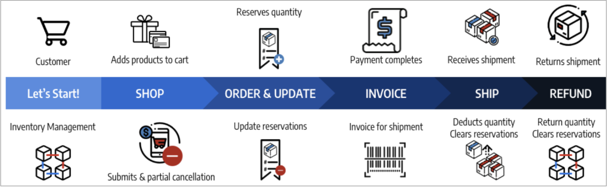
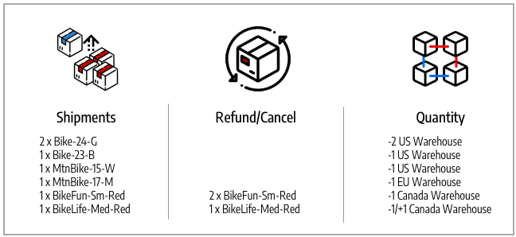

# Statut de la commande et réservations

[!DNL Inventory Management] prend en charge la facturation, les paiements, l’expédition et les annulations partiels et complets par commande. Lorsque vous gérez une commande par le biais du traitement, de la facturation, de l&#39;expédition et éventuellement des remboursements, [!DNL Commerce] saisit ou modifie automatiquement les réservations pour mettre à jour la quantité vendable pour un stock (ou un canal de vente) et la quantité en stock disponible par origine. Vous n’avez pas à accéder activement aux réservations ni à les saisir. Effectuer des actions pour exécuter, annuler ou rembourser une commande le fait pour vous.

Ces réservations ajustent toujours votre quantité vendable, avec des montants positifs ou négatifs pour augmenter ou diminuer les quantités. Il en résulte une mise à jour de votre stock disponible et des quantités disponibles pour une disponibilité à jour des produits.

Pour plus d&#39;informations sur les commandes et les livraisons, voir [Gestion des commandes et des livraisons](shipments.md).

## Options de gestion des commandes

Selon le statut du stock et les demandes des clients, vous pouvez mettre à jour les commandes avec des paiements et des annulations partiels, des expéditions partielles provenant de plusieurs origines ou pour des commandes en souffrance, ou des avoirs pour rembourser les produits retournés.

### Expéditions

Après avoir facturé les commandes, envoyez des envois partiels ou complets jusqu&#39;à ce que vous exécutiez la commande entière. Chaque expédition convertit la réservation, en déduisant le montant de la quantité de produit par source. Les compensations de réservation permettent de mettre à jour la quantité disponible pour votre stock. Si vous envoyez des expéditions partielles, chaque expédition déduit ce montant de la quantité de produits et des réservations. Toutes les réservations de produits non expédiées restent en place jusqu&#39;à ce qu&#39;elles soient également expédiées, de sorte que votre montant vendable soit à jour et vous donne le contrôle sur le stock de produits et prend en charge plusieurs expéditions d&#39;origine et commandes en souffrance.

### Commandes annulées

Si un client annule sa commande avant l&#39;expédition (partielle ou complète), une nouvelle réservation est saisie pour retourner le montant du stock à la quantité vendable. Les réserves s&#39;annulent en fait les unes les autres, sans déduire la quantité d&#39;aucune source. D’autres clients peuvent acheter activement ces quantités de produits par le biais des stocks et des canaux de vente associés.

### Commandes remboursées

Si un client demande un remboursement, émettez l&#39;avoir pour les montants partiels ou complets du produit. Lorsque vous recevez les produits renvoyés, saisissez un avoir pour fournir les fonds et mettre à jour les montants des produits. Lors de la sélection de l&#39;option Retour au stock , [!DNL Commerce] ajoute les quantités aux produits et aux origines qui ont expédié les commandes et les compensations de réservation afin de mettre à jour les quantités vendables pour le stock associé.

## Types de commande

Les commandes simples commencent par un panier, continuent jusqu&#39;au paiement et se terminent par une livraison satisfaite. Dans ces commandes, [!DNL Inventory Management] traite facilement les réservations en fonction de la disponibilité (ou de la quantité vendable) dans le panier et le passage en caisse, et déduit du stock disponible à l&#39;expédition.

{width="600" zoomable="yes"}

Une commande plus compliquée peut comporter des annulations partielles, des expéditions partielles et des remboursements. Dans ces situations, les réservations affectent le stock disponible pour ajouter des quantités pour les annulations et les remboursements et réduire les quantités lorsqu&#39;elles sont commandées et expédiées.

{width="600" zoomable="yes"}

Les réservations de disponibilité et les modifications de stock se produisent en fonction du statut de la commande.

## Statut et réservations

Les tableaux suivants détaillent le statut de la commande et de l&#39;avoir avec les modifications de réservation saisies par [!DNL Commerce] pour gérer votre stock.

| Statut de la commande | Description | Réservation pour la quantité vendable |
|--|--|--|
| [!UICONTROL Open] | Nouveau et récemment envoyé, aucun traitement | La réservation est enregistrée lorsque la commande est soumise pour le stock. |
| [!UICONTROL Canceled] | Annulé en partie ou en totalité avant paiement | La compensation de réservation est saisie pour renvoyer une quantité partielle ou complète à la quantité disponible en stock. |
| [!UICONTROL On Hold] | Paiement et expédition non traités ou facturés | La réservation reste en place. |
| [!UICONTROL Suspected Fraud] | Non traité en raison d’une fraude | Si elle est approuvée ou en cours de révision, la réservation reste en place. En cas de refus, la réservation reste en place jusqu’à ce que le commerçant décide d’approuver ou d’annuler. En cas d&#39;annulation, la compensation de réservation est saisie pour renvoyer la quantité totale à la quantité en stock disponible. |
| [!UICONTROL Pending] | En attente de paiement | La réservation reste en place. |
| [!UICONTROL Processing] | Traitement des paiements, non reçu | La réservation reste en place. |
| [!UICONTROL Pending Payment] | Paiement non reçu | La réservation reste en place. |
| [!UICONTROL Payment Review] | Paiement en cours de révision pour traitement et achèvement | La réservation reste en place. |
| [!UICONTROL Complete] | Payé et expédié en entier | Le montant de la réservation est déduit de la quantité de produit pour l&#39;origine sélectionnée lorsqu&#39;elle est facturée partiellement ou en totalité. La compensation de la réservation est saisie pour mettre à jour la quantité totale à vendre. |
| [!UICONTROL Closed] | Remboursé ou archivé | Si elles sont archivées, les quantités ne changent pas. En cas de remboursement partiel ou total, la compensation de la réservation est saisie et convertie pour rajouter les quantités de produits par source et la quantité vendable par stock. |

| Statut de l&#39;avoir | Description | Réservation pour la quantité vendable |
|--|--|--|
| [!UICONTROL Open] | Le remboursement est dû, non terminé | Les réservations ne changent pas. |
| [!UICONTROL Refunded] | Terminé, fonds renvoyés | En cas de remboursement partiel ou total, la compensation de la réservation est saisie et convertie pour ajouter les quantités de produits par source et la quantité vendable par stock. |

## Exemple d’ordre complexe

Blake Sanders commande des vélos et des vêtements pour leurs vacances en famille et leurs divertissements. Ils voient d&#39;excellentes ventes sur votre boutique Biking Adventures avec des stocks et des sources aux États-Unis, au Canada et en Europe.

Ils achètent deux superbes vélos de parc pour leurs petits enfants, un vélo BMX pour leur adolescent, un beau vélo de montagne pour eux-mêmes et un vélo de fond allemand moderne pour leur épouse. Le magasin avait une vente sur des chemises mignonnes, alors ils en ont acheté pour toute la famille. Consultez la liste des achats de vacances ci-dessous, les SKU correspondants et les réservations saisies pour les quantités disponibles en stock.

{width="600" zoomable="yes"}

Ils montrent à leur famille ce qu&#39;ils ont trouvé, mais apportent quelques changements. Avant que le paiement ne soit terminé, ils annulent deux des 33 SKU de BikeFun (les enfants ne les aimaient pas). Il s&#39;agit d&#39;une annulation partielle en raison d&#39;un paiement en attente, aucun avoir n&#39;est donc nécessaire. Pour mettre à jour, [!DNL Commerce] ajoute de nouveau au stock de la quantité vendable pour le Canada. La commande est payée, et tous les produits sont expédiés, arrivant à temps pour les vacances. [!DNL Commerce] met à jour la quantité commercialisable et les quantités d&#39;origine pour les entrepôts d&#39;expédition des produits expédiés.

Mais la chemise ne convenait pas à leur conjoint. Blake demande un remboursement et renvoie sa chemise. La création de la note de crédit ajoute une chemise 54-BikeLife à l&#39;entrepôt de stock et d&#39;expédition du Canada.

- **Produits expédiés** - Avec les produits achetés et expédiés, [!DNL Commerce] met à jour l’inventaire. Les compensations de réservation sont converties en déductions de quantité de stock disponible à partir de l&#39;origine expédiée. Mises à jour des quantités disponibles pour le stock.

- **Produits annulés** - En annulant le stock, [!DNL Commerce] supprime la réservation pour ce produit. La compensation de la réservation est saisie au niveau du stock pour ajouter les quantités vendables pour l&#39;annulation partielle de deux t-shirts. Cela n&#39;affecte pas la quantité en stock au niveau de l&#39;origine.

- **Avoir/Produit remboursé** - En retournant le stock, il doit être rajouté aux quantités. Lors de l&#39;émission de l&#39;avoir, vous pouvez choisir de revenir au stock. [!DNL Commerce] réajoute la quantité en stock à l&#39;origine expédiée pour le produit. Les compensations de réservation permettent d&#39;effacer les réservations restantes. La quantité commercialisable est recalculée par rapport à la quantité mise à jour.

{width="600" zoomable="yes"}
