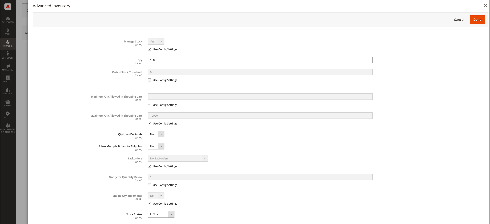

# Configuration des options de produit [!DNL Inventory Management]

Ces configurations s’appliquent uniquement au produit modifié, remplaçant toutes les configurations au niveau du site web global. Modifiez ces paramètres lors de la modification d’un produit, via la section _[!UICONTROL Sources]_&#x200B;et la page&#x200B;_[!UICONTROL Advanced Inventory]_.

- Configuration des options de produit par source
- Configuration des options de produit pour un inventaire avancé

## Options de produit par source

Configurez les quantités et les paramètres supplémentaires par [source ajoutée](sources-add.md) pour le produit.

1. Sur la barre latérale _Admin_, accédez à **[!UICONTROL Catalog]** > **[!UICONTROL Products]**.

1. Ouvrez un produit en mode d’édition.

1. Développez la section  et configurez les paramètres de produit pour chaque source :**[!UICONTROL Sources]**

   - Saisissez un montant **[!UICONTROL Qty]** (quantité).

   - Définissez le **[!UICONTROL Source Item Status]** sur `In Stock` ou `Out of Stock`.

   - Pour modifier la case à cocher Notifier pour la quantité inférieure à la source, décochez ou cochez la case **[!UICONTROL Notify Quantity Use Default]** .

     Si cette option est effacée, saisissez le montant du stock qui déclenche l’avis d’absence de stock de l’article. Le montant saisi est soustrait de la Quantité vendable de l&#39;article au niveau du stock.

     `Select to use Default` - [!DNL Commerce] vérifie les paramètres de configuration des options de l’inventaire avancé du produit.
     `Clear to Modify` - Saisissez une valeur pour la valeur Notifier la quantité, en remplaçant les paramètres de configuration Inventaire avancé et Magasin.

   {width="350" zoomable="yes"}

1. Une fois l’opération terminée, cliquez sur **[!UICONTROL Done]**, puis sur **[!UICONTROL Save]**.

### Descriptions des champs

| Champ | Portée | Description |
|--|--|--|
| [!UICONTROL Source Code] | Global | Le code unique d’une [source](sources-manage.md). |
| [!UICONTROL Name] | Global | Nom unique d’une source. |
| [!UICONTROL Status] | Global | Le produit est activé ou désactivé dans le catalogue. |
| [!UICONTROL Source Item Status] | Global | Détermine la disponibilité actuelle du produit. Options :  `In Stock` - Rend le produit disponible à l’achat. `Out of Stock` - À moins que les commandes en arrière-plan ne soient activées, empêche le produit d’être disponible à l’achat et supprime la liste du catalogue. |
| [!UICONTROL Qty] | Global | Montants du stock disponible pour chaque source ou emplacement. |
| [!UICONTROL Notify Quantity] | Global | Une valeur pour _[!UICONTROL Notify for Quantity Below]_&#x200B;pour cette source spécifique si&#x200B;_[!UICONTROL Notify Quantity Use Default]_ n’est pas sélectionné. |
| [!UICONTROL Notify Quantity Use Default] | Global | Indique d’utiliser le paramètre par défaut pour _[!UICONTROL Notify for Quantity Below]_&#x200B;dans le produit&#x200B;_[!UICONTROL Advanced Inventory]_ ou le paramètre global dans la configuration du magasin. |

## Options de produit avancées

1. Sur la barre latérale _Admin_, accédez à **[!UICONTROL Catalog]** > **[!UICONTROL Products]**.

1. Ouvrez un produit en mode d’édition.

1. Développez  de la section **[!UICONTROL Sources]** et cliquez sur **[!UICONTROL Advanced Inventory]**.

1. Pour activer le [contrôle d’inventaire](enable.md) pour votre catalogue, définissez **[!UICONTROL Manage Stock]** sur `Yes`.

   >[!NOTE]
   >
   >Les paramètres [!UICONTROL Manage Stock] des produits enfants remplacent un produit configurable.

   {width="600" zoomable="yes"}

1. Saisissez un montant pour le **[!UICONTROL Out-of-Stock Threshold]** :

   | Valeur | Description |
   | ----- | ----- |
   | Montant positif | Lorsque _[!UICONTROL Backorders]_&#x200B;est désactivé, entrez une valeur positive. |
   | Zéro | Lorsque _[!UICONTROL Backorders]_&#x200B;est activé, la saisie de `0` permet d’obtenir des commandes d’arrière-plan infinies. |
   | Montant négatif | Lorsque _[!UICONTROL Backorders]_&#x200B;est activé, il est recommandé de saisir une valeur négative. Le montant est ajouté à la quantité vendable. Par exemple, saisissez `-50` pour autoriser les commandes jusqu’à ce montant. |

1. Saisissez le **[!UICONTROL Minimum Qty Allowed in Shopping Cart]**.

1. Saisissez le **[!UICONTROL Maximum Qty Allowed in Shopping Cart]**.

1. Définissez **[!UICONTROL Qty uses Decimals]** sur `Yes` si les clients peuvent utiliser une valeur décimale plutôt qu’un nombre entier lors de la saisie de la quantité commandée.

1. Définissez **[!UICONTROL Allow Multiple Boxes for Shipping]** sur `Yes` si le produit peut être vendu séparément, dans de nombreuses boîtes. Cette option est visible lorsque **[!UICONTROL Qty Uses Decimals]** est défini sur `Yes` uniquement.

1. Définissez **[!UICONTROL Backorders]** sur l’une des options suivantes :

   | Option | Description |
   | ----- | ----- |
   | `No Backorders` | Ne pas accepter les commandes en arrière-plan lorsque le produit est en rupture de stock. |
   | `Allow Qty Below 0` | Accepter les commandes en arrière-plan lorsque la quantité est inférieure à zéro. |
   | `Allow Qty Below 0 and Notify Customer` | Pour accepter les commandes en arrière-plan lorsque la quantité est inférieure à zéro et informer le client que la commande peut toujours être passée. |

   Pour plus d’informations, voir [Configuration des commandes en arrière-plan](backorders.md).

1. Pour activer les incréments de quantité pour le produit, définissez **[!UICONTROL Enable Qty Increments]** sur `Yes` et saisissez le nombre d’articles à acheter pour répondre aux exigences du champ **[!UICONTROL Qty Increments]**.

   Par exemple, un article vendu par incréments de six peut être acheté en quantités de 6, 12, 18, etc.

   Le champ **[!UICONTROL Qty Increments]** définit le nombre d’articles de produit qui doivent être achetés en tant que produit unique et enfant de produits configurables, regroupés et regroupés.

1. Une fois l’opération terminée, cliquez sur **[!UICONTROL Done]**, puis sur **[!UICONTROL Save]**.

### Descriptions des champs

| Champ | Portée | Description |
|--|--|--|
| [!UICONTROL Manage Stock] | Global | Détermine si le contrôle des stocks est utilisé pour gérer ce produit dans votre catalogue. Défini pour activer ou désactiver toutes les fonctions [!DNL Inventory Management]. Lorsque vous réalisez un retour ou une note de crédit, la quantité du produit est automatiquement renvoyée à la quantité source affectée. Si vous utilisez un système ERP tiers, vous pouvez le désactiver. |
| [!UICONTROL Out-of-Stock Threshold] | Global | Détermine le niveau de stock auquel un produit est considéré comme en rupture de stock. Options :  Valeur positive - Si les commandes en arrière-plan sont désactivées, saisissez un montant positif. Zéro (0) - Lorsque les commandes d’arrière-plan sont activées, la valeur zéro autorise des commandes d’arrière-plan infinies. Valeur négative : lorsque les commandes en arrière-plan sont activées, il est recommandé de saisir un montant négatif. Le montant est ajouté à la quantité vendable. Par exemple, saisissez `-50` pour autoriser les commandes jusqu’à ce montant. |
| [!UICONTROL Minimum Qty Allowed in Shopping Cart] | Global | Détermine le nombre minimum de produits pouvant être achetés dans une seule commande. |
| [!UICONTROL Maximum Qty Allowed in Shopping Cart] | Global | Détermine le nombre maximal de produits pouvant être achetés dans une seule commande. |
| [!UICONTROL Qty Uses Decimals] | Global | Détermine si les clients peuvent utiliser une valeur décimale plutôt qu’un nombre entier lors de la saisie de la quantité commandée. Options :  `Yes` - Permet d’entrer des valeurs sous forme de décimales plutôt que de nombres entiers. Les décimales conviennent aux produits vendus en poids, volume ou longueur. `No` - Nécessite que les valeurs de quantité soient saisies en nombres entiers. |
| [!UICONTROL Allow Multiple Boxes for Shipping] | Global | Détermine si des parties du produit peuvent être expédiées séparément. Cette option est visible lorsque **[!UICONTROL Qty Uses Decimals]** = `Yes`. |
| [!UICONTROL Backorders] | Global | Détermine le mode de gestion des commandes en arrière-plan. Les commandes en arrière-plan ne modifient pas l’état de traitement de la commande. Les fonds sont toujours autorisés ou capturés immédiatement lorsque la commande est passée, que le produit soit en stock ou non. Les produits sont livrés dès qu’ils deviennent disponibles. Lorsque cette option est activée, il est recommandé de saisir un montant négatif pour le seuil d’rupture de stock. Options :  `No Backorders` - N’accepte pas les commandes en arrière-plan lorsque le produit est en rupture de stock. `Allow Qty Below 0` - Accepte les commandes en arrière-plan lorsque la quantité est inférieure à zéro. `Allow Qty Below 0 and Notify Customer` - Accepte les commandes en arrière-plan lorsque la quantité est inférieure à zéro, mais avertit les clients que les commandes peuvent toujours être passées. |
| [!UICONTROL Enable Qty Increments] | Global | Détermine si le produit peut être vendu en quantité par incréments. Les incréments définissent le nombre d’articles de produit qui doivent être achetés en tant que produit unique et enfant de produits configurables, regroupés et regroupés. |

>[!NOTE]
>
>La configuration de produit simple remplace les configurations de produit configurables pour un produit spécifique.
