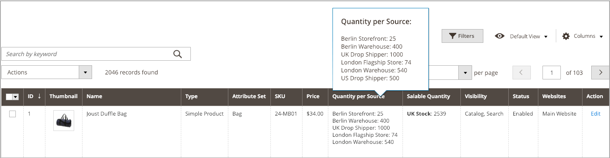

# Gérer les quantités d&#39;inventaire

Les informations suivantes expliquent comment attribuer des sources et des quantités pour de nouveaux produits ou modifier des produits existants.

Lors de la création de produits, affectez des sources et des quantités lors de la création de produits. Voir [Création d’un produit](../catalog/product-create.md) pour obtenir des instructions complètes. Ces pages contiennent des informations à source unique et multi-source pour les sources et les quantités par source.

Lors de la première consultation d’une mise à niveau [!DNL Commerce] avec [!DNL Inventory Management], tous les produits et toutes les quantités sont attribués à la source par défaut. Lors de l’importation de nouveaux produits via le fichier .csv , ils sont également affectés à la source par défaut.

Les marchands à source unique et multi-source peuvent mettre à jour les sources, les quantités d’inventaire et les seuils par produit ou en bloc.

- Les marchands à source unique peuvent mettre à jour les quantités de produits pour la source par défaut. Cette quantité correspond au nombre total de produits disponibles à la vente.

- Les négociants multi-sources peuvent attribuer plusieurs sources et quantités par produit pour chaque emplacement (entrepôts, magasins, expéditeurs, etc.). Il est recommandé d’ajouter des sources avant de définir les quantités d’inventaire des produits.

Lors de l’ajout de sources et de quantités à vos produits, vous pouvez afficher les montants par le biais de la grille de produits. Si vous disposez d’un grand nombre de sources, passez la souris sur la variable _[!UICONTROL Quantity per Source]_pour afficher la liste complète et déroulante des sources avec les quantités actuelles.

{width="600" zoomable="yes"}

Vous disposez des options suivantes pour affecter un inventaire aux produits :

- [Attribution de sources par produit](sources-assign-per-product.md) - Attribuez manuellement des sources par produit dans votre catalogue.

- [Attribution de quantités par produit](quantities-assign-per-product.md) - Ajoutez des quantités de stock disponibles à vos produits par source. Ces informations sont spécifiques aux marchands multisource.

- [Affectation et annulation de l’affectation de sources en bloc](bulk-assignment.md) - Attribuer des sources à des produits sélectionnés en tant qu’action de masse. Utilisez la variable [Transférer l’inventaire vers la source](inventory-transfer.md) si vous souhaitez transférer l’inventaire et supprimer la source.

- [Transfert du stock vers la source](inventory-transfer.md) - Transférez en masse tous les stocks d’une source d’origine vers une source de destination.

- [Import et export de quantités](inventory-import-export.md) - Utilisez les fonctionnalités d’importation et d’exportation pour mettre à jour plusieurs SKU de produit avec des sources et des quantités d’inventaire.
