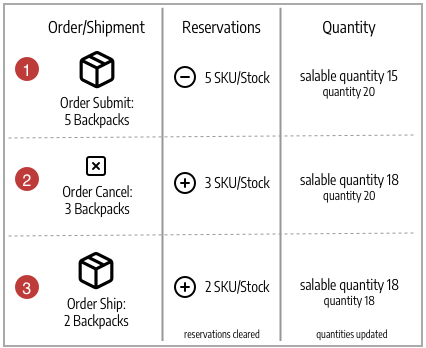

# Algorithmes et réservations Source

Le cœur de [!DNL Inventory Management] suit chaque produit disponible virtuellement et à portée de main dans vos entrepôts et magasins. L&#39;algorithme de sélection Source et les systèmes de réservation s&#39;exécutent en arrière-plan, ce qui permet de mettre à jour vos quantités vendables, de ne pas avoir de collisions lors du passage en caisse et de recommander des options d&#39;expédition.

>[!NOTE]
>
>Pour plus d’informations sur l’utilisation du système [ par programmation](https://developer.adobe.com/commerce/php/development/framework/inventory-management/) consultez la [!DNL Inventory Management] documentation pour les développeurs .

## Algorithme de sélection Source

L’algorithme de sélection Source (SSA) analyse et détermine la meilleure correspondance pour les sources et l’expédition à l’aide de l’ordre de priorité des sources configurées dans un stock. Lors de la livraison de commande, l&#39;algorithme fournit une liste recommandée de sources, de quantités disponibles et de montants à déduire en fonction de l&#39;algorithme sélectionné. [!DNL Inventory Management] fournit un algorithme de priorité et prend en charge les extensions pour les nouvelles options.

Avec plusieurs lieux d&#39;origine, des clients internationaux et des transporteurs ayant diverses options et frais d&#39;expédition, il peut être difficile de connaître vos stocks disponibles réels et de trouver la meilleure option d&#39;expédition. SSA effectue le travail à votre place, depuis le suivi des quantités vendables en stock à travers toutes les sources jusqu&#39;au calcul et à la formulation de recommandations pour les expéditions.

**Suivi des stocks** - En utilisant les stocks et les sources, le SSA vérifie le canal de vente des demandes de produits entrantes et détermine les stocks disponibles :

- Calcule la quantité vendable virtuelle agrégée de toutes les sources affectées par stock : agrégats Quantité - Seuil de rupture de stock par source
- Soustrait le montant du seuil de rupture de stock de la quantité vendable pour se protéger contre les ventes excessives
- Réserve les quantités en stock lors de la soumission de la commande, en déduisant du stock en stock au traitement de la commande et à l&#39;expédition
- Prend en charge les commandes en souffrance avec des options améliorées pour les seuils négatifs

**Gérer les expéditions** - L’algorithme vous aide à traiter et à expédier les commandes. Vous pouvez exécuter l’algorithme pour obtenir des recommandations sur les meilleures sources d’expédition du produit ou remplacer les sélections dans :

- Expédiez des envois partiels, en envoyant seulement quelques produits à partir d&#39;emplacements spécifiques et en effectuant la commande complète ultérieurement
- Expédier l&#39;intégralité de la commande à partir d&#39;une seule source
- Ventilez les expéditions entre plusieurs sources en différents montants, en conservant un stock équilibré dans tous les entrepôts et magasins

SSA est extensible pour une prise en charge tierce et des algorithmes personnalisés pour recommander des expéditions rentables.

>[!NOTE]
>
>SSA fonctionne différemment pour les produits virtuels et téléchargeables, ce qui peut ne pas engendrer de frais d&#39;expédition. Dans ce cas, le système exécute l&#39;algorithme implicitement lors de la création des factures et utilise toujours les résultats suggérés. Vous ne pouvez pas ajuster ces résultats pour les produits virtuels et téléchargeables.

### Algorithme de priorité Source

Les stocks personnalisés comprennent une liste attribuée de sources à vendre et expédient les stocks de produits disponibles par l&#39;intermédiaire de votre storefront. L’algorithme de priorité Source utilise l’ordre des sources affectées en stock pour recommander des déductions de produit par source lors de la facturation et de l’expédition de la commande.

Lorsqu’il est exécuté, l’algorithme :

- Passe par l&#39;ordre configuré des sources au niveau du stock, en commençant par le haut
- Recommande une quantité à expédier et une origine par produit en fonction de l&#39;ordre dans la liste, de la quantité disponible et de la quantité commandée
- Continue dans la liste jusqu&#39;à ce que l&#39;expédition de la commande soit remplie
- Ignore les sources désactivées si elles figurent dans la liste

Pour configurer, affecter et commander des sources à un stock personnalisé. Voir [ Hiérarchisation des sources pour un stock](stocks-prioritize-sources.md).

L&#39;exemple suivant détaille les origines mappées dans l&#39;ordre, la quantité disponible, l&#39;origine et le montant recommandés à déduire et à expédier. La source principale est un Drop Shipper au Royaume-Uni avec une quantité disponible de 240.

{width="600" zoomable="yes"}

### Algorithme De Priorité De Distance

L&#39;algorithme de priorité de distance compare l&#39;emplacement de l&#39;adresse de destination d&#39;expédition avec les emplacements source afin de déterminer la source la plus proche pour exécuter les expéditions. La distance peut être déterminée par la distance physique ou le temps passé à voyager d&#39;un endroit à un autre, en utilisant des emplacements de base de données importés ou des directions de Google (conduite, marche ou vélo).

Vous disposez de deux options pour calculer la distance et le temps pour trouver la source la plus proche pour l&#39;exécution de l&#39;expédition :

- **Google MAP** - Utilise les services de [Google Maps Platform][1] pour calculer la distance et le temps entre l&#39;adresse de destination d&#39;expédition et les emplacements sources (adresse et coordonnées GPS). Cette option utilise la latitude et la longitude de la source. Une clé API Google est requise avec l’[API Geocoding][2] et l’[API Distance Matrix][3] activées. Cette option nécessite un plan de facturation Google et peut entraîner des frais via Google.

- **Calcul hors ligne** - Calcule la distance à l’aide des données de géocode téléchargées et importées afin de déterminer la source la plus proche de l’adresse de destination d’expédition. Cette option utilise les codes pays de l’adresse et de la source d’expédition. Pour configurer cette option, vous pouvez avoir besoin de l&#39;aide d&#39;un développeur pour télécharger et importer initialement des géocodes à l&#39;aide d&#39;une ligne de commande.

Pour configurer, sélectionnez des configurations et effectuez des étapes supplémentaires telles que la clé API Google ou le téléchargement des données d’expédition. Voir [Configurer l’algorithme de priorité de distance](distance-priority-algorithm.md).

### Algorithmes personnalisés

[!DNL Commerce] prend en charge le développement personnalisé et les extensions pour ajouter des algorithmes alternatifs afin de hiérarchiser les sources. Par exemple, vous pouvez avoir un algorithme de priorité basé sur la géographie et un autre basé sur les dépenses en stock ou un attribut du client. Lorsque le coût des stocks change, votre implémentation peut facilement modifier les algorithmes pour garantir le coût le plus bas.

## Réservations

Au lieu de déduire ou d&#39;ajouter immédiatement des quantités en stock de produits, les réservations conservent les quantités en stock jusqu&#39;à ce que les commandes soient expédiées ou annulées. Les réservations fonctionnent entièrement en arrière-plan pour mettre automatiquement à jour votre quantité vendable au niveau du stock.

>[!NOTE]
>
>[!BADGE PaaS uniquement]{type=Informative url="https://experienceleague.adobe.com/fr/docs/commerce/user-guides/product-solutions" tooltip="S’applique uniquement aux projets Adobe Commerce on Cloud (infrastructure PaaS gérée par Adobe) et aux projets On-premise."} La fonctionnalité de réservation nécessite que le client de file d’attente de messages `inventory.reservations.updateSalabilityStatus` s’exécute en continu. Pour vérifier s’il est en cours d’exécution, utilisez la commande `bin/magento queue:consumers:list` . Si le client de la file d’attente de messages n’est pas répertorié, démarrez-le : `bin/magento queue:consumers:start inventory.reservations.updateSalabilityStatus`.

### Réservation de commande

Les réservations sont bloquées sur les quantités en stock déduites de la quantité vendable lors de la soumission d&#39;une commande. Les réservations sont au niveau du stock, en comptant par rapport aux quantités jusqu&#39;à ce que la commande soit facturée et expédiée, annulée, etc. Lors de l&#39;expédition de la commande, vous pouvez utiliser les recommandations SSA ou saisir manuellement des déductions de quantité par origine. Lors de l&#39;expédition, les réservations sont automatiquement effacées et la quantité déduite. La quantité vendable est recalculée pour le stock avec une quantité mise à jour et les montants de réservation restants dans le système.

Le diagramme suivant permet de définir le processus de réservation au cours d’une commande et jusqu’à l’expédition.

{width="600" zoomable="yes"}

Un client passe une commande. [!DNL Commerce] vérifie la quantité disponible en stock actuelle. Si un stock suffisant est disponible au niveau du stock, une réservation met en attente temporairement le SKU du produit (pour ce stock) et recalcule la quantité à vendre.

Après avoir facturé la commande, vous déterminez les montants de produit à déduire et à expédier à partir de vos sources. L&#39;expédition est traitée et envoyée au client à partir d&#39;une ou plusieurs sources sélectionnées. Les quantités sont déduites automatiquement de la quantité en stock d&#39;origine et les réservations sont effacées. Pour obtenir des détails complets et des exemples, voir [À propos du statut de la commande et des réservations](order-status.md).

## Calculs de réservation

Le système crée une réservation pour chaque produit lorsque les événements suivants se produisent :

- Un client ou un commerçant passe une commande.
- Un client ou un commerçant annule entièrement ou partiellement une commande.
- Le commerçant crée une expédition pour un produit physique.
- Le marchand crée une facture pour un produit virtuel ou téléchargeable.
- Le marchand émet un avoir.

Les réservations sont des opérations en ajout uniquement, similaires à un journal d’événements. Une valeur de quantité négative est affectée à la réservation initiale. Toutes les réservations suivantes créées lors du traitement de la commande sont des valeurs positives. Lorsque la commande est terminée, la somme de toutes les réservations pour le produit est de 0.

Avant que le système puisse émettre une réservation en réponse à une nouvelle commande, il détermine s&#39;il y a suffisamment d&#39;articles vendables pour exécuter la commande. Les quantités suivantes entrent dans le calcul :

- **Quantité StockItem**. La quantité StockItem est le montant cumulé du stock provenant de toutes les sources physiques pour le canal de vente actuel. Prenons un exemple où la source Baltimore contient 20 unités d’un produit, la source Austin en contient 25, et la source Reno en contient 10. Lorsque toutes ces sources sont liées au Stock A, le nombre de StockItem pour ce produit est de 55 (20 + 25 + 10). (Lorsque des articles sont expédiés, l&#39;indexeur de stock met à jour les quantités disponibles à chaque origine.)

- **Réserves en suspens**. Le système totalise toutes les réservations initiales qui n&#39;ont pas été compensées. Ce nombre est toujours négatif. Si le client A a une réservation pour dix articles et que le client B a une réservation de 5 articles, les réservations en attente pour le produit total sont de -15.

Par conséquent, le commerçant peut exécuter une commande entrante tant que le client commande moins de 40 (55 + -15) unités.

Lorsque vous terminez le traitement d’une commande (Terminé, Annulé, Fermé), toutes les réservations dans le cadre de cette commande doivent être résolues sur `0`. Cette opération efface toutes les quantités disponibles.

>[!NOTE]
>
>Les commandes en souffrance (avec les seuils de rupture de stock) et les paramètres Notifier pour une quantité inférieure au seuil affectent également le calcul des quantités vendables, mais ils ne sont pas couverts par cette rubrique. Pour plus d’informations sur ces paramètres, voir [Configuration [!DNL Inventory Management]](./configuration.md).

## Objets de réservation

Une réservation contient les informations suivantes :

| Paramètre | Type de données | Description |
| --- | --- | --- |
| `reservation_id` | Entier | Identifiant généré par le système |
| `stock_id` | Entier | ID du stock auquel le produit est affecté |
| `sku` | String | SKU du produit |
| `quantity` | Flottant | Nombre d’éléments dans cette réservation |
| `metadata` | String | Type d’événement, type d’objet et ID d’objet pour cette réservation. Par exemple, `{"event_type":"order_placed","object_type":"order",| "object_id":"8"}` |

{style="table-layout:auto"}

Le `event_type` de métadonnées peut avoir les valeurs suivantes :

- `order_placed`
- `order_canceled`
- `shipment_created`
- `creditmemo_created`
- `invoice_created`

Actuellement, le type d’objet de métadonnées doit être `order` et l’ID d’objet est l’ID de commande.

Dans les prochaines versions, il pourrait être possible de créer une réservation lorsqu’un client ajoute un article dans un panier. Chaque article peut être réservé pour une durée fixe, par exemple 15 minutes, ce qui permet au client de réserver des articles tout en continuant à magasiner. Lorsque ce type de réservation est activé, les métadonnées peuvent contenir des types d’informations supplémentaires.

## Cycle de vie de la réservation

L’exemple suivant illustre l’ordre des réservations générées pour une commande simple.

1. Le client effectue un bon de commande pour 25 unités de `SKU-1` de produit. La réservation contient les informations suivantes :

   ```text
   reservation_id = 1
   stock_id = 1
   sku = SKU-1
   quantity = -25
   event_type = order_placed
   ```

1. Le client envoie une facture pour 20 articles, annulant essentiellement 5 des unités commandées.

   ```text
   reservation_id = 2
   stock_id = 1
   sku = SKU-1
   quantity = 5
   event_type = order_canceled
   ```

1. Le marchand expédie les 20 unités achetées.

   ```text
   reservation_id = 3
   stock_id = 1
   sku = `SKU-1`
   quantity = 20
   event_type = shipment_created
   ```

Les trois valeurs `quantity` font la somme de 0 (-25 + 5 + 20). Le système ne modifie aucune réserve existante.

## Suppression des réservations traitées

Le traitement cron `inventory_cleanup_reservations` exécute des requêtes SQL pour effacer la table de la base de données de réservation. Par défaut, il s’exécute tous les jours à minuit, mais vous pouvez configurer les heures et la fréquence. La tâche cron exécute un script qui interroge la base de données pour trouver des séquences de réservation complètes dans lesquelles la somme des valeurs de quantité est égale à 0. Lorsque toutes les réservations d’un produit donné provenant du même jour (ou d’une autre heure configurée) ont été compensées, la tâche cron supprime les réservations en une seule fois.

La tâche cron `inventory_reservations_cleanup` n’est pas identique au consommateur de file d’attente de messages `inventory.reservations.cleanup`. Le client supprime de manière asynchrone les réservations par SKU de produit après la suppression d’un produit, tandis que la tâche cron efface l’ensemble de la table des réservations. Le client est requis lorsque vous activez l’option de stock [**Synchroniser avec le catalogue**](../configuration-reference/catalog/inventory.md) dans la configuration du magasin. Voir [Gérer les files d’attente de messages](https://experienceleague.adobe.com/docs/commerce-operations/configuration-guide/message-queues/manage-message-queues.html?lang=fr) dans le _Guide de configuration_.

Souvent, toutes les réservations initiales produites au cours d’une seule journée ne peuvent pas être compensées ce même jour. Cette situation peut se produire lorsqu’un client passe une commande juste avant le début de la tâche cron ou effectue l’achat avec un mode de paiement hors ligne, tel qu’un virement bancaire. Les séquences de réservation compensées restent dans la base de données jusqu&#39;à ce qu&#39;elles soient toutes compensées. Cette pratique n’interfère pas avec les calculs de réservation, car le total de chaque réservation est 0.

>[!NOTE]
>
>Il existe des commandes d’interface de ligne de commande que vous pouvez utiliser pour détecter et gérer les incohérences de réservation (voir la [[!DNL Inventory Management] Référence de l’interface de ligne de commande](cli.md)).

### Mises à jour des réservations

Lorsque les modifications sont terminées dans les commandes et les montants de produit, [!DNL Commerce] saisit automatiquement les compensations de réservation. Vous n&#39;avez pas besoin de saisir des rémunérations par l&#39;intermédiaire de l&#39;administrateur ou du code pour mettre à jour ou effacer ces blocages. Les réservations ne sont affectées que par les réservations entrées pour mettre un blocage sur une quantité ou pour effacer un montant de blocage (compensation des réservations).

Voici comment ils fonctionnent :

- **Commande envoyée** - Lorsqu’une commande est envoyée pour plusieurs produits, une réservation est effectuée pour ce montant. Par exemple, la commande de cinq sacs à dos à partir d’un site web américain entre une réservation de `-5` pour ce SKU et ce stock. La quantité vendable est réduite de 5.

- **Commande annulée** - Lorsqu’une commande est annulée (en totalité ou en partie), une réservation de rémunération entre pour apurer ce montant. Par exemple, l’annulation de trois sacs à dos entraîne une réservation de +3 pour ce SKU et ce stock, ce qui permet de lever la retenue. La quantité vendable est augmentée de 3.

- **Commande expédiée** - Lorsqu’une commande est expédiée (en totalité ou en partie), une réservation de rémunération est saisie pour apurer ce montant. Par exemple, l’expédition de deux sacs à dos entre dans une réservation de +2 pour ce SKU et ce stock, ce qui efface la retenue. La quantité de produit est directement réduite de 2 pour l&#39;expédition. La quantité vendable calculée est également mise à jour pour le montant de stock réduit, mais n’est plus affectée par la réservation.

{width="600" zoomable="yes"}

Toutes les réservations doivent être compensées par des compensations lorsque l&#39;exécution des commandes est terminée, que les produits sont annulés, que des avoirs sont émis, etc. Si les compensations n&#39;éliminent pas les réservations, vous pourriez avoir des quantités retenues en stase (non disponibles à la vente et jamais à l&#39;expédition).

>[!NOTE]
>
>Si vous souhaitez consulter les réservations, une série d’options de ligne de commande est disponible. Vous pouvez uniquement consulter les réservations par le biais d’une interface de ligne de commande. L’utilisation des commandes de l’interface de ligne de commande peut nécessiter l’aide d’un développeur. Voir [[!DNL Inventory Management]  Référence de l’interface en ligne de commande ](cli.md).

Si vous supprimez toutes les sources d&#39;un produit pour un stock avec des commandes en attente, vous avez peut-être bloqué les réservations.

{{$include /help/_includes/unassign-source.md}}

[1]: https://cloud.google.com/maps-platform/
[2]: https://developers.google.com/maps/documentation/geocoding/start
[3]: https://developers.google.com/maps/documentation/distance-matrix/start

<!-- Last updated from includes: 2022-08-30 15:36:09 -->
