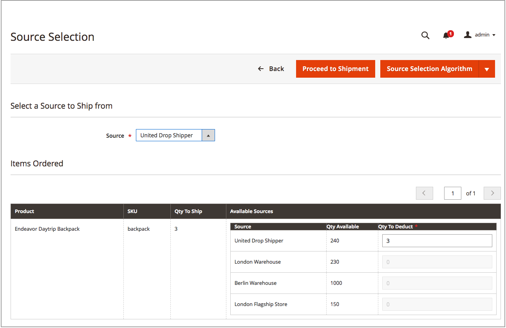

# Créer des expéditions multi-sources

Avec [!DNL Inventory Management], envoyez un ou plusieurs envois car vous avez des stocks. Pour générer des expéditions supplémentaires au besoin, répétez ces instructions en utilisant les quantités et les origines recommandées ou entrées manuellement. Ces instructions détaillent la manière dont les commerçants multi-sources envoient les expéditions. Les commerçants à source unique envoient les envois sans ces étapes supplémentaires (voir [Créer un envoi](../stores-purchase/shipments.md#create-a-shipment){target="_blank"} dans le guide d’utilisation principal).

Lors de la création d&#39;expéditions, utilisez l&#39;algorithme de sélection Source pour les recommandations calculées. Suivez et utilisez ces recommandations ou définissez les montants par source, ce qui génère des expéditions personnalisées. Vous contrôlez votre stock sortant pour chaque commande, en définissant les montants à déduire, en envoyant une ou plusieurs expéditions et en livrant en stock et les reliquats lorsque le stock est disponible. Pour chaque ligne de la commande, saisissez un montant à déduire de la quantité d&#39;origine.

Vous pouvez envoyer des envois partiels à :

- Exécuter les reliquats à mesure que les stocks arrivent

- Équilibrer les déductions de stock entre les sources

Lorsque vous saisissez des livraisons, vos quantités de stock disponible déduisent les montants saisis. En effet, les réservations sont converties en déductions de quantité réelles.

## Créer une expédition

1. Dans la barre latérale _Admin_, accédez à **[!UICONTROL Sales]** > **[!UICONTROL Orders]**.

1. Recherchez la commande et ouvrez en mode d’affichage.

1. Si la commande est payée et facturée et est prête à être expédiée, cliquez sur **[!UICONTROL Ship]**.

1. Effectuez la sélection Source pour envoyer des produits par source :

   - Pour afficher les recommandations d’expédition, cliquez sur **[!UICONTROL Source Selection Algorithm]** et sélectionnez un algorithme.

     | Algorithme | Description |
     |--|--|
     | [Priorité &#x200B;](source-priority-algorithm.md) | Recommande des expéditions à partir de sources en fonction des ordres de sources affectés au stock. |
     | [Priorité de distance](distance-priority-algorithm.md) | Recommande des expéditions provenant de sources proches de l&#39;adresse d&#39;expédition en fonction de la distance physique ou du délai de livraison le plus court. |

     >[!IMPORTANT]
     >
     >Lorsque l’algorithme de priorité de distance pour l’expédition et les itinéraires et données ne renvoie pas pour le [mode de calcul](distance-priority-algorithm.md) sélectionné (conduite, bicyclette ou marche) pour une expédition, la SSA utilise par défaut la priorité Source. Il est également recommandé de définir la [priorité des sources par stock](stocks-prioritize-sources.md).

   - Par **[!UICONTROL Select a Source to Ship from]**, sélectionnez une origine pour envoyer une expédition.

   - Pour chaque ligne, conservez le montant recommandé ou saisissez un montant spécifique dans le **[!UICONTROL Qty to Deduct]**. Cette valeur spécifie le montant qui est déduit du stock de l&#39;origine sélectionnée.

   - Cliquez sur **[!UICONTROL Proceed to Shipment]**.

     {width="350" zoomable="yes"}

1. Passez en revue la page _[!UICONTROL New Shipment]_&#x200B;et saisissez les modifications supplémentaires nécessaires.

   La section _[!UICONTROL Inventory]_&#x200B;affiche l&#39;origine, l&#39;expédition des produits, la quantité totale commandée et la quantité à expédier.

   {width="350" zoomable="yes"}

1. Cliquez sur **[!UICONTROL Submit Shipment]** pour terminer.
