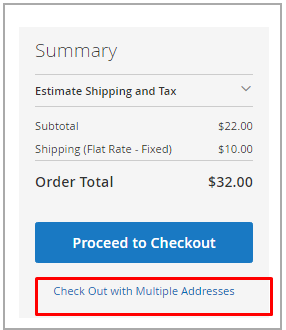

# Gérer les commandes et les expéditions

[!DNL Inventory Management] comprend des fonctionnalités et des options supplémentaires pour gérer les quantités en stock via le processus d&#39;expédition. Lorsque vous vérifiez et exécutez des expéditions, annulez des commandes et émettez des avoirs, les quantités de produits à vendre et en stock sont automatiquement mises à jour.

Ces informations incluent des détails spécifiques à [!DNL Inventory Management]. Pour plus d&#39;informations, reportez-vous à la rubrique [Commandes](../stores-purchase/orders.md){target="_blank"} du _Guide de l&#39;expérience client_.

## Commandes

[!DNL Commerce] prend en charge les commandes uniques et les commandes multi-adresses prêtes à l’emploi sans configurations supplémentaires. Lorsque les clients ou le personnel saisissent des commandes, [!DNL Inventory Management] effectue le suivi du stock à l&#39;aide des réservations par rapport à la quantité vendable, en déduisant de la quantité en stock les produits facturés et expédiés.

### Commandes multi-adresses

Pour les commandes à plusieurs adresses, une série de commandes uniques est générée, une pour chaque adresse de destination saisie. Lors du passage en caisse, les clients sélectionnent chaque ensemble de produits associé par adresse pendant le passage en caisse et génèrent une seule commande en fonction de l’adresse de destination. Chaque commande comprend les produits associés par adresse.

[!DNL Commerce] gère les stocks pour ces commandes multi-adresses exactement comme pour les commandes uniques. Il permet d’effectuer des recommandations ou des remplacements de l’algorithme de sélection Source lors de l’expédition, des expéditions partielles, de l’annulation des commandes et du remboursement avec les mises à jour de stock.

{width="350" zoomable="yes"}

### Remboursements

Lors de la saisie d&#39;un [avoir](../stores-purchase/credit-memo-create.md){target="_blank"} pour émettre un remboursement, vous pouvez renvoyer la quantité de produit à l&#39;origine déduite. Les informations sur la commande incluent l&#39;origine du stock qui a expédié le produit. Il est recommandé d&#39;adjuger la quantité de produit retournée par un avoir lorsque vous recevez le produit retourné.

{width="350" zoomable="yes"}

### Annuler les commandes non expédiées

Si une commande n&#39;a pas été expédiée et est annulée (en totalité ou en partie), [!DNL Inventory Management] retourne automatiquement le stock de produit à la quantité vendable. Jusqu&#39;à la facturation et l&#39;expédition, les produits achetés sont réservés par rapport à la quantité vendable, et non déduits de la quantité réelle. Au moment de la facturation et de l’expédition de la commande, le système convertit la réservation en déduction pour inventaire.

En arrière-plan, [!DNL Inventory Management] saisit automatiquement une réservation de rémunération supprimant le blocage de la quantité de produit. La quantité revient à la quantité vendable virtuelle agrégée.

## Expéditions

Lorsque l&#39;option [!DNL Inventory Management] est activée, vous pouvez envoyer des expéditions partielles ou complètes à partir d&#39;une ou de plusieurs sources pour exécuter les commandes. Vous contrôlez votre stock sortant pour chaque commande, en définissant les montants à déduire, en envoyant une ou plusieurs expéditions et en livrant en stock et les reliquats lorsque le stock est disponible. Pour chaque ligne de la commande, saisissez un montant à déduire de la quantité d&#39;origine. Générer une expédition par origine en fonction du stock disponible, jusqu&#39;à ce que la commande soit entièrement exécutée.

### Expéditions partielles

Pour les commerçants multi-sources, [!DNL Commerce] génère une expédition pour chaque source que vous sélectionnez. Le workflow général vous permet de sélectionner une origine, de définir la quantité de produits à déduire pour exécuter la commande et de procéder à l&#39;expédition. Une fois la commande terminée, créez des livraisons supplémentaires pour chaque origine jusqu&#39;à ce que vous ayez exécuté la commande.

Les commerçants à source unique peuvent également envoyer des expéditions partielles pour prendre en charge les commandes en souffrance ou équilibrer les stocks au fur et à mesure que les commandes d&#39;articles populaires arrivent.

### Algorithme de sélection de Recommendations et Source

L&#39;algorithme de sélection [&#128279;](selection-reservations.md) (SSA) fournit des recommandations pour les expéditions partielles et complètes. Vous pouvez accéder aux algorithmes de sélection Source lors de la création de factures d’expédition pour une commande. Sur la page Expédition, exécutez à tout moment l&#39;algorithme Priorité Source ou Priorité Distance afin de déterminer les meilleures options pour apparier les quantités commandées et les sources disponibles. Le système prend en charge l&#39;expédition d&#39;une commande complète à partir d&#39;une seule source et la ventilation de la commande en plusieurs livraisons partielles entre plusieurs sources. Vous pouvez accéder à ces options pour une exécution immédiate et des expéditions échelonnées pour envoyer de plus petits montants au fil du temps.

Pour finaliser et expédier une commande, celle-ci doit avoir effectué le paiement et être facturée. Actuellement, vous pouvez exécuter à nouveau le SSA pour les recommandations et l&#39;expédition à partir d&#39;une ou de plusieurs sources, ou remplacer les recommandations du SSA par des sources et des quantités définies manuellement pour exécuter l&#39;expédition.

- Il est recommandé de réexécuter la SSA pour examiner les recommandations pour chaque expédition.

- Si vous souhaitez modifier les sélections, vous pouvez les remplacer par des déductions d&#39;origine manuelles.

### Livraisons et réservations

À mesure que les expéditions sont générées, les réservations de produits sont effacées et la quantité de produits est déduite. La quantité en stock par stock est mise à jour en fonction des détails d&#39;expédition. Par exemple, si vous envoyez des expéditions pour dix produits provenant de deux sources, les quantités correspondant à ces sources déduisent 10 chacune. La quantité commercialisable est automatiquement actualisée pour les stocks associés, fournissant ainsi aux clients et au personnel les dernières quantités de produits. Et les réservations sont complètement effacées, ne comptant plus par rapport à la quantité vendable.
