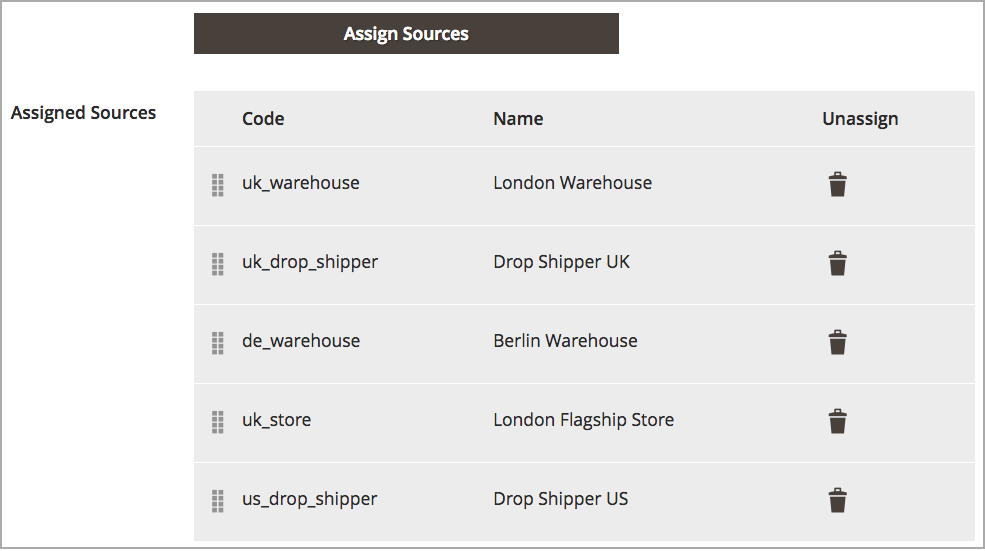

# Configuration de l’algorithme de priorité Source

Les stocks personnalisés comprennent une liste attribuée de sources à vendre et à expédier l’inventaire des produits disponibles via votre vitrine. Cet algorithme utilise l’ordre des sources affectées dans votre stock pour effectuer des recommandations.

Lors de l’exécution, l’algorithme :

- Fonctionne par l’ordre configuré des sources au niveau du stock, en commençant par le haut

- Recommande une quantité à envoyer et une source par produit en fonction de la commande dans la liste, de la quantité disponible et de la quantité commandée.

- Continue la liste jusqu’à ce que la commande d’envoi soit remplie

- Ignore les sources désactivées si elles figurent dans la liste.

Pour configurer ces sources, organisez-les de haut en bas en priorité afin de respecter les commandes. L’algorithme de sélection Source (SSA) fournit une priorité d’algorithme en utilisant cet ordre pour déterminer les déductions d’expédition et d’inventaire. Voir [Hiérarchisation des sources pour un stock](stocks-prioritize-sources.md).

## Configuration de la priorité des sources

1. Sur la barre latérale _Admin_, accédez à **[!UICONTROL Stores]** > **[!UICONTROL Inventory]** > **[!UICONTROL Stocks]**.

1. Ouvrez un stock en mode d’édition et accédez à la zone _[!UICONTROL Sources]_.

1. Cliquez sur **[!UICONTROL Assign Sources]**.

1. Dans la vue _[!UICONTROL Assign Sources]_, cochez la case correspondant à la source requise, puis cliquez sur **[!UICONTROL Done]**&#x200B;pour affecter une source au stock.

>[!NOTE]
>
>Lors de l’utilisation de l’algorithme [Distance Priority](distance-priority-algorithm.md) pour l’expédition, si les itinéraires et les données ne reviennent pas pour le [mode de calcul](distance-priority-algorithm.md) sélectionné (conduite, vélo ou marche) pour une expédition, l’ASS utilise par défaut la priorité Source.

| Icônes | Description |
|----------------------------------------------|----------------------------------------------------------------|
|  | Utilisez pour faire glisser et déposer des sources en fonction de leur priorité. |
|  | Annulation de l’affectation d’une source à un stock. |
