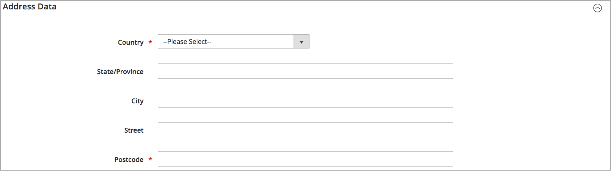

# Ajouter une source

Gérez l’exécution des stocks et des commandes à partir de plusieurs emplacements à l’aide de sources personnalisées. Créez une source pour chaque emplacement, par exemple des entrepôts, des magasins en briques et des magasins ordinaires, des centres de distribution et des expéditeurs. Attribuer des sources et mettre à jour des quantités par produit

Si vous modifiez la source par défaut, vous pouvez modifier toutes les configurations, à l’exception du nom et du code. Il est recommandé que les marchands à source unique ajoutent des informations correspondant à leur emplacement.

## Ajout d’une source d’inventaire

1. Sur le _Administration_ barre latérale, accédez à **[!UICONTROL Stores]** > _[!UICONTROL Inventory]_>**[!UICONTROL Sources]**.

1. Cliquez sur **[!UICONTROL Add New Source]**.

   

1. Développer  la valeur **[!UICONTROL General]** et procédez comme suit :

   - Pour identifier la source de l’inventaire, saisissez une **[!UICONTROL Name]**.

   - Saisissez une variable **[!UICONTROL Code]**.

     Le code prend en charge les lettres majuscules et minuscules, les chiffres, les tirets et les traits de soulignement. Le code est un identifiant unique utilisé lors de l’affectation de données de stock et d’import-export.

   - Si cette source d’inventaire est prête à être utilisée, définissez **[!UICONTROL Is Enabled]** to `Yes`.

   - Entrez un résumé **[!UICONTROL Description]** pour cet emplacement à titre de référence rapide ou pour des détails supplémentaires.

   - Pour **[!UICONTROL Latitude]** et **[!UICONTROL Longitude]**, saisissez les coordonnées GPS de l’emplacement de l’installation.

     Pour trouver les coordonnées GPS avec [Mappages Google][1], saisissez l’adresse dans la zone de recherche. Cliquez avec le bouton droit sur le marqueur sur la carte et choisissez **[!UICONTROL What's here?]**. Les coordonnées GPS apparaissent dans la zone de détails située sous l’adresse de la rue.

     

   - Si cette source d’inventaire est un emplacement de récupération, définissez **[!UICONTROL Use as Pickup Location]** to `Yes`.

     La source par défaut ne peut pas être utilisée comme emplacement de sélection pour les commandes de saut en magasin.

1. Développer  la valeur **[!UICONTROL Contact Info]** et procédez comme suit :

   - Pour **[!UICONTROL Contact Name]**, saisissez le nom complet du contact principal à l’emplacement.

   - Saisissez un **[!UICONTROL Email]** adresse pour contacter l’emplacement.

   - Pour **[!UICONTROL Phone]**, saisissez l’indicatif régional et le numéro de téléphone.

   - Pour **[!UICONTROL Fax]**, saisissez l&#39;indicatif et le numéro de téléphone du fax, le cas échéant.

     

1. Développer  la valeur **[!UICONTROL Address Data]** et procédez comme suit :

   - Choisissez la **[!UICONTROL Country]**.

   - Pour **[!UICONTROL State/Province]**, saisissez l’abréviation standard de l’état ou de la province.

   - Saisissez le **[!UICONTROL City]**.

   - Saisissez le **[!UICONTROL Street]** adresse.

   - Pour **[!UICONTROL Postcode]**, saisissez le code postal.

     

1. Si vous avez défini la source comme emplacement de récupération à l’étape précédente, développez  la valeur **[!UICONTROL Pickup Location]** et fournir des informations descriptives sur l’emplacement :

   - Saisissez le **[!UICONTROL Frontend Name]** de l’emplacement de la sélection.

   - Saisissez un **[!UICONTROL Frontend Description]** de l’emplacement de la sélection. Utilisez cette zone de texte pour afficher les heures de la boutique, l’emplacement par rapport à d’autres points de repère ou d’autres informations utiles qui aident le client à sélectionner l’emplacement de récupération correct.

     

   Pour plus d’informations sur la configuration des notifications électroniques lors de l’utilisation d’une source comme emplacement de récupération, voir [Courriers électroniques de vente](../configuration-reference/sales/sales-emails.md) dans le _Guide de référence de configuration_.

1. Pour enregistrer votre travail, effectuez l’une des opérations suivantes :

   - Pour enregistrer votre travail et continuer la modification, cliquez sur **[!UICONTROL Save & Continue]**.

   - Pour enregistrer votre travail et revenir à la page Gérer les sources , cliquez sur la flèche vers le bas () et choisissez **[!UICONTROL Save & Close]**.

   - Pour enregistrer votre travail sur l’enregistrement source actuel et saisir une nouvelle source, choisissez **[!UICONTROL Save & New]**.

## Barre de boutons

| Bouton | Description |
|--|--|
| [!UICONTROL Back] | Renvoie à la page Gérer les sources . |
| [!UICONTROL Reset] | Rétablit les valeurs de tous les champs du formulaire au moment du dernier enregistrement. |
| [!UICONTROL Save & Continue] | Enregistre toutes les modifications et conserve le formulaire ouvert pour modification ultérieure. Cliquez sur la flèche vers le bas pour accéder aux options supplémentaires : **[!UICONTROL Save & Close]**- Enregistre les modifications apportées à l’enregistrement actif, ferme le formulaire et revient à la page Gérer les sources . **[!UICONTROL Save & New]** - Enregistre les modifications, ferme l’enregistrement actif et ouvre un nouveau formulaire vierge. |

## Descriptions des champs

| Champ | Description |
|--|--|
| **[!UICONTROL General]** | |
| [!UICONTROL Name] | (Obligatoire) Un nom unique qui identifie la source de stock pour les utilisateurs administrateurs. |
| [!UICONTROL Code] | (Obligatoire) Code alphanumérique unique utilisé par le système pour identifier la source de l’inventaire. Saisissez le code en majuscules ou minuscules et/ou en chiffres, sans espaces. Au besoin, un trait d’union ou un trait de soulignement peut être utilisé à la place d’un espace. Le code ne peut pas être modifié après la création de la source. Il s’agit d’un identifiant unique utilisé lorsque vous affectez des sources aux stocks et exportez et/ou importez des données de produit. |
| [!UICONTROL Is Enabled] | Détermine si la source d’inventaire peut être utilisée. Options : Oui/Non |
| [!UICONTROL Description] | Brève description de l’emplacement de la source du stock. Incluez des détails utiles à vos utilisateurs administrateurs. |
| [!UICONTROL Latitude] | Indique la coordonnée de latitude de la source d’inventaire pour le GPS. Saisissez la valeur sous la forme d’un nombre, précédé d’un signe plus ou moins, si nécessaire. Le symbole du diplôme et les lettres ne sont pas autorisés. Par exemple : Latitude 32.755 |
| [!UICONTROL Longitude] | Indique la coordonnée de longitude la source d’inventaire pour le GPS. Saisissez la valeur sous la forme d’un nombre, précédé d’un signe plus ou moins, si nécessaire. Le symbole du diplôme et les lettres ne sont pas autorisés. Par exemple: `-97.3308` |
| **[!UICONTROL Contact Info]** | |
| [!UICONTROL Contact Name] | Nom du contact principal à l’emplacement de la source de l’inventaire. |
| [!UICONTROL Email] | Adresse électronique du contact principal. |
| [!UICONTROL Phone] | L&#39;indicatif régional et le numéro de téléphone du contact principal, selon le format que vous préférez. Par exemple : `(123) 456-7890` ou `123-456-7890` |
| [!UICONTROL Fax] | l&#39;indicatif régional et le numéro de fax du contact principal. |
| **[!UICONTROL Address Data]** | |
| [!UICONTROL Country] | (Obligatoire) Pays où se trouve la source de l’inventaire. |
| [!UICONTROL State/Province] | État ou province où se trouve la source de l’inventaire. |
| [!UICONTROL City] | Ville où se trouve la source de l’inventaire. |
| [!UICONTROL Street] | Adresse postale de la source de l’inventaire. |
| [!UICONTROL Postcode] | (Obligatoire) Code postal de la source de stock. |
| **[!UICONTROL Pickup Location]** | |
| [!UICONTROL Frontend Name] | Nom de l’emplacement de la sélection de la source affichée sur le storefront. |
| [!UICONTROL Frontend Description] | Description de l’emplacement de la sélection de la source affichée sur le storefront. Il peut contenir des images jointes. |

[1]: https://www.google.com/maps
