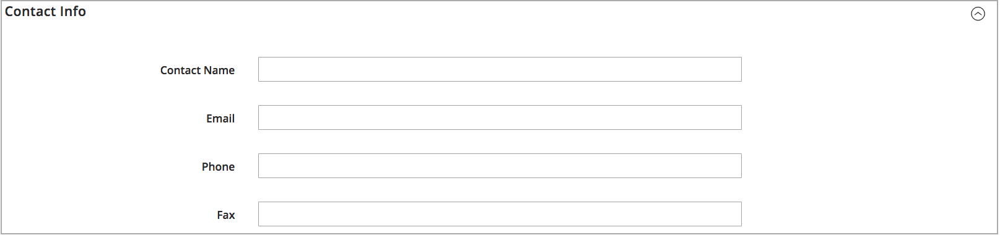

# Ajouter une source

Gérez l’exécution des stocks et des commandes à partir de plusieurs emplacements avec des sources personnalisées. Créez une source pour chaque emplacement, telle que des entrepôts, des magasins physiques, des centres de distribution et des chargeurs. Affecter des sources et mettre à jour des quantités par produit

Si vous modifiez le Source par défaut, vous pouvez modifier toutes les configurations, à l’exception du nom et du code. Il est recommandé que les commerçants monosources ajoutent des informations correspondant à leur emplacement.

## Ajouter une source d’inventaire

1. Dans la barre latérale _Admin_, accédez à **[!UICONTROL Stores]** > _[!UICONTROL Inventory]_>**[!UICONTROL Sources]**.

1. Cliquez sur **[!UICONTROL Add New Source]**.

   

1. Développez  la section **[!UICONTROL General]** et procédez comme suit :

   - Pour identifier l&#39;origine du stock, saisissez un **[!UICONTROL Name]** unique.

   - Saisissez un **[!UICONTROL Code]** unique.

     Le code prend en charge les majuscules et les minuscules, les chiffres, les tirets et les traits de soulignement. Le code est un ID unique utilisé lors de l’affectation de à des données de stock et d’exportation-importation.

   - Si cette source d&#39;inventaire est prête à être utilisée, définissez **[!UICONTROL Is Enabled]** sur `Yes`.

   - Saisissez un bref **[!UICONTROL Description]** pour cet emplacement à titre de référence rapide ou pour obtenir des détails supplémentaires.

   - Pour **[!UICONTROL Latitude]** et **[!UICONTROL Longitude]**, entrez les coordonnées GPS de l’emplacement de l’installation.

     Pour trouver les coordonnées GPS avec [Google Maps](https://www.google.com/maps), saisissez l&#39;adresse dans la zone de recherche. Cliquez avec le bouton droit sur le marqueur sur la carte et choisissez **[!UICONTROL What's here?]**. Les coordonnées GPS apparaissent dans la zone de détails située sous l&#39;adresse postale.

     

   - Si cette origine de stock est un lieu de prélèvement, définissez **[!UICONTROL Use as Pickup Location]** sur `Yes`.

     Le Source par défaut ne peut pas être utilisé comme emplacement de retrait pour les commandes de retrait en magasin.

1. Développez  la section **[!UICONTROL Contact Info]** et procédez comme suit :

   - Par **[!UICONTROL Contact Name]**, saisissez le nom complet du contact principal à l’emplacement.

   - Saisissez une adresse **[!UICONTROL Email]** pour contacter l’emplacement.

   - Par **[!UICONTROL Phone]**, entrez l&#39;indicatif régional et le numéro de téléphone.

   - Par **[!UICONTROL Fax]**, entrez l&#39;indicatif régional et le numéro de téléphone du télécopieur, le cas échéant.

     

1. Développez  la section **[!UICONTROL Address Data]** et procédez comme suit :

   - Choisissez le **[!UICONTROL Country]**.

   - Par **[!UICONTROL State/Province]**, saisissez l’abréviation standard de l’État ou de la province.

   - Saisissez le **[!UICONTROL City]**.

   - Saisissez l’adresse **[!UICONTROL Street]** physique.

   - Par **[!UICONTROL Postcode]**, saisissez le code postal.

     

1. Si vous avez défini la source comme emplacement de prélèvement à l’étape précédente, développez  dans la section **[!UICONTROL Pickup Location]** et fournissez des informations descriptives sur l’emplacement :

   - Saisissez le **[!UICONTROL Frontend Name]** du lieu de retrait.

   - Saisissez un **[!UICONTROL Frontend Description]** du lieu de retrait. Utilisez cette zone de texte pour afficher les heures d&#39;ouverture du magasin, l&#39;emplacement par rapport à d&#39;autres repères ou d&#39;autres informations utiles qui aident le client à sélectionner l&#39;emplacement de retrait approprié.

     

   Pour plus d’informations sur la configuration des notifications par e-mail lors de l’utilisation d’une source comme emplacement de retrait, voir [E-mails commerciaux](../configuration-reference/sales/sales-emails.md) dans le _Guide de référence de configuration_.

1. Pour enregistrer votre travail, effectuez l’une des opérations suivantes :

   - Pour enregistrer votre travail et continuer à le modifier, cliquez sur **[!UICONTROL Save & Continue]**.

   - Pour enregistrer votre travail et revenir à la page Gérer les sources, cliquez sur la flèche vers le bas () et choisissez **[!UICONTROL Save & Close]**.

   - Pour enregistrer votre travail sur l&#39;enregistrement d&#39;origine actuel et saisir une nouvelle source, choisissez **[!UICONTROL Save & New]**.

## Barre de boutons

| Bouton | Description |
|--|--|
| [!UICONTROL Back] | Retourne à la page Gérer les sources . |
| [!UICONTROL Reset] | Rétablit les valeurs de tous les champs du formulaire au moment du dernier enregistrement. |
| [!UICONTROL Save & Continue] | Enregistre toutes les modifications et garde le formulaire ouvert pour modification ultérieure. Cliquez sur la flèche vers le bas pour afficher d’autres options :  **[!UICONTROL Save & Close]**- Enregistre les modifications dans l’enregistrement actif, ferme le formulaire et revient à la page Gérer les sources . **[!UICONTROL Save & New]** - Enregistre les modifications, ferme l’enregistrement actif et ouvre un nouveau formulaire vierge. |

## Descriptions des champs

| Champ | Description |
|--|--|
| **[!UICONTROL General]** | |
| [!UICONTROL Name] | (Obligatoire) Nom unique qui identifie la source d’inventaire pour les utilisateurs administrateurs. |
| [!UICONTROL Code] | (Obligatoire) Code alphanumérique unique utilisé par le système pour identifier l&#39;origine du stock. Saisissez le code en majuscules ou minuscules et/ou en chiffres, sans espaces. Si nécessaire, un trait d’union ou de soulignement peut être utilisé à la place d’un espace. Le code ne peut pas être modifié après la création de la source. Il s’agit d’un identifiant unique utilisé lorsque vous affectez des sources aux stocks et que vous exportez et/ou importez des données de produit. |
| [!UICONTROL Is Enabled] | Détermine si la source de stock peut être utilisée. Options : Oui / Non |
| [!UICONTROL Description] | Brève description de l&#39;emplacement d&#39;origine du stock. Incluez des détails utiles à vos utilisateurs administrateurs. |
| [!UICONTROL Latitude] | Indique la coordonnée de latitude de la source d’inventaire pour le GPS. Saisissez la valeur sous la forme d’un nombre, précédé du signe plus ou moins selon les besoins. Le symbole du diplôme et les lettres ne sont pas autorisés. Par exemple : Latitude 32.7555 |
| [!UICONTROL Longitude] | Indique la coordonnée de longitude de la source d’inventaire pour le GPS. Saisissez la valeur sous la forme d’un nombre, précédé du signe plus ou moins selon les besoins. Le symbole du diplôme et les lettres ne sont pas autorisés. Par exemple : `-97.3308` |
| **[!UICONTROL Contact Info]** | |
| [!UICONTROL Contact Name] | Nom du contact principal au lieu d&#39;origine du stock. |
| [!UICONTROL Email] | Adresse e-mail du contact principal. |
| [!UICONTROL Phone] | Indicatif régional et numéro de téléphone du contact principal, au format de votre choix. Par exemple : `(123) 456-7890` ou `123-456-7890` |
| [!UICONTROL Fax] | Indicatif régional et numéro de fax du contact principal. |
| **[!UICONTROL Address Data]** | |
| [!UICONTROL Country] | (Obligatoire) Pays où se trouve l&#39;origine du stock. |
| [!UICONTROL State/Province] | État ou province où se trouve la source de l&#39;inventaire. |
| [!UICONTROL City] | Ville où se trouve la source de l&#39;inventaire. |
| [!UICONTROL Street] | Adresse postale de l&#39;origine du stock. |
| [!UICONTROL Postcode] | (Obligatoire) Code postal de l&#39;origine du stock. |
| **[!UICONTROL Pickup Location]** | |
| [!UICONTROL Frontend Name] | Nom de l’emplacement de prélèvement de la source affiché sur le storefront. |
| [!UICONTROL Frontend Description] | Description de l’emplacement de prélèvement de la source affichée sur le storefront. Il peut contenir des images jointes. |
