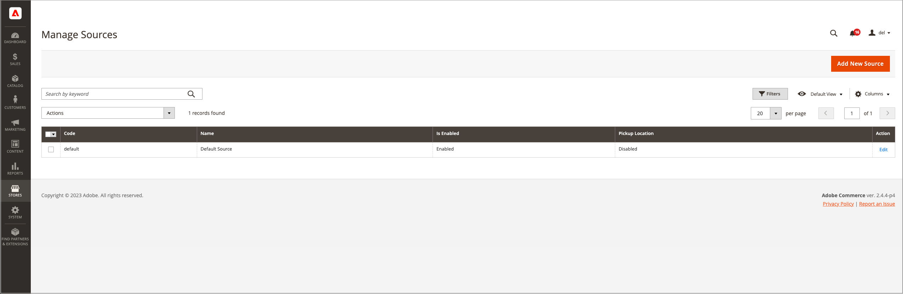

# Gestion des sources

Les origines sont les emplacements physiques où le stock de produits est géré et expédié pour l&#39;exécution des commandes, ou où des services sont disponibles. Ces emplacements peuvent comprendre des entrepôts, des magasins physiques, des centres de distribution, des lieux de ramassage et des chargeurs. Vous affectez des quantités en stock à ces sources et [!DNL Commerce] agrège automatiquement le total des produits à vendre pour vos stocks. Pour les grandes entreprises, ajoutez plusieurs sources pour tous vos emplacements : dans différents emplacements géographiques par pays et continent, des emplacements dans une ville, en fonction du type d&#39;inventaire, même en fonction des services.

Il est recommandé de fournir des emplacements géographiques physiques spécifiques lors de la création d’une source. Cela permet à l&#39;_algorithme de priorité de distance_ de comparer l&#39;emplacement de l&#39;adresse de destination d&#39;expédition avec les emplacements sources disponibles afin de déterminer la source la plus proche pour exécuter les expéditions. Vous pouvez utiliser des cartes Google ou des calculs hors ligne, qui utilisent des géocodes. Pour plus d&#39;informations sur cet _algorithme de priorité de distance_, voir [Configurer l&#39;algorithme de priorité de distance](distance-priority-algorithm.md).

Commencez par un Source par défaut _que vous pouvez mettre à jour, mais pas désactiver._ Cette source est utilisée par les commerçants à source unique et pour la migration des produits. Vous avez toujours besoin d’une source par défaut.

- **Informations sur le lieu** - Chaque source comprend le nom, le pays, l’adresse physique du lieu et un point de contact.
- **Activation des ressources** - Vous pouvez activer et désactiver des sources si nécessaire. N&#39;activez une origine que si elle accepte et exécute les commandes et les reliquats.
- **Stock disponible** - Attribuez et mettez à jour les quantités en stock pour chaque origine via la page du produit. Les quantités en stock sont calculées, fournies et réservées par le biais de la mise en correspondance des sources et des stocks.

Le diagramme suivant illustre les sources d&#39;un marchand de vélos qui vend un vélo de montagne, qui sont disponibles pour les stocks et accessibles par la SSA pour les expéditions.

{width="600" zoomable="yes"}

Tous les magasins commencent par un Source par défaut qui doit rester activé :

- Tous les nouveaux produits importés dans [!DNL Commerce] nécessitent une source et un stock, automatiquement affectés pour un accès immédiat aux [!DNL Inventory Management].
- Les commerçants à source unique utilisent le Source par défaut comme point unique d’emplacement des stocks et d’expédition.

## Modifier les sources

Vous pouvez mettre à jour le nom, l’adresse, l’emplacement GPS et les coordonnées du point de contact. Le code source est une valeur protégée, qui fait office d’identifiant unique associant la source aux quantités et stocks de vos produits.

Si vous modifiez le Source par défaut, vous pouvez modifier toutes les configurations, à l’exception du nom et du code. Il est recommandé que les commerçants monosources ajoutent des informations correspondant à leur emplacement.

La page _[!UICONTROL Manage Sources]_&#x200B;répertorie tous les emplacements d&#39;inventaire et installations d&#39;exécution disponibles. Vous pouvez ajouter de nouvelles sources de stock et modifier des emplacements existants.

1. Dans la barre latérale _Admin_, accédez à **[!UICONTROL Stores]** > _[!UICONTROL Inventory]_>**[!UICONTROL Sources]**.

1. Pour ajouter un emplacement d’inventaire, voir [Ajouter un nouveau Source](sources-add.md).

1. Recherchez la source de l&#39;inventaire et ouvrez-la en mode _Modifier_.

1. Mettez à jour les informations et enregistrez les modifications.

   {width="600" zoomable="yes"}

## Barre de boutons

| Bouton | Description |
|--|--|
| [!UICONTROL Add New Source] | Ouvre le formulaire Nouveau Source utilisé pour entrer une nouvelle source d&#39;inventaire, une nouvelle installation d&#39;exécution ou un nouvel emplacement. |

## Gérer les descriptions des colonnes de sources

| Colonne | Description |
|--|--|
| [!UICONTROL Code] | Code alphanumérique unique utilisé par le système pour identifier l&#39;origine de l&#39;inventaire. |
| [!UICONTROL Name] | Nom unique qui identifie la source d’inventaire pour les utilisateurs administrateurs. |
| [!UICONTROL Is Enabled] | Indique si l&#39;origine du stock est active et disponible. |
| [!UICONTROL Pickup Location] | Indique si la source est active comme emplacement de retrait pour la [diffusion en magasin](../stores-purchase/shipping-in-store-delivery.md). |
| [!UICONTROL Action] | Cliquez sur **[!UICONTROL Edit]** pour ouvrir l&#39;enregistrement source d&#39;inventaire en mode d&#39;édition. |

## Autres colonnes

| Colonne | Description |
|--- |--- |
| [!UICONTROL Latitude] | Indique la coordonnée de latitude de la source d’inventaire pour le GPS. Saisissez la valeur sous la forme d’un nombre, précédé du signe plus ou moins selon les besoins. Le symbole du diplôme et les lettres ne sont pas autorisés. Par exemple : `32.7555` |
| [!UICONTROL State/Province] | État ou province où se trouve la source. |
| [!UICONTROL Postcode] | Code postal de la source. |
| [!UICONTROL Email] | Adresse e-mail du contact principal. |
| [!UICONTROL Longitude] | Indique la coordonnée de longitude de la source d’inventaire pour le GPS. Saisissez la valeur sous la forme d’un nombre, précédé du signe plus ou moins selon les besoins. Le symbole du diplôme et les lettres ne sont pas autorisés. Par exemple : Longitude -97.3308 |
| [!UICONTROL City] | Ville où se trouve la source. |
| [!UICONTROL Phone] | Numéro de téléphone du contact principal. |
| [!UICONTROL Country] | Pays dans lequel la source est située. |
| [!UICONTROL Street] | Rue de la source. |
| [!UICONTROL Fax] | Indicatif régional et numéro de fax du contact principal. |
