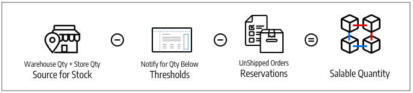

# Stocks et sources

Gérez vos stocks indépendamment de l&#39;emplacement de l&#39;entrepôt, du type de produit ou de service, ou du canal de vente. Exécutez les commandes et expédiez les produits à partir de plusieurs entrepôts, magasins physiques, centres de distribution et livraison directe pour exécuter les commandes en mettant l’accent sur un stock équilibré, des coûts d’expédition, etc.

Ces descriptions incluent les produits, les sources et les stocks pour une entreprise de bicyclettes avec plusieurs lieux d&#39;expédition et sites Web aux États-Unis et en Europe.

## Sources

[Sources](sources-manage.md) sont les emplacements physiques où le stock de produits est géré et expédié pour l&#39;exécution des commandes ou où les services sont disponibles. Ces emplacements peuvent comprendre des entrepôts, des magasins physiques, des centres de distribution et des chargeurs directs. [!DNL Commerce] utilise les quantités et les quantités vendables par stock et gère automatiquement les quantités en stock pour les produits et les commandes gérés. Si vous n’avez qu’une seule source, vous êtes considéré comme _source unique_. Si vous disposez de plusieurs sources, vous êtes considéré comme étant en mode _multi-source_.

Une source peut avoir la priorité dans l&#39;étendue du stock d&#39;un entrepôt, mais pas nécessairement dans tous les entrepôts, car la source peut être réutilisée dans différents stocks. Le nombre de stocks et de sources ajoute à la complexité pour déterminer le meilleur entrepôt ou magasin pour exécuter une commande. Par exemple, vous pouvez avoir un nombre limité de produits disponibles à partir de vos sites physiques avec un stock important dans vos entrepôts et des services dans des emplacements clés avec une disponibilité limitée.

Dans cet exemple, le marchand dispose d’un vélo tout terrain qui peut être expédié à partir de magasins, d’entrepôts et d’un chargeur automatique.

{width="600" zoomable="yes"}

## Stocks

[Stocks](stocks-manage.md) représente un inventaire virtuel et agrégé de produits disponibles à la vente dans vos canaux de vente (sites Web). Chaque stock mappe vos canaux de vente avec les sources pour les stocks disponibles et les quantités à vendre. Selon la configuration de votre site, le stock peut être affecté à un ou plusieurs canaux et sources de vente.

Les canaux de vente représentent les entités qui vendent votre stock, notamment les sites web, les vues de magasin, les groupes de clients B2B, etc. Les canaux de vente ne peuvent être associés qu’à un seul Stock. Chaque canal de vente ne peut être attribué qu’à un seul stock, et un seul stock peut être attribué à plusieurs sites web. Grâce au stock, vous pouvez modifier la priorité des sources utilisées lors des commandes d’expédition et par l’algorithme de sélection de [&#128279;](selection-reservations.md).

Vous commencez avec un Stock par défaut attribué avec le Source par défaut et votre site web, mieux utilisé par les commerçants à source unique. Seul le Source par défaut peut être affecté à ce stock. Les commerçants multi-sources créent des stocks personnalisés pour les sources et les sites web personnalisés, selon les besoins.

{width="600" zoomable="yes"}

## Quantités de produits

Quantité correspond au nombre de produits de votre stock actif disponibles à l&#39;achat. La quantité de produits augmente et diminue lorsque vous terminez des expéditions ou ajustez les stocks. L’ajout de produits à un panier n’affecte pas cette quantité. La Quantité commercialisable effectue le suivi de la disponibilité du produit pour un canal de vente et utilise également cette valeur pour déterminer le stock disponible à l&#39;achat. Selon le nombre de vos sources, vous pouvez voir et gérer la quantité de produits pour l&#39;un des éléments suivants :

- **Quantité** - Pour les commerçants à source unique, la colonne et la valeur _[!UICONTROL Quantity]_&#x200B;permettent de suivre le montant du stock disponible.
- **Quantité par Source** - Pour les commerçants multi-sources, la colonne _[!UICONTROL Quantity per Source]_&#x200B;et les valeurs effectuent le suivi du stock disponible par emplacement. Si vous ajoutez plusieurs origines, cette valeur remplace la quantité et répertorie chaque origine et quantité affectée.

Les réservations effectuent le suivi des demandes de stock pour l’ensemble du processus d’achat (ajout de produits au panier, passage en caisse et gestion des remboursements). Pour le stock disponible et le stock, réservez les montants du stock par commande via le processus de passage en caisse, soustraits de la quantité vendable. Les réservations sont converties en déductions de quantité lors de la facturation et de l’expédition des produits.

Quantité commercialisable calcule l&#39;inventaire virtuel des produits (ou de leur disponibilité), en utilisant les seuils configurés, les montants réservés ou vendus et les quantités par source. Pour chaque stock, [!DNL Commerce] accède à toutes les sources affectées et agrège les quantités de produits associées. Avec cette valeur de base, il soustrait ensuite tous les montants de réservation et le seuil de _[!UICONTROL Notify for Quantity Below]_.

{width="600" zoomable="yes"}

## Configurations d’inventaire

Chaque produit, source et stock comprend plusieurs options de configuration pour votre magasin au niveau global, source, stock et produit. Pour obtenir la liste complète de ces options, voir [Configuration d’Inventory management](configuration.md).

Voici des options importantes à comprendre pour [!DNL Inventory Management] :

- **[!UICONTROL Out-of-Stock Threshold]** - Définit un montant à soustraire de votre quantité vendable. Si vous activez les reliquats, cette valeur n&#39;est pas déduite de la quantité vendable.
- **[!UICONTROL Backorders]** - Détermine si les produits peuvent être vendus au-delà d&#39;un inventaire nul, en enregistrant les commandes jusqu&#39;à ce qu&#39;elles soient réapprovisionnées. Lorsque les reliquats sont activés, il est recommandé de configurer le [!UICONTROL Out-of-Stock Threshold].

>[!NOTE]
>
>La valeur du seuil de rupture de stock prend en charge les montants négatifs et positifs. Si vous activez les reliquats, définissez cette valeur sur un montant négatif pour le nombre maximal de produits pouvant faire l&#39;objet de reliquats avant que le produit ne soit réellement considéré comme en rupture de stock.

## Démonstration d’Inventory management

Regardez cette vidéo pour en savoir plus sur les sources et les stocks Inventory management :

>[!VIDEO](https://video.tv.adobe.com/v/3410196?captions=fre_fr&quality=12&learn=on)
