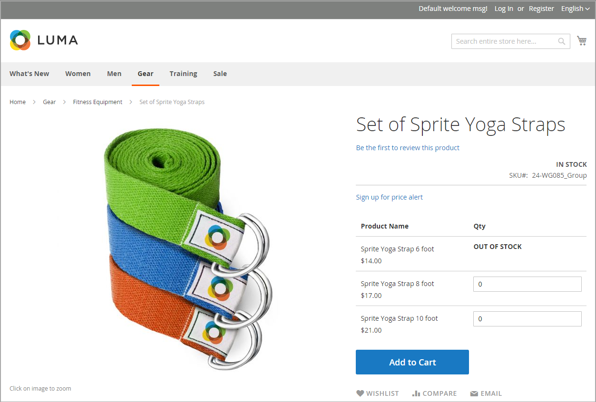

# Scénarios de messages Stock

Vous pouvez utiliser une combinaison de paramètres de configuration pour contrôler les messages de disponibilité du stock sur les pages de produits et dans les listes de produits sur les pages de catalogue.

{width="600" zoomable="yes"}

## Messages du stock de la page de produit

Plusieurs variantes de messages sont disponibles pour la page de produits, selon la combinaison des paramètres Gérer le stock et Disponibilité des stocks .

### Exemple 1 : afficher le message de disponibilité

#### Scénario 1

Cette combinaison de paramètres provoque l’affichage du message de disponibilité sur la page du produit, en fonction de la disponibilité du stock de chaque produit.

| Options Stock | Paramètre | Message |
|--|--|--|
| [!UICONTROL Display product availability in stock in the frontend] | `Yes` | |
| [!UICONTROL Manage Stock] | `Yes` | |
| [!UICONTROL Stock Availability] | `In Stock` | _[!UICONTROL Availability: In Stock]_ |
| | `Out of Stock` | _[!UICONTROL Availability: Out of Stock]_ |

#### Scénario 2

Lorsque le stock n’est pas géré pour un produit, cette combinaison de paramètres peut être utilisée pour afficher le message de disponibilité sur la page du produit.

| Options Stock | Paramètre | Message |
|--|--|--|
| [!UICONTROL Display product availability in stock in the frontend] | `Yes` |  |
| [!UICONTROL Manage Stock] | `No` | _[!UICONTROL Availability: In Stock]_ |

### Exemple 2 : masquer le message de disponibilité

#### Scénario 1

Cette combinaison de paramètres de configuration et de produit empêche le message de disponibilité de s’afficher sur la page du produit.

| Options Stock | Paramètre | Message |
|--|--|--|
| [!UICONTROL Display product availability in stock in the frontend] | `No` |  |
| [!UICONTROL Manage Stock] | `Yes` |  |
| [!UICONTROL Stock Availability] | `In Stock` | Aucun |
|  | `Out of Stock` | Aucun |

#### Scénario 2

Lorsque le stock n’est pas géré pour un produit, cette combinaison de configuration et de paramètres de produit empêche l’affichage du message de disponibilité sur la page du produit.

| Options Stock | Paramètre | Message |
|--|--|--|
| [!UICONTROL Display product availability in stock in the frontend] | `No` |  |
| [!UICONTROL Manage Stock] | `No` | Aucun |

## Messages de stock de page de catalogue

Les options d’affichage suivantes sont possibles pour les listes de résultats de recherche et de catégorie, selon la disponibilité du produit et les paramètres de configuration.

{width="600" zoomable="yes"}

### Exemple 1 : afficher le produit avec le message &quot;En rupture de stock&quot;

Cette combinaison de paramètres de configuration inclut les produits en rupture de stock dans les listes de résultats de recherche et de catégorie et affiche un message &quot;article épuisé&quot;.

| Options Stock | Paramètre | Message |
|--|--|--|
| [!UICONTROL Display Out of Stock Products] | `Yes` |  |
| [!UICONTROL Display product availability in stock in the frontend] | `Yes` | _[!UICONTROL Out of stock]_ |
| [!UICONTROL Display Out of Stock Products] | `Yes` |  |
| [!UICONTROL Display product availability in stock in the frontend] | `No` | Aucun |

### Exemple 2 : afficher le produit sans message &quot;En rupture de stock&quot;

Cette combinaison de paramètres de configuration inclut les produits en rupture de stock dans les listes de résultats de recherche et de catégorie, mais n’affiche pas de message.

| Options Stock | Paramètre | Message |
|--|--|--|
| [!UICONTROL Display Out of Stock Products] | `Yes` | Aucun |
| [!UICONTROL Display product availability in stock in the frontend] | `No` |  |

### Exemple 3 : masquer le produit jusqu’à sa mise en stock

Ce paramètre de configuration omet les produits en stock entièrement dans les listes de résultats de recherche et de catégorie, jusqu’à ce qu’ils soient de nouveau en stock.

| Options Stock | Paramètre | Message |
|--|--|--|
| [!UICONTROL Display Out of Stock Products] | `No` | Aucun |
