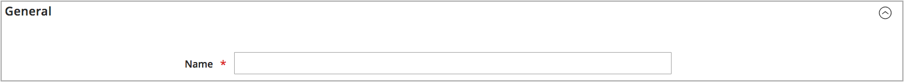
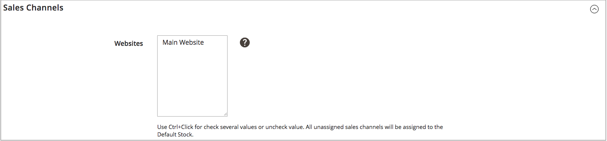
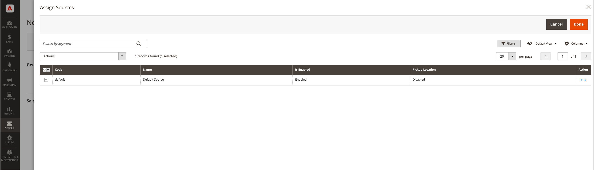

# Ajouter un stock

Les stocks mappent vos sources aux canaux de vente (ou sites web), fournissant un lien direct aux quantités à vendre et aux inventaires de produits.

Lors de la création d’un stock personnalisé, vous affectez des sites web et des sources. Les sources peuvent inclure des sources activées et désactivées. Par exemple, vous pouvez ajouter un entrepôt à votre stock, vous préparer à ouvrir l&#39;emplacement pour gérer les stocks et terminer les expéditions.

Après avoir ajouté des sources, vous devez donner la priorité à l’ordre des sources, du haut (premier) au bas (dernier). Cette commande affecte les recommandations lors de l&#39;expédition de la commande.

{width="600" zoomable="yes"}

## Ajouter le stock d’inventaire

1. Dans la barre latérale _Admin_, accédez à **[!UICONTROL Stores]** > _[!UICONTROL Inventory]_>**[!UICONTROL Stock]**.

1. Cliquez sur **[!UICONTROL Add New Stock]**.

1. Développez  la section **[!UICONTROL General]** et saisissez un **[!UICONTROL Name]** unique pour identifier le nouveau stock.

   {width="350" zoomable="yes"}

1. Développez  la section **[!UICONTROL Sales Channels]** et sélectionnez le **[!UICONTROL Websites]** où ce stock est disponible.

   Pour une installation multisite, maintenez la touche Ctrl (PC) ou Commande (Mac) enfoncée et cliquez sur chaque site Web.

   >[!NOTE]
   >
   >Si vous sélectionnez un site web ou un canal de vente affecté à un autre stock, l’affectation de ce stock est annulée. Tous les canaux de vente qui ne sont pas affectés à un stock personnalisé sont affectés au stock par défaut.

   {width="350" zoomable="yes"}

1. Développez  la section **[!UICONTROL Sources]** et procédez comme suit pour tout stock autre que le stock par défaut :

   - Cliquez sur **[!UICONTROL Assign Sources]**.

   {width="350" zoomable="yes"}

   - Cochez les cases correspondant à toutes les sources que vous souhaitez affecter au stock.

   >[!IMPORTANT]
   >
   >Si vous affectez la même source à plusieurs stocks, cela peut entraîner une survente des produits affectés à cette source.

   - Cliquez sur **[!UICONTROL Done]**.

     Les sources ajoutées s’affichent dans Sources affectées.

     {width="600" zoomable="yes"}

1. Utilisez l’icône  pour faire glisser les sources et les déposer dans une priorité allant du haut (première) au bas (dernière).

   La commande source est importante lors de l&#39;expédition des commandes.

   {width="600" zoomable="yes"}

1. Dans le menu _[!UICONTROL Save]_(), choisissez **[!UICONTROL Save & Close]**.

## Descriptions des champs

| Champ | Description |
|--|--|
| **[!UICONTROL General]** | |
| [!UICONTROL Name] | Nom du stock. Par exemple : `UK Stock`, `US Stock` |
| **[!UICONTROL Sales Channels]** | |
| [!UICONTROL Websites] | Définit la [portée](../getting-started/websites-stores-views.md#scope-settings) du stock en affectant le stock à des sites web spécifiques en tant que _canaux de vente_. Sélectionnez un ou plusieurs sites web par stock. Chaque site web ne peut être affecté qu&#39;à un seul stock. |
| **[!UICONTROL Sources]** | |
| [!UICONTROL Assign Sources] | Attribue des origines de stock à ce stock. Les sources personnalisées ne peuvent pas être affectées au stock par défaut. |
| [!UICONTROL Assigned Sources] | Liste des sources attribuées. Faites glisser et déposez les sources à l’aide de l’icône  dans un ordre de priorité pour l’exécution des commandes et l’expédition.  **[!UICONTROL Code]**- ID de code unique pour la source. **[!UICONTROL Name]** - Description du nom de la source. **[!UICONTROL Unassign]**- Supprimez la source affectée du stock à l’aide de . |
