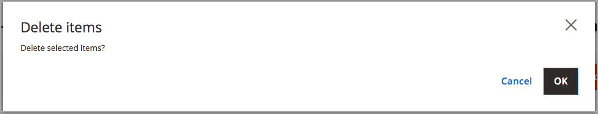

# Supprimer des stocks

Lorsque vous supprimez le stock, tous les sites web attribués sont attribués au stock par défaut. Il est recommandé de réaffecter des sites web à d’autres stocks avant suppression.

>[!IMPORTANT]
>
>La suppression d&#39;un [stock](stocks-manage.md) peut affecter les quantités vendables et les commandes non traitées pour un canal de vente. Si vous continuez à utiliser un canal de vente, ajoutez le canal de vente à un autre stock existant ou nouveau.

1. Sur la barre latérale _Admin_, accédez à **[!UICONTROL Stores]** > _[!UICONTROL Inventory]_>**[!UICONTROL Stocks]**.

1. Sélectionnez un ou plusieurs stocks à supprimer.

   Recherchez ou cochez les stocks que vous souhaitez supprimer, puis cochez-les.

1. Dans le menu **[!UICONTROL Actions]**, sélectionnez **[!UICONTROL Delete]**.

   {width="350" zoomable="yes"}

1. Dans la boîte de dialogue de confirmation, cliquez sur **[!UICONTROL OK]**.

   Le stock est supprimé et tous les canaux de vente attribués sont démappés.

   {width="350" zoomable="yes"}
