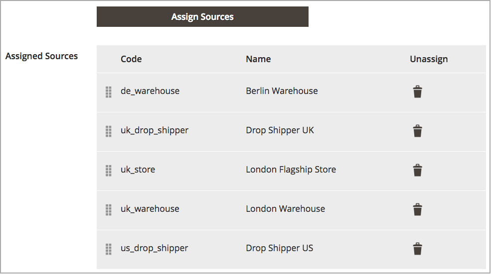
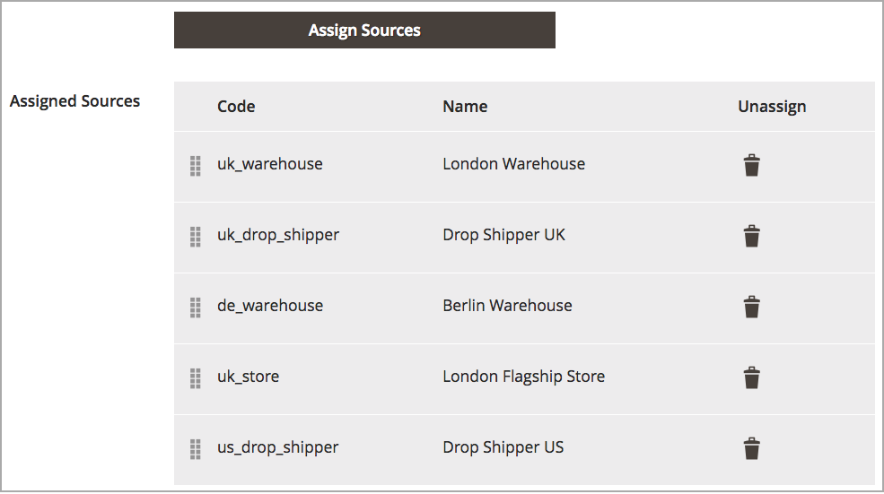

# Définir la priorité des sources pour un stock

Après ajout [sources](sources-manage.md) à la fonction [stock](stocks-manage.md), organisez ces sources de haut en bas en priorité pour respecter les commandes. L’algorithme SSA (Source Selection Algorithm) fournit une priorité d’algorithme en utilisant cet ordre pour déterminer les déductions d’expédition et d’inventaire.

La priorité de la source sur les stocks n’a aucune incidence sur les sources attribuées lors de la modification des stocks de produits.

Dans cet exemple, UK Stock a attribué des sources hors-service pour un magasin et deux entrepôts à Londres et un entrepôt à Berlin.

{width="350" zoomable="yes"}

Le marchand préfère que les envois soient classés par priorité dans l&#39;entrepôt plus vaste de Berlin, puis dans l&#39;entrepôt de Londres, dans l&#39;emplacement de débordement de Londres, et enfin dans l&#39;entrepôt de Londres. Pour modifier l’ordre, les entrées sont glissées-déposées dans l’ordre souhaité.

1. Sur le _Administration_ barre latérale, accédez à **[!UICONTROL Stores]** > _[!UICONTROL Inventory]_>**[!UICONTROL Stocks]**.

1. Ouvrez le stock dans la _Modifier_ mode .

1. Développez l’objet _[!UICONTROL Sources]_si nécessaire.

1. Utilisation  pour faire glisser les sources et les déposer en priorité du haut (premier) vers le bas (dernier).

   Cette commande est importante lors des commandes d’expédition. L&#39;ASL recommande les envois selon l&#39;ordre des sources

1. Cliquez sur **[!UICONTROL Save & Continue]** pour enregistrer les modifications.

{width="350" zoomable="yes"}
