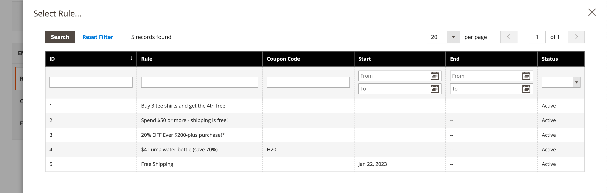
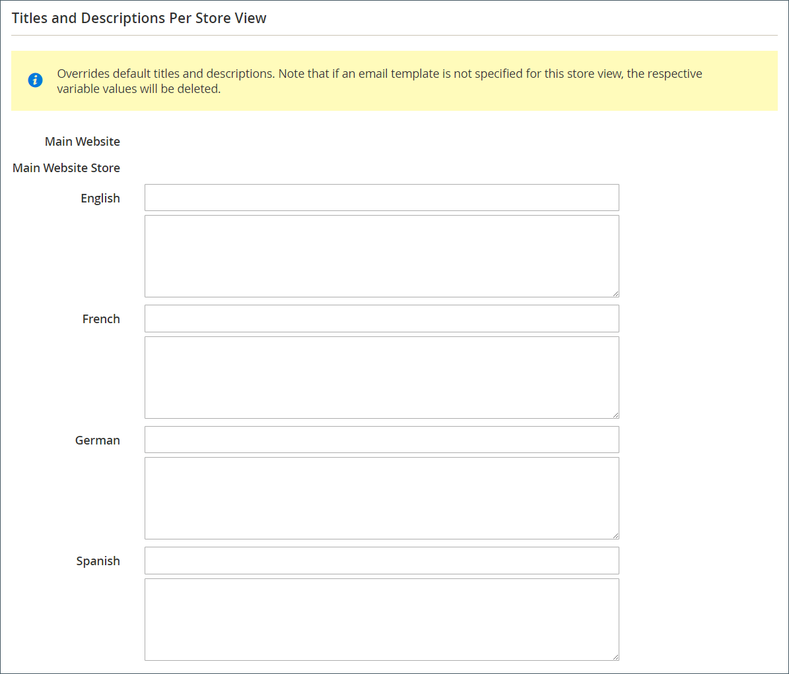

# Créer des rappels par courrier électronique

Avant de configurer une règle de rappel par email, vous devez [configurer une règle de prix de panier](price-rules-cart-create.md) pour définir la promotion qui est proposée. Les conditions de règle qui déclenchent un rappel d’email peuvent être basées sur les propriétés du panier, les propriétés de liste bloquée ou les deux.

>[!NOTE]
>
>Les rappels par e-mail peuvent promouvoir une règle de prix de panier avec ou sans coupon. Une règle de prix du panier qui définit un coupon généré automatiquement génère un code de bon aléatoire pour chaque client.

1. Sur la barre latérale _Admin_, accédez à **[!UICONTROL Marketing]** > _[!UICONTROL Communications]_>**[!UICONTROL Email Reminder Rules]**.

1. Dans le coin supérieur droit, cliquez sur **[!UICONTROL Add New Rule]**.

1. Complétez le _[!UICONTROL Rule Information]_comme suit :

   {width="700" zoomable="yes"}

   - Saisissez un **[!UICONTROL Rule Name]** pour identifier la règle en interne.

   - Saisissez un résumé **[!UICONTROL Description]** de la règle.

   - Pour choisir la promotion **[!UICONTROL Cart Price Rule]** dont ce rappel doit faire la publicité, cliquez sur **[!UICONTROL Select Rule…]**, puis sélectionnez la règle.

     {width="600" zoomable="yes"}

   - Si vous souhaitez que la règle entre en vigueur immédiatement, définissez **[!UICONTROL Status]** sur `Active`.

   - Pour configurer une période pour que la règle soit active, saisissez les dates **[!UICONTROL From]** et **[!UICONTROL To]**.

     Vous pouvez également choisir la date dans le calendrier (  ).

   - Pour envoyer le rappel plusieurs fois, saisissez le nombre de jours avant la prochaine explosion de l’email dans le champ **[!UICONTROL Repeat Schedule]**.

1. Dans le panneau de gauche, choisissez **[!UICONTROL Conditions]**.

   Au moins une condition doit être définie pour la règle. Le processus est similaire à la création d’une [règle de prix de catalogue.](price-rules-catalog.md)

   {width="600" zoomable="yes"}

   Cliquez sur _Ajouter_ ( ) pour afficher la liste des options, puis sélectionnez l’une des conditions suivantes :

   - Liste de souhaits
   - Panier

   >[!NOTE]
   >
   >Si un client possède plusieurs paniers abandonnés correspondants, une liste de souhaits ou une combinaison des deux, le rappel par e-mail n’est déclenché qu’une seule fois pour ce client. Pour déclencher à nouveau le même rappel d&#39;email, utilisez le champ _[!UICONTROL Repeat Schedule]_pour définir le nombre de jours entre les emails.  
   >
   >Le même rappel par e-mail est **_non redéclenché_** pour le même client pour **_nouveau_** paniers abandonnés et listes de souhaits **_après_** la période _[!UICONTROL Repeat Schedule]_est terminée.

   Renseignez la condition pour décrire le scénario qui déclenche le rappel par courrier électronique.

   {width="600" zoomable="yes"}

1. Dans le panneau de gauche, choisissez **[!UICONTROL Emails and Labels]**.

   {width="600" zoomable="yes"}

1. Dans la section **[!UICONTROL Email Templates]** , choisissez le modèle d&#39;email à utiliser pour chaque site web et la vue de magasin dans votre [hiérarchie de magasins](../getting-started/websites-stores-views.md).

   Si vous ne souhaitez pas envoyer d’email de rappel aux clients d’une vue de magasin, laissez la valeur `Not Selected`.

1. Dans la section _Titre par défaut et description_ , procédez comme suit :

   - Saisissez le **[!UICONTROL Rule Title for All Store Views]**.

     >[!NOTE]
     >
     >Cette valeur peut être incorporée dans les modèles d’email à l’aide de la variable `promotion_name`.

   - Saisissez le **[!UICONTROL Rule Description for All Store Views]**.

     {width="500" zoomable="yes"}

   - Dans la section _[!UICONTROL Titles and Descriptions Per Store View]_, saisissez les **[!UICONTROL Rule Title]**et **[!UICONTROL Description]**pour la_ vue Boutique par défaut _. Pour plusieurs vues de magasin, saisissez le titre et la description appropriés pour chacune d’elles.

     >[!NOTE]
     >
     >La description peut être incorporée dans les modèles d’email à l’aide de la variable promotion_description .

     {width="500" zoomable="yes"}

1. Une fois l’opération terminée, cliquez sur **[!UICONTROL Save]**.

## Conditions de déclenchement

| Source | Déclencheur |
|--- |--- |
| [!UICONTROL Wish List] | [!UICONTROL Conditions Combination] [!UICONTROL Sharing] [!UICONTROL Number of Items] [!UICONTROL Items Sub selection] |
| [!UICONTROL Shopping Cart] | [!UICONTROL Conditions Combination] [!UICONTROL Coupon Code] [!UICONTROL Cart Line Items] [!UICONTROL Items Quantity] [!UICONTROL Virtual Only] [!UICONTROL Total Amount] [!UICONTROL Items Subselection] |

{style="table-layout:auto"}

## Descriptions des champs

| Champ | Description |
|--- |--- |
| [!UICONTROL Rule Name] | Le nom de la règle de rappel automatisée identifie la règle en interne. |
| [!UICONTROL Description] | Description de la règle pour référence interne. |
| [!UICONTROL Shopping Cart Price Rule] | La règle Panier associée à ce rappel d’email. Les e-mails de rappel peuvent promouvoir une règle de prix de panier avec ou sans coupon. Si une règle de prix de panier comprend un coupon généré automatiquement, la règle de rappel génère un code de bon unique aléatoire pour chaque client. |
| [!UICONTROL Assigned to Website] | Sites web qui reçoivent un courrier électronique de rappel automatisé en fonction de cette règle. |
| [!UICONTROL Status] | Active la règle. Si l’état est inactif, tous les autres paramètres sont ignorés et la règle n’est pas déclenchée. Options : `Active` / `Inactive` |
| [!UICONTROL From Date] | Date de début de cette règle de rappel automatisée. Si aucune date n’est spécifiée, la règle devient active immédiatement. |
| [!UICONTROL To Date] | Date de fin de cette règle de rappel automatisée. Si aucune date n’est spécifiée, la règle devient active indéfiniment. |
| [!UICONTROL Repeat Schedule] | Nombre de jours avant le déclenchement de la règle et l’email de rappel envoyé à nouveau, à condition que les conditions soient remplies. Pour déclencher la règle plusieurs fois, saisissez le nombre de jours avant le prochain envoi d’email, séparés par une virgule. Par exemple, saisissez `7` pour que la règle soit déclenchée à nouveau sept jours plus tard ; saisissez `7,14` pour que la règle soit déclenchée dans sept jours, puis 14 jours plus tard. |
| [!UICONTROL Email Templates] | Détermine le modèle de courrier électronique à utiliser pour chaque vue de magasin. |
| [!UICONTROL Rule Title for All Store Views] | Détermine le titre de la règle pour chaque vue de magasin. |
| [!UICONTROL Rule Description for All Store Views] | Détermine la description de la règle pour chaque vue de magasin. |

{style="table-layout:auto"}
