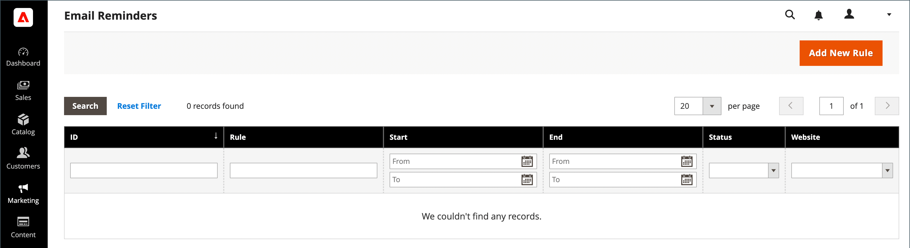

# Rappels électroniques

{{ee-feature}}

Le but d’un rappel par email est d’encourager les personnes qui ont visité votre boutique à profiter d’une promotion et à faire un achat. Des rappels par email peuvent être envoyés automatiquement aux clients lorsqu’un ensemble spécifique de conditions est satisfait. Par exemple, vous pouvez envoyer un rappel aux clients qui ont ajouté un article à leur panier ou à leur liste de souhaits, mais qui n’ont pas encore effectué d’achat. Vous pouvez utiliser des rappels par e-mail pour encourager les clients à retourner dans votre boutique et inclure un [code de bon](price-rules-cart-coupon.md) comme incitation. Les codes coupon peuvent être générés automatiquement pour chaque lot de rappels par email, afin de vous permettre de contrôler les offres associées à chaque lot.

Les rappels par email peuvent être déclenchés après qu’un nombre spécifique de jours a été passé depuis l’abandon d’un panier ou pour toute autre condition que vous souhaitez définir. Les conditions courantes comprennent la valeur totale du panier, la quantité, les articles dans le panier, etc.

>[!NOTE]
>
>Si un client possède plusieurs paniers abandonnés correspondants, une liste de souhaits ou une combinaison des deux, le rappel par e-mail n’est déclenché qu’une seule fois pour ce client. Pour déclencher à nouveau le même rappel d&#39;email, utilisez le champ _[!UICONTROL Repeat Schedule]_&#x200B;pour définir le nombre de jours entre les emails.

{width="700" zoomable="yes"}

## Configuration de rappels par courrier électronique

Les règles de rappel de courrier électronique peuvent être envoyées à intervalles réguliers par minute, heure ou jour. La configuration détermine le nombre d’emails envoyés par lot et l’identité du magasin qui apparaît comme expéditeur du message.

1. Sur la barre latérale _Admin_, accédez à **[!UICONTROL Stores]** > _[!UICONTROL Settings]_>**[!UICONTROL Configuration]**.

1. Dans le panneau de gauche, développez **[!UICONTROL Customers]** et choisissez **[!UICONTROL Promotions]**.

1. Développez la section  de **[!UICONTROL Automated Email Reminder Rules]** et procédez comme suit :

   {width="600" zoomable="yes"}

   - Définissez **[!UICONTROL Enable Reminder Emails]** sur `Yes`.

   - Pour définir la fréquence d&#39;exécution des vérifications pour les nouveaux clients qui remplissent les critères des rappels de courrier électronique automatisés, définissez **[!UICONTROL Frequency]** sur l&#39;une des options suivantes :

      - `Minute Intervals`
      - `Hourly`
      - `Daily`

   - Définissez la valeur **[!UICONTROL Interval]** appropriée, en fonction du paramètre _[!UICONTROL Frequency]_.

   - Définissez **[!UICONTROL Start Time]** sur l’heure, la minute et la seconde d’envoi de l’email, en fonction d’une horloge de 24 heures.

   - Pour limiter le nombre d&#39;emails pouvant être envoyés dans un lot, saisissez le nombre dans le champ **[!UICONTROL Maximum Emails per One Run]** .

   - Pour éviter les tentatives répétées d’envoi d’un email en échec, saisissez le nombre maximal de tentatives dans le champ **[!UICONTROL Email Send Failure Threshold]**.

   - Définissez **[!UICONTROL Reminder Email Sender]** sur le [contact de magasin](../getting-started/store-details.md#store-email-addresses) qui apparaît comme expéditeur de l’email de rappel.

   Pour obtenir une liste détaillée de ces options, voir [ Règles de rappel de messagerie automatisée ](../configuration-reference/customers/promotions.md#automated-email-reminder-rules) dans la _référence de configuration_.

1. Une fois l’opération terminée, cliquez sur **[!UICONTROL Save Config]**.

## Modèles de rappel par email

Le modèle de rappel par e-mail par défaut peut être personnalisé et des modèles supplémentaires peuvent être créés pour différentes promotions. Les rappels par email contiennent une sélection de variables spécifiques qui peuvent être intégrées dans le message. Les informations contenues dans ces variables sont déterminées par la règle de rappel par email que vous configurez, ainsi que par la règle de prix du panier associée au coupon. Le bouton Insérer une variable peut être utilisé pour insérer la balise avec la variable dans le modèle. Pour en savoir plus, voir [Email](../systems/email-templates.md).

{width="600" zoomable="yes"}

### Personnalisation d’un modèle de rappel d’email

1. Sur la barre latérale _Admin_, accédez à **[!UICONTROL Marketing]** > _[!UICONTROL Communications]_>**[!UICONTROL Email Templates]**.

1. Cliquez sur **[!UICONTROL Add New Template]**.

1. Dans la liste **[!UICONTROL Template]** sous `Magento_Reminder`, choisissez le modèle **[!UICONTROL Promotion Notification/Reminder]**.

1. Cliquez sur **[!UICONTROL Load Template]**.

Suivez les [instructions](../systems/email-template-custom.md) standard pour personnaliser le modèle.

### Variables de rappel de courrier électronique

#### Code coupon

```
{{var coupon.getCode()|escape}}
```

#### Limite d’utilisation du bon

```
{{var coupon.usage_limit|escape}}
```

#### Utilisation du coupon par client

```
{{var coupon.usage_per_customer|escape}}
```

#### URL du compte client

```
{{var this.getUrl($store,'customer/account/',[_nosid:1])}}
```

#### Nom du client

```
{{var customer_data.name|escape}}
```

#### Modèle de pied de page de courrier électronique

```
{{template config_path="design/email/footer_template"}}
```

#### Modèle d’en-tête de courrier électronique

```
{{template config_path="design/email/header_template"}}
```

#### Email Logo Image Alt

```
{{var logo_alt}}
```

#### URL de l’image du logo de l’email

```
{{var logo_url}}
```

#### Description de la promotion

```
{{var promotion_description|escape|nl2br}}
```

#### Nom de la promotion

```
{{var promotion_name|escape}}
```

#### Nom de la boutique

```
{{var store.frontend_name}}
```

#### URL du magasin

```
{{store url=""}}
```
