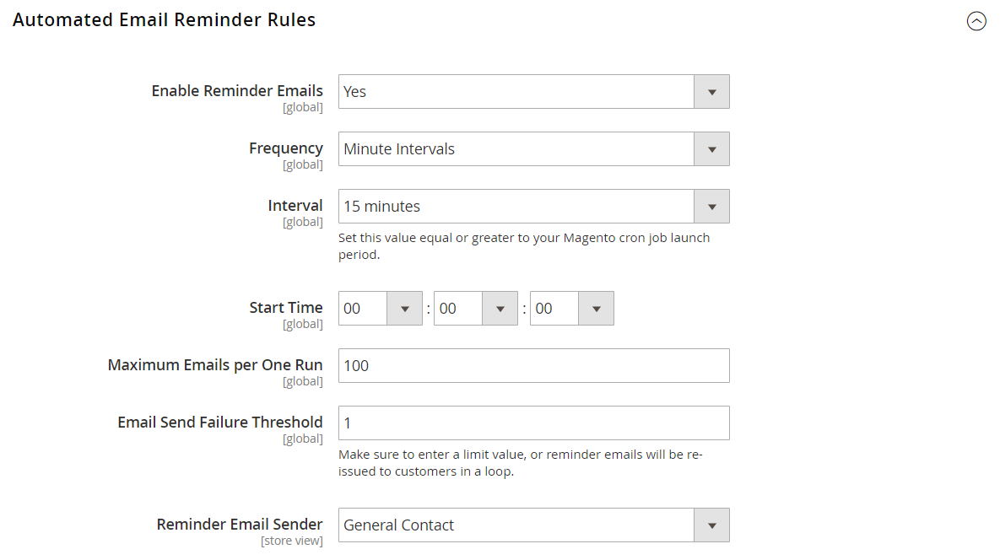

# Rappels par e-mail

{{ee-feature}}

L’objectif d’un rappel par e-mail est d’encourager les personnes qui ont visité votre magasin à profiter d’une promotion et à effectuer un achat. Des rappels par e-mail peuvent être automatiquement envoyés aux clients lorsqu’un ensemble spécifique de conditions est rempli. Par exemple, vous pouvez envoyer un rappel aux clients qui ont ajouté quelque chose à leur panier ou à leur liste de souhaits, mais qui n’ont pas encore effectué d’achat. Vous pouvez utiliser des rappels par e-mail pour encourager les clients à revenir dans votre boutique et inclure un [code de coupon](price-rules-cart-coupon.md) en guise d’incitation. Des codes promotionnels peuvent être générés automatiquement pour chaque lot de rappels par e-mail, afin que vous puissiez contrôler les offres associées à chaque lot.

Les rappels par e-mail peuvent être déclenchés après un nombre spécifique de jours écoulés depuis l’abandon d’un panier ou pour toute autre condition que vous souhaitez définir. Les conditions courantes incluent la valeur totale du panier, la quantité, les articles du panier, etc.

>[!NOTE]
>
>Si un client possède plusieurs paniers abandonnés, listes de souhaits ou combinaisons des deux, l’e-mail de rappel n’est déclenché qu’une seule fois pour ce client. Pour déclencher à nouveau le même rappel par e-mail, utilisez le champ _[!UICONTROL Repeat Schedule]_&#x200B;pour définir le nombre de jours entre les e-mails.

{width="700" zoomable="yes"}

## Configuration des rappels par e-mail

Les règles de rappel d’e-mail peuvent être envoyées à intervalles réguliers par minute, heure ou jour. La configuration détermine le nombre d’e-mails envoyés dans un lot et l’identité du magasin qui apparaît comme expéditeur du message.

1. Dans la barre latérale _Admin_, accédez à **[!UICONTROL Stores]** > _[!UICONTROL Settings]_>**[!UICONTROL Configuration]**.

1. Dans le panneau de gauche, développez **[!UICONTROL Customers]** et choisissez **[!UICONTROL Promotions]**.

1. Développez  la section **[!UICONTROL Automated Email Reminder Rules]** et procédez comme suit :

   {width="600" zoomable="yes"}

   - Définissez **[!UICONTROL Enable Reminder Emails]** sur `Yes`.

   - Pour définir la fréquence d’exécution des vérifications pour les nouveaux clients qui remplissent les critères des rappels par e-mail automatisés, définissez **[!UICONTROL Frequency]** sur l’un des éléments suivants :

      - `Minute Intervals`
      - `Hourly`
      - `Daily`

   - Définissez la **[!UICONTROL Interval]** appropriée en fonction du paramètre _[!UICONTROL Frequency]_.

   - Définissez **[!UICONTROL Start Time]** sur l’heure, la minute et la seconde auxquelles l’e-mail est envoyé, dans un délai de 24 heures.

   - Pour limiter le nombre d’e-mails pouvant être envoyés dans un lot, saisissez le nombre dans le champ **[!UICONTROL Maximum Emails per One Run]** .

   - Pour éviter des tentatives répétées d’envoi d’e-mail ayant échoué, saisissez le nombre maximal de tentatives dans le champ **[!UICONTROL Email Send Failure Threshold]** .

   - Définissez **[!UICONTROL Reminder Email Sender]** sur le [contact du magasin](../getting-started/store-details.md#store-email-addresses) qui s’affiche en tant qu’expéditeur de l’e-mail de rappel.

   Pour obtenir la liste détaillée de ces options, voir [Règles de rappel d’e-mail automatisées](../configuration-reference/customers/promotions.md#automated-email-reminder-rules) dans le _Guide de référence de configuration_.

1. Cliquez ensuite sur **[!UICONTROL Save Config]**.

## Modèles de rappel d’e-mail

Le modèle par défaut de rappel d’e-mail peut être personnalisé et des modèles supplémentaires peuvent être créés pour différentes promotions. Les rappels par e-mail comportent une sélection de variables spécifiques qui peuvent être intégrées au message. Les informations contenues dans ces variables sont déterminées par la règle de rappel par e-mail que vous avez configurée et par la règle de prix du panier associée au coupon. Le bouton Insérer une variable permet d’insérer la balise de balisage avec la variable dans le modèle. Pour en savoir plus, voir [E-mail](../systems/email-templates.md).

{width="600" zoomable="yes"}

### Personnaliser un modèle de rappel d’e-mail

1. Dans la barre latérale _Admin_, accédez à **[!UICONTROL Marketing]** > _[!UICONTROL Communications]_>**[!UICONTROL Email Templates]**.

1. Cliquez sur **[!UICONTROL Add New Template]**.

1. Dans la liste **[!UICONTROL Template]** sous `Magento_Reminder`, choisissez le modèle de **[!UICONTROL Promotion Notification/Reminder]**.

1. Cliquez sur **[!UICONTROL Load Template]**.

Suivez les [instructions](../systems/email-template-custom.md) standard pour personnaliser le modèle.

### Variables de rappel d’e-mail

#### Code de coupon

```
{{var coupon.getCode()|escape}}
```

#### Limite d’utilisation des coupons

```
{{var coupon.usage_limit|escape}}
```

#### Utilisation des coupons par client

```
{{var coupon.usage_per_customer|escape}}
```

#### URL du compte client

```
{{var this.getUrl($store,'customer/account/',[_nosid:1])}}
```

#### Nom du client

```
{{var customer_data.name|escape}}
```

#### Modèle de pied de page d’e-mail

```
{{template config_path="design/email/footer_template"}}
```

#### Modèle d’en-tête d’e-mail

```
{{template config_path="design/email/header_template"}}
```

#### Alt Image du logo de l’e-mail

```
{{var logo_alt}}
```

#### URL de l’image du logo de l’e-mail

```
{{var logo_url}}
```

#### Description de la promotion

```
{{var promotion_description|escape|nl2br}}
```

#### Nom de la promotion

```
{{var promotion_name|escape}}
```

#### Nom de la boutique

```
{{var store.frontend_name}}
```

#### URL de la boutique

```
{{store url=""}}
```
